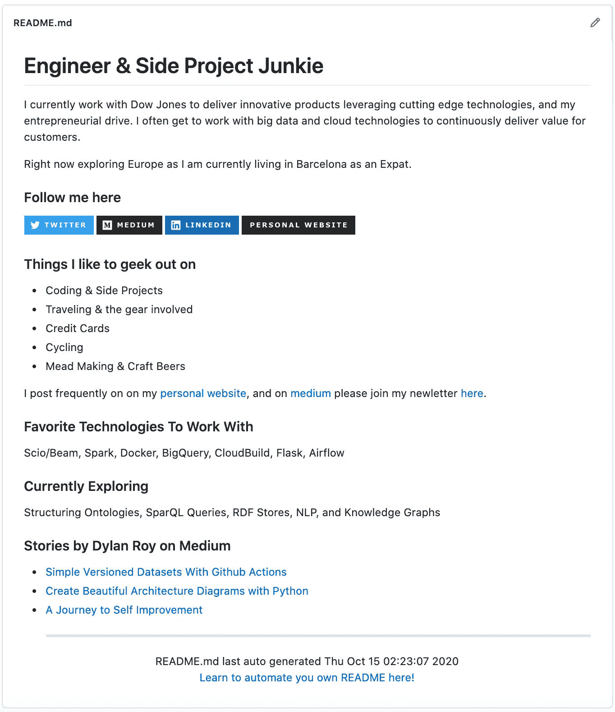

# 使用 Python 自动更新您的 Github 概要文件

> 原文：<https://towardsdatascience.com/auto-updating-your-github-profile-with-python-cde87b638168?source=collection_archive---------36----------------------->

## [实践教程](https://towardsdatascience.com/tagged/hands-on-tutorials)

## 通过自动化您的个人资料自述来展示您的技能


照片由来自 [Pexels](https://www.pexels.com/photo/eyeglasses-in-front-of-laptop-computer-1181253/?utm_content=attributionCopyText&utm_medium=referral&utm_source=pexels) 的[克里斯蒂娜·莫里洛](https://www.pexels.com/@divinetechygirl?utm_content=attributionCopyText&utm_medium=referral&utm_source=pexels)拍摄

# 背景

最近，我在 Github 上看到越来越多的开发者拥有个人资料级别`README.md`，我想创建同样的东西。我认为这是另一个展示我的机会。我还觉得这是一个将技术观众引向对我来说重要的东西的好地方，这些东西就是我过去几周一直在写的文章。此外，如果你作为一名读者，目前正在寻求提高你在同事、客户或潜在雇主中的权威，这可能是另一个给人留下深刻印象的机会。作为一名科技领域的招聘经理，我也会对那些通过 Github 个人资料展示自己技能的人留下深刻印象。

我想展示的东西之一就是我正在写的这样的文章。我每周都会写一些文章，这要求我每次发表文章时都要记得去更新这些文章。作为一个开发者，这将是不可接受的，因为我希望你们中的一些人会有这样的反应😉。

这让我开始寻找在我之前已经为这种自动化做了些什么的伟人。在搜索过程中，我找到了一些 Go 教程，以及一个非常好的 JavaScript 教程，我在页脚中做了链接。

以此为灵感，我想我会自己构建它，因为我还没有找到一个人以我喜欢的方式用 Python 做这件事。接受了这个挑战后，我现在需要搜索所需的组件来保持我的 Github 概要自述文件是最新的。

对于那些不愿意等着看结果的人。你可以自己看看下图中的结果。



作者图片

# 入门指南

正如你在上面看到的，我的 README 页面中我想要自动化的部分将会是 Medium 上最近文章的提要。为了轻松做到这一点，我需要一个 python 库来解析 RSS 提要。除此之外，我想在页脚添加我所在时区的当前时间戳，以表明上次更新的时间，因为这在 Github profile 登录页面中没有显示。所有这些都将在我选择的语言 Python 3.8 中发生，所以如果你继续学习，请确保使用 Python 3，因为有一些文件 I/O 是 Python 3 特有的。

## 图书馆

这里是我决定使用的库，基于前面提到的实现这个目标所需要的库。

[**feed parser**](https://pypi.org/project/feedparser/)—一个为 Atom 和 RSS 提要提供解析器的库。我本可以构建自己的解析器并使用 urlib 或 requests，但是我可以添加这种依赖。

[**pytz**](https://pypi.org/project/pytz/) —允许我们为我们想要的时区提供一个人类可读的名称，这样我们就有了一个时区感知时间戳。这可能是通过标准库的 tzinfo 来实现的，但是这个库是我愿意用于这个目的的拐杖。

# 概念

虽然你应该可以克隆我的回购协议，并从中工作，或者只是从这篇文章中复制和粘贴。了解以下概念会很有用。如果这篇文章中的其他内容值得在这里发表，请在评论中告诉我，我可以为任何未来对 Github 自述文件的自动化部分感兴趣的读者添加它。

**Github 操作** — Github 的 CI/CD 解决方案允许我们创建和更新我们的 Github 自述文件的工作流程。

**真正简单的聚合(RSS)** —一种标准化的提要格式，在这种情况下，允许用户或应用程序自动检查新内容。

# 开始建造

如果你还没有这样做，我的第一步也是一样的。我需要利用 Github Profile 特性创建一个自己命名的 Github 库。所以有了下面的回购，我准备开始建立我的`README.md`文件。

[](https://github.com/dylanroy/dylanroy) [## 迪兰罗伊/迪兰罗伊

### 我目前在道琼斯公司工作，利用尖端技术提供创新产品，我的…

github.com](https://github.com/dylanroy/dylanroy) 

## 我们的自述文件

为了确定我想更新我的`README.md`的哪些部分，我在 markdown 文件中搜索了短语“## Stories by Dylan Roy on Medium”，并添加了新的内容，在本文后面，当我浏览用于更新自述文件的代码时，您将会看到这些内容。

在未来的迭代中，我可能只需要更新一个主模板，而不是这个粗糙的方法，虽然这可以等到我决定向我的个人资料添加更多动态更新信息的时候。

## Python 代码

因此，我们想要创建的自动化代码非常简单。首先，我们将使用 feedparser 读取一个 RSS 提要。

下一步是找到提要中列出的所有项目，并检查它们是否有与文章相关联的标签。这是我能够识别哪些是我发布的真实故事，哪些是评论的唯一方法。介质应该真正改变这一点，因为这是一个相当黑客。

过滤掉评论后，我们将故事列表加入到一个减价列表中，并将其附加到当前 readme 的末尾，使用 Python string 的 find 函数来识别标题所在的位置，从而删除旧的故事列表。

一旦看到这个样子，我就发现在 Github 中查看配置文件时缺少了一些东西。如果由于某种原因同步失败，我不知道信息是否过时，只需查看自述文件。

为了让我的个人资料的读者明白这一点，也为了让我在调试问题时明白这一点。我需要在最终产品中添加一个带有最新更新日期的页脚，如下所示。


作者图片

我做的第一件事是创建一个页脚模板，如下所示。在这个模板中，我只是使用了 python 字符串插值的模板语法。

```
<hr>
<div align="center">
README.md last auto generated {timestamp}
<br>
<a href="https://medium.com/@dylanroy" target="_blank">Learn to automate you own README here!</a>
</div>
```

更新和添加页脚的代码非常简单。第一步是以适合我的格式更新我想要的时间值。这就是`pytz`库发挥作用的地方。我想用我的时区来反映它，所以我只是用那个时区配置了检索到的时间戳。

之后，就像使用标准 Python 格式函数替换那个时间一样简单。

> **注意:**不是用标准的`open`函数打开文件，然后读取内容。我使用`Path`对象一次性读取文件的内容。否则，我需要在之后关闭文件流，或者为文件操作设置一个范围。

之后，我们只需要将 Github 动作运行所需的功能组合在一起。步骤很简单。

1.  阅读旧的 readme 与我们的手路径对象。
2.  将更新后的自述文件输出到变量中
3.  将此内容写入文件，并追加更新后的页脚。

下面是完整的代码，这样可以更容易地为您自己的目的进行复制导入等等。

## 通过操作实现自动化

现在我只需要为需要调度的 Github 动作构建工作流。

在之前的一篇文章中，我实际上描述了如何构建一个操作工作流来保持数据集最新，因此如果您已经阅读过，那么您将只是在这一点上逐步完成动作，因为这些工作流非常相似。因为我已经写完了，所以我不会对每一步做太深入的描述。

[](/simple-versioned-datasets-with-github-actions-bd7adb37f04b) [## 具有 Github 操作的简单版本化数据集

### 不到 10 行 Python 代码，保存了著名 CEO 的历史

towardsdatascience.com](/simple-versioned-datasets-with-github-actions-bd7adb37f04b) 

首先，我们想安排我们的行动运行。在本例中，我只选择了上午 5:05。这些操作使用 cron 语法进行调度，因此这一步非常简单。

Github 动作工作流中需要定义的下一件事是我们想要在其上执行动作的操作系统。虽然将来我可能会使用更亮的图像，但我选择了最新的 ubuntu 来运行。

最初的步骤是我基本上复制并粘贴到我创建的每个动作中的步骤。它们按此顺序用于以下目的。获取 Github 存储库的工作副本，设置 Python 3.8，并安装将要执行的 Python 脚本的需求。

在工作流中的这一点上，运行我们的代码以更新数据集所需的一切都已经提供给了环境，因此在这一步中，我们现在将这样做。

现在，我们有了 readme 的更新版本，剩下的就是提交这些更改了。下面的命令就是这样做的，并推动这些更改。此时，我们已经执行了指示我们自动更新自述文件所需的所有操作。

和前面的步骤一样，这里是完整的 Github 操作流程。确保将这个文件放在`.github/workflows`目录中，这样就一切就绪了。

将来我将对我的自述文件做一个额外的改进。将有条件地部署我的自述文件更新。现在我每天都有一个提交，但是只有当新的帖子出现时才更新是有意义的。我在下面的另一篇文章中采用了这种方法，我在下面链接了一个版本化数据集的条件部署。

## 关键要点

实际上，自动化操作非常容易。在这种情况下，你的 Github Profile 自述文件不仅可以传达你是一名开发人员，还可以作为作品集的一部分。

如果你在找工作或想给人留下深刻印象，这份文件可以帮助你开始成为一个更有吸引力的候选人。你能做什么的限制实际上只是你的想象，因为围绕公共 Github Repos 没有任何明确的限制。一旦你开始使用它，就值得在 Github 中搜索一些其他的配置文件自动化的例子，因为有一些非常有创意的例子。我印象最深的是 Tim Burgan 的，他的个人资料中有一场公共象棋比赛。

[](https://github.com/timburgan) [## 廷伯根-概述

### 游戏正在进行中。任何人都可以下一步棋。这才是重点。👋轮到你了！移动一个白色…

github.com](https://github.com/timburgan) 

感谢阅读。我在下面链接了我的其他教程，如果你感兴趣的话，请看看，并给我一个关注，以保持对未来文章的了解。

# 阅读迪伦的其他教程

[](/create-beautiful-architecture-diagrams-with-python-7792a1485f97) [## 用 Python 创建漂亮的架构图

### 停止花费时间手动调整未对准的箭头

towardsdatascience.com](/create-beautiful-architecture-diagrams-with-python-7792a1485f97) [](/simple-versioned-datasets-with-github-actions-bd7adb37f04b) [## 具有 Github 操作的简单版本化数据集

### 不到 10 行 Python 代码，保存了著名 CEO 的历史

towardsdatascience.com](/simple-versioned-datasets-with-github-actions-bd7adb37f04b) 

# 资源

*   [本文来源于知识库](https://github.com/dylanroy/dylanroy)
*   [动作 Python 设置 Github](https://github.com/actions/setup-python)
*   [对我有用的 Github 动作介绍](/introduction-to-github-actions-7fcb30d0f959)
*   [另一篇关于 Python Readme Profile Automation 的文章](https://eugeneyan.com/writing/how-to-update-github-profile-readme-automatically/) *(给这家伙发了一些链接 karma，因为他是我见过的唯一一个用 Python 做这件事的人。)*
*   [Thomas Guibert 关于 JavaScript 自述文件自动化的文章](https://medium.com/swlh/how-to-create-a-self-updating-readme-md-for-your-github-profile-f8b05744ca91)
*   [Koen Verburg 关于 Go 自述文件自动化的文章](https://medium.com/better-programming/update-your-github-profile-readme-with-you-latest-medium-article-automatically-using-go-e6d303109164)
*   [Victoria Drake 关于 Go 自述文件自动化的文章](https://www.freecodecamp.org/news/go-automate-your-github-profile-readme/)