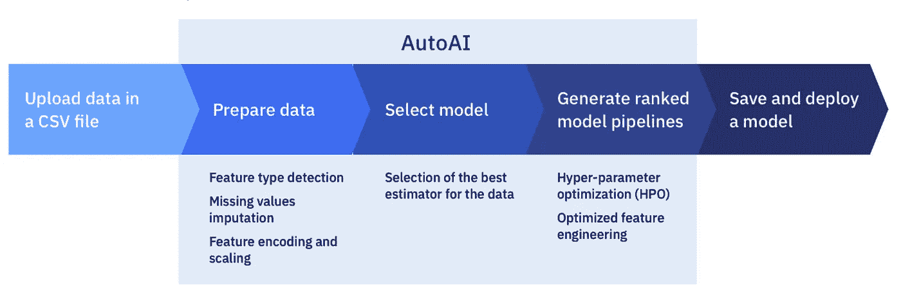
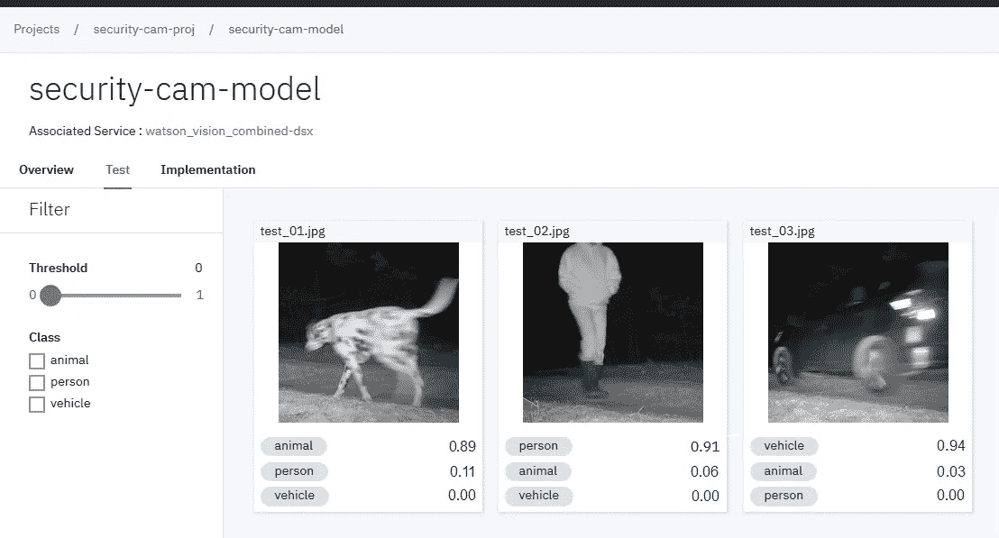
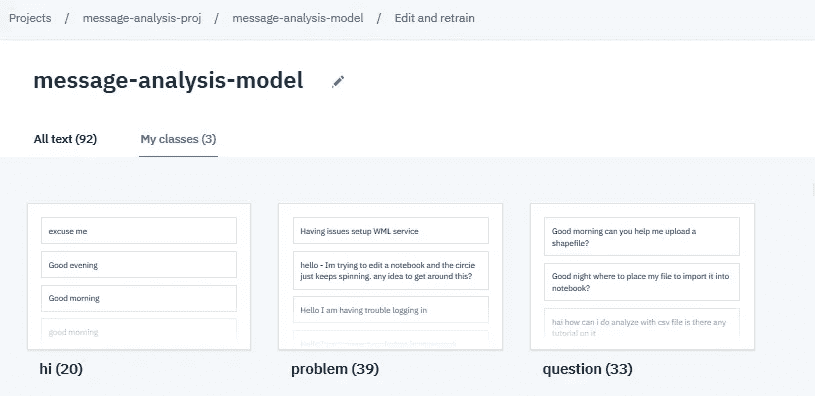

# 将数据转换为模型的魔力

> 原文：<https://towardsdatascience.com/autoai-the-magic-of-converting-data-to-models-185f26d22234?source=collection_archive---------43----------------------->

## 不用一行代码就能构建复杂的人工智能模型！

## IBM Watson AutoAI

AutoAI 是一个图形工具，是 Watson Studio 的一部分，它允许在没有编码的情况下生成预测模型。AutoAI 由 IBM 生产，用于自动化企业 AI 模型开发，并减少建模生命周期的时间。[奥拓获得爱康智能自动化奖](https://www.ibmbigdatahub.com/blog/autoai-wins-aiconics-intelligent-automation-award-meet-key-inventor)。

**AutoAI 具有强大的功能，包括:**

*   快速选择和创建模型
*   人工智能生命周期管理，即理解你的数据，清理数据，预处理，培训，特征工程，微调，并为部署提供 API
*   易用性(只需几次点击即可培训和部署不同的模型)

自动开票流程—来自[自动开票文档](https://dataplatform.cloud.ibm.com/docs/content/wsj/analyze-data/autoai-overview.html)的图像

## Watson Studio 中的视觉识别

Watson Studio 识别服务使用尖端的深度学习算法对图像进行分析和分类，并检测物体和其他内容。它允许用户建立一个协作环境，机器学习工程师可以远程合作。它将项目与 Github 连接起来，使推和拉变更变得更加容易。它支持不同的图像格式，如 JPEG 和 PNG。它还支持笔记本。

使用 Watson Studio 构建的视觉识别模型— [来自 Watson Studio 文档的图像](https://dataplatform.cloud.ibm.com/docs/content/wsj/analyze-data/visual-recognition-overview.html)

## 自然语言分类器

Watson Studio 自然语言分类器允许用户基于用户定义的类来构建文本分类器。它支持 CSV(。csv)数据文件，其中包含每个类的样本。它支持不同的语言，包括英语、阿拉伯语、法语、德语、意大利语、日语、韩语、葡萄牙语(巴西)和西班牙语。Watson Studio 提供多类别分类和多阶段分类(单个 API 请求中最多 30 个单独的输入)。它还支持笔记本中的 API。

这是一个使用 Watson Studio 构建的示例模型，包含三个类(嗨，问题，问题。

*Watson Studio 中的自然语言分类器模型生成器—* [*图片来自 Watson Studio 文档*](https://dataplatform.cloud.ibm.com/docs/content/wsj/analyze-data/nlc-overview.html)

## 自动示例

在下文中，我列出了我创建的几个博客，以指导您使用 AutoAI 训练和部署不同模型的步骤:

## 图像分类

我们将使用包含来自世界各地的 120 种狗的图片的斯坦福狗数据集。我们的分类器的目标是根据狗的品种对狗的图像进行分类。

 [## 如何使用 Watson AutoAI 构建图像分类器

### 建立一个没有编码的图像分类模型

towardsdatascience.com](/how-to-build-an-image-classifier-using-watson-autoai-ab1ffda25bab) 

## 使用预先训练的图像分类器

在这篇博客中，我们学习了如何通过将预先训练好的模型公开为推理任务的 API 来重用它们。

 [## 如何使用 Watson AutoAI 推断预训练的图像分类器

### 推理 AutoAI 预训练模型

towardsdatascience.com](/how-to-inference-a-pre-trained-image-classifier-using-watson-autoai-a63894a06458) 

## 目标检测

在这篇博客中，我们学习如何建立一个模型来检测大脑扫描中的癌症和液体。

 [## 如何使用 Watson AutoAI 建立对象检测模型

### 无需编码，构建脑瘤目标检测模型

towardsdatascience.co](/how-to-build-an-object-detection-model-using-watson-autoai-64677e045fd0) 

## 文本分类

我们建立了一个模型，用于将不同的 StackOverflow 帖子分类到不同的标签中。

 [## 使用 Watson AutoAI 建立文本分类模型

### 如何在不编码的情况下使用 Watson Studio AutoAI 训练文本分类器

towardsdatascience.com](/build-a-text-classification-model-using-watson-autoai-3650c461642) 

如果你是图像分类/深度学习的新手，请查看我的帖子，了解深度学习的基础知识，并在下面的博客中端到端地了解整个训练过程:

 [## 在深度学习的掩护下

### 理解神经网络的循序渐进教程

towardsdatascience.com](/under-the-hood-of-deep-learning-e8bb39aec5d2) 

了解关于嵌入和文本模型的更多信息

 [## 嵌入模型背后的魔力

### 探索 Word2vec 和 GloVe 的实现

towardsdatascience.com](/the-magic-behind-embedding-models-c3af62f71fb) 

如果你是文本数据的初学者，想从头开始，看看下面的帖子

 [## 文本矢量化:将文本转换为数字的魔力

### 将文本转换成数字的魔力

towardsdatascience.com](/the-magic-behind-embedding-models-part-1-974d539f21fd) 

# 结论

机器学习工程师经常花费相当多的时间来搜索合适的模型(参考模型)。使用 AutoAI 可以极大地改进和简化这一步骤。它有助于轻松建立深度学习模型，只需提供您的数据，无需一行代码。

如果您有任何问题，请告诉我！

# 承认

非常感谢[Jorge Castaón](https://medium.com/u/530b2e4b5059?source=post_page-----185f26d22234--------------------------------)的宝贵意见，使这个博客的质量得以提高！

# 资源

*   [IBM 沃森工作室- AutoAI 概述](https://dataplatform.cloud.ibm.com/docs/content/wsj/analyze-data/autoai-overview.html)