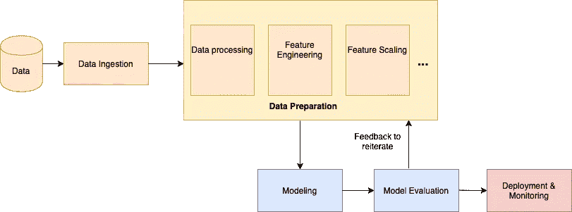

# AutoAI:您的伙伴(值得信赖的合作伙伴),加快您的 AI 和 ML 模型的上市时间。

> 原文：<https://towardsdatascience.com/autoai-your-buddy-trusted-partner-to-speed-up-time-to-market-for-your-ai-and-ml-models-64690fb22e16?source=collection_archive---------49----------------------->

## 自动化 ML 生命周期的不同步骤

在 [Unsplash](https://unsplash.com?utm_source=medium&utm_medium=referral) 上由 [Franck V.](https://unsplash.com/@franckinjapan?utm_source=medium&utm_medium=referral) 拍摄的照片

Auto AI 或 AUTO ML(甚至自动化数据科学)是学术界和行业中一个活跃的研究领域。云供应商推广某种形式的 AutoML 服务。同样，科技独角兽也为其平台用户提供各种 AutoML 服务。此外，还有许多不同的开源项目，提供了有趣的新方法。但是什么是 Auto AI，AutoML 是什么意思？

AutoAI 以一种复杂的方式利用特征训练来自动完成整个机器学习管道中的大多数复杂和耗时的任务，更具体地说，是特征工程和 ML 模型选择和构建部分。它不需要您成为数据科学专家。当然，如果你有这方面的专业知识会有所帮助，因为到那时，你将能够在下一个最佳水平上利用自动人工智能能力，这就是所谓的反馈回路中的人类。

预计自动化人工智能将有助于将 ML 功能提升到一个新的水平，帮助商业用户改善 ML 工作流程。虽然，自动人工智能的长期目标是自动化大部分(如果不是全部的话)将 ML 应用于商业用例的端到端过程。我们有必要了解它的能力、局限性以及自动化人工智能的未来目标。

这篇博客的重点是澄清概念，它包括什么，我们还缺少什么，或者换句话说，需要哪些潜在的改进来完成自动化数据科学之旅。本博客讨论了与 AutoML 相关的项目和研究工作的前景和历史，不仅着眼于超参数优化，还考虑了对端到端工作流和数据科学实践的影响。

# 🎓你会学到什么？

在这篇博客中，你将了解到以下几个方面:

*   自动人工智能、自动人工智能，以及我们所说的自动人工智能/数据科学是什么意思
*   目前使用的各种自动化技术
*   AutoML 的近期功能和局限性，以及长期目标
*   如何利用这项技术来改善机器学习工作流的端到端生命周期

# 什么是汽车 AI？

AutoAI 代表人工智能的自动化。更具体地说，它意味着 ML / DL 管道的哪些部分(或步骤)可以而且应该自动化。它以机器学习步骤的选择和调整的自动化为中心，包括但不限于数据准备、特征工程和提取、模型选择、超参数调整和优化、结果解释和可视化。

## ML 工作流程的哪些部分可以自动化？

虽然不是数据科学工作流中的一切，但我相信很多事情是可以自动化的。你可以看看下面一个典型的机器学习工作流程，我在 2020 年 4 月关于[功能商店](/feature-store-a-better-way-to-implement-data-science-and-ai-in-and-across-your-organization-93edc6366375?source=friends_link&sk=38f3cf363fc772a490fc50cc18f1ee2c)的文章中介绍过。我把它转贴下来供你参考。Feature Store 是让你的 AI 和数据科学工作流自动化的一个很好的方式(至少在很多部分)。关于功能商店的更多细节，你可以阅读 T2 的博客。

预先实现的模型类型和结构可以从输入数据集中呈现或学习以供选择。AutoAI 简化了 AI 项目的开发、价值证明计划，并帮助(企业)用户加快 ML 解决方案的开发，而无需丰富的编程知识。然而，就目前而言，它可以作为数据科学家的补充工具。这有助于他们快速找到他们可以尝试的算法，或者看看他们是否错过了一些算法，这可能是一个有价值的选择，以获得更好的结果。

通常，商业领袖认为，如果他们手中有自动人工智能工具，他们为什么要雇用数据科学家。我强烈建议不要陷入这种想法，因为它会给你错误的印象。

原因是，

*   数据科学就像任何其他业务职能一样，必须尽职尽责地执行，并需要创造性思维和人类技能来充分利用它。
*   汽车人工智能仍然没有出现，我们正在研究的仍然是狭义的人工智能，我们还没有接近实现(通用人工智能)AGI，一旦我们有了它，我们就可以考虑没有数据科学家的生活，至少在大部分情况下。
*   数据科学就像保姆，你必须定期照看你的管道、模型、数据和其他资产
*   理解业务和数据(CRISP-DM 模型的前两步)不能由算法来完成，你需要一个数据科学家来做这项工作，为 ML 管道准备好数据。
*   同样，在管道的其他步骤中，您仍然需要数据科学家和人工智能专家来确保模型正常工作，如果有什么需要调整的话。
*   最后但并非最不重要的一点是，一旦您获得了结果和业务见解，您仍然需要数据工作者来解释它们并将其传达给业务部门。

我在这里很早就提出了这些观点，这样您就不会因为没有数据科学家就可以使用 AutoAI 而感到困惑。如果您在迈向基于人工智能的转型之旅中同时拥有这两者，那将是最好的选择。

与此同时，我想强调并提醒你，有一个极好的价值，汽车人工智能可以提供给你，并缩短上市时间的毫升模型，这就是为什么我想出了这个博客。

企业寻求自动化 ML 管道和 ML 工作流中的不同步骤，以解决他们加快采用人工智能的趋势和需求的增长。在深入研究什么是自动化之前，我们先来看看标准的 ML 管道是什么样子的。如上图所示，它包括数据检索、数据准备、建模、超参数调整、模型部署和监控。

在初始数据摄取之后，我们需要删除重复项，修复缺失值，并解决数据中是否存在任何潜在错误。下一步是应用特征工程来提取和工程化特征，然后从清理后的数据集中获得训练数据。它包括数据编码、特征(重新)缩放、相关性分析等。

然后，我们将这些准备用于训练的特征馈送到所选模型，随后进行超参数调整。这种模型选择和参数调整需要数据科学家多次经历这个过程，并比较模型的性能。

由此产生的模型及其结果需要检验和解释。在这一步中，数据科学家必须验证特征的重要性，检测潜在的偏差，并解释预测，以便业务用户能够理解见解并理解它们对他们的相关性。

数据科学家对每个用例和每个用例中的每个用例都要经历这个过程。这些重复需要花费时间、精力、金钱和延迟才能投入生产。出于这个原因，我们建议 AutoAI 可以作为救星出现，并且可以自动化 ML 生命周期的许多步骤。

不同的供应商提供了 ML 管道自动化的解决方案。由 IBM 提供的解决方案被称为 AutoAI。AutoAI 专注于自动准备数据、选择和应用机器学习算法，以及构建最适合您的数据和业务场景的模型管道。

## 数据清理和特征工程

在 ML 管道中，数据摄取之后的第一步是关于数据清理和特征工程:特征+(选择、提取、构造)。“自动分析”可以帮助您检测数据中可能存在的重复项、缺失值以及其他不一致或错误。在解决了这些问题(数据清理)之后，我们将数据中的属性转换为特征，以便 ML 模型可以使用它们。特征的质量和数量极大地影响了模型及其结果。

**特征选择:**系统使用搜索策略选择特征子集，并对其进行评估。它一直这样做，直到找到适合该模型的这样一个特征集。

**特征构建:**从原始数据或结合现有特征创建新特征。

**特征提取:**侧重于使用 PCA、独立成分分析、isomap 等标准方法进行降维。

通常，这一步需要数据科学家花费大量时间，因为这是一个繁琐的过程。Auto AI 解决了这个问题，提高了效率并保证了质量特性。

提出正确的功能是机器学习流程中最耗时的步骤之一。

## 模型选择、超参数调整和模型测试

有两种选择模型的方法。传统上，数据科学家专注于手动模型选择:从传统的 ML 模型(决策树、SVM、逻辑回归等)中选择模型。)基于可用的数据和模型的适用性。AutoAI 使用的第二种方法是**神经架构搜索(NAS)** :它试图在 b 背景中使用强化学习来设计网络架构。

由于数据科学家是稀缺资源，这一部分通常对数据科学家来说非常具有挑战性，因为他们的时间和其他实际考虑有限，不允许他们同时尝试多个模型。AutoAI 在许多方面帮助他们。一旦模型得到训练，就可以在 AutoAI 的测试和进一步调整中重用它们。

为了有效地选择最佳模型，AutoAI 对小的数据子集运行估值器，逐渐增加。它有助于系统迭代地消除估值器并选择最佳估值器，同时节省时间和存储等稀缺资源。

一个至关重要的方面是超参数训练。它包含管理培训过程的数据。超参数调整运行整个训练作业，评估结果，并进行调整，以找到最佳的参数组合，从而找到解决方案。

Auto AI 提供了一个智能的超参数调整，可以调整每个算法的基本超参数。用于 HPO 的方法包括进化算法、强化学习、贝叶斯优化等。它搜索每个参数的不同范围的值，一旦算法完成执行，您可以选择相应的模型并可视化结果。

## 解释和可视化

您希望能够可视化数据集和模型，即能够看到关于数据的统计信息，如数据类型、分布、异常值等。如果没有自动化的人工智能，数据科学家可能需要几个小时甚至几天的工作。

可视化有助于用户更直观地了解和理解数据。它还可以帮助你解释模型，把它们变成白盒。例如，如果您可以直观地绘制决策树的结构，这将非常有帮助。它使用户能够评估模型并修改树结构，如剪枝和增强。同样，它有助于了解关于特征、特征的重要性以及特征如何影响模型预测的信息。

## 模型部署和监控

当模型准备好进行部署时，可以使用模型功能的一键部署，这让数据科学家感到非常轻松和舒适。此外，如果您可以选择并保存您希望与模型一起使用的服务，并创建模型的版本控制，这将会很有帮助。我的意思是，谁不想有“饭桶”在那里！

模型管线的自动评分使模型准备好在生产中运行它们。除此之外，它还为用户提供了运行多项实验的灵活性，例如 A/B 测试、健康检查、维护和应用安全补丁。

## 汽车人工智能的未来

在未来，汽车人工智能将获得更多的采用和动力。它要求进一步改进和增加 AutoAI 系统的功能。例如，添加数据收集功能将非常有帮助，因为这通常是需要解决的挑战性问题之一，尤其是高质量的数据。这个问题有两个解决方案；1)数据合成和 2)数据搜索。

**数据合成:**数据扩充将对图像数据有用；文本数据的翻译也有帮助，数据模拟可以服务于更特殊的任务。

**数据搜索:**由于互联网包含无限的数据，数据搜索可能会成为一个很好的解决方案。此外，特定于领域的功能将有助于针对特定场景自动化数据科学。

2020，Chan Naseeb。保留所有权利。