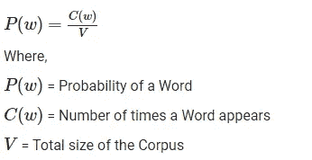
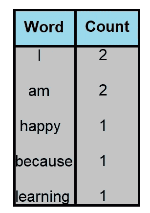
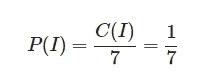
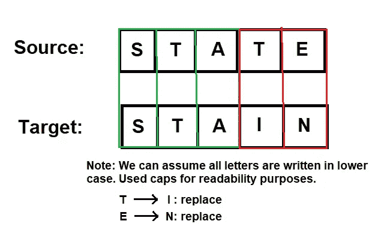
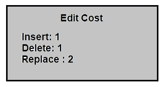
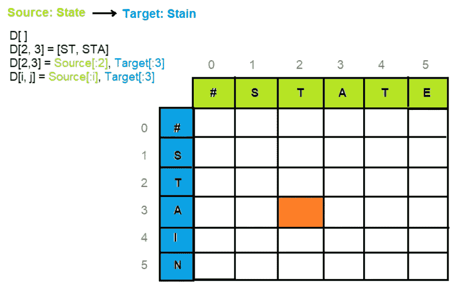
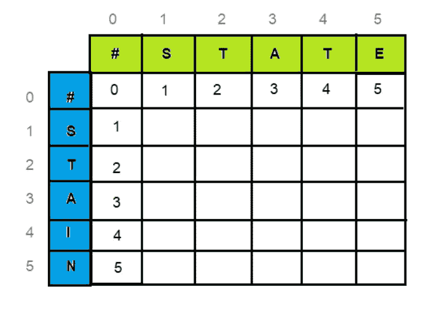
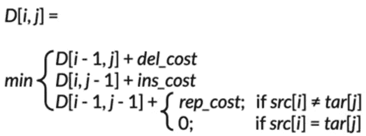
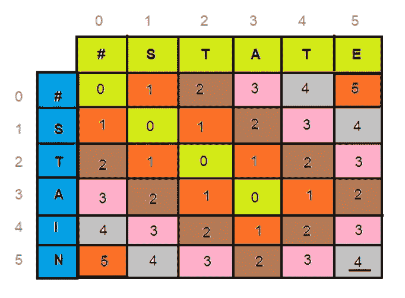

# 自动更正

> 原文：<https://towardsdatascience.com/autocorrect-8c33f3b472a0?source=collection_archive---------15----------------------->

## [自然语言处理笔记](https://towardsdatascience.com/tagged/nlpnotes)

## 自然语言处理专业课程 2 第 1 周笔记

[真诚媒体](https://unsplash.com/@sincerelymedia?utm_source=medium&utm_medium=referral)在 [Unsplash](https://unsplash.com?utm_source=medium&utm_medium=referral) 上拍摄的照片

自动更正是我们所有人的救星。有多少次，我去输入一条信息，它会出来，好像我喝醉了，然后自动更正替我调解-哦，我多么爱你自动更正(有时)。

更正式地说，自动更正是一种软件功能，它在我们打字时自动建议或纠正拼写或语法错误。

我们都使用自动更正，但这篇文章将教你它是如何工作的。然而，在这些笔记中，我们将只涉及拼写错误，而不是上下文错误。例如，“祝我的朋友生日快乐！”包含拼写错误的单词“deah”，“自动更正”有望识别该单词并将其更改为“dear”(假设我们的模型是准确的)。另一方面，“生日快乐我的鹿朋友！”不会被认为是一个错误，因为“鹿”是一个真实的单词(它是一种动物)，在上下文中是不正确的，除非你的朋友实际上是一只鹿。

> **注**:捕捉上下文错误是一个更复杂的问题，我们将在以后讨论。

## 自动更正是如何工作的？

建立更正拼写错误的自动更正模型有 4 个关键步骤:

***#1:识别拼错的单词***——根据我们之前的例子，我们如何知道单词“ *deah* ”拼错了呢？如果一个单词拼写正确，那么这个单词可以在字典中找到，如果不正确，那么它可能是一个拼写错误的单词。因此，当一个单词在字典中没有给出时，我们会将其标记出来进行更正。

***#2:查找字符串 n 编辑距离*** —编辑是对一个字符串执行的将它转换成另一个字符串的操作， *n* 就是编辑距离(即 1、2、3 等的编辑距离)，它统计了编辑操作的次数。因此， *n* 编辑距离告诉我们一个字符串与另一个字符串相距多少个操作。以下是不同类型的编辑:

*   插入(添加一个字母)
*   删除(去掉一个字母)
*   切换(交换两个相邻的字母)
*   替换(将一个字母改为另一个字母)

通过这 4 次编辑，我们能够修改任何字符串。并且这些编辑的组合允许我们找到所有可能的字符串的列表，这些字符串是 *n* 编辑的。

> **注意**:对于自动更正，n 通常是 1-3 次编辑。

***#3:过滤候选词*** —我们只想考虑候选词列表中拼写正确的真实单词，因此我们将这些单词与已知词典进行比较(如**# 1】**，并过滤掉候选词列表中未出现在已知词典中的单词。

***#4:计算单词概率***——利用我们的实际单词列表，我们可以计算单词概率，从候选单词中找出最有可能的单词。这就要求我们知道语料库中的词频和总字数。

**图 1** :计算单词概率的公式(图片由作者提供)

给定*图 1* 中的公式，我们可以想象一个由句子“我很高兴，因为我在学习”组成的语料库，我们首先计算字数…

**图 2** :字数统计(图片由作者提供 NLP 专业化课程 2 第 1 周表格的翻拍)

然后我们应用我们的公式来计算单词概率(我们将使用“I”作为例子)…

**图 3** :计算单词“I”的单词概率

当执行自动更正时，我们必须找到概率最高的候选词，并选择该词作为替换。

## 最小编辑距离

上面我们看到了如何使用编辑距离应用自动更正，然而，当我们给定多个单词或整个文档时，我们也可以使用最小编辑距离来评估它们的相似程度。事实上，在许多情况下可以应用最小编辑距离，例如:

*   拼写纠正
*   文档相似度
*   机器翻译
*   DNA 测序

还有更多。

***最小编辑距离*** →将一个字符串转换成另一个字符串所需的最少操作次数。

为了计算最小编辑距离，我们使用了我们已经讨论过的 3 种类型的编辑计算。这 3 个编辑是*插入*、*删除*和*替换*——最小编辑距离示例见*图 4* 。

**图 4** :使用编辑将源单词替换为目标单词的示例(作者图片)

鉴于我们认为所有编辑操作的成本相同，图 4 中的编辑总数为 2。但是，通过调整每次编辑的成本，我们可以计算出编辑成本，这是我们试图通过合计每次编辑的成本来最小化的成本——更新后的编辑成本见*图 5* 。

**图 5** :一次编辑的成本。

对于我们的例子，在图 4 中，我们修改后的编辑成本是 4。这很简单，我们可以直观地解决这个问题。然而，如果我们有更长的字符串或大量的文本，操作就会更多，也不会那么简单。我们可以尝试用蛮力来克服这一点，每次增加一个额外的距离，并枚举所有的可能性，直到一个字符串转换成另一个字符串。但是，这可能会花费不必要的长时间。

> **注意**:这样求解会成倍增加计算复杂度，
> 随着每个字符串长度的增长。

## 动态规划

更快的方法是使用动态编程。动态编程是计算机科学中一项众所周知的专长，指的是通过将复杂的问题分解成更简单的子问题来简化它。其思想是简单地存储子问题的结果，这样我们就不必在以后需要时重新计算它们。这个简单的优化将时间复杂度从指数级降低到多项式级(来源: [GeeksToGeeks](https://www.geeksforgeeks.org/dynamic-programming/) )。

> **注意**:深入研究动态编程超出了这篇文章的范围，但是你可以在[维基百科](https://en.wikipedia.org/wiki/Dynamic_programming#:~:text=Dynamic%20programming%20is%20both%20a,from%20aerospace%20engineering%20to%20economics.)上读到更多。

**图 6** :我们要用编辑成本填充的矩阵 D——注意:D[2，3]用橙色突出显示，作为我们如何引用每个网格的示例。(图片由作者提供)

从图 6 的*中给定我们的编辑成本，*我们的矩阵 D 的第一个任务是填充 D[0，0]，我们从源中的空字符串到目标中的空字符串。这是非常明显的，因为它们是相同的，所以达到这一点的编辑次数应该是 0。

事实上，填充第一行和第一列是非常直观的，因为我们只是将删除的成本添加到前一个单元格中——参见图 7*。*

**图 7** :填充 D 矩阵第一行第一列

这可以用数学方法表示，如图 8 中的*所示。*

**图 8:** 数学表达式(图片由作者提供)

现在，让我们将此公式应用于图 7 中的示例，以更新编辑成本。还记得我们之前说过答案是 4，我们直观地算出了答案，因为我们有相当简单的字符串。为了确定最小编辑距离，我们将看到在矩阵的 D[m，n](右下角)中出现的操作数——如果我们做得正确，应该是 4。

**图 9:** 完成的三维矩阵

如你所见，矩阵同意 4 是将状态转换为污点的最小编辑距离。我还在矩阵中添加了一些颜色来突出有趣的图案。

> **注**:这个我个人在重复了无数遍视频后还是没看懂。Youtube 上一个叫做[最小编辑距离动态编程](https://www.youtube.com/watch?v=We3YDTzNXEk)的视频帮我澄清了这个问题。

为了测量编辑距离，我们指定 3 个编辑:插入、删除和替换，编辑成本为 1、1、2，分别称为 [Levenshtein 距离](https://en.wikipedia.org/wiki/Levenshtein_distance#:~:text=Informally%2C%20the%20Levenshtein%20distance%20between,considered%20this%20distance%20in%201965.)，这不是唯一的方法，但也是我们在示例中使用的方法。同样重要的是，我们在每个单元格中保留一个回溯，或者简单地说，一个指针，以允许我们跟踪我们是如何达到最小编辑距离的。

谢谢你看完。在 LinkedIn 上和我保持联系，让我们一起学习！

 [## Kurtis Pykes -数据科学家-自由职业者，自由职业者| LinkedIn

### 在世界上最大的职业社区 LinkedIn 上查看 Kurtis Pykes 的个人资料。Kurtis 有 3 个工作列在他们的…

www.linkedin.com](https://www.linkedin.com/in/kurtispykes/)