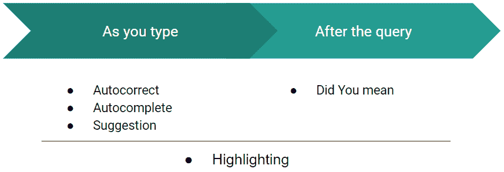
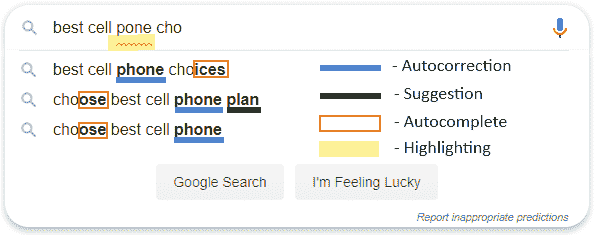
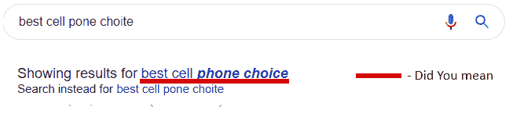
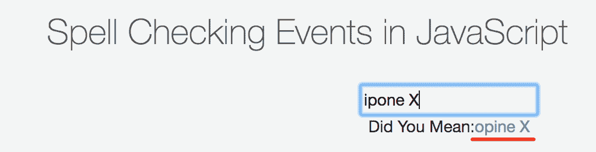
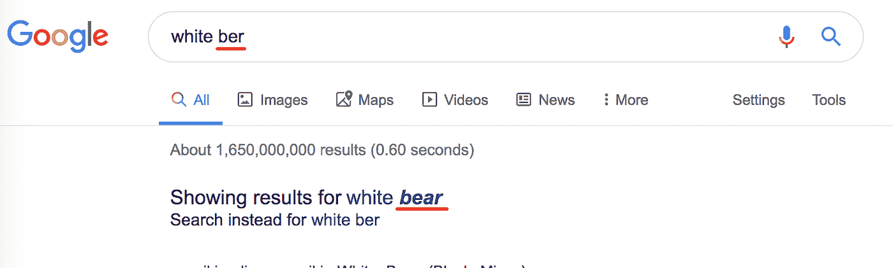

# 谷歌、亚马逊和 Pinterest 中的自动更正以及如何编写自己的自动更正

> 原文：<https://towardsdatascience.com/autocorrect-in-google-amazon-and-pinterest-and-how-to-write-your-own-one-6d23bc927c81?source=collection_archive---------8----------------------->

## 在本文中，我将解释什么是搜索功能领域的拼写纠正，它如何在谷歌、亚马逊和 Pinterest 中工作，并将演示如何使用自定义搜索引擎蝎狮搜索从头开始实现自己的应用。


“禽龙”，海因里希·哈德(维基媒体)

**拼写纠正**也称为:

*   自动校正
*   文本校正
*   修复拼写错误
*   错别字容差
*   “你是说？”

“等等”是一种软件功能，它可以给你提供替代文本的建议，或者对你输入的文本进行自动更正。

卡耐基梅隆大学的界面设计教授 Brad Myers 说，纠正键入文本的概念可以追溯到 20 世纪 60 年代。这是一位名叫沃伦·泰特尔曼的计算机科学家，他也发明了“撤销”命令，提出了一种叫做 D.W.I.M .的计算哲学，或者说“按我的意思做”泰特尔曼说，我们应该给计算机编程，让它们识别明显的错误，而不是让它们只接受完全格式化的指令。

*第一个提供拼写纠正功能的知名产品是 1993 年发布的 Microsoft Word 6.0。*

如今，人们无法想象他们的真实生活中没有消息传递、搜索、浏览和使用不同的商业应用程序:文本编辑器、内容管理系统(CMS)、客户关系管理系统(CRM)等。在所有这些网站中，人们会犯打字错误，忘记单词的正确拼写，有时还会犯语法错误等等。这绝对没问题，每个人都会犯错。一个好的软件所做的就是帮助你以最简单和最有效的方式修复这些错误。有很多方法可以做到这一点:从它如何寻找用户，它带来什么价值，以及它是如何在引擎盖下制造的。

在这篇文章中，我们将特别关注搜索系统，因为对于它们来说，在处理之前(或处理过程中)纠正您的搜索查询尤为重要，因为否则您的搜索结果可能是绝对错误的。

# **自动更正的不同方法**

就用户体验而言，我们可以将这些方法分为两组:

*   在第一种情况下，系统会在你输入的时候试图纠正你的文字
*   在另一种情况下，它认为这是已知的，然后给你建议

在大多数情况下，这些方法是结合在一起的，所以系统会在你输入时试图纠正你，如果它认为还有问题，会在你得到搜索结果后建议你改正。



*   **自动更正** —立即更正键入的错误查询
*   自动完成功能——许多现代网站的另一大功能，通常与自动更正功能结合在一起
*   建议 —这是一种自动完成和自动更正的混合，看起来像是建议你键入的内容有一点不同，但仍然有意义(见下图)
*   **突出错误的**——另一个不错的功能是突出错误。它也可以在你打字时和打字后完成
*   **“你是说”**——很多系统不仅在你打字的时候，而且在显示搜索结果的时候，都会向你推荐精炼的搜索查询。我们称之为“你是说…？”。依次有两种模式:

1.  通过你的原始搜索查询进行搜索，然后只显示推荐的查询(就像谷歌一样)
2.  或者按精搜索，建议“改为搜索<original query=""></original>

## 键入组件时:



## 查询后:



让我用图片向你展示不同的流行网站如何使用上述技术。

谷歌**谷歌**作为互联网上排名第一的网站无所不能:自动更正、自动完成、建议、错误突出显示和“你是指”。谷歌使用预测服务来帮助完成搜索，甚至是地址栏中键入的 URL:这些建议或预测(谷歌称之为预测)是基于相关的网络搜索、你的浏览历史和谷歌网站排名。


**亚马逊**使用名为 A9 的面向电子商务的搜索算法。它与谷歌算法的不同之处在于，它非常强调销售转化率。

就亚马逊的自动更正实现而言，它包含了前面提到的所有组件，但由于它是一个市场，其建议排名公式似乎包括了一个建议在销售方面对你有多大吸引力的因素。


**Pinterest** 也有自己的基于内部域/pin/pin ners 相关性的算法。


# 它是如何工作的

现在让我们考虑一下如何进行拼写纠正。有几种方法，但重要的是，没有一种纯粹的编程方法可以将你输入错误的“ipone”转换成“iphone”(至少质量不错)。大多数情况下，必须有一个系统所基于的数据集。数据集可以是:

*   拼写正确的单词词典。反过来，它可以是:

1.  基于你的真实数据。这里的想法是，在根据你的数据组成的**字典中，拼写大多是正确的，然后对于每个键入的单词，系统只是试图找到一个最相似的单词(我们将很快谈论如何准确地完成)**
2.  或者可以基于与你的数据无关的**外部字典**。这里可能出现的问题是，您的数据和外部字典可能差别太大:字典中可能缺少一些单词，您的数据中可能缺少一些单词。例如，在这些情况下:



但是，对于较小的数据集合来说，这仍然是有意义的，因为这样一来，搜索查询被纠正的可能性就更大了

*   不仅仅是基于字典，而且**上下文感知**，比如如果我搜索“白色 **ber** ，谷歌理解我指的是一只熊:



但是如果我把它改成“黑暗 **ber** ”，它就会明白我指的是啤酒:


上下文可能不仅仅是你查询中的一个相邻词，还包括你的位置、时间、当前句子的语法(比如把“there”改成“their”或者不改)、你的搜索历史以及几乎任何其他可能影响你意图的东西。

*   另一个经典的方法是使用**先前的搜索查询**作为拼写校正的数据集。它甚至更多地用于自动完成功能，但对自动更正也有意义。这里的想法是，大多数用户的拼写是正确的，因此我们可以使用他们搜索历史中的单词作为事实的来源，即使我们的文档中没有这些单词，也不使用外部词典。上下文感知在这里也是可能的。
*   另一种方法是使用你的用户以前的搜索查询和/或你的字典和/或文档来找出一些**校正规则**，并使用它们来校正新的搜索查询。甚至还有一项关于这个[https://patents.google.com/patent/US6618697B1/en](https://patents.google.com/patent/US6618697B1/en)的专利

对于所有的方法，可以使用不同的算法来搜索和评估候选拼写纠正:

*   从最简单的比较一个给定的单词和字典中的所有单词
*   早期拒绝算法可以大大缩小候选列表的范围(我们将在下面详细讨论)
*   不同种类的有限自动机来提高寻找候选者的性能(Lucene 的方式)
*   概率模型，例如 [Etsy 在先前搜索查询的基础上利用的隐马尔可夫模型](https://codeascraft.com/2017/05/01/modeling-spelling-correction-for-search-at-etsy/)
*   到通常需要大量训练数据的不同机器学习技术

看看人工智能、机器学习和语义搜索最近发展得多快，我相信在这十年里，拼写纠正技术的前景可能会发生巨大变化，但就目前而言，上述方法似乎是最常用的。而且大多数解决方案都是基于你现有的数据收集和由此组成的字典。

# 如何编写您的自定义自动更正

> 在这里，我将描述我自己在蝎狮搜索的帮助下进行网站搜索的一部分经历。大约一年前，我在为一些客户项目工作时发现了这个产品，由于它的轻量级和快速搜索以及许多开箱即用的功能，我仍然在我的一些项目中使用它。

现在，让我们来讨论一下您可以使用哪些工具将自动更正功能添加到您的系统中，同时更深入地了解一些更简单的技术是如何工作的。

到这样做的话，我们将选择一个流行的定制搜索引擎，因为它们通常提供我们正在寻找的功能。我喜欢蝎狮搜索，因为与更知名的 Elasticsearch 相比，它更轻量级，更容易处理，因为它是 SQL 原生的，在大多数情况下工作更快。它是如此的 SQL 原生，你甚至可以用一个标准的 MySQL 客户端连接到它。它们提供了一个官方的 docker 图片，所以我将用它来演示自动更正在蝎狮搜索中是如何工作的:

```
➜ ~ **docker run --name manticore -d manticoresearch/manticore** 1ac28e94b3ca728fb431ba79255f81eb31ec264b5d9d49f1d2db973e08a32b9f
```

在容器内部，我将运行 mysql 来连接运行在那里的蝎狮搜索服务器:

```
➜ ~ **docker exec -it manticore mysql**
Welcome to the MariaDB monitor. Commands end with ; or \g.
Your MySQL connection id is 1
Server version: 5.5.21
Copyright © 2000, 2018, Oracle, MariaDB Corporation Ab and others.
Type 'help;' or '\h' for help. Type '\c' to clear the current input statement.
```

它配有两个测试表，我们可以用它们来快速纠正拼写:

```
MySQL [(none)]> **show tables;** +--------+-----------+
| Index  | Type      |
+--------+-----------+
| pq     | percolate |
| testrt | rt        |
+--------+-----------+
2 rows in set (0.00 sec)
```

让我们检查一下 testrt 的模式:

```
MySQL [(none)]> **describe testrt;** +---------+--------+------------+
| Field   | Type   | Properties |
+---------+--------+------------+
| id      | bigint |            |
| title   | field  | stored     |
| content | field  | stored     |
| gid     | uint   |            |
+---------+--------+------------+
4 rows in set (0.00 sec)
```

并在其中插入少量文档。让它成为电影标题:

```
MySQL [(none)]> **insert into testrt(title)** values('The Godfather'),('The Wizard of Oz'),('Combat!'),('The Shawshank Redemption'),('Pulp Fiction'),('Casablanca'),('The Godfather: Part II'),('Mortal Kombat'),('2001: A Space Odyssey'),('Schindler\'s List');Query OK, 10 rows affected (0.00 sec)
```

我们现在可以在索引中看到我们所有的文档:

```
MySQL [(none)]> select * from testrt;
+---------------------+------+--------------------------+---------+
| id                  | gid  | title                    | content |
+---------------------+------+--------------------------+---------+
| 1657719407478046741 |    0 | The Godfather            |         |
| 1657719407478046742 |    0 | The Wizard of Oz         |         |
| 1657719407478046743 |    0 | Combat!                  |         |
| 1657719407478046744 |    0 | The Shawshank Redemption |         |
| 1657719407478046745 |    0 | Pulp Fiction             |         |
| 1657719407478046746 |    0 | Casablanca               |         |
| 1657719407478046747 |    0 | The Godfather: Part II   |         |
| 1657719407478046748 |    0 | Mortal Kombat            |         |
| 1657719407478046749 |    0 | 2001: A Space Odyssey    |         |
| 1657719407478046750 |    0 | Schindler's List         |         |
+---------------------+------+--------------------------+---------+
10 rows in set (0.00 sec)
```

W 刚刚发生了什么:当我们插入标题时，不仅蝎狮搜索按原样保存了它们，而且它为自然语言处理(NLP)做了许多必要的事情:标记化(将标题拆分成单词)、规范化(将所有内容都小写)和许多其他事情，但对我们来说有一点很重要，那就是它将单词拆分成组成它们的三元模型。比如“战斗！”(或者实际上是常态化后的“战斗”)被拆分为**【com】【OMB】【MBA】【bat】**。为什么这很重要呢？

为了回答这个问题，让我们假设我们在“战斗”中打错了，而是输入了“comabt”。如果我们现在想要“战斗”被发现，我们该如何做呢？这些选项包括:

*   我们可以查阅整个字典，将每个单词与我们的关键字(“comabt”)进行比较，然后我们会评估这两个单词之间的差异。它叫做莱文斯坦距离。对于给定的一对单词，有几种方法可以计算出来，但问题是，即使你能这么快地计算出两个单词，你也可能需要一段时间来比较字典中的每个单词和给定的单词
*   因此，最好不要比较字典中的所有单词，而只比较那些更有可能对给定单词进行更正的单词。接下来是三元模型的概念——如果我们将所有的字典单词和搜索关键词都分成三元模型，我们现在可以操作这些更小的符号来找到候选词。

因此，在这种情况下，内部所做的是，蝎狮搜索首先将“comabt”拆分为中缀:“com”、“oma”、“mab”和“abt”，然后在字典中找到相应的单词，因为当文档被插入时，它也这样做。由于这种算法的复杂性不是很高(比互相比较每个单词低得多)，蝎狮很快发现有一个单词“combat”也有“com ”,而且它是唯一的候选单词。因此，在此之后，它所要做的就是确保候选单词与给定单词不会有太大差异。它计算 Levensthein 距离，认为它不大于限制值(默认为 4 ),并返回候选值:

```
MySQL [(none)]> call qsuggest('comabt', 'testrt');
+---------+----------+------+
| suggest | distance | docs |
+---------+----------+------+
| combat  | 2        | 1    |
+---------+----------+------+
1 row in set (0.00 sec)
```

在其他情况下，可能有更多的候选人。例如，如果您搜索“combat ”,字典中会有一个词与您的查询完全匹配(Levenshtein 距离为 0 ),但您可能会搜索另一个词，并调用 SUGGEST 也会返回该词:

```
MySQL [(none)]> call qsuggest('combat', 'testrt');
+---------+----------+------+
| suggest | distance | docs |
+---------+----------+------+
| combat  | 0        | 1    |
| kombat  | 1        | 1    |
+---------+----------+------+
2 rows in set (0.00 sec)
```

如果您输入两个单词，请调用 QSUGGEST，仅处理最后一个单词:

```
MySQL [(none)]> call qsuggest('mortal combat', 'testrt');
+---------+----------+------+
| suggest | distance | docs |
+---------+----------+------+
| combat  | 0        | 1    |
| kombat  | 1        | 1    |
+---------+----------+------+
2 rows in set (0.00 sec)
```

那么，如何在我的应用程序中使用这一功能呢？“你可能会问。很简单。只是:

*   在每个新字符后继续发送搜索查询来调用 QSUGGEST
*   并将它的输出显示给用户

下面是它在我们的数据集的情况下给出的日志，注意输入(在“call qsuggest”之后)和输出(在“suggest”列中):

```
MySQL [(none)]> call qsuggest('m', 'testrt');
Empty set (0.00 sec)
MySQL [(none)]> call qsuggest('mo', 'testrt');
Empty set (0.00 sec)
MySQL [(none)]> call qsuggest('mor', 'testrt');
Empty set (0.00 sec)
MySQL [(none)]> call qsuggest('**mort**', 'testrt');
+---------+----------+------+
| suggest | distance | docs |
+---------+----------+------+
| **mortal**  | 2        | 1    |
+---------+----------+------+
1 row in set (0.01 sec)
MySQL [(none)]> call qsuggest('**morta**', 'testrt');
+---------+----------+------+
| suggest | distance | docs |
+---------+----------+------+
| **mortal**  | 1        | 1    |
+---------+----------+------+
1 row in set (0.00 sec)
MySQL [(none)]> call qsuggest('**mortal**', 'testrt');
+---------+----------+------+
| suggest | distance | docs |
+---------+----------+------+
| **mortal**  | 0        | 1    |
+---------+----------+------+
1 row in set (0.00 sec)
MySQL [(none)]> call qsuggest('**mortal c**', 'testrt');
Empty set (0.01 sec)
MySQL [(none)]> call qsuggest('**mortal co**', 'testrt');
Empty set (0.00 sec)
MySQL [(none)]> call qsuggest('**mortal com**', 'testrt');
Empty set (0.00 sec)
MySQL [(none)]> call qsuggest('**mortal comb**', 'testrt');
+---------+----------+------+
| suggest | distance | docs |
+---------+----------+------+
| **combat**  | 2        | 1    |
| **kombat**  | 3        | 1    |
+---------+----------+------+
2 rows in set (0.00 sec)
MySQL [(none)]> call qsuggest('**mortal comba**', 'testrt');
+---------+----------+------+
| suggest | distance | docs |
+---------+----------+------+
| **combat**  | 1        | 1    |
| **kombat**  | 2        | 1    |
+---------+----------+------+
2 rows in set (0.00 sec)
MySQL [(none)]> call qsuggest('**mortal combat**', 'testrt');
+---------+----------+------+
| suggest | distance | docs |
+---------+----------+------+
| **combat**  | 0        | 1    |
| **kombat**  | 1        | 1    |
+---------+----------+------+
2 rows in set (0.00 sec)
```

# 结论

*   自动更正是许多系统中常用的一个非常好的功能，它可以帮助用户找到更好的结果，网站所有者也不会因为输入错误或查询不正确而失去用户
*   有许多方法可以实现它
*   谷歌、亚马逊、Pinterest、Etsy 和其他大网站的实现似乎相当复杂，并且基于一种非平凡的算法
*   但是在很多情况下，一些简单得多的东西也是有意义的
*   蝎狮搜索可用于提供所需的功能。顺便说一下，在他们的网站上有一个关于它的互动课程:

 [## 你是说？

### 你是说？除了自动完成功能之外，我们在本课程中讨论了一个简单的例子…

play.manticoresearch.com](https://play.manticoresearch.com/didyoumean/)