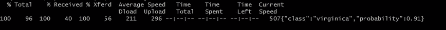

# 通过 Git 将 FastAPI 应用程序自动部署到 Heroku，只需 5 个简单的步骤

> 原文：<https://towardsdatascience.com/autodeploy-fastapi-app-to-heroku-via-git-in-these-5-easy-steps-8c7958ef5d41?source=collection_archive---------25----------------------->

## 在 5 分钟内将您的应用分享到互联网


苏珊·路易斯·佩尼克斯在 [Unsplash](https://unsplash.com?utm_source=medium&utm_medium=referral) 上的照片

如果不是用现有的 app，可以参考我的虹膜分类器 FastAPI App 进行参考。我写过一篇关于如何设置的文章(Docker 组件是可选的)。

**注意:**我很快地组装了 Iris 应用程序来演示如何设置 FastAPI——在提供模型预测时，它肯定不符合最佳实践

[](/deploying-iris-classifications-with-fastapi-and-docker-7c9b83fdec3a) [## 使用 FastAPI 和 Docker 部署 Iris 分类

### 让我们用 Docker 部署一个 FastAPI 应用程序来对一些虹膜进行分类。

towardsdatascience.com](/deploying-iris-classifications-with-fastapi-and-docker-7c9b83fdec3a) 

这是我的虹膜分类器应用程序的 GitHub repo。我们将在本教程中以此为例。确保您正在使用的 FastAPI 项目也被托管为 GitHub 存储库。

# 什么是 FastAPI？

> FastAPI 是一个现代、快速(高性能)的 web 框架，用于基于标准 Python 类型提示用 Python 3.6+构建 API。

FastAPI 网站[提供了有关 FastAPI 如何工作以及使用 FastAPI 的优势的更多详细信息。](https://fastapi.tiangolo.com/)

# 什么是 Heroku？

> **Heroku** 是一个平台即服务(PaaS ),支持开发者完全在云中构建、运行和操作应用。

我真的很喜欢使用 Heroku 来展示我的副业项目，因为它很容易设置，而且免费层通常足以满足大多数目的。

在本文中，我将使用 Heroku 将我的 FastAPI 应用程序部署到公共互联网，并将主分支与生产应用程序同步。每当我将更改推送到主分支时，它们都会在 web 应用程序上同步。

# 步骤 1:添加 Procfile

Procfile 指定了应用程序在启动时执行的命令。创建一个名为`Procfile`的新文件(没有扩展名，确保使用相同的大小写)。

这是虹膜分类器的过程文件:

```
web: uvicorn iris.app:app --host=0.0.0.0 --port=${PORT:-5000}
```

如果您使用自己的 FastAPI 项目，相应地更改路径`iris.app:app`。这是实例化的`FastAPI()`对象的路径。

下面是[矿](https://github.com/happilyeverafter95/iris-classifier-fastapi/blob/master/iris/app.py#L4)供参考。

# [可选]步骤 2:下载 Heroku CLI

按照 Heroku 网站上的说明下载 CLI:

[](https://devcenter.heroku.com/articles/heroku-cli#download-and-install) [## Heroku CLI

### Heroku 命令行界面(CLI)使得直接从终端创建和管理您的 Heroku 应用程序变得非常容易…

devcenter.heroku.com](https://devcenter.heroku.com/articles/heroku-cli#download-and-install) 

虽然我们在这里实际上根本没有使用 CLI，但是 CLI 使得通过终端管理应用程序变得很容易。

# 步骤 3:在 Heroku 上创建应用程序

前往[https://www.heroku.com/](https://www.heroku.com/)创建一个账户。导航到[仪表盘](https://dashboard.heroku.com/apps)创建一个新应用。


我把我的应用程序命名为 *irisclassifierfastapi* 。这个名字决定了默认的 URL——这个项目将在[www.irisclassifierfastapi.herokuapp.com 托管。](http://www.irisclassifierfastapi.myherokuapp.com.)可以在应用程序的`Settings`页面将自定义域名添加到应用程序中。

# **步骤 4:设置自动部署**

导航到 **deploy** 选项卡，点击 GitHub logo，认证并授权 Heroku 从你的 GitHub 账户部署代码。


连接后，选择存储库以连接到应用程序。从那里，选择一个分支并点击**启用自动部署。**如果您正在使用 CI 工具，您可以选中复选框以确保 CI 在部署变更之前通过。


# 第 5 步:首次手动部署您的应用程序

下次将更改推送到主分支时，将会部署该应用程序。由于我们还没有部署我们的应用程序(到目前为止还没有进行任何更改)，我们可以通过滚动到**部署**选项卡的底部来触发手动部署。


如果您安装了 CLI，也可以通过命令行执行手动部署。

 [## 命令行

### heroku 命令行界面(CLI)是使用 Heroku 的重要部分。使用它来执行几乎任何…

devcenter.heroku.com](https://devcenter.heroku.com/categories/command-line) 

部署更改大约需要一分钟。你可以在[https://irisclassifierfastapi.herokuapp.com/docs](https://irisclassifierfastapi.herokuapp.com/docs)上找到虹膜分类器的 Swagger UI


只要我的应用程序在运行，这个 CURL 请求就允许我从分类器中获取预测。

```
curl 'http://irisclassifierfastapi.herokuapp.com/iris/classify_iris' -X POST -H 'Content-Type: application/json' -d '{"sepal_l": 5, "sepal_w": 2, "petal_l": 3, "petal_w": 4}'
```

分类器预测这种鸢尾有 91%的概率是海滨鸢尾。



# 有用的后期制作工具

这里有一些工具，你可以利用它们来调试糟糕的部署，并从总体上监控你的应用。

## 日志

在应用页面中，点击**更多**，从下拉菜单中选择**查看日志**查看应用日志。每个日志都是应用程序中发生的事件。日志可用于提供信息(例如，您可以记录用户属性)、警告和错误。


您可以使用 Python [logging](https://docs.python.org/3/library/logging.html) 库来添加更多的日志，这将使调试您的应用程序变得更加容易。

## 反转

如果部署不当，您可能希望回滚您的更改。虽然您可以在 Git 中通过恢复到以前的提交来实现这一点，但 Heroku 也提供了通过 UI 实现这一点的选项。

导航到**活动**选项卡查看以前的版本，并单击**回滚到此处**恢复到以前的版本。


## 指标(不可用于免费计划)

指标不可用于空闲层。度量图表捕获与系统健康和性能相关的信息，例如内存使用和事件发生。

爱好层下我的一个应用的指标选项卡如下所示:


如果您有兴趣了解更多关于应用程序开发的知识，请查看本课程。

[](https://click.linksynergy.com/link?id=J2RDo*Rlzkk&offerid=759505.11680934640&type=2&murl=https%3A%2F%2Fwww.coursera.org%2Flearn%2Fapp-deployment-debugging-performance) [## 应用部署、调试和性能

### 在本课程中，应用程序开发人员将学习如何设计和开发云原生应用程序，以便无缝地…

click.linksynergy.com](https://click.linksynergy.com/link?id=J2RDo*Rlzkk&offerid=759505.11680934640&type=2&murl=https%3A%2F%2Fwww.coursera.org%2Flearn%2Fapp-deployment-debugging-performance) 

# 感谢您的阅读！

[](https://ko-fi.com/mandygu#checkoutModal)

如果你喜欢这篇文章，可以考虑给我买杯咖啡——每一点小小的贡献都帮助我找到更多的时间在这个博客上工作。请通过 Medium 关注我的最新消息。😃

作为一个业余爱好项目，我还在[www.dscrashcourse.com](http://www.dscrashcourse.com/)建立了一套全面的**免费**数据科学课程和练习题。

再次感谢您的阅读！📕