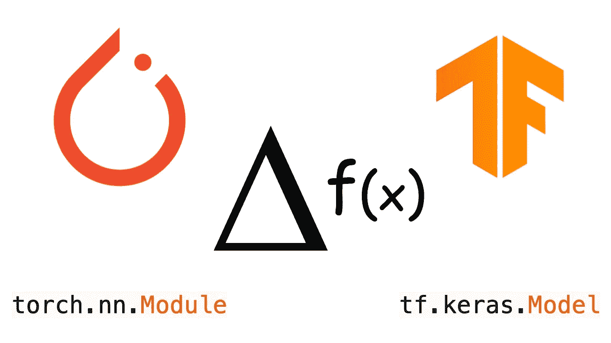
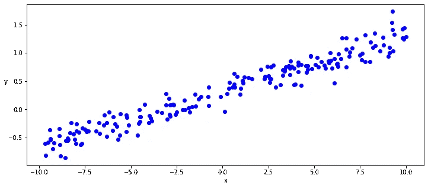
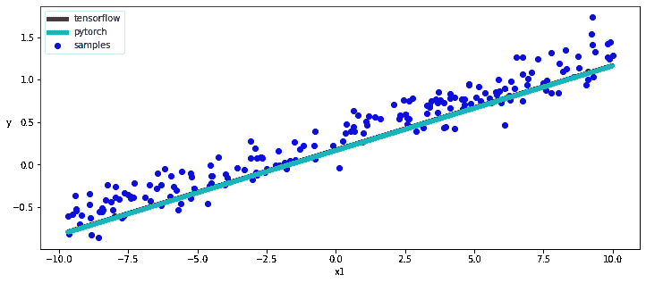

# PyTorch 与 TensorFlow 的自动挖掘和动态子类模型

> 原文：<https://towardsdatascience.com/autodiff-and-dynamic-subclassed-models-with-pytorch-vs-tensorflow-c5224a0a375c?source=collection_archive---------59----------------------->

## 比较 PyTorch 1.x 和 TensorFlow 2.x 之间的自动 Diff 和动态模型子分类方法，使用自定义动态模型类和手动训练循环/损失函数从零开始训练线性回归

来源:作者

这篇短文重点介绍如何在 PyTorch 1.x 和 TensorFlow 2.x 中分别使用带有模块/模型 API 的动态子类模型，以及这些框架如何在训练循环中使用 AutoDiff 来获得损失的梯度，并从头开始实现一个非常简单的梯度后代实现。

# 生成一些带有一点噪声的线性数据

为了专注于自动差异/自动梯度功能的核心，我们将使用最简单的模型，即线性回归模型，我们将首先使用 numpy 生成一些线性数据，添加随机水平的噪声。

来源:作者

# 模型

然后，我们将在 TF 和 PyTorch 中从头开始实现一个线性回归模型，不使用任何层或激活器，而是简单地定义两个张量 w 和 *b* ，分别表示我们的线性模型的*权重*和*偏差*，并简单地实现线性函数: *y = wx + b*

正如你在下面看到的，我们的模型的 TF 和 PyTorch 类定义基本上是完全相同的，只有在一些 api 名称上有很小的不同。

这里唯一值得注意的区别是 PyTorch 显式地使用了一个参数对象来定义图表要“捕获”的*权重*和*偏差*张量，而 TF 在这里似乎更“神奇”，自动捕获图表要使用的参数。

事实上，在 PyTorch 中，参数是张量子类，当与模块 api 一起使用时，具有非常特殊的属性，可以自动将自身添加到模块参数列表中，并且会出现在例如 Parameters()迭代器中。

无论如何，这两个框架都能够从这个类定义和执行方法( *__call__* 或 *forward* )、参数和图形定义中提取，以便向前运行图形执行，并且正如我们稍后将看到的，通过自动微分功能获得梯度，以便还能够执行反向传播。

## 张量流动态模型

## PyTorch 动态模型

# 训练循环、反向传播和优化器

现在，我们已经实现了简单的 TensorFlow 和 PyTorch 模型，我们可以使用 TF 和 PyTorch api 定义实现均方误差的损失函数，最后实例化我们的模型类，并运行一系列时期的训练循环。

同样，为了专注于自动区分/自动分级功能的核心，我们将使用 TF 和 PyTorch 特定的自动区分实现来实现一个定制的训练循环，以便为我们的简单线性函数提供梯度，并使用一个特别的简单梯度下降优化器来手动优化*权重*和*偏差参数*。

在 TensorFlow 训练循环中，我们将特别明确地使用 GradientTape API 来记录我们模型的正向执行和损失计算，然后我们将从该 GradientTape 获得梯度，以用于优化我们的*权重*和*偏差参数*。

PyTorch 在这种情况下提供了一种更“神奇”的自动梯度方法，隐式捕获参数张量上的任何操作，并为我们提供相同的梯度来优化我们的*权重*和*偏差参数*，而不使用任何特定的 api。

一旦我们有了*权重*和*偏差梯度*，那么在 PyTorch 和 TensorFlow 上实现我们的自定义梯度下降方法就像减去*权重*和*偏差*参数一样简单，这些梯度乘以一个恒定的学习速率。

这里唯一的微小差别是，当我们在反向传播中更新*权重*和*偏差参数*时，PyTorch 以一种更隐式和“神奇”的方式实现自动区分/自动嫁接，我们需要确保不要继续让 PyTorch 从这最后一次更新操作中提取 grad，这次显式调用 no_grad api，并最终将我们的*权重*和*偏差参数*的梯度归零。

## 张量流训练回路

## PyTorch 训练循环

# 结论

正如我们所看到的，TensorFlow 和 PyTorch 自动微分和动态子类 API 非常相似，当然这两个模型的训练给了我们非常相似的结果。

在下面的代码片段中，我们将分别使用 Tensorflow 和 py torch*trainible _ variables*和 *parameters* 方法来访问模型参数，并绘制我们学习的线性函数的图形。

## 标绘结果

来源:作者

# 源代码

 [## 雅格布曼吉亚瓦奇/TF VS . py torch

### 比较 PyTorch 和 TensorFlow 2.x 之间的自动 Diff 动态模型方法从零开始训练线性…

github.com](https://github.com/JacopoMangiavacchi/TF-VS-PyTorch)