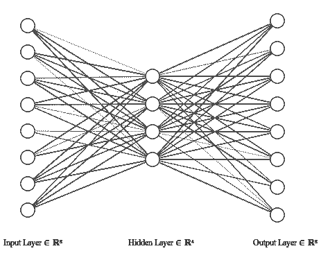
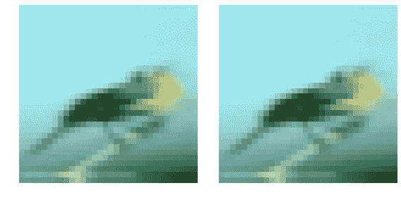
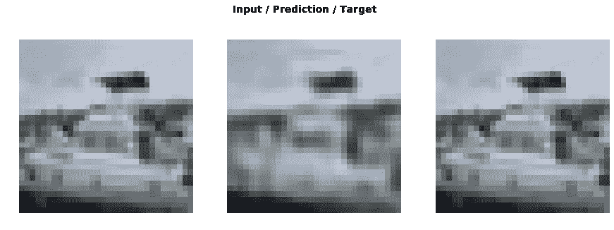

# 在 Fastai 库中实现自动编码器

> 原文：<https://towardsdatascience.com/autoencoders-in-the-fastai-library-fa288e1f899a?source=collection_archive---------68----------------------->

## 在 fastai 中实现自动编码器的分步指南。



自动编码器架构。使用 [NN-SVG](https://alexlenail.me/NN-SVG/LeNet.html) 制作的图像。

# 介绍

[fastai](https://docs.fast.ai/index.html) 是一个深度学习库，它使用现代最佳实践来简化训练神经网络[1]。虽然 fastai 为用户提供了一个高级别的神经网络 API，但它旨在允许研究人员和用户轻松混合低级别的方法，同时仍然使整个训练过程变得简单易行。

这篇文章将讲述如何在 fastai 中设置一个自动编码器。这将通过创建一个基本的 autoencoder 模型，在 fastai 中设置数据，最后将所有这些放到一个学习者模型中。

*注意:假设对 fastai 和 PyTorch 有基本的了解。*

# 履行

## 设置数据

自动编码器是一种神经网络，它通过架构中的某种瓶颈来学习重新创建输入。为此，我们需要一个输入和输出相等的 fastai 数据束。

在这里，我将给出一个使用图像数据实现这一点的示例，但是，还有一个更通用的示例，可以使用相应笔记本电脑上的任何可用阵列[在这里](https://github.com/henriwoodcock/blog-post-codes/blob/master/autoencoders-in-fastai/autoencoders-in-fastai.ipynb)。

导入数据集的代码如下:

```
from fastai import *
from fastai.vision import *size = 32
batchsize = 32
tfms = get_transforms(do_flip = True)
src = (ImageImageList.from_folder(image_path).label_from_func(lambda x: x))
data = (src.transform(tfms, size=size, tfm_y=True)
 .databunch(bs=batchsize)
 .normalize(imagenet_stats, do_y = False))
```

这与为分类器设置数据分组的两个区别是:

```
ImageImageList()
```

`ImageImageList`是一个内置的 fastai 列表，它将输入和输出数据都设置为图像。使用这种方法，我们仍然可以像使用`show_batch`一样使用**内置的 fastai 函数**。

第二个区别是标签的设置方式:

```
label_from_func(lambda x: x)
```

这允许用户从定义的功能中设置标签。这里我们使用一个输出输入的函数。

现在有了这些，我们可以运行:

```
data
```

哪些输出:

```
ImageDataBunch;Train: LabelList (4800 items)
x: ImageImageList
Image (3, 32, 32),Image (3, 32, 32),Image (3, 32, 32),Image (3, 32, 32),Image (3, 32, 32)
y: ImageList
Image (3, 32, 32),Image (3, 32, 32),Image (3, 32, 32),Image (3, 32, 32),Image (3, 32, 32)
Path: autoencoders-in-fastai/data;Valid: LabelList (1200 items)
x: ImageImageList
Image (3, 32, 32),Image (3, 32, 32),Image (3, 32, 32),Image (3, 32, 32),Image (3, 32, 32)
y: ImageList
Image (3, 32, 32),Image (3, 32, 32),Image (3, 32, 32),Image (3, 32, 32),Image (3, 32, 32)
Path: autoencoders-in-fastai/data;Test: None
```

运行 show_batch 给出:

```
data.show_batch(rows = 1)
```



`data.show_batch(rows = 1)` 输出。从 [CIFAR10 数据集](https://www.cs.toronto.edu/~kriz/cifar.html)中获取的图像。

## 创建模型

我们现在需要创建一个自动编码器模型。这是通过创建 PyTorch 模块来实现的。下面是从[这里](https://github.com/jellycsc/PyTorch-CIFAR-10-autoencoder/blob/master/main.py)截取的一个基本例子。

```
from torch import nnclass Autoencoder(nn.Module):
    def __init__(self):
        super(Autoencoder, self).__init__()
        # Input size: [batch, 3, 32, 32]
        # Output size: [batch, 3, 32, 32]
        self.encoder = nn.Sequential(
            nn.Conv2d(3,12,4,stride=2,padding=1),
            nn.ReLU(),
            nn.Conv2d(12,24,4,stride=2,padding=1),
            nn.ReLU(),
            nn.Conv2d(24,48,4,stride=2,padding=1),
            nn.ReLU(),
            )
        self.decoder = nn.Sequential(
            nn.ConvTranspose2d(48,24,4,stride=2,padding=1),
            nn.ReLU(),
            nn.ConvTranspose2d(24,12,4,stride=2,padding=1),
            nn.ReLU(),
            nn.ConvTranspose2d(12,3,4,stride=2,padding=1),
            nn.Sigmoid(),
            ) def encode(self, x): return self.encoder(x) def decode(self, x): return self.decoder(x) def forward(self, x):
        encoded = self.encoder(x)
        decoded = self.decoder(encoded)
        return decoded
```

## 创造快速学习者

现在我们把所有这些放入一个快速学习器中。为此，你需要定义一个损失函数，在这个例子中，我将使用 *MSE 损失*。

为了实现这一点，我们首先创建一个 autoencoder 实例，如下所示:

```
autoencoder = Autoencoder()
```

然后我们把这个放入一个快速学习者中:

```
import torch.nn.functional as Flearn = Learner(data, autoencoder, loss_func = F.mse_loss)
```

现在我们已经做到了这一点，我们可以轻松地利用 fastai 中包含的所有最佳培训实践，如`lr_find`和`fit_one_cycle`。

## 培养

fastai 中实现的所有技术现在都可以在您的自定义 autoencoder 上使用。

```
learn.lr_find()
learn.fit_one_cycle()
```

## 示例结果

使用 fastai 库，我在 [CIFAR10](https://www.cs.toronto.edu/~kriz/cifar.html) 的一个子集上训练了 10 个历元，使用`lr_find`找到了一个最佳学习率和`fit_one_cycle`，并取得了以下结果:



使用 fastai 文库的 10 个时期的结果。

# 结论

在这里，我简单介绍了如何在 fastai 中实现自动编码器，您可以在这里找到笔记本[和](https://github.com/henriwoodcock/blog-post-codes/blob/master/autoencoders-in-fastai/autoencoders-in-fastai.ipynb)，其中包括所有代码以及如何为通用数组数据集实现它。一旦自动编码器经过训练，还有关于如何使用*编码器*和*解码器*部件的信息。

我在这里展示的 autoencoder 模型是一个非常简单的模型，有许多改进可以提及的是特征丢失、上采样而不是转置卷积以及最后的像素混洗。我发现这些在我自己的工作中非常有效。

# 参考

[1]杰瑞米·霍华德和西尔万·古格。_fastai:深度学习的分层 API。arXiv。https://arxiv.org/abs/2002.04688。2020.