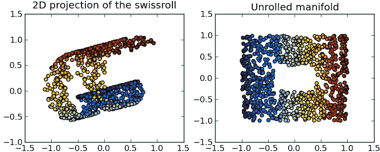
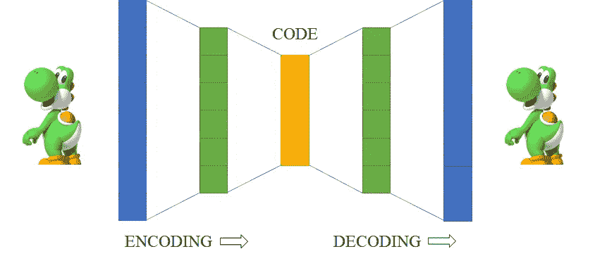
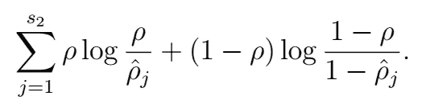
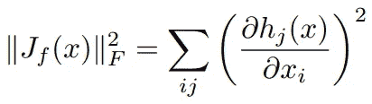
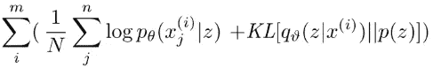
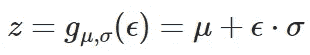

# 自动编码器:研究和应用综述

> 原文：<https://towardsdatascience.com/autoencoders-overview-of-research-and-applications-86135f7c0d35?source=collection_archive---------16----------------------->

自从机器学习的早期以来，人们一直试图以无监督的方式学习数据的良好表示。这项工作的基本假设是，解开表征很好地转化为下游监督任务。例如，如果一个人被告知特斯拉是一辆汽车，并且他对汽车的外观有很好的描述，他可能会在房屋照片中认出特斯拉的照片，而从未见过特斯拉。

大多数早期的表示学习思想都围绕着线性模型，如因子分析、主成分分析(PCA)或稀疏编码。**由于这些方法是线性的，它们可能无法找到复杂数据的清晰表示，如图像或文本**。特别是在图像的情况下，简单的变换，例如照明的改变，可能与像素强度有非常复杂的关系。因此，需要深度非线性编码器和解码器，将数据转换成其隐藏的(希望是解开的)表示，然后再转换回来。

**自动编码器是神经网络模型，旨在学习数据点之间复杂的非线性关系。**通常，自动编码器由多个神经网络层组成，并被训练在输出端重建输入(因此得名*自动*编码器)。在这篇文章中，我将尝试给出一个多年来开发的各种类型的自动编码器及其应用的概述。

# 自动编码器做什么

一般来说，使用自动编码器的假设是，如果我们正确地考虑数据点的几何形状，高度复杂的输入数据可以更简洁地描述。例如，考虑图 1 所示的所谓“瑞士滚”流形。虽然数据最初位于 3-D 空间中，但是可以通过“展开”该卷并将其展开在地板上(2-D)来更简单地描述它。注意，瑞士卷的线性变换不能展开流形。然而，**自动编码器能够学习(可能非常复杂的)非线性变换函数。**

图 1:展开瑞士卷流形。来源:Olivier Grisel——使用模块化数据处理工具包和 matplotlib 生成。，CC 乘 3.0，[https://commons.wikimedia.org/w/index.php?curid=10661091](https://commons.wikimedia.org/w/index.php?curid=10661091)

# 欠完整自动编码器

让自动编码器学习输入的低维表示的一个简单方法是**约束隐藏层中的节点数量。**由于自动编码器现在必须使用有限数量的节点来重建输入，它将尝试学习输入的最重要方面，并忽略数据中的细微变化(即噪声)。

为了实现欠完整自动编码器，至少需要一个隐藏的全连接层。如今，大多数自动编码器架构实际上采用多个隐藏层，以便使架构更深入。从经验上来说，更深层次的架构能够学习更好的表示并实现更好的概括。编码器和解码器中的层数和大小也是惯例，使架构对称。

欠完整自动编码器不一定需要使用任何显式正则化项，因为网络架构已经提供了这种正则化。然而，我们仍然应该小心模型的实际容量，以防止它只是简单地记忆输入数据。一个正则化选项是通过简单地使用解码器中相应层的编码器权重矩阵的转置，将编码器和解码器的参数绑定在一起。

图 2:欠完整自动编码器的概念视图

欠完整自动编码器的应用包括**压缩、推荐系统以及异常值检测**。异常值检测通过检查自动编码器的重构误差来工作:如果自动编码器能够很好地重构测试输入，则它很可能来自与训练数据相同的分布。然而，如果重建不好，数据点很可能是异常值，因为自动编码器没有学会正确地重建它。

# 卷积自动编码器

由于卷积神经网络(CNN)在许多计算机视觉任务中表现良好，因此自然会考虑将卷积层用于图像自动编码器。通常，在卷积自动编码器中，池层与卷积层一起使用，以减小隐藏表示层的大小。在编码器中，隐藏层之前通常是全连接层，并且在解码步骤之前，它被重新整形为适当的大小。由于卷积自动编码器的输出必须与输入大小相同，我们必须调整隐藏层的大小。原则上，我们可以通过两种方式做到这一点:

*   **在每个卷积层之前对隐藏层**进行上采样，例如使用双线性插值，或者
*   使用专门的**转置卷积层**来执行可训练形式的上采样。

第二种选择更有原则，通常提供更好的结果，但是它也增加了网络的参数数量，并且可能不适用于所有类型的问题，尤其是在没有足够的可用训练数据的情况下。

卷积自动编码器常用于**图像压缩和降噪**。在去噪的情况下，网络被称为**去噪自动编码器**，它被训练成不同于标准自动编码器:不是试图在输出中重建输入，而是输入被适当的噪声信号(例如高斯噪声)破坏，并且自动编码器试图预测去噪的输出。

卷积自动编码器也可以用于**图像搜索应用**，因为隐藏的表示通常带有语义。因此，对隐藏表示的相似性搜索比对原始图像像素的相似性搜索产生更好的结果。它的速度也明显更快，因为隐藏表示通常要小得多。

# 稀疏自动编码器

正如我已经提到的，欠完整自动编码器通过与输入和输出相比压缩隐藏层的大小来使用隐式正则化。稀疏自动编码器现在为隐藏层引入了一个显式正则化项。因此，取消了隐藏层必须小于输入的限制，我们甚至可以考虑隐藏层大小大于输入的过完备自动编码器，但在某些其他意义上是最佳的。

例如，我们可以在隐藏层上引入 L1 惩罚，以获得数据分布的稀疏分布表示。这将迫使自动编码器仅选择隐藏层中的几个节点来表示输入数据。注意，这种惩罚与通常在训练期间对神经网络的权重引入的 L2 或 L1 惩罚有质的不同。在这种情况下**，我们限制隐藏层的值，而不是权重**。与重量衰减相反，这一过程并不完全是理论上的，没有明确的潜在概率描述。然而，这是一个直观的想法，在实践中效果很好。

我们可以使用的另一个惩罚是 KL 散度。在这种情况下，我们引入了稀疏度参数ρ(通常为 0.005 或另一个非常小的值)，该参数将表示样本集合上神经元的平均激活。在我们的例子中，ρ将被假定为描述平均激活的伯努利分布的参数。我们还会计算ρ_hat，训练时所有例子的真实平均激活量。两个伯努利分布之间的 KL 散度由下式给出:

，其中 s₂是隐藏层中神经元的数量。这是一个可微的函数，可以作为惩罚加到损失函数中。

# 收缩自动编码器

正则化自动编码器的一个有趣的方法是假设对于非常相似的输入，输出也将是相似的。我们可以**通过要求隐藏层激活的导数相对于输入**较小来加强这一假设。这将确保输入的小变化将被映射到隐藏层中的小变化。收缩自动编码器这个名字来源于这样一个事实，即我们正试图**将一小簇输入压缩成一小簇隐藏表示。**

具体来说，我们在损失函数中包括一项，该项惩罚隐藏激活的雅可比矩阵的弗罗贝纽斯范数(矩阵 L2 范数)。

因此， *h_j* 表示隐藏激活， *x_i* 表示输入，*| | | * | _ F*表示弗罗贝纽斯范数。

# 变分自动编码器

变分自动编码器和其他类型的自动编码器之间的关键区别在于 **VAEs 将隐藏表示视为具有其自身先验分布的潜在变量**。这给了他们一个恰当的贝叶斯解释。变分自动编码器是具有适当定义的先验和后验数据分布的**生成模型。**

更具体地，变分自动编码器将输入数据和潜在表示的联合概率建模为 *p(x，z) = p(x|z) p(z)。*生成过程通过从 *p(z)* 中提取一个潜在变量并将其传递给由 *p(x|z)* 给出的解码器来定义。与其他自动编码器类型一样，解码器是一个学习参数函数。

为了找到输入(编码器)的最佳隐藏表示，我们必须根据贝叶斯定理计算 *p(z|x) = p(x|z) p(z) / p(x)* 。直接应用这个公式的问题是分母要求我们忽略潜在变量。换句话说，我们必须计算所有可能的潜在变量构型的积分。这通常很棘手。相反，我们转向变分推理。

**在变分推断中，我们使用真后验 *p(z|x)* 的一个近似 *q(z|x)* 。q(z|x) 被明确地设计成易处理的。**在我们的例子中， *q* 将由自动编码器的编码器功能建模。为了训练变分自动编码器，我们希望最大化以下损失函数:

我们可以将第一项识别为具有从先前(编码器)抽取的 *n* 个样本的解码器的最大似然。第二项对于变分自动编码器来说是新的:它试图使用 KL 散度作为度量，将变分后验 *q* 逼近真实先验 *p* 。此外， *q* 被选择为使得它在 *m* 训练样本上分解，这使得使用随机梯度下降进行训练成为可能。虽然这可以直观地理解，但你也可以严格地推导出这个损失函数。如果你熟悉贝叶斯推断，你也可能认识到损失函数是最大化证据下界(ELBO)。

我们通常选择简单分布作为先验 *p(z)* 。在许多情况下，对于所有隐藏单元，它只是均值为 0、方差为 1 的单变量高斯分布，从而导致 KL 散度的一种特别简单的形式(请查看[此处的](https://arxiv.org/pdf/1606.05908.pdf)以获得准确的公式)。 *q* 通常也选择为单变量或多变量的高斯分布。

现在剩下唯一要讨论的是如何训练变分自动编码器，因为损失函数涉及从 *q* 采样。采样操作是不可微的。幸运的是，我们试图从中取样的分布是连续的。这允许我们使用一个技巧:**我们让编码器生成分布的参数**，而不是通过采样过程反向传播(在高斯分布的情况下，只是平均值μ和方差σ)。然后，我们从单位高斯ε中生成一个样本，并使用生成的参数对其进行重新缩放:

因为我们不需要计算梯度 w.r.t ε，并且所有其他导数都是明确定义的，所以我们完成了。这就是所谓的**重新参数化技巧**。请注意，重新参数化技巧适用于许多连续分布，而不仅仅是高斯分布。然而不幸的是，**它对离散分布**不起作用，比如伯努利分布。

在训练之后，我们有两个选择:(I)忘记编码器，只有**使用潜在表示，通过采样并通过训练的解码器运行样本，从数据分布**产生新的样本，或者(ii) **通过编码器、采样级以及解码器**运行输入样本。如果我们选择第一个选项，我们将从潜在空间先验得到无条件样本。对于第二个选项，我们将得到以输入为条件的后验样本。

这已经激发了 VAEs 的主要应用:生成与训练数据相似的新图像或声音。当生成图像时，通常使用卷积编码器和解码器以及密集潜在向量表示。多年来出现了多种不同版本的变分自动编码器，包括旨在生成特别清晰的表示的 Beta-VAEs，克服不能使用离散分布的限制的 VQ-VAEs，以及根据某个标签(如有胡子或眼镜的脸)生成输出的条件 VAEs。请参见图 3，这是最近一个变化的自动编码器实例的输出示例。

图 3:在 CSVAE 中操作面部毛发和眼镜隐藏属性，这是一个最新的自动编码器版本。资料来源:克里斯、杰克、杰克·斯内尔和理查德·泽梅尔。"在变分自动编码器中学习潜在子空间."*神经信息处理系统的进展*。2018.

虽然变分自动编码器最近由于其他生成模型(如 GANs)的兴起而失宠，但它们仍然保留了一些优点，如先验分布的显式形式。

# 结论

自动编码器形成了一组非常有趣的神经网络结构，在计算机视觉、自然语言处理和其他领域有许多应用。虽然现在当然有其他类别的模型用于表示学习，如暹罗网络等，但对于各种问题，自动编码器仍然是一个很好的选择，我仍然希望在不久的将来这个领域会有很多改进。