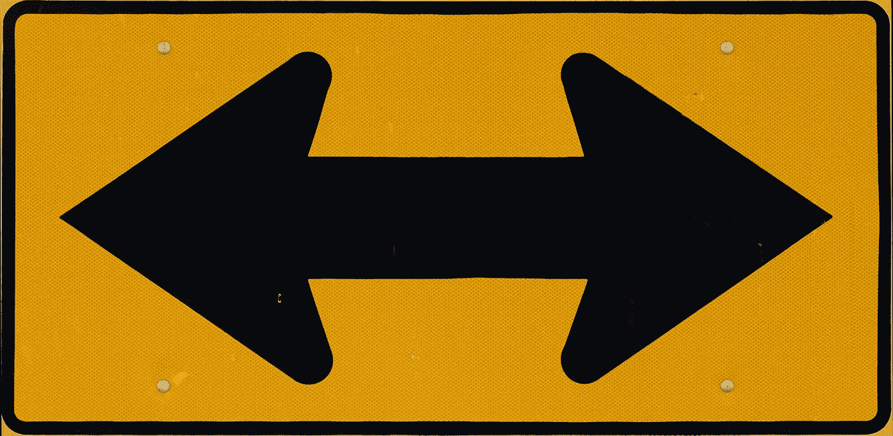
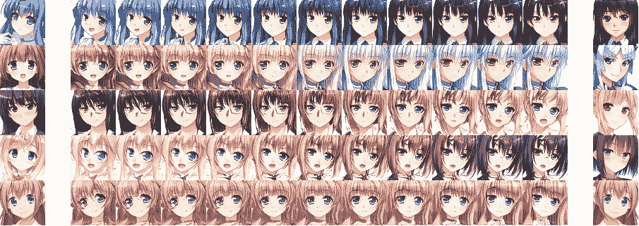
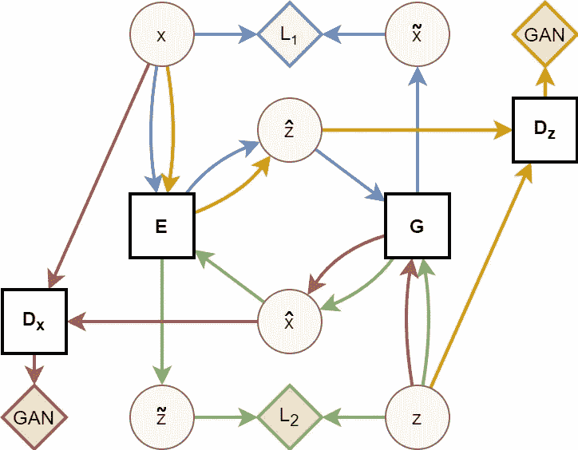
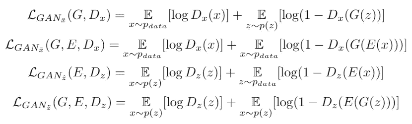
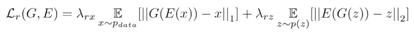
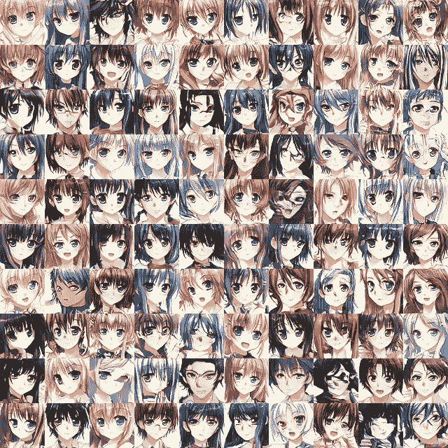
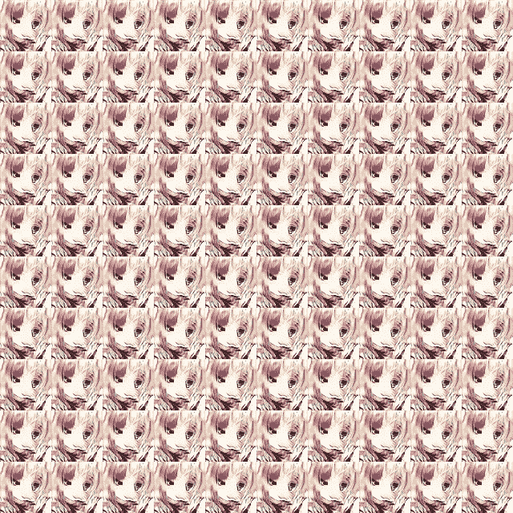
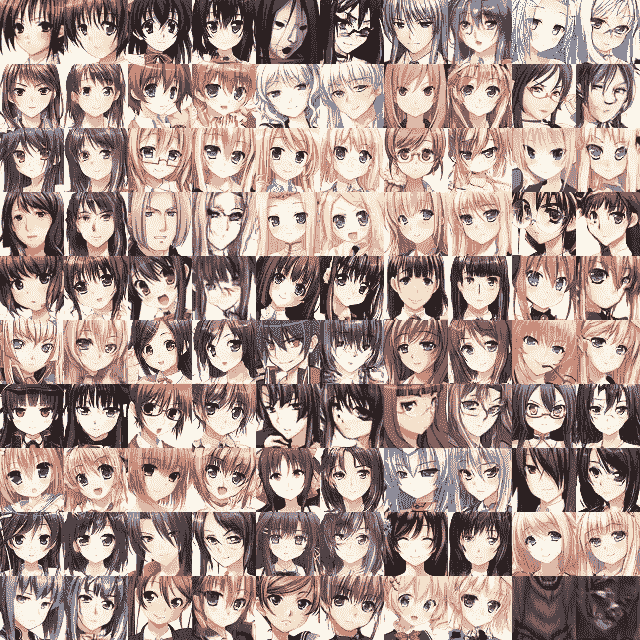
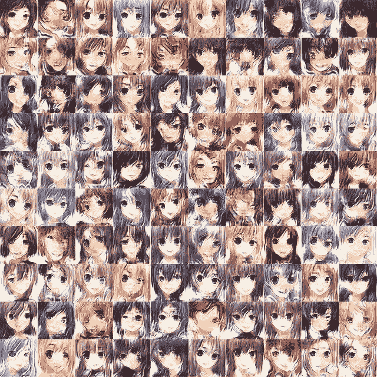
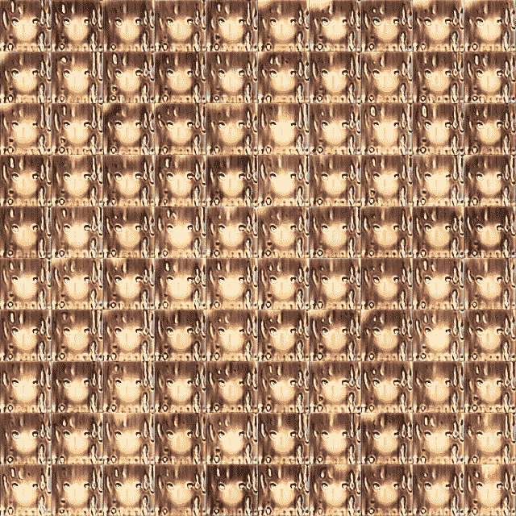

# 自动编码生成对抗网络

> 原文：<https://towardsdatascience.com/autoencoding-generative-adversarial-networks-16082512b583?source=collection_archive---------12----------------------->

## AEGAN 架构如何稳定 GAN 训练并防止模式崩溃

双向街道 AEGAN(图片来源: [Pixabay](https://pixabay.com/photos/sign-one-way-two-way-direction-3219707/)

甘很难训练。当他们工作时，[他们创造奇迹](https://blogs.nvidia.com/blog/2019/03/18/gaugan-photorealistic-landscapes-nvidia-research/)，但是任何试图训练他们自己的人都知道他们是该死的挑剔的混蛋。GAN 训练中最常见的两个问题是模式崩溃和缺乏收敛。在模式崩溃中，生成器学习只生成少量样本；在生成“手写”数字的过程中，经历模式崩溃的 GAN 可能只能学会画 7，尽管这是高度真实的 7。由于缺乏收敛性，发生器和鉴别器之间的良性竞争恶化，通常鉴别器变得比发生器好得多；当鉴别器能够容易且完全地区分真实样本和生成样本时，生成器不会得到有用的反馈，也无法改进。

在[最近的一篇论文](https://arxiv.org/abs/2004.05472)中，我提出了一种技术，似乎可以稳定 GAN 的训练并解决上述两个问题。这种技术的副作用是它允许在真实样本之间进行有效和直接的插值。在这篇文章中，我的目标是逐步介绍本文的主要观点，并说明为什么我认为 AEGAN 技术有可能成为 GAN 培训师工具箱中非常有用的工具。

有人告诉我不要再埋 led 了，所以这是这篇论文最有趣的结果。这是怎么回事？请继续阅读，寻找答案。

# 进入艾根

## 双射映射

GANs 学习从某个潜在空间 *Z* (随机噪声)到某个样本空间 *X* (数据集，通常是图像)的映射。这些映射自然是[内射的](https://en.wikipedia.org/wiki/Injective_function)——Z*Z*中的每个点 *z* 对应于 *X* 中的某个样本 *x* 。然而，它们很少[满射](https://en.wikipedia.org/wiki/Surjective_function)——X 中的许多样本在 z 中没有对应的点。实际上，当许多点 *zi* 、 *zj* 和 *zk* 映射到单个样本 *xi* 时，模式崩溃就发生了，GAN 无法生成点 *xj* 或 *xk* 。考虑到这一点，更理想的 GAN 应该具有以下品质:

1.  *Z* 中的每个潜在点 *z* 应该对应于 *X.* 中的一个唯一样本 *x*
2.  *X* 中的每个样本 *x* 应该对应于 *Z* 中的一个唯一潜在点 *z* 。
3.  从 *Z、* *p(Z=z)* 中抽取 *z* 的概率，应该等于从 *X* 、 *p(X=x)* 中抽取 *x* 的概率。

这三个性质表明，我们应该以潜在空间和样本空间之间的一对一关系(即双射映射)为目标。为此，我们训练一个函数 *G : Z ⟶ X* ，这是我们的生成器，另一个函数 *E : X ⟶ Z* ，我们称之为编码器。这些功能的目的是:

*   *G(z)* 应产生与分布在 *X* 中的比例相同的真实样本。(这是普通 GANs 的目标)
*   *E(x)* 应该产生与它们在 z 上分布的比例相同的可能潜在点。
*   构图 *E(G(z))* 应忠实再现原潜点 *z* 。
*   构图 *G(E(x))* 要忠实再现原图像 *x* 。

## 体系结构

图 1:高级 AEGAN 架构。网络用方框表示，价值用圆圈表示，损失用菱形表示。颜色代表组合网络，其中红色是常规图像生成 GAN，黄色是用于产生潜在向量的 GAN，蓝色是图像自动编码器，绿色是潜在向量自动编码器。

AEGAN 是一个四网络模型，由两个 GAN 和两个自动编码器组成，如图 1 所示，它是用于不成对图像到图像转换的 [CycleGAN](https://arxiv.org/abs/1703.10593) 技术的推广，其中一个图像域用随机噪声代替。简而言之，我们训练两个网络在样本空间 *X* 和潜在空间 *Z* 之间进行翻译，我们训练另外两个网络来区分真假样本和潜在向量。图 1 是一个复杂的图表，所以让我来分解它:

**网络(方块):**

*   *G* 是发电机网络。它将一个潜在向量 *z* 作为输入，并返回一个图像 *x* 作为输出。
*   *E* 是编码器网络。它将图像 *x* 作为输入，并返回潜在向量 *z* 作为输出。
*   *Dx* 是图像鉴别器网络。它将图像 *x* 作为输入，并将从原始数据集中提取的 *x* 的概率作为输出返回。
*   *Dz* 是潜在鉴别器网络。它取一个潜在向量 *z* 作为输入，并返回从潜在分布中抽取 *z* 的概率作为输出。

**数值(圆圈):**

*   *x* :来自原始数据集的真实样本。这有点不明确，因为在某些地方我用 *x* 来表示域 x 中的任何值。抱歉。
*   *z* :来自潜在生成分布(随机噪声)的真实样本。
*   *x _ hat*:G 给定一个实随机向量产生的样本，即 *x_hat=G(z)。*
*   *z_hat* :给定一个真实样本，E 产生的向量，即 *z_hat=E(x)。*
*   *x_tilde* :由 *G* 从 *E* 产生的编码中重现的样本，即 *x_tilde=G(z_hat)=G(E(x))。*
*   *z_tilde* :由 *E* 从 *G* 生成的图像中重现的向量，即 *z_tilde=E(z_hat)=E(G(z))。*

**损失(钻石):**

*   L1(蓝色):图像重建损失 *||G(E(x))-x||_1* ，即原始图像像素与自动编码重建像素之间的曼哈顿距离。
*   L2(绿色):潜在向量重建损失 *||E(G(z))-z||_2* ，即原始潜在向量和自动编码重建之间的欧几里德距离。
*   甘(红):图像的对抗性丧失。 *Dx* 被训练来区分真实图像( *x* )和虚假图像( *x_hat* 和 *x_tilde* (未显示))
*   甘(黄色):潜在载体的对抗性损失。 *Dz* 被训练来区分真实随机噪声( *z* )和编码( *z_hat* 和 *z_tilde* (未显示))

## 培养

AEGAN 的训练方式与 GAN 相同，交替更新发电机( *G* 和 *E* )和鉴别器( *Dx* 和 *Dz* )。然而，AEGAN 损耗函数比典型的 GAN 损耗稍微复杂一些。它由四个对立的部分组成:

艾根损失的对抗成分。

和两个重建分量(这里显示为加在一起):

艾根损失的重建部分。λs 是控制重建分量的相对权重的超参数。

这些加在一起就形成了艾根损失。 *E* 和 *G* 尽量减少这种损失，而 *Dx* 和 *Dz* 尽量增加这种损失。如果你不关心数学，直觉很简单:

1.  *G* 试图欺骗 *Dx* 相信生成的样本 *x_hat* 和自动编码的样本 *x_tilde* 是真实的，而 *Dx* 试图将它们与真实样本 *x* 区分开来。
2.  *E* 试图欺骗 *Dz* 相信生成的样本 *z_hat* 和自动编码的样本 *z_tilde* 是真实的，而 *Dz* 试图将它们与真实样本 *z* 区分开来。
3.  *G* 和 *E* 必须一起工作，以便自动编码的样本 *G(E(x))=x_tilde* 与原始的 *x* 相似，并且自动编码的样本 *E(G(z))=z_tilde* 与原始的 *z* 相似。

## 结果

首先，免责声明。由于个人原因，我只有时间和精力在单个数据集上进行测试。我按原样发布我的工作，以便其他人可以自己测试这项技术，验证我的结果，或者表明这是一个死胡同。也就是说，以下是 30 万步训练后的结果样本:

图 AEGAN 在 21552 张独特动漫人脸的数据集上经过 30 万步训练后生成的随机图像。

图 2 本身并不那么令人兴奋。如果你正在读一篇关于 GANs 的中型文章，那么你可能已经看到了在动画人脸上训练的风格 GANs 产生了更好的结果。*令人兴奋的是*将上述结果与图 3 进行比较:

图 3:GAN 在 21552 张独特动漫人脸的数据集上经过 30 万步训练后生成的随机图像。

用于生成图 3 中图像的 GAN 和用于生成图 2 中图像的 AEGAN 对于 *G* 和 *Dx* 具有完全相同的架构；唯一的区别是，AEGAN 也学习相反的功能。这稳定了训练过程。在你问之前，不，这不是一次性的侥幸；我对 GAN 和 AEGAN 重复了五次训练，在每种情况下，AEGAN 产生了良好的结果，GAN 产生了垃圾。

AEGAN 技术的一个令人兴奋的副作用是它允许在真实样本之间进行直接插值。众所周知，GANs 能够在样本之间进行插值；画两个随机向量 *z1* 和 *z2* ，在向量之间进行插值，然后将插值结果反馈给发电机和[吊臂](https://www.youtube.com/watch?v=djsEKYuiRFE)！借助 AEGAN，我们可以在真实样本之间进行插值:

图 4:真实样本之间的插值。最左边和最右边的列是真实样本，而中间的图像是这些样本之间的插值。最下面一行显示了一个样本和水平镜像的同一样本之间的插值，给人一种角色正在转头的错觉。

因为编码器 *E* 能够将样本 *x* 映射到其在潜在空间中的对应点 *z* ，所以 AEGAN 允许我们为任何样本 *x1* 和 *x2* 找到点 *z1* 和 *z2* 并在它们之间进行插值，就像对典型 GAN 一样。图 5 显示了来自数据集的 50 个随机样本的重建:

图 5:排列在五列中的真实样本对(每对中的左边)及其重建(每对中的右边)。在这个意义上，AEGAN 的功能类似于自动编码器，但没有标志性的模糊。请注意，重建的眼睛颜色都是各种深浅不同的绿色，这是一种轻微的模式崩溃。

## 讨论

首先，我想指出这个实验的缺点。正如我所说的，这只是在一个数据集上测试的。各个网络 *G* 、 *E* 、 *Dx* 和 *Dz* 的结构也没有被广泛探索，也没有进行有意义的超调(关于层数或形状、λs 等。).网络本身相当简单；一个更彻底和公平的实验是将 AEGAN 技术作为包装器应用于更复杂数据集上的更强大的 GAN，如 [CelebA](http://mmlab.ie.cuhk.edu.hk/projects/CelebA.html) 。

也就是说，AEGAN 具有许多令人满意的理论特性，这使得它适合于进一步的探索。

*   强制 AEGAN 保留生成图像中潜在向量的信息，可以防止模式崩溃。这也允许我们避免像批量标准化和批量区分这样的批量独立性破坏技术。顺便说一下，由于 TF.keras 2.0 中的实现问题，我不得不在这个实验中避免批处理规范化，但那是另外一个故事了…
*   学习双射函数允许在真实样本之间直接插值，而不依赖于辅助网络或可逆层。它还可以允许更好地探索和操纵潜在空间，可能通过试验不同的分布，就像在[敌对自动编码器](https://arxiv.org/abs/1511.05644)中所做的那样。
*   将发生器直接暴露在真实样本下，可以减少它在像素空间的深渊中跋涉的时间。

对于最后一点，常规 GANs 的生成器从不直接接触训练数据，只通过鉴别器的反馈间接了解数据的样子(因此有了“[blind forgers](https://www.forbes.com/sites/bernardmarr/2019/06/12/artificial-intelligence-explained-what-are-generative-adversarial-networks-gans/#b915f137e007)”)的绰号。通过包括重建损失，生成器可以在高维像素空间中直线朝向低维流形。考虑图 6，它显示了 AEGAN 仅经过 200 步训练后的输出:

图 6:200 个训练步骤(不是 200 个时期)后的 AEGAN 输出。人脸清晰可见，头发和眼睛的颜色、表情和姿势也各不相同。

将其与图 7 进行比较，图 7 显示了一个与 AEGAN 具有相同架构的常规 GAN 在其训练中的相同点:

图 7:200 个训练步骤(不是 200 个历元)后的 GAN 输出。因为你已经知道这些是脸，你可以看到头发，皮肤和眼睛，但有大量的模式崩溃和图像质量非常低。

正如你所看到的，AEGAN 在寻找低维流形方面特别有效，尽管测量它适应该流形的能力需要进一步的实验。

## 进一步的工作

*   将 AEGAN 应用于 StyleGAN 等最先进的技术，看看它是否能提高质量和/或收敛速度。
*   探索λ超参数以找到最佳值；探索课程方法，如随时间逐渐降低λs。
*   将[条件](https://arxiv.org/abs/1411.1784)应用到培训中；探索伯努利和多伯努利潜在组件，就像在[敌对自动编码器](https://arxiv.org/abs/1511.05644)中所做的那样。
*   将 AEGAN 应用于具有已知基础流形的设计图像数据集，以测量该技术能够多有效地再现它。
*   找到一种方法来匹配潜在空间的维度和数据生成函数的流形的维度(说起来容易做起来难！)

## 正误表

如果我没有在某个地方提到[变量自动编码器/ GANs](https://arxiv.org/abs/1512.09300) ，这是一个有趣的相关技术，所以在这里。用于训练这些模型的数据可在 [Kaggle](https://www.kaggle.com/soumikrakshit/anime-faces) 上获得。你可以在这里查看原论文[。我的这个网络的 tf.keras 实现可以从下面的 github repo 获得:](https://arxiv.org/abs/2004.05472)

 [## ConorLazarou/AEGAN-keras

### 自动编码生成对抗网络(AEGAN)技术的 Keras 实现。

github.com](https://github.com/ConorLazarou/AEGAN-keras)