# AutoGluon vs . XG boost—AutoML 会取代数据科学家吗？

> 原文：<https://towardsdatascience.com/autogluon-vs-xgboost-will-automl-replace-data-scientists-dc1220010102?source=collection_archive---------8----------------------->

## 使用亚马逊的自动增长来预测贷款违约


照片由[法比奥](https://unsplash.com/@fabioha?utm_source=medium&utm_medium=referral)在 [Unsplash](https://unsplash.com?utm_source=medium&utm_medium=referral) 上拍摄

# 背景

2020 年 1 月 9 日，亚马逊推出了 AutoGluon，这是一个开源库，使开发者能够轻松构建自动机器学习(AutoML)模型。近年来，AutoML 已经成为机器学习领域的一个热门话题。许多高科技公司都推出了他们的 AutoML 工具包，包括微软、谷歌和脸书。它允许数据科学家通过将 ML 部署到 ML 本身来自动化 ML 任务，并且具有高准确性、部署简单性和时间效率的优点。AutoML 也非常通用，因为它可以处理许多数据任务，如图像分类、语言处理和表格预测。[据 Gartner](https://www.cisin.com/coffee-break/technology/the-growth-of-automated-machine-learning-automl.html) 称，预计到 2020 年，超过 40%的数据科学任务将实现自动化。

亚马逊对 AutoGluon 有着独特的眼光和很高的期望。正如亚马逊所说，它的目的是“让机器学习民主化，让深度学习的力量为所有开发者所用。”AutoGluon 的多个功能已经证明，亚马逊确实在“民主化”机器学习的艰巨任务，并使任何人都有可能学习:

*   AutoGluon 可以轻松训练和部署高精度模型。
*   它只需要几行代码。
*   可以针对特定的使用情形对自动增长进行定制。
*   该库利用自动超参数调整、模型选择、架构搜索和数据处理。

这个列表中的最后一个特性值得特别关注，因为它预示着数据科学的未来将在很大程度上实现自动化，并且不需要手动构建和调整模型。一些数据科学专家开始担心他们是否会在不久的将来被 AutoML 取代，这是合理的。

在本文中，我的同事[张一阳](https://www.linkedin.com/in/yiyang-zhang-386b68146/)和[我](https://www.linkedin.com/in/harry-junyan-he-4a1591130/)将测试自旋转的潜力，并将其性能与其他流行的 ML 方法进行比较。我们的基准将是经典的随机森林，以及 XGBoost(极端梯度提升)，这也是监督学习的一种流行技术。它具有优化的计算资源分配，这有助于其快速的执行速度和极高的准确性。XGBoost 被认为是 Kaggle 数据竞赛中获胜者的首选算法。

比较模型性能的主要任务是贷款违约预测，它涉及预测具有给定特征的人是否会拖欠银行贷款。长期以来，这项任务一直是最受欢迎的数据科学主题之一。


照片由[佩皮·斯托扬诺夫斯基](https://unsplash.com/@timbatec?utm_source=medium&utm_medium=referral)在 [Unsplash](https://unsplash.com?utm_source=medium&utm_medium=referral) 拍摄

# 数据准备

我们的表格数据集是从 Kaggle 网站上获得的。它由 30，000 个目前负债的个人及其基本信息组成，包括身份证、性别、教育、婚姻、年龄和给予的信贷。该数据集还包含连续 6 个月的还款状态、账单金额和以前的付款金额，以及下个月的默认指标。原始数据集已经非常干净了。我们对分类变量进行了虚拟编码(这是运行 XGBoost 所必需的)，即，将分类变量转换为一系列只有 0 和 1 级别的二分变量。

# 随机森林


我们的团队决定使用随机森林作为第一个基准。这是一种用于分类的集成学习方法。该模型随机采样训练数据，并创建特征子集，以构建数百或数千棵决策树，然后将所有树聚合在一起。随机森林因其高精度而成为最流行的 ML 方法之一。

在我们的测试中，我们将树的数量设置为 100，并将标准设置为“gini ”,它代表 gini 杂质:

```
# Random Forest
rm = RandomForestClassifier(
                             random_state=123,
                             criterion='gini',
                             n_estimators=100,
                             verbose=False)rm.fit(X_train,y_train)
```

混淆矩阵和特征重要性总结如下。我们使用随机森林取得了 81.77%的准确率。

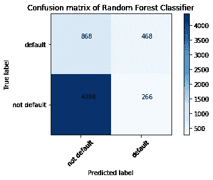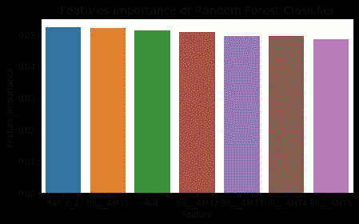

# XGBoost

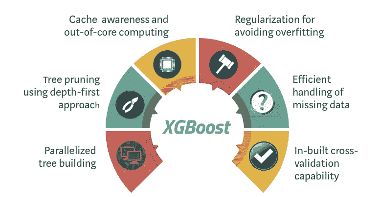

XGBoost 是随机森林的继承者，被认为是基于决策树的集成 ML 算法皇冠上的明珠。它最初是由陈天琦和卡洛斯·格斯特林于 2016 年在华盛顿大学开发的，并在数据科学行业迅速获得了巨大的人气。XGBoost 通过系统优化和算法增强改进了梯度推进机器。

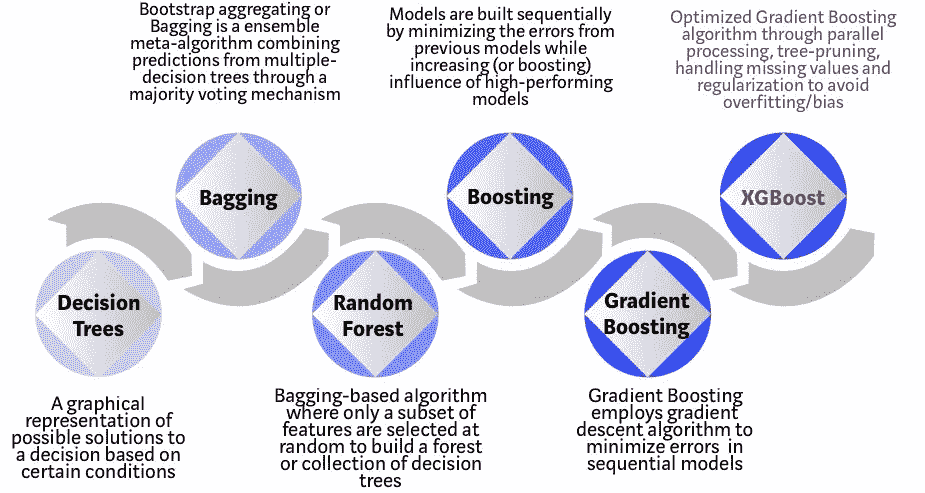

在数据科学家 [Vishal Morde](/https-medium-com-vishalmorde-xgboost-algorithm-long-she-may-rein-edd9f99be63d) 完成的一项测试中，XGBoost 的性能在准确性和计算效率方面明显优于传统算法。结果如下图所示:

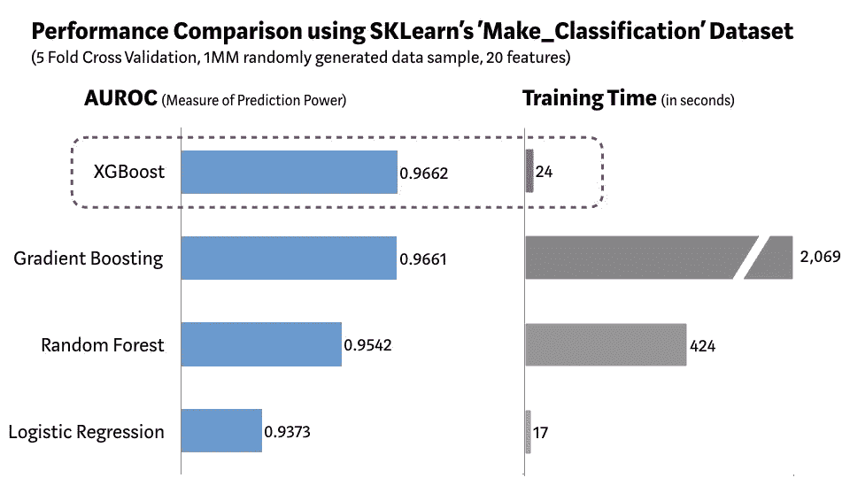

由于 XGBoost 在处理表格数据的预测问题时具有出色的性能，我们相信在这种情况下它可以成为自动增长的有力竞争者。我们运行 XGBoost 来构建贷款违约预测模型:

```
# XGBoost ClassifierX_train, X_test, y_train, y_test= train_test_split(X,y, test_size=0.2, random_state=123)model = xgb.XGBClassifier(base_score=0.5, booster='gbtree', colsample_bylevel=1,colsample_bynode=1, colsample_bytree=1, gamma=0,learning_rate=0.3, max_delta_step=0, max_depth=3,min_child_weight=1, missing=None, n_estimators=10, n_jobs=1,nthread=None, objective='binary:logistic', random_state=0,reg_alpha=0, reg_lambda=1, scale_pos_weight=1, seed=123,verbosity=1)model.fit(X_train,y_train)
preds = model.predict(X_test)
```

XGBoost 帮助我们达到了 82.00%的准确率。下图显示了混淆矩阵和特征重要性。

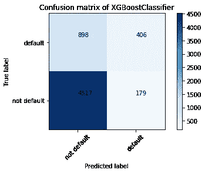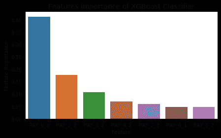

# 自动增长

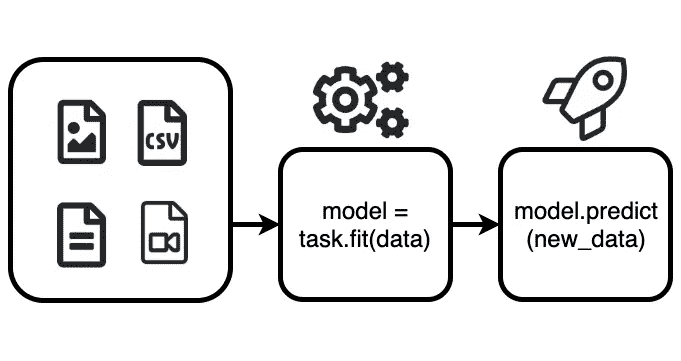

如前所述，Amazon 声称 AutoGluon 在涉及图像、文本和表格数据的各种数据任务中表现出色。在我们的研究中，我们专注于用表格数据进行预测。与 random forest 和 XGBoost 不同，AutoGluon 负责模型选择和超参数调整。第一步是使用 ML 来确定适合给定任务的几个模型。模型确定后，AutoGluon 再次利用 ML 优化每个模型的超参数。例如，如果 AutoGluon“认为”随机森林是该任务的良好模型，那么它将决定森林中决策树的数量，以及在拆分节点时考虑的功能数量。以下是我们的自动增长代码:

```
# AutoGluon Classifierpredictor = task.fit(train_data=train_data, label=label_column, output_directory=dir)y_pred = predictor.predict(test_data_nolab) 
```

在我们的测试中，自动旋翼利用了以下模型。每个模型的性能和相应的计算时间总结在以下两个图表中:

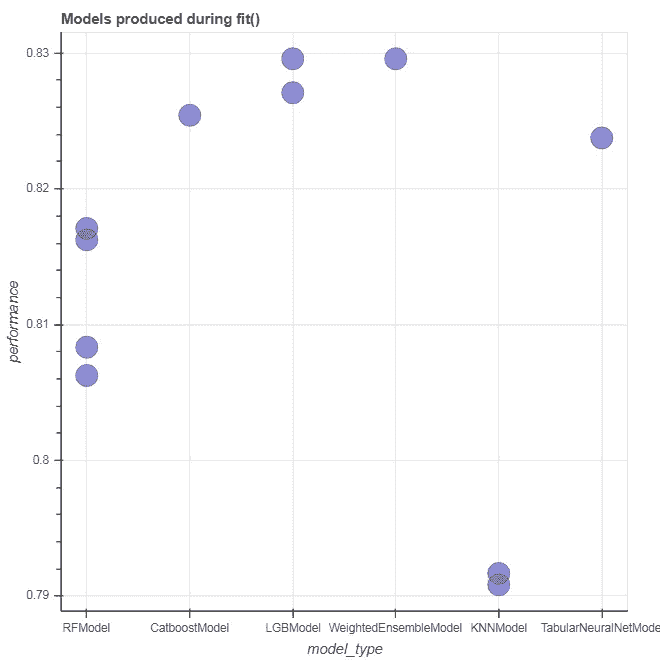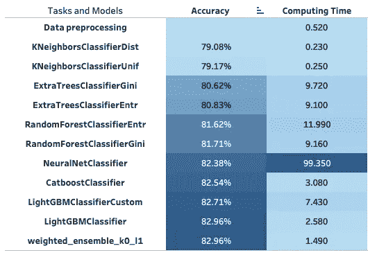

自动旋转的最终准确率为 82.96%，这是一个振奋人心的数字。我们还为模型创建了混淆矩阵。请注意，可以通过配置模型进一步提高精度，这需要更先进的硬件。

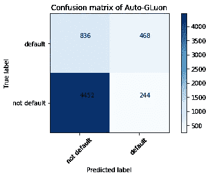

但是，与前两种模型相比，计算时间要长得多。同样值得一提的是，当我们执行该命令时，我们不断收到以下警告:

```
Warning: Model is expected to require 25.288658239618677 percent of available memory...
```

我们运行代码的计算机在内存和 CPU 方面的计算能力都高于平均水平。似乎自动旋转是极其计算密集型的。

# 结论

为了评估这三个模型，我们不仅考虑了基于准确性分数和 AUC 分数的模型性能，还考虑了计算时间和模型建立的难度。我们相信所有这些在标准数据科学项目中都是必不可少的。结果总结如下:

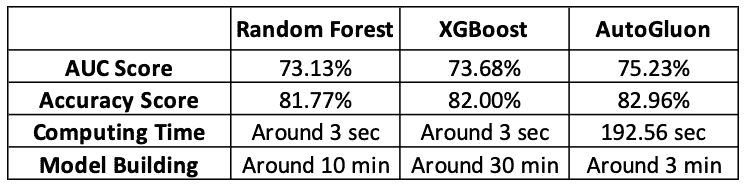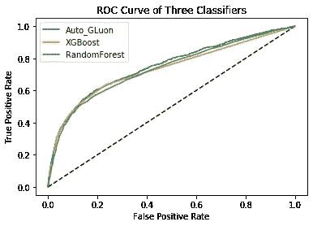

就 AUC 分数和准确度分数而言，AutoGluon 具有最佳的模型准确度。此外，我们发现 AutoGluon 非常容易构建，因为它只需要几行代码就可以完成，并且不需要任何超参数调整。但是，它的一个主要缺点是计算时间比 XGBoost 长得多。根据具体需求，在选择模型时，必须在时间和精度之间进行权衡。尽管如此，当谈到自动化 ML 任务时，我们对 AutoGluon 的潜力非常有信心。它代表了数据科学行业的转折点:不仅仅是数据专家，不具备编码技能的人现在也可以构建有效的模型来满足他们的各种需求。

那么 AutoGluon 和其他 AutoML 最终会取代数据科学家吗？答案是复杂的:一些任务肯定会完全自动化，导致未来对数据科学家的需求减少。具体来说，专注于模型调整和优化的工作职能将更有可能被 AutoML 取代。根据中国著名数据科学家 Justin Ho 的说法，随着 AutoML 在未来达到更成熟的阶段，那些只拥有模型调整技能的人将失去竞争优势。然而，我们仍然怀疑它能否完全取代数据科学家，原因有五:

1.  在无监督学习中，没有明确的措施来评估结果的质量。无监督学习被认为是成功的，只要它提供了可用于进一步分析的信息。此外，该过程需要大量的领域知识。AutoML 在此步骤中无法提供足够的帮助。
2.  Skim Technologies 的高级数据科学家 Marcia Oliveira 表示，迄今为止，还没有为强化学习开发出有效的 AutoML。
3.  AutoML 不能很好地处理网络数据、web 数据等复杂数据。
4.  很少有 AutoML 能处理特征工程。
5.  AutoML 不能完全自动化构思商业见解和实施决策的过程。

下图展示了我们对 AutoML 未来在标准项目工作流程中所能完成的工作的预测。我们相信只有有限的一部分任务能够并且将会实现自动化。请注意，蓝色越深，任务自动完成的可能性越大。

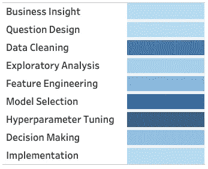

毕竟，数据科学是一门艺术，需要结合业务洞察力和数据技术来解决现实世界中的问题。虽然 AutoML 可以在特定流程中取代人类，但还有许多其他领域需要数据科学家的创造力和领域知识。无论 AutoML 有多“聪明”，它只是一个帮助实现更大模型性能的工具。此外，它旨在将数据科学家从繁琐的“杂务”中解放出来，如超参数调整和数据清理，使他们能够专注于其他更重要的任务。因此，AutoML 应该被视为数据科学家的朋友，而不是敌人。作为数据科学家，我们应该了解 AutoML 的发展趋势，并加强我们无法完全被 AutoML 取代的能力。最重要的是，我们应该拥抱 AutoML 的力量，继续发掘它的真正潜力，让它更好地为人类服务。

# 警告

尽管亚马逊的 AutoGluon 似乎是我们测试中的最佳选择，但仍有几个警告需要注意:

*   我们的测试仅证明了在使用给定数据的特定任务中，AutoGluon 优于 XGBoost。也就是说，如果我们使用另一个数据集或改变任务的性质，自动增长可能不是最佳选择。
*   虽然 AutoGluon 在准确性方面略好于 XGBoost，但在大多数情况下，它比 XGBoost 计算量更大。
*   自动旋转令人印象深刻的表现可能是纯粹运气的结果。

# 作者

[](https://www.linkedin.com/in/harry-junyan-he-4a1591130/) [## 哈里(严俊)何-杜克大学-北卡罗莱纳州达勒姆| LinkedIn

### 我现在是杜克大学商业分析硕士课程福库商学院的学生。这里…

www.linkedin.com](https://www.linkedin.com/in/harry-junyan-he-4a1591130/) [](https://www.linkedin.com/in/yiyang-zhang-386b68146/) [## 张艺洋-杜克大学-富卡商学院-北卡罗莱纳州达勒姆| LinkedIn

### 我目前在杜克大学学习的定量管理硕士:商业分析和我的…

www.linkedin.com](https://www.linkedin.com/in/yiyang-zhang-386b68146/) 

# 参考

[1]:希瓦尼。(2019 年 8 月 2 日)。自动机器学习的发展。[https://www . cisin . com/coffee-break/technology/the-growth-of-automated-machine-learning-automl . html](https://www.cisin.com/coffee-break/technology/the-growth-of-automated-machine-learning-automl.html)

[2]:安比卡·乔杜里。(2019 年 1 月 14 日)。亚马逊 AutoGluon 如何只用几行代码就能自动化深度学习模型。[https://analyticsindiamag . com/how-amazons-autoglon-can-automated-deep-learning-models-with-just-the-less-lines-of-codes/](https://analyticsindiamag.com/how-amazons-autogluon-can-automate-deep-learning-models-with-just-a-few-lines-of-codes/)

[3]:杰森·布朗利。(2019 年 8 月 21 日)。应用机器学习 XGBoost 简介。[https://machine learning mastery . com/gentle-introduction-xgboost-applied-machine-learning/](https://machinelearningmastery.com/gentle-introduction-xgboost-applied-machine-learning/)

[4]:威尔·科尔森。(2018 年 8 月 30 日)。Python 中随机森林的实现和解释。[https://towards data science . com/an-implementation-and-explain-the-random-forest-in-python-77bf 308 a9b 76](/an-implementation-and-explanation-of-the-random-forest-in-python-77bf308a9b76)

[4]:毗瑟摩德。(2019 年 4 月 7 日)。XGBoost 算法:愿她统治长久！[https://towards data science . com/https-medium-com-vishalmorde-xgboost-algorithm-long-she-may-rein-edd 9 f 99 be 63d](/https-medium-com-vishalmorde-xgboost-algorithm-long-she-may-rein-edd9f99be63d)

[5]:玛西娅·奥利维拉。(2019 年 3 月)。AutoML 不会取代数据科学家的 3 个原因。[https://www . kdnugges . com/2019/03/why-automl-wont-replace-data-scientists . html](https://www.kdnuggets.com/2019/03/why-automl-wont-replace-data-scientists.html)

[6]: UCI 机器学习。信用卡客户数据集的默认值。[https://www . ka ggle . com/UC IML/default-of-credit-card-clients-dataset](https://www.kaggle.com/uciml/default-of-credit-card-clients-dataset)