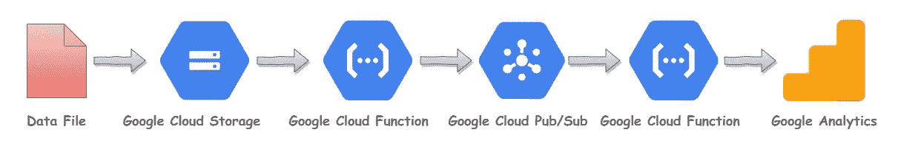
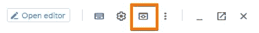

# 自动将数据导入 Google Analytics

> 原文：<https://towardsdatascience.com/automate-data-import-to-google-analytics-471de2c3fc76?source=collection_archive---------31----------------------->

## 建立一个数据管道，使用谷歌触角和 GCP 将数据导入谷歌分析。


来源 [pixabay](https://pixabay.com/photos/web-network-technology-developer-3963945/) ，作者 [geralt-9301](https://pixabay.com/users/geralt-9301/)

假设你已经将先进的机器学习技术应用于你的[谷歌分析点击量数据](/send-google-analytics-hit-level-data-to-bigquery-5093e2db481b)来丰富它。现在，您希望将增强的数据发送到您的 google analytics，这样您就可以细分和锁定那些丰富的用户，以实现重新激活和其他营销目标。

在本演练指南中，我将演示如何建立一个数据管道，允许您使用 google 云平台将数据自动导入 google analytics。我们将使用[谷歌触手](https://github.com/GoogleCloudPlatform/cloud-for-marketing/tree/master/marketing-analytics/activation/gmp-googleads-connector)来建立数据管道。

谷歌触手是一个免费使用的解决方案，有助于以自动化的方式将数据发送回谷歌分析。你所要做的就是将你的数据上传到云存储，该解决方案将按照谷歌分析要求的格式将数据发送到谷歌分析。

*注意:这个解决方案广泛使用了谷歌云组件，因此，如果你想了解更多关于 GCP 方面的事情，我推荐* [*谷歌的 GCP 课程*](https://bit.ly/2X4kefM) *作为一个很好的起点。*

# 数据管道



数据导入管道，由 Muffaddal

触手使用了 GCP 的四个组件，即云存储、Firestore/Datastore、发布/订阅和云功能。

**云存储**用于存储需要导入的数据。您可以在这里上传要发送给 GA 的离线数据。数据需要采用特定的格式，以便 GA 读取。在后面的章节中会有更多关于数据格式的内容。

**Firestore 或 Datastore** 用于配置。它告诉 tentacles 向哪个 GA 帐户发送数据以及如何发送。根据您的 GCP 项目配置，您将使用 Firestore 或 Datastore。默认情况下，tentacles 使用 Firestore，但如果您的项目设置为使用 Datastore，那么 tentacles 将使用它。

**发布/订阅**用于保存、通知和移动数据。使用了三个 pub/sub。首先是`ps-data`。它保存从云功能临时发送的数据。其次是`ps-tran`。通知云函数从`ps-data`发布/订阅中读取数据。第三个是`ps-api`。这个发布/订阅负责在发布/订阅之间传递数据。

**云函数**是动作发生的地方。使用了三种云函数。首先是`initiator`。每当有文件上传到云桶时就会触发。它将上传的数据发送到`ps-data`发布/订阅。其次是 `transporter`。它由`ps-tran`触发，并将数据从`ps-data`传输到`ps-api`发布/订阅。最后一个云函数是`apirequester`。它从`ps-api`获取数据，并将其发送至测量协议。

下面是数据如何在组件之间移动。


数据解决方案架构，作者 Muffaddal

# 装置

我们将使用 GCP 的云壳安装数据管道。

1-打开外壳后，键入以下命令，复制运行安装所需的代码。

```
git clone https://github.com/GoogleCloudPlatform/cloud-for-marketing.git
```

2-下一步移动到我们复制的目录:

```
cd cloud-for-marketing/marketing-analytics/activation/gmp-googleads-connector
```

3-在正确的文件夹中输入一次`bash deploy.sh`。这将启动安装脚本。

在安装过程中，脚本会询问一些需要回答的配置问题。

1.  **项目 Id** :首先提示您输入项目 Id。如果要使用默认项目，请提供项目 id 或按 enter 键。
2.  **输入地区**:接下来需要告知地区。输入“y”表示默认值，或输入“n”表示新区域。
3.  **集成 API** :谷歌触须可以导入多个目的地，但因为我们是为谷歌分析**安装它，输入“0”。我将在本文后面讨论其他 API。**
4.  **云存储空间**:您将被要求提供一个存储空间名称，以便将数据上传到 google analytics。提供存储桶名称或按 enter 键选择默认存储桶名称。
5.  **文件夹名称**:与存储桶类似，提供文件夹名称或保持默认。默认文件夹名称将为“出站”。
6.  发布/订阅:接下来它会询问发布/订阅主题的名称。我建议保持默认，所以只需按回车键。
7.  **配置文件**:当要求设置配置文件时，输入‘y’。
8.  **设置 Firestore/Datastore** :如果您的项目还没有设置 Firestore 或 Datastore，您将被要求进行设置。单击它提供的链接进行设置。

按照上述步骤将完成安装，现在我们的数据管道组件可以使用了。

# 配置

接下来，我们必须添加配置，以便 tentacles 可以知道将数据发送到哪个 Google Analytics 属性。

1.  在云外壳中键入以下命令

```
cp config_api.json.template config_api.json
```

2.接下来，通过单击云外壳右上角的 web 预览图标打开云控制台编辑器。



云网络预览，作者 Muffaddal

3.一旦进入编辑器，转到配置文件，该文件位于:
`cloud-for-marketing/activation/gmp-googleads-connector`


云代码编辑器导航面板，Muffaddal

4.删除`config_api.json`的内容并将下面的代码复制粘贴到文件中

`config_api.json settings`

5.在`tid`中添加 UA id，在`dh`中添加您的网站域名。

`MP` 的子对象告诉触须将数据发送到哪里。您可以添加多个用逗号分隔的子对象来配置多个 GA 属性。

我已经设置了配置文件，这样每当使用 tentacles 将数据导入 GA 时，还会触发一个名为`Google Tentacles`的事件。这有助于监控实时报告和顶级事件报告中的内容。

保存文件并返回到您的云外壳窗口。

# firestore/数据存储

触手读取 Firestore 或 Datastore(取决于您的项目设置)来知道将数据发送到哪里。因此，我们必须将上一步中设置的配置迁移到 Firestore。

为此，请在云外壳中键入以下命令:

```
bash deploy.sh update_api_config
```

如果要求输入文件名，请点击回车，因为我们已经使用了默认文件名。如果一切顺利，你应该可以在 Firestore/Datastore 中看到你在`config.json`文件中的设置。

*注意:每次更改配置时，您都必须运行上述命令。*

我们的数据管道已经准备好了。接下来，让我们向 Google Analytics 发送一些数据。

# 数据文件格式

数据管道的工作原理是，你必须将文件移动到你在安装过程中提供的云存储桶文件夹中。您可以将文件上传到 bucket，或者从 bigquery 或任何其他方式将它移动到 bucket。

一旦文件被转移到存储，它就被处理并导入到 Google Analytics。

但是在上传的数据可以移动到 GA 之前，数据必须是特定的格式，并且文件需要有特定的命名约定，以便触须读取它。

## 数据格式

数据文件应该是具有 ndjson 格式的 CSV 文件。这意味着每一行都应该是用花括号括起来的要上传的数据行。

为了帮助理解这一点，假设我们想要发送一个自定义维度来描述用户对电影类型的喜爱程度。数据看起来是这样的:

```
{"cid":"1471305204.1541378885","cd1":"horror"}
```

“cid”是我们为其发送自定义维度 1 的用户的客户端 id。

只要文件内容是所描述的格式，我们就可以将任何内容发送到 GA，例如，如果我们想要发送一个事件标签`‘upload’`和自定义维度 2 作为`‘stripe’`，那么内容将如下所示:

```
*{"cid":"2070754008.1580876566","el":"*upload*","cd2":"*stripe*"}*
```

## 命名约定

为了让 tentacles 读取上传的文件，必须使用以下命名约定:


Muffaddal 对上传文件的命名约定

文件名的绿色部分是静态的，不应该改变，因为 Tentacles 被设计成只能读取这种格式。

红色部分表示发送数据的目的地。这告诉触须使用配置中的哪些设置。这可以定制为告诉 tentacles 应该使用哪个 GA 帐户来发送数据。


由 Muffaddal 创建的 config.json 文件

开头的“*”表示可以在此处添加附加文本，以赋予文件更有意义的名称，例如:

```
*analysis_results_****API[MP]_config[*GA_Setting_1*].csv***
```

搞定了。

在云存储中创建您在安装期间输入的 bucket 和文件夹，上传您的 CSV，您应该会在您的 Google analytics 的实时报告中看到一个事件。

# 结束注释

我们努力建立谷歌触角，使用谷歌云平台向谷歌分析发送数据。安装完成后，你只需将数据文件以正确的格式上传到谷歌云存储中，数据管道就会触发将数据导入谷歌分析。

*请注意，谷歌触手也能够向其他谷歌营销平台发送数据。在步骤 3 安装的 API 集成中，我们输入“0”以使用测量协议。为了使用其他 API，请在该步骤中输入相关数字。此外，请记住，每个 API 都需要单独的配置，并期望云存储中有不同的数据格式，所以请记住这一点。阅读*[*GitHub repo*](https://github.com/GoogleCloudPlatform/cloud-for-marketing/tree/master/marketing-analytics/activation/gmp-googleads-connector)*了解更多详情。*

## 相似读取

1.  [向 BigQuery 发送 Google Analytics 点击量数据](/send-google-analytics-hit-level-data-to-bigquery-5093e2db481b)
2.  [使用 BigQuery ML 执行 RFM 分析](/rfm-analysis-using-bigquery-ml-bfaa51b83086)