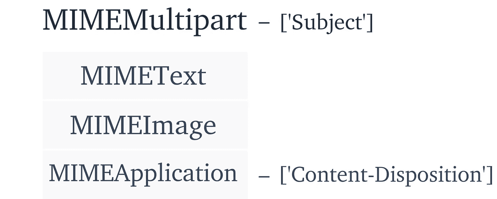

# 使用 Python 自动处理电子邮件

> 原文：<https://towardsdatascience.com/automate-email-with-python-1e755d9c6276?source=collection_archive---------7----------------------->

## 使用 Python 自动化枯燥的工作，优化我们的工作流程


照片由 [Daria Nepriakhina](https://unsplash.com/@epicantus?utm_source=medium&utm_medium=referral) 在 [Unsplash](https://unsplash.com?utm_source=medium&utm_medium=referral) 拍摄

M:我们都是上班族。如果你在工作日阅读这篇文章，你可能已经发送了几封电子邮件，或者很快就会这样做。

典型的工作者总共花 28%的时间阅读和回复电子邮件[1]。对于普通美国人来说，这相当于每天 2 小时 36 分钟。

电子邮件是保持工作世界运转的润滑油。没有它，世界看起来会非常不同。

但是，花在电子邮件上的时间真的有必要吗？《哈佛商业评论》的一项研究认为，事实并非如此。他们发现，由于电子邮件，我们平均每天浪费 1 小时 21 分钟。

我们所拥有的是难以想象数量的人可能被扔进无用的电子邮件任务的空白中。

尽管 Python 可能无法解决所有这些问题，但它肯定会有所帮助。

我们中的许多人都有数不清的电子邮件，这些邮件要求我们经历一个重复的过程，一周又一周地向相同的人发送所述过程的重复摘要。这种类型的重复对于自动化来说是成熟的。

我们将学习如何使用 Python 动态编写电子邮件，包括相关图片，以及附加重要文件。正确实施后，我们将节省大量时间，并消除潜在的人为错误。

# 它是如何工作的

对于这个任务，我们将使用两个库，`email`和`smtplib`。我们使用`email`来构建电子邮件消息本身，使用`smtplib`来发送消息。

这封邮件将被包含在一个叫做`MIMEMultipart`的物体中。这个对象可以包含几个子类，每个子类对应一个不同的媒体类型。我们的电子邮件将使用这些子类/部件构建，它们是:

*   `MIMEText` —纯文本，这将构成我们电子邮件的主体。
*   `MIMEImage` —允许我们在电子邮件中添加图像。
*   `MIMEAudio` —音频文件随该部分一起添加。
*   `MIMEApplication` —可以添加任何其他附件。

在我们使用这些不同的部分建立了我们的电子邮件消息之后，我们切换到`smptlib`。

SMTP 指的是简单邮件传输协议。这是通过互联网发送电子邮件最常用的协议。

在使用该协议时，我们将使用传输层安全(TLS)加密协议加密我们的电子邮件。

一旦我们与预定的电子邮件服务器建立了连接，我们就发送使用`MIMEMultipart`对象构建的电子邮件消息。那我们就完了。

# 哑剧

现在，让我们来充实上述过程。首先，我们的电子邮件消息，用`MIMEMultipart`构建。

`MIMEMultipart`允许我们附加几个子类。我们不需要使用它们，我们可以简单地通过`MIMEText`添加文本，然后就这样。但是，在大多数情况下，我们可能希望添加一个或多个其他类型。



`MIMEMultipart`的结构如上图所示。右边是我们的零件，`MIMEText`、`MIMEImage`和`MIMEApplication`。在左侧，是其他消息属性，如电子邮件主题。我们将不使用`MIMEAudio`，因此它被排除在上面的图像之外。

让我们来看一个示例导入和消息创建脚本:

这里发生了一些事情。在前五行中导入所需的库之后，我们初始化`MIMEMultipart`对象，将其赋给`msg`变量。

然后，我们将文本、图像`image.jpg`和附件`report.docx`附加到我们的消息`msg`中。

如上面的代码所示，使用`attach`方法可以很容易地将每个部分添加到`MIMEMultipart`中。

可以像访问 Python 字典一样访问和修改其他电子邮件和部件属性。例如，电子邮件主题的修改非常简单，如下所示:

```
msg['Subject'] = "Weekly Sales Report"
```

此外，我们还可以通过`'Content-Disposition'`键将文件元数据添加到我们的`MIMEApplication`对象中。我们这样做:

```
with open('report.docx', 'rb') as f:
    file = MIMEApplication(f.read())file['Content-Disposition'] = **"attachment; filename=report"**msg.attach(file)
```

## 附加几个文件

尽管我们在上面的例子中只附加了每个 MIME 子类中的一个，但是我们可以添加任意多个。这样做很简单，只需再次使用相关子类对象的`attach`方法:

```
for img_path in ['image1.png', 'image2.png']:
    img_data = open(img_path, 'rb').read()
    msg.attach(MIMEImage(img_data, name=os.path.basename(img_path)))
```

这里我们循环遍历一个包含两个图像文件的文件路径的列表— `image1`和`image2`。

我们将每个图像加载到`img_data`。*注意*当我们`open`图像时，我们通过指定`'rb'`标志将它们读取为二进制——我们必须对加载到`MIMEMultipart`子类中的所有内容都这样做。

最后，我们创建一个`MIMEImage`对象并将它们`attach`到我们的`msg`对象。创建`MIMEImage`时使用的`name`参数只是在电子邮件中指定附件名称。我们使用`os.path.basename`只返回文件名，没有任何路径或文件扩展名。

下面的代码是这个脚本的另一个更加结构化和完整的用例。其中我们包含了添加多个图像和附件的循环，还访问了`'Subject'`和`'Content-Disposition'`值。

# 简单邮件传输协议

如前所述。使用 SMTP 通过互联网在服务器之间传输电子邮件。幸运的是，`smtplib`让这个设置变得非常简单——我们只需要知道我们的电子邮件地址就可以了。


每个电子邮件提供商都有一个`server`地址和`port`号码。这些充当街道地址的数字等价物。

使用这些地址，我们初始化我们的 SMTP 连接。对于 Outlook，我们写`smtp = smtplib.SMTP('smtp-mail.outlook.com', '587')`。

一旦我们初始化了连接，我们必须让服务器知道我们想要如何与邮件服务器通信。

首先，我们使用`smtp.ehlo`发送一个 EHLO(扩展 Hello)命令。这告诉服务器我们可以使用扩展的 SMTP 协议(ESMTP)。有些服务器使用这个，有些不使用。但是，通过指定 EHLO，我们可以同时与 SMTP 和 ESMTP 服务器进行通信。

接下来，我们设置传输层安全性(TLS)加密。同样，这很简单，只需`smtp.starttls`即可实现。

我们用`smtp.login`登录 SMTP 服务器，用`smtp.sendmail`发送邮件。最后，我们用`smtp.quit`关闭与服务器的连接。

*注意*登录时，我们必须提供我们的电子邮件地址和密码。一般来说，尽量避免对此进行硬编码。相反，将它们保存在一个安全的本地文本文件中，并允许 Python 从那里读取它们。

至此，我们已经建立了自动化的工作流程。Python 现在可以为我们动态编写电子邮件，包括图像、音频和其他附件。

然后，我们使用 SMTP 协议发送这些消息，并使用 TLS 加密保护我们的通信。

我希望这篇文章是有用的，并帮助你腾出更多的时间来专注于工作中更有创造性、更深入的任务。

感谢阅读！

# 参考

[1] [《社会经济:通过社会技术释放价值和生产力》](https://www.mckinsey.com/industries/technology-media-and-telecommunications/our-insights/the-social-economy) (2012)，麦肯锡全球研究所

[2] M. Plummer，[如何每天花更少的时间在电子邮件上](https://hbr.org/2019/01/how-to-spend-way-less-time-on-email-every-day) (2019)，《哈佛商业评论》

[3] [SMTP 命令参考](https://www.samlogic.net/articles/smtp-commands-reference.htm)

除了自动报告之外，您还可以做更多的事情，例如机器学习培训更新或数据传输完成通知。当与移动电子邮件结合使用时，这是非常有用的。

如果您有兴趣进一步了解这方面的内容，我已经在另一篇文章《用 Python 通知:

[](/notify-with-python-41b77d51657e) [## 用 Python 通知

### 使用 Python 构建的电子邮件通知让生活更轻松

towardsdatascience.com](/notify-with-python-41b77d51657e)