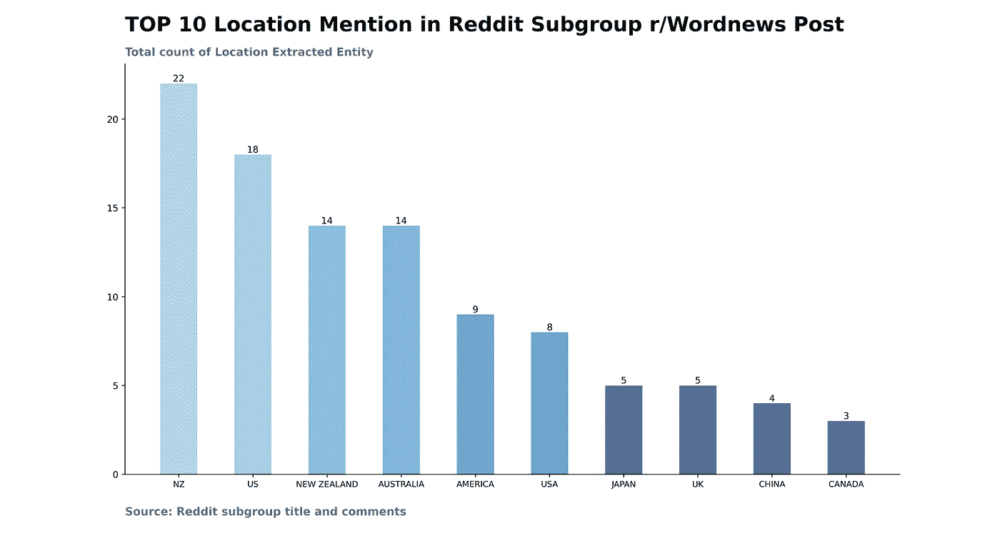
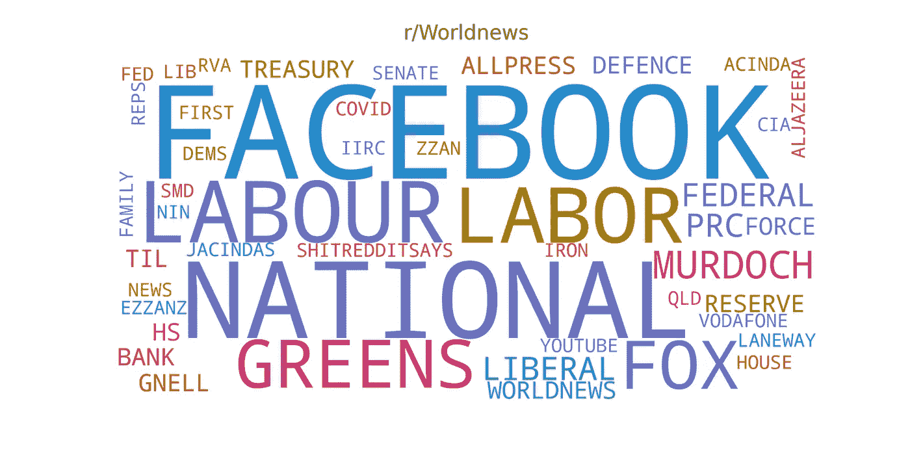

# 使用 BERT 模型自动提取 Reddit 子组实体

> 原文：<https://towardsdatascience.com/automate-entity-extraction-of-reddit-subgroup-using-bert-model-336f9edb176e?source=collection_archive---------33----------------------->

## 使用预先训练的 BERT 模型从 Subreddit r/Wordnews 中提取人名、位置和组织信息

被困在付费墙后面？点击这里阅读这篇文章和我的朋友链接。


资料来源:Unsplash 的 Luis Villasmil

命名实体识别(NER)是一个从非结构化文本中提取信息的过程。它也被称为实体提取。该方法提取时间、地点、货币、组织、医疗代码、人名等信息。我们可以将这些提取的实体标记为文章/文档的标签。

但是，我们通过从文本中提取实体来实现什么呢？这些标签能帮助我们减少文章搜索过程中的时间吗？

通过改进搜索过程，文章或文档上的标签可以节省大量时间。标签帮助我们对文本文档进行分类。这是 NER 的一个用例。

下面列出了 NER 的一些其他使用案例。

1.**将通讯社的文章分为世界、体育、时尚、娱乐等类别。类别。**

**2。它有助于在不同的在线购物网站上搜索产品。**

**3。在线课程可以根据不同的相关标签进行分类。**

我们将使用 BERT 预训练模型。点击了解有关 BERT 模型[的更多信息。BERT 模型将从 Reddit 子组中提取人名、组织名和地名。](https://huggingface.co/transformers/model_doc/bert.html)

本文分为三个部分。

**第一部分。数据收集和数据准备**

Python 程序连接 Reddit API，从 subreddit 获取信息。然后我们根据 BERT 模型输入格式化数据。

**第二部分。信息提取**

我们将从第一部分准备的数据中提取实体信息。

**第三部分。数据分析和数据可视化**

在这一部分，我们将通过图表分析从第二部分提取的信息。

现在，让我们开始吧。

## 第一部分。数据收集和数据准备

我们将使用 Reddit 分组 r/Worldnews 数据。Reddit 提供 API 访问来获取标题、评论和其他与帖子相关的数据。PRAW 是一个 python 库，它帮助我们与 API 连接。在这里了解更多关于 PRAW 图书馆的信息。([https://praw.readthedocs.io/en/latest/](https://praw.readthedocs.io/en/latest/))。您需要创建一个 Reddit 帐户来访问 API 所需的信息。

这些是必需的 API 信息。

```
reddit = praw.Reddit(client_id=’my_client_id’,
                     client_secret=’my_client_secret’,
                     user_agent=’my user agent name’)
```

按照[文章](/scraping-reddit-data-1c0af3040768)中提到的步骤获取所需的 API 访问信息。

一旦你获得访问权，我们将从 r/Worldnews post 获取标题和评论。我们将使用 r/Worldnews 的顶级周刊。您可以根据不同的时间线和受欢迎程度接收来自子组的数据。

```
def replies_of(top_level_comment, comment_list):
  if len(top_level_comment.replies) == 0:
    return
  else:
    for num, comment in enumerate(top_level_comment.replies):
      try:
        comment_list.append(str(comment.body))
      except:
        continue
      replies_of(comment, comment_list)list_of_subreddit = [‘worldnews’]
for j in list_of_subreddit:
  # get 10 hot posts from the MachineLearning subreddit
  top_posts = reddit.subreddit(j).top(‘week’, limit=1)
  comment_list = []
    # save subreddit comments in dataframe
    for submission in top_posts:
      print(‘\n\n’)
      print(“Title :” , submission.title)
      submission_comm = reddit.submission(id=submission.id)
      comment_list.append(str(submission.title))
        for count, top_level_comment in enumerate(submission_comm.comments):
          try:
            replies_of(top_level_comment, comment_list)
          except:
            continue
print(comment_list)
```

这段代码将使用递归函数获取 subreddit 帖子的整个评论部分。数据将被存储到 comment_list 变量中。

## 第二部分。信息提取

第一部分准备的数据是 BERT 模型的输入格式。模型生成的输出保存在不同的变量中。

拥抱脸的 transformer python 库将帮助我们访问 DBMDZ 训练的 BERT 模型。BERT 令牌库中包含大约 30k 个单词。如果输入文本由库中不存在的单词组成，则 BERT 标记将该单词分解为相近的单词。

比如拥抱这个词会分裂成 hu 和##gging。如果一个未被识别的单词被认为是一个实体，那么每个被拆分的单词将被赋予相同的标签。

比如(' Hu '，' I-ORG ')，(' ##gging '，' I-ORG ')。

```
for sequence in comment_list:
  if len(sequence) > 512:
    continue
  tokens = tokenizer.tokenize(tokenizer.decode
                           (tokenizer.encode(sequence)))
  inputs = tokenizer.encode(sequence, return_tensors=”tf”)
  outputs = model(inputs)[0]
  predictions = tf.argmax(outputs, axis=2)
  list_bert = [(token, label_list[prediction]) for token, prediction in zip(tokens, predictions[0].numpy())]
```

由于 BERT 令牌限制，我将输入句子长度限制为 512。

我将这些词组合起来，并赋予它们各自的实体。这个模型不是 100%准确。因此，一些单词可能会被指定错误的标签。我们在分析中会尽量避免这些不相关的词。

## 第三部分。数据分析和数据可视化。

我们有三个类别进行分析。这些类别是位置、人名和组织。

从数据中提取的主题和实体的标题。

```
Title: Research finds that New Zealand beat Covid-19 by trusting leaders and following advice. Citizens had a high level of knowledge about coronavirus and how it spread, and compliance with basic hygiene practices and trust in authorities was at nearly 100%.{‘Location’: [‘UNITED STATES’, ‘ILLINOIS’, ‘GREECE’, ‘TAIWAN’, ‘NEW Z’, ‘ISLAND’, ‘PORTLAND’, ‘NSW’, ‘CANADA’, ‘QUEENSLAND’, ‘VIETNAM’, ‘CHRISTCHURCH’, ‘HAWAII’,’VICTORIA’, ‘UK’, ‘RUSSIA’, ‘WELLINGTON’, ‘INDIANA’, ‘CHUR’, ‘NZ CHINA’, ‘STATES’, ‘ARGENTINA’, ‘CALIFORNIA’, ‘IETNAM’, ‘TRUMPTOWN’, ‘TEXAS’, ‘FRANCE’, ‘AUS’, ‘NZ’, ‘NEW YORK’, ‘JAPAN’, ‘FLORIDA’, ‘QLD’, ‘AUCKLAND’, ‘KE’, ‘USA’, ‘THE’, ‘CHINA’, ‘ITALY’, ‘SWEDEN’, ‘JONESTOWN’, ‘MELBOURNE’, ‘AMERICA’, ‘NEW ZEALAND’, ‘IRAQ’,’US’, ‘AFGHANISTAN’, ‘AUSTRALIA’], ‘Organisation’: [‘YOUTUBE’, ‘FED’, ‘FACEBOOK’, ‘ALLPRESS’, ‘GNELL’, ‘VODAFONE’, ‘IRON’, ‘LIB’, ‘RESERVE BANK’, ‘LANEWAY’, ‘DEMS’, ‘ALJAZEERA’, ‘RVA’, ‘JACINDAS’, ‘CIA’, ‘LABOR’, ‘TREASURY’, ‘SMD’, ‘WHO’, ‘SENATE’, ‘LIBERALS’, ‘LIBERAL’, ‘IIRC’, ‘COVID’, ‘HS’, ‘PRC’, ‘NATIONAL’, ‘TIL’, ‘SHITREDDITSAYS’, ‘COM’, ‘FOX’, ‘EZZANZ’, ‘QLD’, ‘FAMILY FIRST’, ‘NATIONALS’, ‘NIN’, ‘DEFENCE FORCE’, ‘ZZAN’, ‘ACINDA’, ‘FOX NEWS’, ‘LABOUR’, ‘FEDERAL’, ‘HOUSE OF REPS’, ‘WORLDNEWS’, ‘MURDOCH’, ‘GREENS’], ‘Person Name’: [‘KEVIN’, ‘FATHE’, ‘KAREN’, ‘MACRON’, ‘WINSTON’, ‘LES’, ‘BUCKLEY’, ‘CHLÖE SWARBRICK’, ‘COLLINS’, ‘CLINTON’,’JUDITH COLLINS’, ‘TO’, ‘KYLER’, ‘ASHLEY’, ‘BILL GATES’, ‘THE P’, ‘SCOTTY’, ‘HITLER’, ‘TRUMP’, ‘RUPERT MURDOCH’, ‘GATES’, ‘HGO’, ‘WILLIAM CASEY’, ‘OAK’, ‘TOVA’,’JIM JONES’, ‘KEZZA’, ‘ENN’, ‘MERICA’, ‘ROF’, ‘BLOOMFIELD’, ‘GOD’, ‘KIF’, ‘CLIVE PALMER’, ‘DAVE GROHL’, ‘SHER’, ‘BLAIR’, ‘JACINDA ARDERN’, ‘DAD’, ‘JACINDA’, ‘WINS TON PETERS’, ‘LERON’, ‘BLOOMFIELDS’, ‘MURDOCH’]}
```

**以下是我的观察。**

1.新西兰的位置在评论中被多次提及。标题中也提到了这个地名。Reddit 用户可能更喜欢国家名称的简称，而不是全称。

例如，美国、新西兰和英国等国家的简称是美国、新西兰和英国。

2.当用户知道某个国家时，他们会提到这个国家的名字。或者他们属于那个国家。因此，我们可以说，对这个帖子发表评论的大多数用户来自新西兰、美国、澳大利亚或英国。

3.杰辛达·阿德恩是新西兰总理，这解释了为什么在大多数评论中提到这个名字。由于话题情绪积极，我可以说评论提到杰辛达·阿德恩的名字也是积极的。

4.我们还可以看到特朗普(美国总统)和比尔·盖茨(微软创始人)的名字。但是提到这些名字的评论的观点并不是决定性的。你可以分别分析那些评论。

5.杰辛达·阿德恩属于执政的工党。反对党是国家党。评论中既有劳工组织的名字，也有国家组织的名字。

6.你也可以看到提及科维德和世卫组织。在组织标签中提到脸书是不确定的，除非你有提到它的评论。

有了这些实体，您就可以预期它是什么类型的数据。你可以把这些数据归入《世界新闻》一类。这些标签将帮助你过滤阅读材料。

如果运行相同的 python 程序，则不会出现相同的主题。因此观察和标记可能会有所不同。

这是从帖子中摘录的位置条形图。



以下是从帖子中摘录的一个组织单词云。



## 结论

Reddit 是一个很好的社交媒体平台，可以测试 BERT 实体提取模型的准确性。本文将帮助您处理 BERT 模型的输出数据并提取实体。您将了解它的用例，以及如何使用这些标签对文本数据进行分类。

希望这篇文章能帮助你有效地搜索不同的文档。

请在这里找到完整的代码。