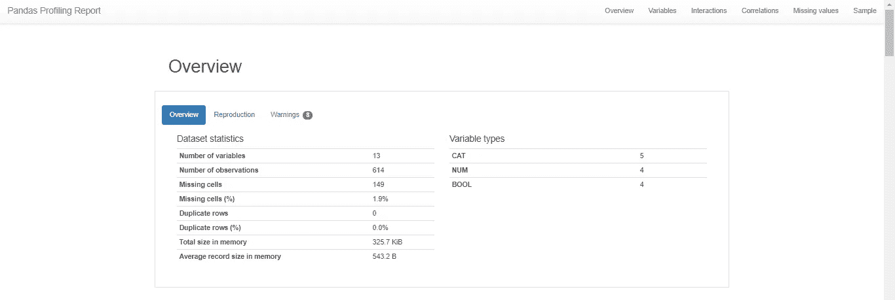

# 使用 Pandas Profiling 自动进行探索性数据分析

> 原文：<https://towardsdatascience.com/automate-exploratory-data-analysis-with-pandas-profiling-90c1842d838f?source=collection_archive---------40----------------------->

## 通过使用自动生成的报告，节省可视化和理解数据的时间


来源[https://pypi.org/project/pandas-profiling/](https://pypi.org/project/pandas-profiling/)

根据维基百科，探索性数据分析(EDA)是一种分析数据集以总结其主要特征的方法，通常采用可视化方法。

因此，EDA 是理解底层数据、变量分布及其相关性的过程。这使得 EDA 成为构建任何统计模型之前任何数据科学过程的第一步。

如果你也不知道 EDA 是如何执行的，这里有几个例子可以参考。

[*https://towards data science . com/explorative-data-analysis-EDA-a-practical-guide-and-template-for-structured-data-abfb F3 ee 3 BD 9*](/exploratory-data-analysis-eda-a-practical-guide-and-template-for-structured-data-abfbf3ee3bd9)

[*https://www . ka ggle . com/ekami66/detailed-explorative-data-analysis-with-python*](https://www.kaggle.com/ekami66/detailed-exploratory-data-analysis-with-python)

但是 EDA 通常是一项非常耗时的任务，它需要你构建多个视图来检查变量之间的分布和交互。

有一些像 info()和 describe()这样的函数确实在一定程度上有所帮助，但是即使使用了这些函数，您仍然需要执行许多手动步骤。

这就是一个名为熊猫档案的非常酷的库派上用场的地方。这个库只需一行代码就能自动生成解释数据的详细报告！

下面快速浏览一下报告的样子。

**变量概述:**



**变量统计:**


**变量之间的相互作用:**


**变量之间的相关性:**


**缺失值的数量:**


**样本数据:**


惊人的正确！

对于每个列，报告中会显示以下统计信息(如果与列类型相关):

*   类型推断:检测数据框中列的类型。
*   要素:类型、唯一值、缺失值
*   分位数统计，如最小值、Q1、中值、Q3、最大值、范围、四分位间距
*   描述性统计，如平均值、众数、标准差、总和、中位数绝对偏差、变异系数、峰度、偏斜度
*   最常见的值
*   柱状图
*   相关性突出显示高度相关的变量、Spearman、Pearson 和 Kendall 矩阵
*   缺失值矩阵、计数、缺失值的热图和树状图
*   文本分析了解文本数据的类别(大写、空格)、脚本(拉丁文、西里尔文)和块(ASCII)。
*   文件和图像分析提取文件大小、创建日期和尺寸，并扫描截断的图像或包含 EXIF 信息的图像。

除此之外，报告中还介绍了变量之间的相关性和相互作用。

所有这一切只需要一行代码！

安装库

```
pip install pandas-profiling
```

导入库

```
from pandas_profiling import ProfileReport
profile = ProfileReport(df, title=”Pandas Profiling Report”)
```

您可以直接在 jupyter 笔记本上查看报告，但我更喜欢将报告转换为 HTML 文件，然后在浏览器上查看。

```
profile.to_file(“your_report.html”)
```

这将生成一个交互式仪表板，您可以在其中探索您需要的一切。

更多信息和例子，可以参考 https://pypi.org/project/pandas-profiling/[的官方文档](https://pypi.org/project/pandas-profiling/)

尽管这是一个神奇的工具，但它也有一些**缺点。**在处理大型数据集时，生成报表需要花费大量时间。

解决这个问题的一种方法是使用下面的语法禁用昂贵的计算(如相关性和动态宁滨)。

```
profile = ProfileReport(large_dataset, minimal=True)
```

如果你正在寻找更多的例子，看看[https://pypi.org/project/pandas-profiling/#examples](https://pypi.org/project/pandas-profiling/#examples)

希望这有所帮助:)