# 使用 REST API 和 Python 自动获取 Tableau 服务器用户

> 原文：<https://towardsdatascience.com/automate-getting-tableau-server-users-with-rest-api-and-python-228fe6e7677f?source=collection_archive---------10----------------------->

有多少次有人问你，你能检查一下这些人是否有 Tableau 权限吗？而且，当你打开列表时，它已经超过了 50 封邮件。

作为 Tableau **的网站管理员，**最繁琐的任务之一就是向 Tableau 服务器上不存在的无照人员的企业主返回一个列表，以便他们可以请求预算和许可证。

验证和创建最终列表是一个手动过程。很容易出错，如果你有一个很长的输入列表，这将花费许多小时。

我将解释如何使用 Tableau REST API、Tableau 服务器客户端(TSC)和 Python Pandas 与本地 Tableau 服务器管理员用户连接并使用个人访问令牌(PAT)来自动完成这项任务

主要功能如下所示，在本例中，它使用 PAT 登录 Tableau 服务器。

# 手动步骤

你需要登录服务器，进入用户，点击过滤按钮，逐个搜索邮件或姓名，在另一个工具中做笔记。您不能使用网络浏览器搜索，因为页面是成批加载的，如果您不移动滚动条，它将不会显示您要查找的名称。

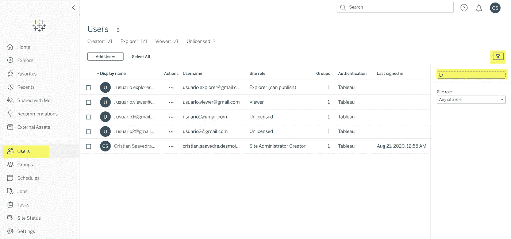

# 设置

如果你没有管理员用户来做测试，你可以以开发者的身份加入并在 https://www.tableau.com/developer/get-site[申请一个免费的网站来获得你自己的 Tableau 在线网站](https://www.tableau.com/developer/get-site)


## **使用 Tab 命令测试连接**

在使用 REST API 之前，可以使用 remote Tab 命令测试连接。如果没有，可以只下载安装 Tab 命令转到当前的 Tableau Server 发布页面，你会在页面末尾找到文件。

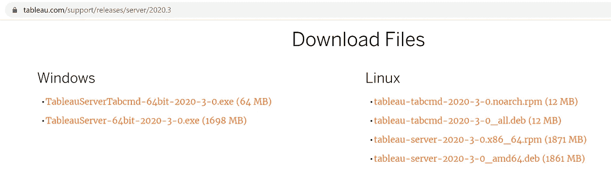

我打算在 Ubuntu 上使用 Windows 子系统 Linux (WSL2)。您需要安装 java，获取文件，安装 deb 包，刷新您的配置文件，打开一个新的终端(或使用 source 命令)并接受 EULA。

```
sudo apt update
sudo apt install default-jre
wget [https://downloads.tableau.com/esdalt/2020.3.0/tableau-tabcmd-2020-3-0_all.deb](https://downloads.tableau.com/esdalt/2020.3.0/tableau-tabcmd-2020-3-0_all.deb)
chmod +x tableau-tabcmd-2020-3-0_all.deb
sudo apt install ./tableau-tabcmd-2020-3-0_all.deb
tabcmd --accepteula
```

使用 Tab 命令测试**登录**而不检查 SSL 认证:

```
tabcmd login --no-certcheck -s [https://](https://10ax.online.tableau.com)yourserver[.online.tableau.com](https://10ax.online.tableau.com) -u your_user -p your_password -t your_site
```

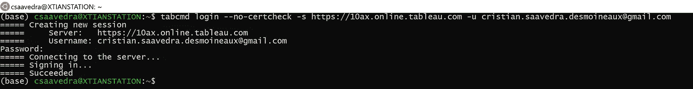

## 为 Python 安装 REST API 库

我们将按照建议使用 pip 安装 Tableau 服务器客户端(TSC ),文档位于[https://Tableau . github . io/Server-Client-python/docs/# install-TSC](https://tableau.github.io/server-client-python/docs/#install-tsc)

```
pip install tableauserverclient
pip install tableauserverclient --upgrade
```

# 代码

我将在 WSL2 和 Ubuntu 中使用 Tableau 服务器客户端和使用 Miniconda 的 Python Pandas。如果你需要更多关于安装的信息，我在这个[以前的帖子](https://medium.com/@cristiansaavedra/configuring-jupyter-notebook-in-windows-subsystem-linux-wsl2-c757893e9d69)中留了一个指南

## 这种联系

有两种方法可以连接到 Tableau 服务器:

*   使用直接在 Tableau 服务器中创建的本地管理员用户
*   或者使用个人访问令牌(PAT)

正如[文档](https://help.tableau.com/current/api/rest_api/en-us/REST/rest_api_concepts_auth.htm)所说，REST API 和 TabCmd 无法使用 SAML 进行单点登录(SSO)，比如使用 Office 365 Azure Active Directory。如果是你的情况，必须使用 PAT，可从 Tableau Server 2019.4 获得

在这两种情况下，您都必须提供完整的 URL 地址和站点以及登录标识。

如果您有许多站点要连接到默认站点，请将站点清空，如下所示:

```
site = ''
```

## 使用本地用户连接到 Tableau 服务器

使用下一个 Python 代码，您将可以连接到 Tableau 服务器。

## **使用个人接入令牌(PAT)**

首先，您需要在用户设置中创建一个 PAT，您将需要**令牌密码**和**令牌名称。**

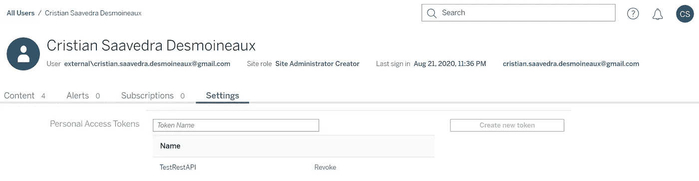

通过下面的代码，您将使用 PAT 连接到 Tableau 服务器。

## 使用 REST API 获取用户列表

使用 PAT，我创建了两个函数，一个用正则表达式验证电子邮件，另一个获取 Tableau 服务器用户列表，为文本添加一些清理:

## 与您的本地列表进行比较

使用 Python Pandas 和 Jupyter Lab，下一节将向您展示如何比较和导出到 Excel 文件。结果应该是 Anir 不存在，Elliot 无证。

我的 Tableau 服务器用户列表如下所示。

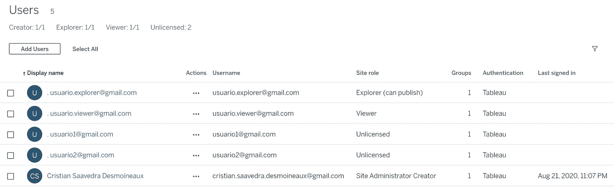

我将使用逗号分隔值(CSV)文件和要查找的电子邮件列表。


下一步是创建一个 Pandas **DataFrame** ，其中包含来自 Tableau 服务器的用户列表，具有前面的功能。

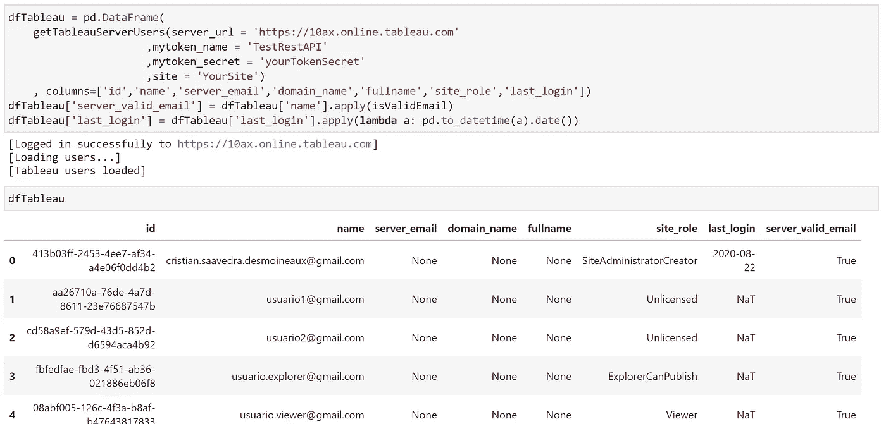

我检查是否有用户在用户名中有无效的电子邮件。


接下来，我将 CSV 文件加载到第二个**数据帧**

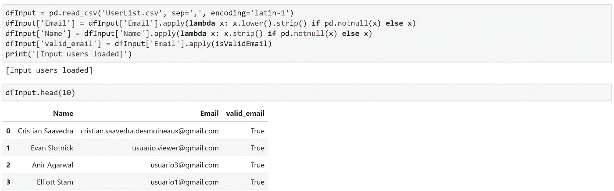

我验证 CSV 中是否有任何用户需要修复无效的电子邮件。

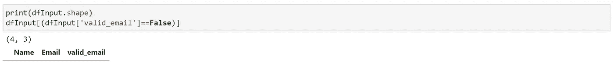

然后，我对两个数据帧进行左连接，以保留 CSV 文件中的所有电子邮件。

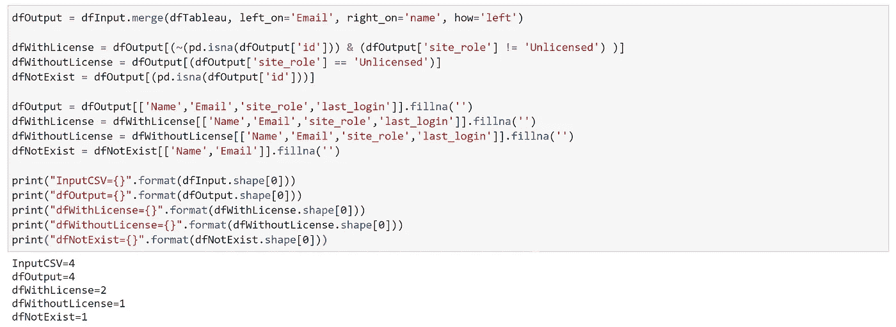

我创建了输出来分割有许可证、无许可证或不存在的用户。

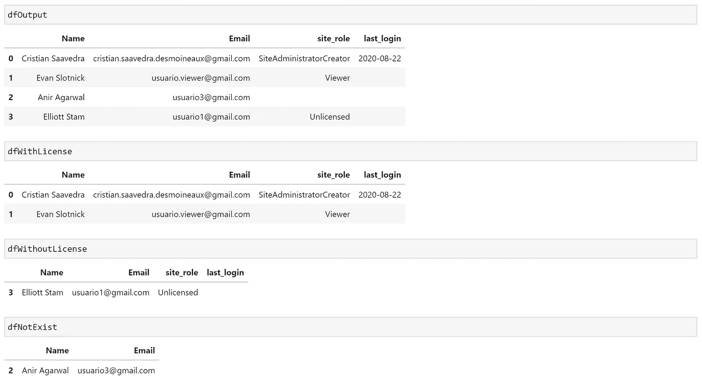

并使用 **openpyxl** 将结果保存到 Excel 文件中

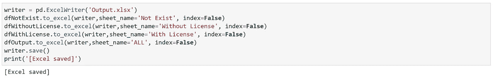

要安装 **openpyxl，**使用以下命令:

```
conda install openpyxl
conda update openpyxl
```

# 有用的资源

 [## REST API

### 通过 Tableau Server REST API，您可以使用 HTTP 以编程方式管理和更改 Tableau 服务器资源。的…

help.tableau.com](https://help.tableau.com/current/api/rest_api/en-us/REST/rest_api.htm) [](https://tableau.github.io/server-client-python/docs/api-ref#users) [## API 参考

### 重要提示:更多即将推出！本节正在积极建设中，可能不会反映所有可用的…

tableau.github.io](https://tableau.github.io/server-client-python/docs/api-ref#users) [](https://github.com/tableau/server-client-python/tree/master/samples) [## tableau/服务器-客户端-python

### Tableau 服务器 REST API 的 Python 库。为 tableau/server-client-python 开发做出贡献，创建一个…

github.com](https://github.com/tableau/server-client-python/tree/master/samples) 

# 谢谢

最后，我要感谢 Evan Slotnick、Anir Agarwal 和 Elliott Stam，因为他们向我展示了从 Tableau REST API 开始的道路。

快乐万岁！