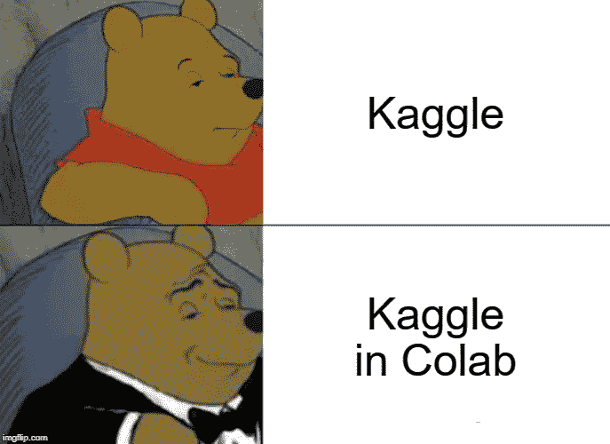
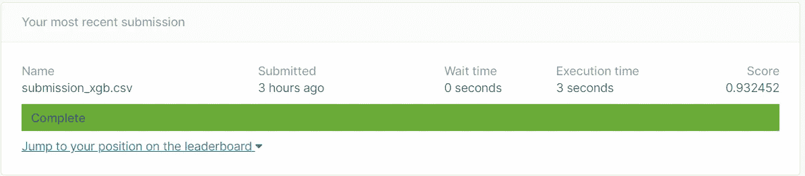

# 借助 Google Colab 自动化 Kaggle 竞赛

> 原文：<https://towardsdatascience.com/automate-kaggle-competition-with-the-help-of-google-colab-4c43a6960115?source=collection_archive---------26----------------------->

## 如何有效使用 colab 笔记本，创建 Kaggle 管道

当我开始研究 Kaggle 问题时，我在 Kaggle 笔记本上工作压力很大。在 Spyder 和 Jupyter 笔记本上工作过之后，我对在 Kaggle 上工作感到不舒服。在找出一些实用程序的过程中，比如增加 RAM、通过 API 加载数据、使用 GPU 等，我发现 Colab 解决方案更容易获得(也许这是 Google 的事情！).我在 Colab 中找到了一些简单的技巧，使使用 Colab 更容易，并创建了一个 Kaggle ML 管道来自动化这个过程。



[**Google Colab**](https://colab.research.google.com/) 是一个**免费的** Jupyter/IPython 笔记本环境，不需要设置，完全在云中运行。

## 如何充分利用 Colab？

在创建一个新的 Python 笔记本后，确保将运行时类型更改为 GPU，您将分配到约 12.72 GB RAM 和英伟达特斯拉 P4 或英伟达特斯拉 K80 或英伟达特斯拉 P100 GPU 约 7.1 GB 作为 GPU。通过运行以下命令，可以将内存分配增加到大约 25.51 GB RAM，将 GPU 增加到大约 16 GB。

```
d=[]
while(1):
  d.append('1')
```

上面的命令试图扩展(由于‘append’命令)RAM，并在此过程中崩溃。在上次内存分配崩溃后，点击“获取更多内存”。然后，您可以通过运行以下命令来检查分配的 GPU。

```
!nvidia-smi
```

# Kaggle 管道:

我正在考虑 [Kaggle IEEE-CIS 欺诈检测竞赛](https://www.kaggle.com/c/ieee-fraud-detection)，我现在将一步一步地分解 colab 中一个典型的 Kaggle 机器学习管道。

## 1.从 API 调用下载数据集:

首先下载您的 API 令牌，方法是转到您的 Kaggle 我的帐户([https://www.kaggle.com/*Your-Username*/account)](https://www.kaggle.com/*Your-Username*/account))，转到“API”部分，然后单击“创建新的 API 令牌”。您现在将下载一个名为“kaggle.json”的文件。你必须把这个文件上传到你的笔记本上。

```
from google.colab import files
uploaded = files.upload()
```

您可以使用下面给出的代码来下载和解压缩数据集。

```
!mkdir -p ~/.kaggle
!cp kaggle.json ~/.kaggle/
!chmod 600 ~/.kaggle/kaggle.json
!kaggle competitions download --force ieee-fraud-detection
#Unzip the downloaded files
!unzip sample_submission.csv.zip
!unzip test_identity.csv.zip
!unzip test_transaction.csv.zip
!unzip train_identity.csv.zip
!unzip train_transaction.csv.zip
```

现在，您可以以最有效的方式访问大小约为 1.2 GB 的数据集。

## 2.预处理和数据争论:

使用熊猫，读取这种规模的数据集有时需要几分钟。为了有效地使用提供的 RAM 和 GPU，我们可以使用 dask 包在不到一秒的时间内读取这些大数据集！！

```
import dask.dataframe as dd
train_identity = dd.read_csv('train_identity.csv')
train_transaction = dd.read_csv('train_transaction.csv')
test_identity = dd.read_csv('test_identity.csv')
test_transaction = dd.read_csv('test_transaction.csv')
sub = dd.read_csv('sample_submission.csv')
# let's combine the data and work with the whole dataset
train = dd.merge(train_transaction, train_identity, on='TransactionID', how='left')
test = dd.merge(test_transaction, test_identity, on='TransactionID', how='left')
```

说到数据争论，我接着改变了必要的数据类型，并训练和测试数据分割。这可以根据他们的风格和舒适度来做。你可以通过 [**colab**](https://colab.research.google.com/drive/1QK2Iw1At-sZuQbaBkOWAJZZKUhOVSyJ5) 为我进行数据角力的步骤。

## 3.特征工程和特征选择:

这可以根据数据集的类型来完成，自由地创建新的特征并使用特征选择技术，如递归特征消除、BORUTA、基于树的特征选择等。我在“SelectFromModel”的帮助下使用了“sklearn feature_selection ”,并使用“XGBClassifier”来进行特征选择。

## 4.模型构建:

我使用 XGboost 来拟合数据，使用 gridsearchCV 或 randomsearchCV 或贝叶斯优化等超参数技术来选择参数，这些超参数优化技术的详细版本将包含在以后的博客中。

**5。提交文件:**

在对测试数据进行验证之后，可以将 Kaggle 的进一步“提交数据”预测添加到管道中，以确保在预测之后下载文件。

请从这个 [**colab**](https://colab.research.google.com/drive/1QK2Iw1At-sZuQbaBkOWAJZZKUhOVSyJ5) 检查详细的 Kaggle 管道，我在提交文件上收到了大约 0.93 的分数，运行管道的最短时间为大约 5 分钟。然后，我们可以通过更改参数网格和使用不同的模型(如 LightGBM、Catboost、Adaboost 等)来改进模型，从而实现自动化。



## 专业提示:

除此之外，如果您担心 colab 可能会断开连接，您可以通过在浏览器中单击 Ctrl+ Shift + i，运行下面的一小段 Javascript 代码。

```
**function** **ClickConnect**(){
console.log("Working"); 
document.querySelector("colab-toolbar-button#connect").click() 
}**setInterval**(ClickConnect,60000)
```

**结论:**

处理 Kaggle 竞赛中提供的大型数据集可能是一个耗时的过程。如果我们可以有效地利用 google colab 笔记本来创建管道，那么我们就可以利用 dask 等并行计算库，并有效地使用 GPU 来加速和自动化数据建模过程。

# 参考资料:

*   [XGBoost](https://arxiv.org/abs/1603.02754)
*   [Kaggle IEEE-CIS 欺诈检测竞赛](https://www.kaggle.com/c/ieee-fraud-detection)