# 使用 AWS Lightsail 自动化 python 脚本

> 原文：<https://towardsdatascience.com/automate-python-scripts-with-aws-lightsail-b8dfdd5b0a2f?source=collection_archive---------11----------------------->

## 请跟随我在 AWS Lightsail Ubuntu 实例上自动化 python 脚本的过程。


在我作为一名数据科学家的工作中，我逐渐意识到自动化工作流的每个方面是多么必要。当大多数人听到数据科学这些词时，他们往往会想到机器学习和 AI，但实际上数据科学家的大部分时间都花在了各种工作上。在这篇博客中，我将关注使用 AWS Lightsail 的数据收集自动化。

下面概述的项目都托管在我的 [github](https://github.com/Landstein/AWS-Lightsail) 上

1.创建一个 AWS Lightsail Ubuntu 实例

2.将专用 IP 地址应用于实例

3.在 Ubuntu 实例上安装 Python3.7 和 PIP

4.将 python 存储库克隆到实例

*   python 脚本将调用 reddit 的 api，并将来自 reddit.com/r/learnpython 的所有提交内容存储到一个 csv 文件中

5.创建每小时运行一次的 cron 作业

**在亚马逊网络服务上创建一个 Ubuntu LightSail 实例**

如果你是个人开发者或个人项目爱好者，Lightsail 可以帮助你部署和管理基本的云资源。如果你只是需要虚拟专用服务器，亚马逊 Lightsail 是最容易上手 AWS 的方法。Lightsail 包括快速启动项目所需的一切——虚拟机、基于固态硬盘的存储、数据传输、DNS 管理和静态 IP。创建实例后，您可以轻松地连接到它。您可以使用 Lightsail 控制台、Lightsail API 或 Lightsail 命令行界面(CLI)来管理实例。(【https://lightsail.aws.amazon.com/】T4)

首先，你需要在[亚马逊 LightSail](https://signin.aws.amazon.com/signin?redirect_uri=https%3A%2F%2Flightsail.aws.amazon.com%2Fls%2Fwebapp%3Fstate%3DhashArgs%2523%26isauthcode%3Dtrue&client_id=arn%3Aaws%3Aiam%3A%3A015428540659%3Auser%2Fparksidewebapp&forceMobileApp=0) 注册。第一个月是免费的，这将给你足够的时间来决定这项服务是否是你所需要的。

登录后，您应该会看到 Lightsail 仪表盘。


Lightsail 仪表板

**创建一个 Ubuntu 实例**

1.单击“创建实例”按钮(上面圈出的)。

2.在 pick your instance image 下，选择 **Linux/Unix**

3.仅选择操作系统

4.选择 Ubuntu 18.04

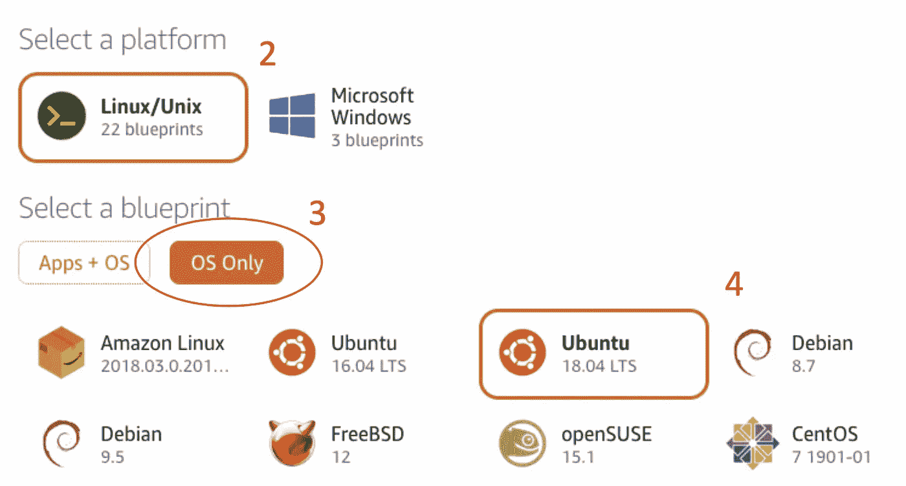

创建 ubuntu 实例

5.选择您的实例计划:对于这个项目，我将使用最便宜的选项($3.50)，因为它足以运行大多数 python 脚本。还有，别忘了第一个月是免费的！

6.命名实例:对于这个项目，我将实例命名为“Ubuntu-Automation”

7.选择创建实例

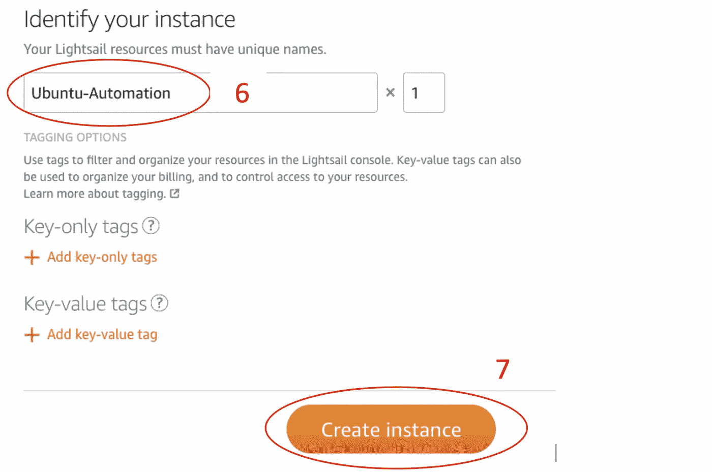

选择创建实例后，您将返回到 AWS LightSail 仪表板。创建 Ubuntu 实例需要几分钟时间。创建实例时，状态将为“待定”,如下图所示:

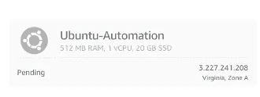

待定创建

创建实例后，状态将变为“正在运行”。您还将看到分配给该实例的 IP 地址，对于我的实例，IP 地址是 3.227.241.208。此 IP 地址是动态的，每次重新启动实例时都会改变。根据您计划托管的项目，可能有必要设置一个静态 IP 地址。

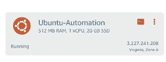

Ubuntu 实例已创建并正在运行

**创建一个静态 IP 地址**

创建静态 IP 是可选的，只有在项目需要时才是必需的。我将创建一个静态 IP 地址，因为出于安全原因，我只向这个 IP 地址打开我的 SQL server。在初始设置之后，我更喜欢从我的本地机器 SSH 到 Ubuntu 实例，拥有一个静态 IP 使这个过程更容易。

1.在 Lightsail 仪表板中选择“网络”选项卡

2.点击“创建静态 IP”

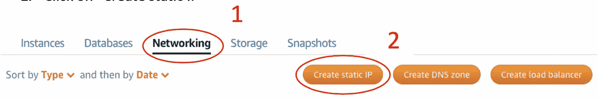

网络仪表板

3.在“附加到实例”下选择您的 Ubuntu 实例服务器

4.给静态 IP 一个名称

5.点击“创建”

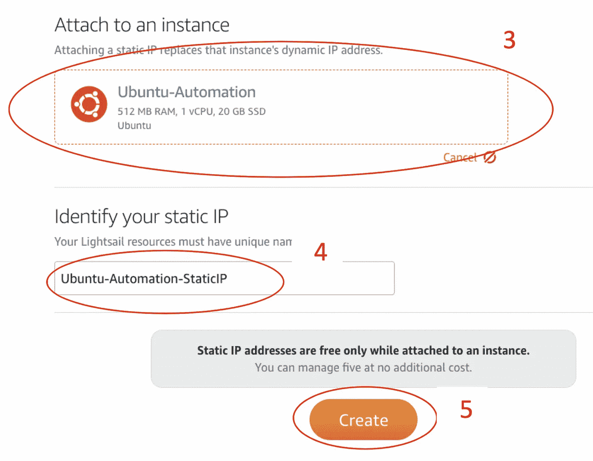

然后，您应该会看到新的静态 IP 地址。此 IP 地址不会改变。

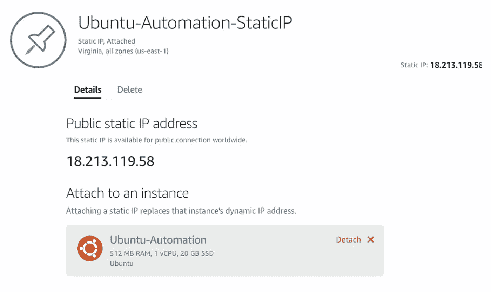

向前迈进，我的静态 IP 地址将是 18.213.119.58，这是我将在这个项目的其余部分使用。

**Python 自动化**

对于这个项目，我将创建一个调用 Reddit API 的 python 脚本，并收集来自 reddit.com/r/learnpython.的所有新提交内容。对于本文的范围，我不会回顾这个特定的脚本是如何工作的，但是，你可以在 [GitHubLink](https://github.com/Landstein/AWS-Lightsail) 查看所有代码。

**使用 SSH 连接到 Ubuntu 实例**

从 Lightsail dashboard 中，您可以使用基于 web 的 SSH 工具连接到您的 Ubuntu 实例。在初始设置之后，我更喜欢使用 SSH，因为它更简单，但是我确实发现使用基于 web 的工具更容易与我在这篇博客中回顾的设置进行交互。

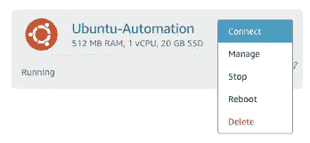

**终端 SSH 连接**

在右上角选择帐户>帐户。这将带您到帐户仪表板，您可以在那里下载您的 SSH 密钥。

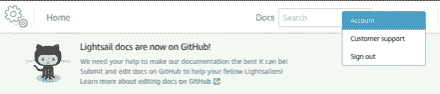

在 Lightsail 帐户面板中，选择“SSH 密钥”,然后下载。

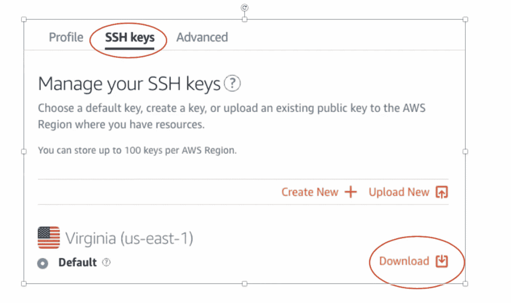

*   在本地计算机上，导航到~/。通过运行命令 cd ~/来运行 ssh。嘘

```
cd ~/.ssh
```

*   将下载的密钥复制到此位置
*   要检查密钥是否已复制到该位置，请运行命令 ls 列出所有文件。(请注意，此方法仅适用于基于 Unix 的操作系统。)

```
 ls
```


要通过 SSH 连接，请运行以下命令

```
ssh -i ~/.ssh/lightsail.pem -T ubuntu@{your_lightsail_IP_address}
```

我的 Ubuntu 服务器的 IP 地址是 18.213.119.58。为了连接，我将使用以下命令


第一次连接时，您会看到以下消息:

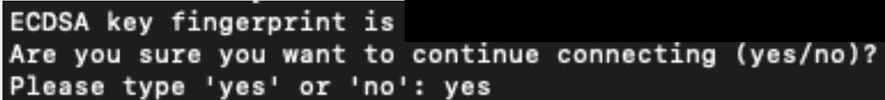

选择“是”连接到您的 Ubuntu 实例。

连接后，您将看到以下内容:


基于 web 的 SSH 连接和本地终端 SSH 连接都是有效的并且可以工作。我只是更喜欢通过终端连接。

**在 Ubuntu 实例上获取 python 脚本**

我将 python 脚本下载到 Ubuntu 实例的首选方法是通过 Git。

```
git clone [https://github.com/Landstein/AWS-Lightsail.git](https://github.com/Landstein/AWS-Lightsail.git)
```

(如果你的 ubuntu 实例上有你需要的配置文件，而你又不想让它托管在 github 上，你可以使用亚马逊的 S3 来传输)

**安装 Python3.7 和 PIP**

对于安装 Python 和 PIP，我建议通过 Lightsail 仪表板使用基于 web 的 SSH。

在存储库文件夹中运行以下命令，该命令将运行以下代码并安装 Python3.7 和 PIP。

```
bash install_python.sh
```

**安装 Python 库**

接下来安装 python 库 praw 和 pandas。运行批处理文件 python_libraries.sh。

Praw: Python reddit aPI 包装器

熊猫:数据处理和分析

```
bash python_libraries.sh
```

**设置 Cron 作业**

cron 软件实用程序是一个基于时间的作业调度程序，在类似 unix 的计算机操作系统中。设置和维护软件环境的用户使用 cron 来安排作业(命令或 shell 脚本)在固定的时间、日期或间隔定期运行。它通常会自动进行系统维护或管理——尽管它的通用性质使它在从互联网下载文件和定期下载电子邮件等方面非常有用(wikipeida.com)。

为了完全自动化这个过程，最后一步是让 cron 作业定期运行。

对于这个项目，我打算让我的脚本每小时运行 15 分钟。cron 命令将如下所示:

```
15 * * * * /usr/bin/python3 /home/ubuntu/AWS-Lightsail/learnpython_to_csv.py >> ~/cron.log 2>&1
```

如果你想尝试为你的 cron 任务设置不同的时间间隔，我建议你先看看[https://crontab.guru/](https://crontab.guru/)。

**创建 Cron 作业**

使用以下命令将编辑器设置为 vim

```
export EDIOTR=vim
```

进入 vim 并编辑 cron 作业

```
crontab -e
```

此时，VIM 将启动，您将能够编辑您的 cron 作业。

1.  按 I 键进入插入模式
2.  进入插入模式后，将 cron 作业复制并粘贴到编辑器中
3.  按退出键
4.  按:(冒号)、w(写)、q(退出)保存并退出 vim

```
:wq
```

现在您已经完成了，您的脚本将按照 cron 作业中给定的时间间隔运行。

要检查您的 cron 作业，您可以运行命令 crontab -l 来查看所有当前的 cron 作业。

```
crontab -l
```

出于日志记录的目的，打印语句和错误将存储在 cron.log 文件中。

```
cat cron.log
```

如果您看到类似的输出，这意味着一切都在工作！


cron.log

设置视频: