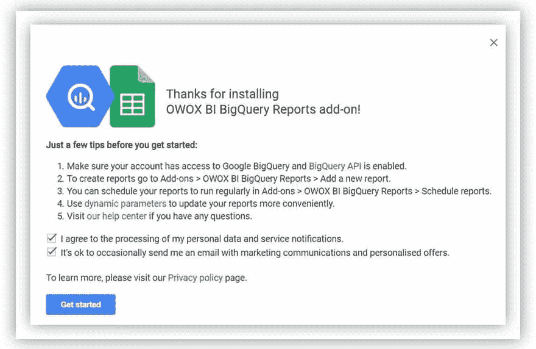
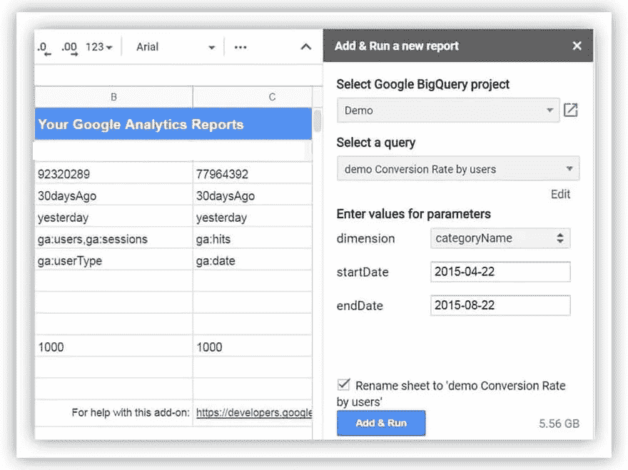
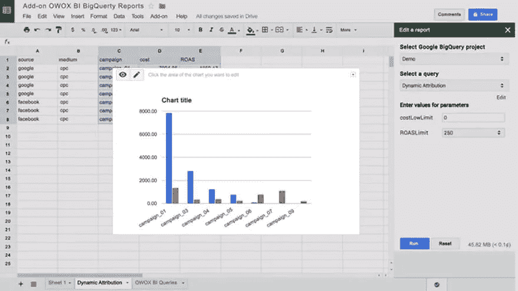
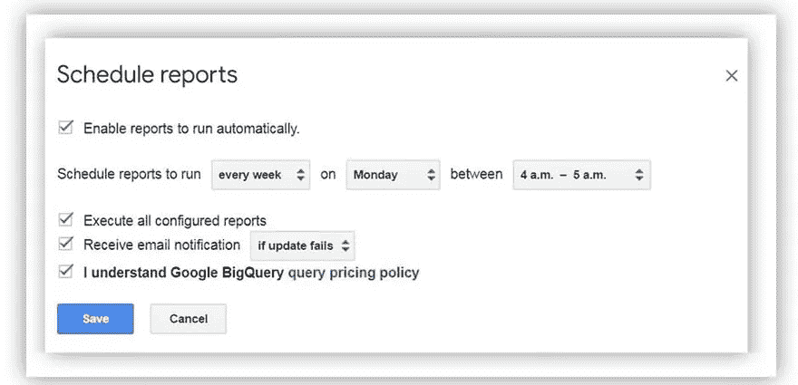

# 使用来自 Google BigQuery 的数据自动生成 Google Sheets 中的报告

> 原文：<https://towardsdatascience.com/automate-reports-in-google-sheets-using-data-from-google-bigquery-e6bb38d745dd?source=collection_archive---------49----------------------->


来源:[沉积照片](https://ru.depositphotos.com/100580468/stock-photo-contemporary-room-workplace.html)

## 如何基于来自 Google BigQuery 的数据设置自动更新和发送 Google Sheets 中内置的电子邮件报告

# 为什么要 Google BigQuery？

在我们谈论设置之前，对于那些不熟悉云存储服务的人来说，先说几句 [Google BigQuery](https://cloud.google.com/bigquery/) 的特性和好处。

Google BigQuery 的优势:

*   快速云解决方案，让您能够在几秒钟内处理数 TB 的数据
*   适合小型和大型公司
*   经济高效且易于扩展
*   不需要服务器、容量预留和维护
*   透明的定价策略—只为处理的数据付费，没有隐藏的费用
*   数据处理的灵活性——用 SQL 访问包含数据的表，还可以使用 JavaScript 函数
*   可靠性和安全性得到了众多证书的证实——PCI DSS、ISO 27001、SOC 2 和 SOC 3 Type II——因此您可以安全地存储客户的信用卡号、电子邮件地址和其他个人信息

# 易于自动化数据交换

Google BigQuery 的另一个值得强调的特性是它与外部服务的方便集成。该存储库有大量现成的库和连接器，使得自动化数据交换变得容易。例如，使用 [OWOX BI](https://www.owox.com/products/bi/pipeline/) ，你可以从谷歌分析、广告源、电话跟踪服务、电子邮件简讯等导入数据。into BigQuery:

以下是使用 BigQuery 的一些更有用的工具:

*   [Rest API](https://developers.google.com/bigquery/docs/reference/v2/)
*   [第三方工具](https://developers.google.com/bigquery/third-party-tools)
*   [SDK](https://cloud.google.com/bigquery/docs/reference/libraries?hl=en)
*   [JDBC](https://code.google.com/p/starschema-bigquery-jdbc/)
*   [ODBC](http://www.simba.com/connectors/google-bigquery-odbc)
*   [命令行工具](https://developers.google.com/bigquery/bq-command-line-tool)

# BigQuery 数据传输服务

BigQuery 最近推出了一款[数据传输服务工具](https://cloud.google.com/bigquery/transfer/)，可以自动传递来自谷歌广告服务的数据。它目前使用以下服务:

*   谷歌广告
*   活动经理
*   谷歌广告经理
*   油管（国外视频网站）

您可以通过几次点击来设置集成，之后来自这些服务的所有信息都会自动在 BigQuery 中提供给您。

# 在 Google BigQuery 中组合数据

要基于完整的数据构建报告并实现自动化，您需要在 BigQuery 中组合来自不同来源的数据。这里有一个如何做到这一点的例子:

1.  首先，在谷歌分析中从你的网站收集数据。
2.  使用 Google Sheets 从其他来源补充信息。
3.  [添加来自广告服务](https://www.owox.com/products/bi/pipeline/google-analytics-cost-data-import/)的成本数据——例如，通过 OWOX BI。
4.  将所有这些数据导入 BigQuery。如果您是 Google Analytics 360 的客户，您可以使用 BigQuery 导出功能来完成这项工作。如果你没有 Google Analytics 360，你可以连接 OWOX BI，用它将数据从 Google Analytics 导入 Google BigQuery。
5.  将信息[从你的 CRM 和 ERP 系统转移到 BigQuery](https://support.owox.com/hc/en-us/articles/360000840193) 并与你网站的数据相结合。
6.  同样在 BigQuery 中，从任何种类的 Google Sheets 下载更多信息
7.  如果您使用通话跟踪，请将通话和聊天数据上传到 BigQuery。OWOX BI 集成了五种通话/聊天服务。
8.  对电子邮件时事通讯做同样的事情。
9.  最后，使用数据传输服务，它从 Google 和 YouTube 广告服务导入数据

# 使用 OWOX BI BigQuery 报表附加组件

在您组合了 Google BigQuery 中的所有数据，通过一个关键参数将其链接起来，并构建了必要的报告之后，您可以自动将这些报告上传到 Google Sheets。为此，请使用 OWOX BI BigQuery Reports 插件。它类似于 Google Analytics Sheets 插件，但是需要 SQL 语法知识。要在 BigQuery 中访问数据，您需要构建一个 SQL 查询，之后您将在 Google Sheets 中看到所需结构的数据。

# 如何基于 Google BigQuery 数据在 Google Sheets 中创建报告

首先，[在你的 Chrome 浏览器中安装 BigQuery Reports 插件](https://chrome.google.com/webstore/detail/owox-bi-bigquery-reports/fepofngogkjnejgcbdmmkddnpeojbbin)。为此，打开一个 Google Sheets 文档，转到 OWOX BI BigQuery Reports 选项卡，并选择 Add a new report。

如果这是你第一次使用这个插件，你需要提供你的 Google BigQuery 帐户的访问权限。



图片由作者提供

之后，指定您想要在报告中查看其数据的项目。然后从下拉列表中选择一个 SQL 查询(如果您之前创建了查询)，或者通过单击“添加新查询”添加一个新查询。



图片由作者提供

您可以立即在 SQL 查询中将先前指定的动态参数添加到报表中。选择报告的日期，并通过单击“添加并运行”按钮运行查询。

此时，附加组件将在 BigQuery 中访问您的数据并执行计算。然后，在您的表中，将出现一个单独的工作表，其中包含查询结果。

现在您可以可视化这些数据，创建数据透视表，等等。



图片由作者提供

# 基于 BigQuery 数据自动更新报告

为了避免每次需要数据时都必须手动运行查询，您可以设置一个计划报告。为此，请转到附加组件–> OWOX BI big query 报告–>计划报告。

选择报告更新的频率(每小时、每天、每周或每月一次)。然后指定开始 SQL 查询的时间。如有必要，激活电子邮件提醒以更新报告。保存设置。



图片由作者提供

完成了。现在，您的报告将根据设定的计划自动更新。

# 使用 Google App 脚本通过电子邮件发送报告

最后，为了不错过 KPI 中的重要变化，您可以使用 Google App Script 配置通过电子邮件发送报告。

首先，让您的开发人员准备一个脚本，其中包含电子邮件地址和发送消息的条件，可以是定期发送，也可以是响应特定指标的重要更改。

您可以将此代码用作模板:

```
// Send an email with two attachments: a file from Google Drive (as a PDF) and an HTML file.
 **var** file = DriveApp.getFileById('abcdefghijklmnopqrstuvwxyz');
 **var** blob = Utilities.newBlob('Insert any HTML content here', 'text/html', 'my_document.html');
 MailApp.sendEmail('mike@example.com', 'Attachment example', 'Two files are attached.', {
     name: 'Automatic Emailer Script',
     attachments: [file.getAs(MimeType.PDF), blob]
 });
```

你可以阅读谷歌帮助中的开发者指南，了解更多关于如何构建这些代码的信息。

然后在表格中打开您需要的报告，进入工具–>脚本编辑器。将会打开一个新窗口，您需要在其中粘贴脚本。

单击时钟图标，设置脚本启动的时间表。现在点击右下角的+添加触发器按钮。然后选择事件源—时间触发器，并从列表中选择通过电子邮件发送报告的频率。最后，单击保存。

搞定了。现在，报告将会发送到您的电子邮件中，您不会错过任何内容，并且能够及时对您的营销活动进行更改。