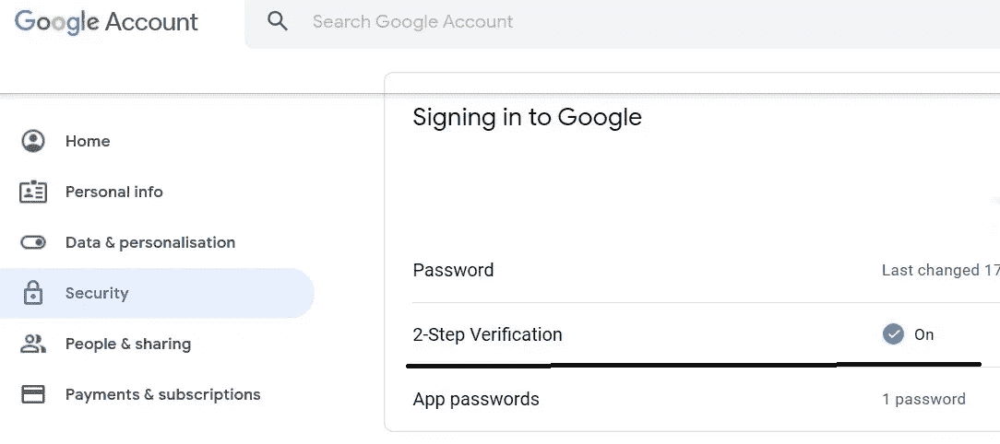
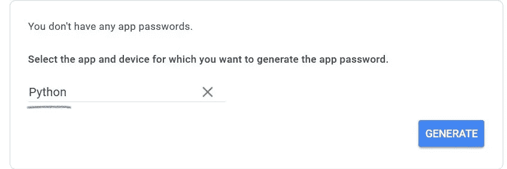
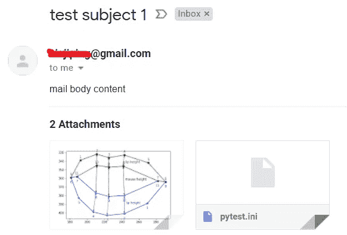
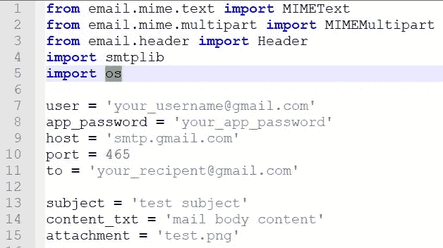
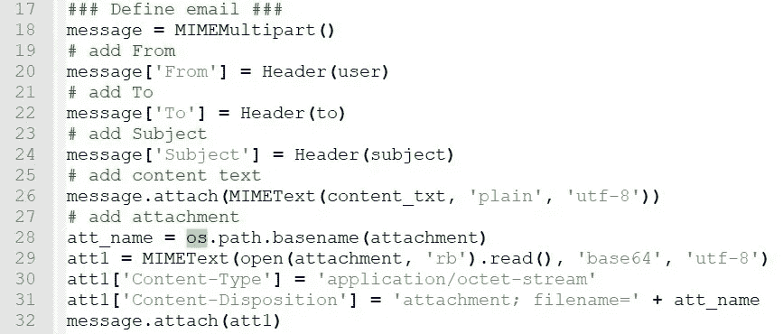
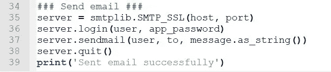

# 用 Python 和 Gmail 发送电子邮件

> 原文：<https://towardsdatascience.com/automate-sending-emails-with-gmail-in-python-449cc0c3c317?source=collection_archive---------3----------------------->

## 用几行代码发送电子邮件


这篇文章将解释如何在 Google 帐户中设置应用程序密码，并使用 Python 在几行代码中发送电子邮件，用于自动报告、测试自动化或 CI/CD 故障通知等。

# Google 帐户设置

要使用 Gmail 帐户通过第三方应用程序(如 Python 脚本)发送电子邮件，我们需要设置应用程序密码。出于安全原因，普通 Gmail 密码仅限于网络登录。从 2020 年开始，即使你打开了谷歌账户中的[“不太安全的应用访问”](https://support.google.com/accounts/answer/6010255?hl=en)选项，也无法使用 Python 脚本中的普通密码登录你的 Gmail 账户。

首先，您需要启用两步验证。只需进入您的 Google 帐户>安全>登录 Google，选择两步验证并按照说明进行操作。



启用两步验证

接下来，创建一个应用程序密码。只需选择“两步验证”下的“应用程序密码”，您将看到如下窗口。在“选择应用程序”下拉列表中选择“其他”。


应用程序密码/步骤 1

输入一个名称，例如 Python，然后单击“生成”。请注意，该名称与 Python 脚本没有任何联系，可以是任何名称。



应用程序密码/步骤 2

然后你会得到一个新的应用程序密码。复制并保存不带空格的 16 字符密码，例如 xnwbjmgvjeeevlgc，以便在 Python 脚本中使用。


应用程序密码/步骤 3

# 用 yagmail 发送电子邮件

[yagmail](https://github.com/kootenpv/yagmail) 是 Python 标准库 smtplib 的包装器，使得发送邮件变得非常容易。

要在 Python 中安装 yagmail，只需运行`pip install yagmail`。

下面是发送带有两个附件的电子邮件的示例脚本。

这段代码非常简单，不言自明，所以几乎不需要任何解释。除了您的 Gmail 用户名和应用程序密码，您只需定义收件人、主题和内容，就像从 web Gmail 写电子邮件一样。内容是一个列表，第一个元素是正文部分，其余是附件。在本例中，我们从脚本所在的同一文件夹中附加了“pytest.ini”和“test.png”。

要运行这个脚本，只需在任何平台上运行`python send_gmail_by_yagmail.py`，Windows、Linux 或 MacOS。您将在收件人帐户中收到一封电子邮件，如下所示。



示例电子邮件

要发送一组收件人，只需将“收件人”更改为一个列表。

`to = [‘user1@gmail.com’, ‘user2@yahoo.com’]`

注意，yagmail 默认使用 gmail SMTP 服务器，你可以显式定义 SMTP 服务器和端口。

```
host = 'smtp.gmail.com'
port = 465
with yagmail.SMTP(user, password, host, port) as yag:
```

# 使用 Python 标准库

我们也可以使用 Python 标准库，不需要安装任何额外的包来发送邮件。

首先，我们导入标准的 email 和 smtplib 包，并定义相关的变量。

*   Gmail 用户名和应用程序密码
*   Gmail 主机和端口
*   到
*   科目
*   正文内容
*   附件



标准库/第 1 部分

其次，我们用上面的信息定义一个电子邮件对象。消息被定义为 MIMEMultipart，这样我们可以添加附件，每个部分都是一个 MIMEText 对象，它也支持二进制文件。



标准库/第 2 部分

最后，我们调用 smtplib 登录并发送消息。



标准库/第 3 部分

你可以在这里找到完整的脚本 send_gmail_standard_lib.py [。当然要运行，只需输入`python send_gmail_standard_lib.py`。](https://gist.github.com/peterjpxie/decd14f5926a895f5cb1d842f2350781)

# Python 3.6+中的变化

上面两个例子支持 Python 3.5 甚至更低版本。Python 3.6 中引入了新的 [EmailMessage](https://docs.python.org/3/library/email.message.html#email.message.EmailMessage) API 来定义电子邮件。更多细节可以参考最新的[文档](https://docs.python.org/3/library/email.html)和一个例子[这里](https://docs.python.org/3/library/email.examples.html)。

# 常见问题解答

在非英语 Windows 操作系统上，您可能会遇到如下 UnicodeDecodeError 错误。

```
server = smtplib.SMTP_SSL(smtp_host, smtp_port)
  File "C:\Program Files (x86)\Python37-32\lib\smtplib.py", line 1031, in __init__
    source_address)
  File "C:\Program Files (x86)\Python37-32\lib\smtplib.py", line 261, in __init__
    fqdn = socket.getfqdn()
  File "C:\Program Files (x86)\Python37-32\lib\socket.py", line 676, in getfqdn
    hostname, aliases, ipaddrs = gethostbyaddr(name)
UnicodeDecodeError: 'utf-8' codec can't decode byte 0xc3 in position 2: invalid continuation byte
```

这似乎是 Python smtplib 模块的一个 bug。原因是您的计算机名包含非英语字符。因此，解决方法是简单地用英文字符重命名您的计算机名。

# 参考

[https://github.com/kootenpv/yagmail](https://github.com/kootenpv/yagmail)
[https://mp.weixin.qq.com/s/AMYeOiMX7URc_PFczqQ-5Q](https://mp.weixin.qq.com/s/AMYeOiMX7URc_PFczqQ-5Q)
[https://docs.python.org/3/library/smtplib.html](https://docs.python.org/3/library/smtplib.html)
https://docs.python.org/3/library/email.html