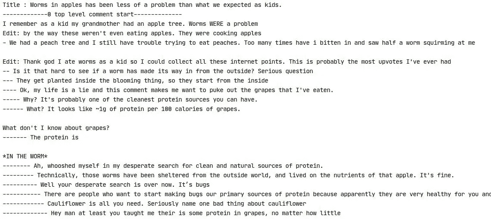

# Reddit Post: TextBlob 和 VADER 的自动化情感分析流程

> 原文：<https://towardsdatascience.com/automate-sentiment-analysis-process-for-reddit-post-textblob-and-vader-8a79c269522f?source=collection_archive---------24----------------------->

## **使用 VADAR 和 TextBlob python 库找到 Reddit 子群的情绪**

被困在付费墙后面？[阅读这篇文章，我的朋友链接在这里。](/automate-sentiment-analysis-process-for-reddit-post-textblob-and-vader-8a79c269522f?source=friends_link&sk=1142e729859b4bfaf5e0fe377fa60981)


来源:图片由[凯文·菲利普斯](https://pixabay.com/users/27707-27707/?utm_source=link-attribution&utm_medium=referral&utm_campaign=image&utm_content=1007072)来自 [Pixabay](https://pixabay.com/?utm_source=link-attribution&utm_medium=referral&utm_campaign=image&utm_content=1007072)

你有没有想过如何从一个用户的评论中找到一个 subreddit 的情绪？或者想在加入之前检查不同主题的 subreddit 极性？如果你正在寻找这些问题的答案，那么这篇文章将会给你很大的帮助。在这篇文章中，我们将发现 subreddit 的整体情绪。

这里给不知道什么是 subreddit 和 reddit 的人解释一下。

# Reddit

Reddit 是一个社交分享网站，它分为更小的社区，称为**子社区**。subreddit 只是一个专门讨论特定主题的板块。

用户，Reddit 的组成部分，加入这些社区并提交他们的想法和经验。然后，其他用户通过对这些想法的评论来表达他们的观点。

开始了解情绪分析所需的库:

## 1.PRAW

Reddit 提供了一个 API 来从他们的站点获取信息。我们将使用 Python 库 PRAW 与 Reddit API 进行交互。

## 2.VADER

VADER (Valence Aware 字典和情感推理器)是一个基于词典和规则的情感分析工具，专门针对社交媒体中表达的情感。我们将使用 VADER 对 Reddit 评论和话题进行情感分析。

## 3.文本 Blob

TextBlob 是一个用于处理文本数据的 Python 库。它为自然语言处理(NLP)任务提供了一个 API，如词性标注、名词短语提取、情感分析、分类、翻译等。

**注意:代码的最终版本可以在本文末尾找到。**

## 让我们导入这些库

```
import praw
from textblob import TextBlob
# VADER can be accessed by the NLTK library.
import nltk
# Download the VADAR tool and access it through the NLTK library.
nltk.download(‘vader_lexicon’)
from nltk.sentiment.vader import SentimentIntensityAnalyzer
```

在我们开始收集情绪分析数据之前，我们需要创建一个 Reddit 应用程序。访问[此](https://www.reddit.com/prefs/apps)页面创建一个应用程序，并获取所需的身份验证和详细信息。

```
reddit_api = praw.Reddit(client_id=’my_client_id’,
                         client_secret=’my_client_secret’,
                         user_agent=’my_user_agent’)
```

Reddit_api 对象与 Reddit API 建立连接。我们将使用它的函数获取帖子和评论等子编辑信息。

我们使用 showerthoughts subreddit 来获得前 5 名每周帖子的数据。如果您想检查其他子编辑的极性，只需用您的子编辑名称替换 showerthoughts 即可。

```
top_posts = Reddit.subreddit(‘showerthoughts’).top(‘week’, limit=5)
```

此外，我们可以用小时、月和年来代替周。该限制将帖子限制为 5 个。有关 Reddit API 配置的更多信息，请访问本页。

下一步是获取每个子编辑中的数据:文章标题、评论和回复。subreddit 上的帖子分为两部分，标题和评论部分。有些标题有一小段描述，代表文章作者的观点。大多数投票的评论及其回复显示在评论区的顶部。

## 标题部分的实现

```
for submission in top_posts:
     print("Title of the post :", submission.title)
```

## 注释部分的实现

我已经使用递归复制了 subreddit 帖子的整个评论部分。

```
def replies_of(top_level_comment,
               count_comment,
               sub_entries_textblob,
               sub_entries_nltk):
    if len(top_level_comment.replies) == 0:
        count_comment = 0
        return
    else:
        for num, comment in enumerate(top_level_comment.replies):
            try:
                count_comment += 1
                   print(‘-’ * count_comment, comment.body)
                   text_blob_sentiment(comment.body,
                                       sub_entries_textblob)
                   nltk_sentiment(comment.body, sub_entries_nltk)
            except:
               continue
            replies_of(comment, 
                       count_comment,
                       sub_entries_textblob,
                       sub_entries_nltk)
```



Reddit 帖子的标题和评论部分

情感分析所需的子编辑数据现已可用。我们将在 TextBlob 工具中传递数据，并获取情绪。

```
def text_blob_sentiment(review, sub_entries_textblob):
    analysis = TextBlob(review)
    if analysis.sentiment.polarity >= 0.0001:
        if analysis.sentiment.polarity > 0:
            sub_entries_textblob[‘positive’]=
                              sub_entries_textblob[‘positive’]+1
            return ‘Positive’
    elif analysis.sentiment.polarity <= -0.0001:
        if analysis.sentiment.polarity <= 0:
            sub_entries_textblob[‘negative’]=
                             sub_entries_textblob[‘negative’] + 1
            return ‘Negative’
    else:
        sub_entries_textblob[‘neutral’]=
                             sub_entries_textblob[‘neutral’] + 1
        return ‘Neutral’
```

TextBlob 的所有函数都可以从分析变量中访问。我们将使用 analysis .情操来了解句子的极性得分。根据极性得分，我们将句子分为阳性、阴性和中性。所有句子的情感已经被统计并存储在变量 sub_entries_textblob 中。

对 VADER 工具遵循相同的过程，传递数据，并将情感存储在 sub_entries_nltk 中。

```
sia = SentimentIntensityAnalyzer()
def nltk_sentiment(review, sub_entries_nltk):
    vs = sia.polarity_scores(review)
    if not vs[‘neg’] > 0.05:
        if vs[‘pos’] — vs[‘neg’] > 0:
            sub_entries_nltk[‘positive’]=
                                 sub_entries_nltk[‘positive’] + 1
            return ‘Positive’
        else:
            sub_entries_nltk[‘neutral’]=
                                 sub_entries_nltk[‘neutral’] + 1
            return ‘Neutral’
    elif not vs[‘pos’] > 0.05:
        if vs[‘pos’] — vs[‘neg’] <= 0:
            sub_entries_nltk[‘negative’]=
                                sub_entries_nltk[‘negative’] + 1
            return ‘Negative’
        else:
            sub_entries_nltk[‘neutral’]=
                                 sub_entries_nltk[‘neutral’] + 1
            return ‘Neutral’
    else:
        sub_entries_nltk[‘neutral’]=sub_entries_nltk[‘neutral’] + 1
        return ‘Neutral’
```

我们可以使用 sia 对象访问 VADER 函数。sia.polarity 将一个句子作为输入，并将情感得分作为输出。从 nltk _ 情操()句子分类成积极，消极和中性的情绪。

如果您打印 sub_entries_nltk 和 sub_entries_textblob 变量，我们将获得正面、负面和中性情绪的总数。从计数中，我们将得出子涡旋的总体极性。

# 结论

在本文中，人们可以学习如何使用 PRAW python 库从 Reddit 获取信息，并发现 subreddit 的观点。此外，了解文本块和 VADER 工具是如何轻松实现情感分析的。这篇文章帮助你复制 subreddit 帖子的整个评论部分，并附上每个评论及其回复。

**作者其他文章**

1.  [EDA 的第一步:描述性统计分析](https://www.analyticsvidhya.com/blog/2020/10/a-quick-guide-to-descriptive-statistics-the-first-step-in-exploring-your-data/)
2.  [路透社文章的文本数据分析和可视化](/analysis-and-visualization-of-unstructured-text-data-2de07d9adc84)
3.  [使用罗伯塔模型发现 Reddit 子群的情绪](/discover-the-sentiment-of-reddit-subgroup-using-roberta-model-10ab9a8271b8)

## 这是完整的代码