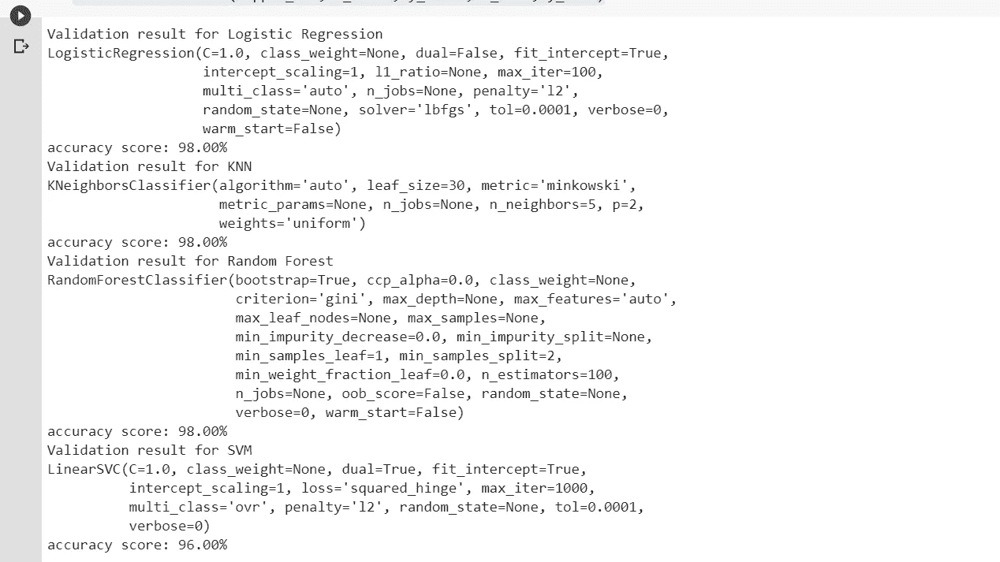
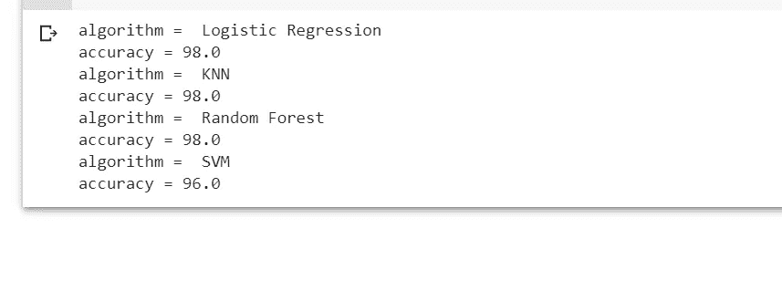

# 利用 Sklearn 管道实现机器学习模型的自动化

> 原文：<https://towardsdatascience.com/automate-the-machine-learning-model-implementation-with-sklearn-pipeline-2ef1389062c9?source=collection_archive---------69----------------------->

## 在本教程中，我们将了解如何加快机器学习算法开发中的模型实现步骤。

在 [Unsplash](https://unsplash.com/@hiteshchoudhary?utm_source=unsplash&utm_medium=referral&utm_content=creditCopyText) 上由 [Hitesh Choudhary](https://unsplash.com/@hiteshchoudhary?utm_source=unsplash&utm_medium=referral&utm_content=creditCopyText) 拍摄的照片

很多时候，在处理机器学习问题时，我们会遇到这样的机器学习任务，我们希望预处理我们的数据，并用不同的分类器测试我们的模型，以选择最佳的一个。在这种情况下，在训练数据上单独拟合每个分类器，然后测试模型是非常繁琐的，更不用说还涉及到大量的冗余编码。此外，如果您的算法涉及交叉验证，并且您的预处理步骤涉及规范化或标准化等操作，则在学习之前对完整的训练集执行规范化或标准化将会影响测试集的规模。如果所有这些问题都有一个单一的解决方案，那不是很好吗？

嗯，有！Scikit-Learn 有一个管道模块，它提供了解决上述问题的简单方法。

> [*Pipeline 是一个按顺序应用一系列变换和一个最终估计器的函数。管道的目的是组装几个步骤，这些步骤可以在设置不同参数的同时进行交叉验证。*](https://scikit-learn.org/stable/modules/generated/sklearn.pipeline.Pipeline.html)

现在让我们来看一个实现，它将展示我们如何使用管道来简化手头的任务。

在这里，我将使用 Iris 数据集，将其标准化，并测试分类器的数量，以查看哪一个给出了最佳结果。在这里，我将使用 KNN、SVM、随机森林和逻辑回归来测试算法。

首先，我们需要导入所有需要的模块。

现在，我们将从 Scikit-Learn 导入 Iris 数据集，并将其分成训练集和测试集。

接下来，我们将从 Scikit-Learn 中列出分类器名称及其各自的功能。最后，把它们连在一起。这一步将确保我们将所有分类器连同它们的名称一起一次性传递给我们的管道函数。

这里需要注意的一点是，我们将为所有分类器的所有超参数选择默认值。

现在，我们将定义将分类器的 zip 以及训练和测试数据作为输入的函数，准备带有分类器的 Standardscalar 管道，并将管道的结果馈送到我们稍后将定义的 ***fit_classifier()*** 函数。

最后，我们定义前面提到的 ***fit_classifier()*** 函数。该功能接收管道和列车测试数据。它用 ***pipeline.fit()*** 拟合管道来训练数据，计算预测和准确度分数。

现在是时候测试我们的算法了。

运行上面的行之后，我们得到以下结果。

分类器和准确度分数

最后，我们将看到分类器及其各自的准确度分数。

上面的运行给出了以下结果。

决赛成绩

你有它！我们刚刚看到 Scikit-Learn 的管道功能如何让生活变得更简单。

**如果你觉得有用，不妨在这里** **多看看我的文章** [**。**](https://medium.com/@agastidukare)

如果你有什么建议，请在评论里告诉我。