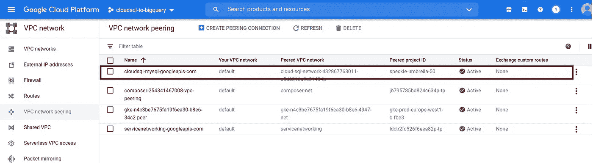
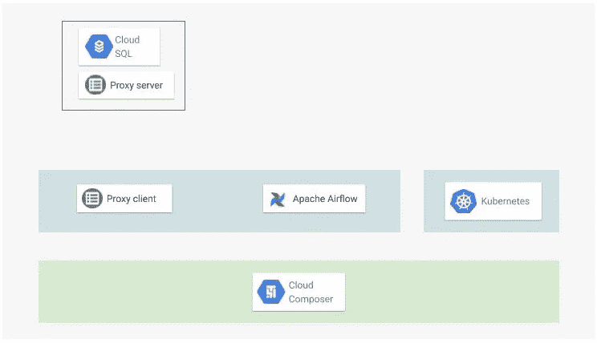
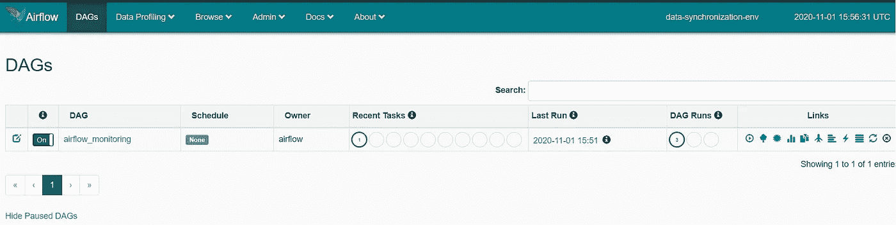
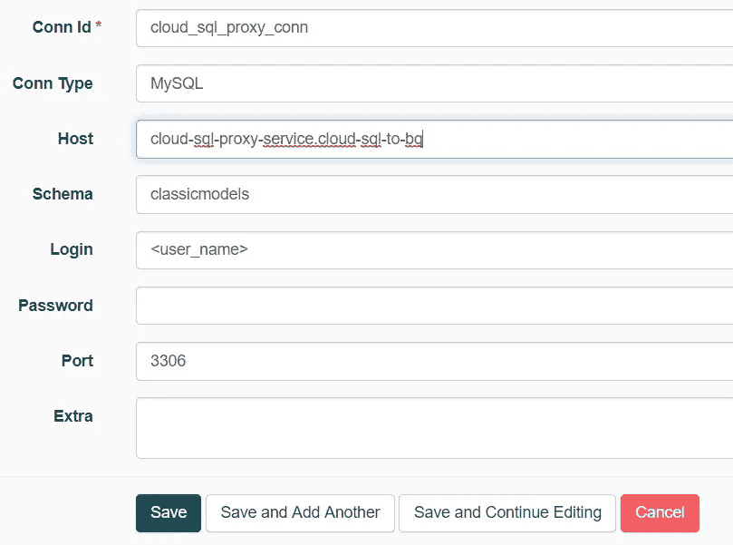
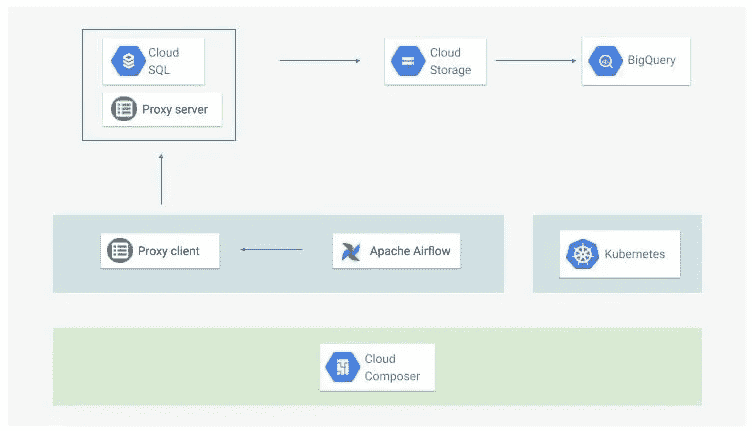
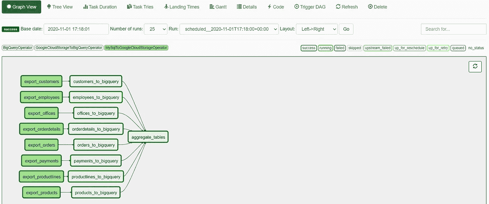

# 使用 Airflow 自动将云 SQL 数据同步到 BigQuery

> 原文：<https://towardsdatascience.com/automate-your-cloud-sql-data-synchronization-to-bigquery-with-airflow-7f9d992da18f?source=collection_archive---------14----------------------->

## 使用私有 IP 连接和云 SQL 代理保护您的数据和工作负载

斯科特·韦伯在 [Unsplash](https://unsplash.com?utm_source=medium&utm_medium=referral) 上拍摄的照片

如果你正在使用 GCP (Google Cloud Platform)来存储你的数据，很可能你正在使用 BigQuery 作为你的数据仓库或者数据湖解决方案(或者作为它的一部分)。存储交易数据的一些解决方案包括数据存储、云扳手和云 SQL。在许多情况下，尤其是从本地迁移到 GCP 时，云 SQL 是事务性数据的自然选择，因为它提供了托管 MySQL 和 PosgreSQL。

有许多方法可以将云 SQL 数据同步到 BigQuery。一个解决方案是使用带有云 SQL BigQuery 特性的[联邦查询。尽管这种解决方案具有速度快、成本低的优势，但它至少有一个限制:还不可能将云 SQL 联邦查询与私有云 SQL 实例一起使用，这意味着留给您的是不太安全的公共实例。本文介绍了一种高度安全、自动化和生产就绪的方式，将您的云 SQL 数据导入 BigQuery。](https://cloud.google.com/bigquery/docs/cloud-sql-federated-queries?hl=en)

## 你会得到什么

在本文结束时，您将获得

1.  在 GCP 上构建云 SQL 数据同步到 BigQuery 工作流的详细分步指南。
2.  访问包含用于构建工作流程的所有材料的 gitlab 存储库。您将能够使用存储库代码作为实现您自己的数据同步工作流的起点。

## 你需要跟进什么

这篇文章对于至少对 GCP 有基本了解的读者来说是最有价值的。如果你想知道这三个字母代表什么，我建议你花点时间[在这里](https://www.coursera.org/learn/gcp-fundamentals)好好了解一下 GCP。我还假设你接触过阿帕奇气流和库伯内特斯。如果不是这样，你可以在 Udemy 上查看[这篇](https://www.udemy.com/course/the-complete-hands-on-course-to-master-apache-airflow/)优秀的气流介绍。你也可以在这里找到 Kubernetes [的快速入门。](https://kubernetes.io/docs/tutorials/kubernetes-basics/)

要跟进，你需要的是一个 GCP 项目。如果你没有可用的项目，或者如果你只是想在现有项目中不产生任何费用的情况下尝试一下，你可以创建一个新的谷歌账户，并使用该账户创建一个[免费的](https://cloud.google.com/free) GCP 账户和项目。

## 你会做什么

在接下来的几分钟内，您将:

1.  设置 Apache 气流
2.  创建云 SQL 实例
3.  设置 Airflow 和云 SQL 之间的私有连接
4.  创建大查询数据集
5.  编写和部署数据同步任务
6.  将新的模拟数据插入云 SQL
7.  监控同步任务

# 设置 Apache 气流

请记住，Airflow 是一种工具，其目的是协调、自动化和监控批处理作业。在我们的上下文中，实际的同步工作是通过调用 GCP API 来完成的，我们将在 [*编写和部署数据同步任务*](#5e39) *时看到。*

在 GCP 上安装 Airflow 有很多选择，包括在谷歌计算引擎或谷歌 Kubernetes 引擎上定制安装。在这里，我们部署了一个 Google Cloud Composer 环境资源，它提供了一个 GKE 集群(以及其他 GCP 资源),并在该集群上安装了 Airflow。

要创建部署，请执行以下操作:

*   打开您的云 shell，并将其配置为使用正确的 GCP 项目。将<project_id>替换为您打算使用的 GCP 项目的 ID:</project_id>

*   如果适用，启用编写器 API(这可能需要 2 分钟)

*   创建一个名为“cloud-composer”的服务帐户，并为其指定角色“roles/composer.worker”、“roles/cloudsql.client”、“roles/bigquery.user”和 roles/bigquery.dataEditor。

*   使用 VPC 本地和专用 GKE 集群创建名为“data-synchronization-env”的 composer 环境。请耐心等待，直到 [*设置好气流和云之间的私有连接 SQL*](#09ec) 我会在这里详细介绍一下 VPC 本地和私有 GKE 集群。为环境分配“cloud-composer”服务帐户。分配给服务帐户的云 SQL 和 BigQuery 角色由 Airflow 用来读取云 SQL 数据库和创建 BigQuery 同步表。

大约 30 分钟后，您的 cloud composer 环境应该在 GCP 项目的默认 VPC 网络中启动并运行。

# 创建云 SQL 实例

我们的云 SQL 到 BigQuery 同步架构的主要优势之一是，它实施了安全最佳实践。实际上，我们将使用私有实例，而不是为云 SQL 数据库使用公共实例。

在创建私有云 SQL 实例之前，我们需要在 GCP 项目中的 VPC 网络(这里我们选择“默认”VPC 网络)和云 SQL 实例所在的 VPC 网络之间创建一个 VPC(虚拟私有云)对等连接。“默认”网络上的实例将能够使用该 VPC 对等连接连接到私有云 SQL 实例。要了解更多关于创建云 SQL 私有实例的信息，请查看[这个](https://cloud.google.com/sql/docs/mysql/configure-private-ip#gcloud)。

以下四个命令创建一个云 SQL MySQL 私有实例:

*   如果适用，启用服务网络 API

*   创建一个地址范围，并使用它来创建 VPC 对等连接。用您的项目 id 替换<project_id>(这可能需要 1 分钟)。</project_id>

*   创建云 SQL 私有实例

为了能够连接到 SQL 实例，让我们创建一个云 SQL 用户。我还将创建一个数据库，我们将在本文后面将其同步到 BigQuery。

*   创建云 SQL 实例用户，用适当的值替换<user_name>。主机“cloudsqlproxy~%”的值使得无法从云 sql 代理服务器进程之外的其他地方连接到用户<user_name>的实例。</user_name></user_name>

*   在云 SQL 实例中创建一个数据库。称这个数据库为“经典模型”

*   从其 [sql 转储文件](https://sp.mysqltutorial.org/wp-content/uploads/2018/03/mysqlsampledatabase.zip)中导入流行的[‘classic models’](https://www.mysqltutorial.org/mysql-sample-database.aspx/)数据库。为此，我们首先创建一个 GCS bucket。为了方便起见，用您的 GCP 项目的名称来命名这个存储桶。

*   复制 GCS (Google 云存储)中的 sql 转储文件。

*   检索云 SQL 实例正在使用的服务帐户:注意“serviceAccountEmailAddress”字段的值

*   将存储桶“cloudsql-to-bigquery”上的 storage.objectAdmin 角色授予该服务帐户。用上一步中检索到的电子邮件地址替换<service_account_email_address></service_account_email_address>

*   执行转储文件导入

# 设置 Airflow 和云 SQL 之间的私有连接

回想一下，我们的 Airflow 安装运行在一个私有的 VPC 本地 GKE 集群上。一方面，顾名思义，私有集群是一种没有为工作节点分配公共 IP 的集群。事实上，我们不需要通过互联网公开我们的 GKE 工人。首先，将公共 IP 分配给工作节点可能会导致安全漏洞。其次，公共 IP 在这里没有用，因为云 SQL 实例不能通过公共 IP 连接访问。

另一方面，VPC 本地意味着 GKE 集群使用别名 IP 地址范围将流量从一个 pod 路由到另一个 pod。事实上，就 IP 路由而言，VPC 本地 GKE 集群有许多有用的好处。例如，当启用 VPC 本地模式时，集群 VPC 网络和通过 VPC 网络对等连接到它的任何网络之间存在本地路由。更多关于 VPC 本地集群的信息可以在这里找到。

如果到目前为止，为气流创建的 GKE 集群正在名为“default”的默认 VPC 内运行。至于云 SQL 实例，它运行在一个 VPC 网络中，该网络位于一个由 GCP 代表我们管理的项目中。既然 GKE 的工作人员属于两个不同的网络，并且没有公共 IP，他们怎么可能与 SQL 实例通信呢？

还记得我们之前在我们的项目“默认”VPC 网络和云 SQL 实例所在的 VPC 网络之间建立了一个 VPC 对等连接。这意味着我们的 GKE 工作人员和我们的云 SQL 实例可以通过私有 IP 连接进行本地通信，这要归功于启用了 VPC 本地模式。您可以在云控制台上找到有关这种对等的详细信息。

打开云控制台，点击菜单(左上角的汉堡图标)，向下滚动直到找到‘VPC 网络’。悬停在“VPC 网络”上。在下拉列表中，单击“VPC 网络对等”。

GKE 集群 VPC 网络和云 SQL 托管网络之间的 VPC 对等连接，图片由作者提供

此时，我们已经为云 SQL 到 BigQuery 的同步作业做好了准备，因为执行这些作业的 GKE 工作人员无法从互联网上访问。然而，我们可以更进一步，加密 GKE(或气流)和云 SQL 之间的连接。

传统上，这是使用 SSL 证书完成的，这意味着配置和管理 SSL 证书的开销。

加密到云 SQL 实例的连接的一种更简单的方法是使用云 SQL 代理。云 SQL 代理的工作方式是，让一个本地进程(称为代理客户端)运行在连接发起的环境中，让一个“远程”进程(称为代理服务器)运行在与云 SQL 实例相同的环境中。请访问这个[文档](https://cloud.google.com/sql/docs/mysql/sql-proxy?hl=en)，获得关于云 SQL 代理的全面解释。

我们在 GKE 上安装 SQL 代理，方法是创建一个运行 SQL 代理进程的 pod，然后创建一个服务在内部向集群公开该 pod。

但是在到达那里之前，我们需要设置 kubectl 二进制文件来与集群通信。为了实现这一目标:

*   通过运行以下命令获取 GKE 群集名称。复制“名称”字段下的值

*   连接到集群并配置 kubectl 二进制文件。用先前命令的值替换<cluster_name></cluster_name>

*   获取云外壳服务器 IP 地址

*   将云 shell 服务器列入白名单，以便 GKE 集群主服务器接受来自它的传入连接。确保在上一步中将<cluster_name>替换为集群名称，将<shell_server_ip_address>替换为 IP 地址</shell_server_ip_address></cluster_name>

我们现在准备在 GKE 集群上安装 SQL 代理。首先，在集群中为代理相关资源创建一个名称空间。为此，创建一个空文件，并将其命名为“namespace.yaml”。然后将以下内容复制到文件中:

创建 cloud-sql-to-bq 命名空间的 GKE 清单

现在创建名称空间:

然后创建一个名为“pod.yaml”的文件。然后将以下内容复制到文件中。请确保用您的 GCP 项目 ID 的值替换<project_id>。</project_id>

创建云 sql 代理 pod 的 GKE 清单

继续创建运行云 SQL 代理流程的 pod

现在，代理运行在 GKE 集群内的 pod“cloud-SQL-proxy”的容器“airflow-sqlproxy”中。最后，创建一个名为“service.yaml”的文件，并向其中添加以下内容。

创建云 sql 代理服务服务的 GKE 清单

将该清单应用到 GKE 集群，以实际创建服务，该服务将代理流程公开给集群中运行的其余 pod。

就是这样！我们已经在 GKE 工作者(以及气流工作者)和云 SQL 实例之间配置了一个私有的加密连接。架构现在看起来像这样:

架构图:为 Airflow 和云 SQL 之间的通信而设置的云 SQL，图片由作者提供

# 创建大查询数据集

在您的 GCP 项目中创建一个 bigquery 数据集，以保存将要从云 SQL 同步的所有表。

# 编写和部署数据同步任务

从云 SQL 到 BigQuery 的实际数据同步是由 Airflow DAG(有向无环图)处理的。DAG 由三个任务组成:

*   第一个任务将数据从云 SQL 实例数据库“classicmodels”导出到之前创建的 GCS 存储桶。这是使用气流[MySqlToGoogleCloudStorageOperator](https://airflow.apache.org/docs/stable/_modules/airflow/contrib/operators/mysql_to_gcs.html)完成的

到云 SQL 实例的连接是私有的和加密的(因为使用了私有实例和云 SQL 代理)，并使用 Airflow 连接字符串“cloud_sql_proxy_conn”。

要配置此连接字符串:

1.  打开气流用户界面。打开云控制台。接下来，单击控制台右上角的菜单栏。向下滚动直到找到“Composer”并点击它。然后点击“数据-同步-环境”菜单。在出现的水平栏上，单击“环境配置”。下一步向下滚动，直到你找到“气流网络用户界面”。单击“Airflow web UI”旁边的链接。使用正确的 google 帐户进行身份验证。气流用户界面如下所示:

气流用户界面，图片由作者提供

2.点击“管理”并在打开的下拉列表中选择“连接”。使用以下信息创建连接。将<user_name>替换为您之前创建的云 SQL 实例用户名，并点击“保存”。</user_name>

MysqlToGoogleCloudStorageOperator 的气流连接

*   第二个任务使用[GoogleCloudStorageToBigQueryOperator](https://airflow.apache.org/docs/stable/_api/airflow/contrib/operators/gcs_to_bq/index.html)将数据从 GCS 存储桶导入 BigQuery 表

*   第三个任务通过 [BigQueryOperator](https://airflow.apache.org/docs/stable/_api/airflow/contrib/operators/bigquery_operator/index.html) 从第二步创建的表中创建一个聚合表。为了使事情看起来更具体一些，我在这个任务中根据销售数字计算了 classicmodels 示例数据库中的前 5 名雇员。

*   创建一个名为“cloud_sql_to_bq.py”的文件，并将 DAG 代码片段复制到其中。
*   通过查找字段“dagGcsPrefix”的值来检索云合成器 dags 目录的名称

*   将文件“cloud_sql_to_bq.py”复制到 Cloud Composer dags 目录中

过一会儿，您的 DAG 应该开始运行，当它结束时，您应该在 BigQuery 数据集中找到您的新表。

恭喜你！您已经成功部署了数据同步 DAG 并实施了目标体系结构的所有部分:

架构图:云 SQL 数据同步到 BigQuery，图片由作者提供

# 将新的模拟数据插入云 SQL

为了让同步作业在每次运行时获取新数据，我在 GKE 上创建了一个 CRON 作业，它每 2 分钟运行一次，向“classicmodels”数据库的“employees”表添加新数据。

我不会在这里花太多时间讨论新的数据插入过程，因为它偏离了我们的主题。如果你有兴趣了解更多关于我是如何实现这个过程的，请耐心听我讲完，你将会看到一个 Gitlab 库，里面有迄今为止讨论过的所有材料。

# 监控同步任务

Airflow modern 用户界面(UI)为任务监控提供了许多有用的功能，包括工作流和任务状态、自定义图表、使用标准 SQL 的即席查询。此外，Cloud Composer 还提供本机[指标和仪表盘](https://cloud.google.com/composer/docs/monitoring-dashboard)来监控气流作业和 GKE 集群。

同步作业计划每 2 分钟运行一次(在现实生活中，您不会有这么高的运行速度)。下图显示了上次作业运行的结果。

同步作业的成功 dag 运行执行图，按作者显示的图像

# 总结

在本文中，我展示了一种将数据从云 SQL 同步到 BigQuery 的安全方法，使用完全同步而不是增量同步。完整的代码可以在这个 [gitlab 私人仓库](https://gitlab.com/marcdjoh/cloud-sql-synchronization-bigquery-airflow)中获得。如果你有兴趣，请发一个访问请求给我，地址是 marcgeremie@gmail.com**的**，我很乐意将你添加到资源库中。

# 结束注释

可以肯定地说，本文中实现的架构已经可以投入生产了。尽管如此，还是有一些方法可以改进它。其中包括:

*   为高可用性的云 SQL 实例添加故障转移副本。
*   为云 SQL 实例添加一个读取副本，并从副本中读取同步作业，而不是直接从主实例中读取。
*   不要使用在 cloud Composer GKE 集群中运行作业的操作符[MySqlToGoogleCloudStorageOperator](https://airflow.apache.org/docs/stable/_modules/airflow/contrib/operators/mysql_to_gcs.html)，考虑使用数据流或 Spark 操作符将表从云 SQL 导出到 GCS。
*   考虑使用增量同步代替完全同步，以降低作业成本并提高性能。
*   本文使用了一个 MySQL cloud SQL 实例。然而，它可以很容易地用 PosgreSQL cloud SQL 实例进行复制，只需对命令进行最少的更改。

# 参考

*   [https://cloud.google.com/sql/docs/mysql/sql-proxy?hl=en](https://cloud.google.com/sql/docs/mysql/sql-proxy?hl=en)
*   [https://cloud . Google . com/kubernetes-engine/docs/concepts/private-cluster-concept](https://cloud.google.com/kubernetes-engine/docs/concepts/private-cluster-concept)
*   [https://cloud . Google . com/kubernetes-engine/docs/concepts/alias-IPS](https://cloud.google.com/kubernetes-engine/docs/concepts/alias-ips)
*   [https://medium . com/grensenittet/copy-data-from-cloud-SQL-to-big query-using-Apache-air flow-b 51 BDB 277463](https://medium.com/grensesnittet/copy-data-from-cloud-sql-to-bigquery-using-apache-airflow-b51bdb277463)