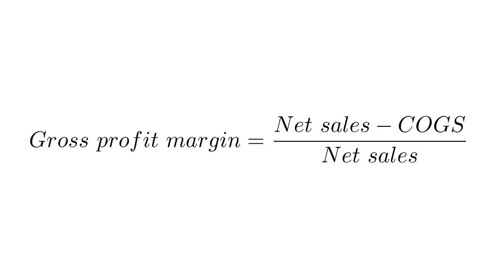

# 使用 Python 自动化您的数据管理规程

> 原文：<https://towardsdatascience.com/automate-your-data-management-discipline-with-python-d7f3e1d78a89?source=collection_archive---------21----------------------->

## 如何提高企业数据质量*和*简化您的工作流程


照片由[亚历山大·奈特](https://www.pexels.com/@agk42?utm_content=attributionCopyText&utm_medium=referral&utm_source=pexels)从[派克斯](https://www.pexels.com/photo/high-angle-photo-of-robot-2599244/?utm_content=attributionCopyText&utm_medium=referral&utm_source=pexels)拍摄

任何与数据打交道的人都知道数据质量的重要性。无论你是在 excel 中进行基本分析，还是用决策树预测销售趋势，糟糕的数据总会让你举步维艰。将责任推给过度工作的数据管理员和贪婪的数据消费者很容易，但最终还是要由数据专业人员来承担这两者之间的联系。那么，*您如何*提升您企业的数据管理能力并倡导更有效的分析呢？**自动化您的数据质量指标**。

许多人以多种方式定义了数据质量指标。我喜欢使用 **4 V 的**和 **4 C 的**来构建关于质量的对话，因为它们易于记忆、营销和可视化:

# 4 C 标准

> **完整性** —预期的数据有多少？“重要”栏是否已填写？
> 
> **一致性** —数据集之间的数据值是否相同？
> 
> 符合性 —数据是否符合规定的格式？
> 
> **好奇心** —利益相关者了解和/或参与了数据管理生命周期吗？

# 4 V 的

> **卷** —呈现多少信息？
> 
> **速度** —输入数据的频率是多少？数据处理和传播的频率如何？
> 
> **多样性** —存在哪些类型的数据？数据是结构化的、非结构化的还是半结构化的？
> 
> **真实性** —数据可信吗？有哪些内在的差异？

我用几个 Python 包来快速测量和社会化这些概念。熊猫有很多内置的方法来调查数据:我用的是[。](https://pandas.pydata.org/pandas-docs/stable/reference/api/pandas.DataFrame.describe.html)描述用条件格式查找模式。为了得到更可靠的报告，我使用了[熊猫概况](https://github.com/pandas-profiling/pandas-profiling)，它可以很容易地嵌入到 Jupyter 笔记本中或者保存到 HTML 文件中。

```
**import pandas as pd
import** pandas_profilingdf = read_csv("raw_data.csv")
df.describe()profile = pandas_profiling.ProfileReport(df)
profile.to_file("profile.html")
```

Matplotlib 和 seaborn 是绘制数据的很好的库。我最近一直在探索[如何创建快速、通用和引人入胜的可视化效果，可以很容易地嵌入到网站中。这里有一个很棒的](https://plot.ly/python/)[指南](/how-to-create-a-plotly-visualization-and-embed-it-on-websites-517c1a78568b)告诉你如何做到这一点。

# 企业中的数据规程

到目前为止，我们已经检查了一些陈腐的理论，以构建一个数据质量社会化的概念框架，并拥有可视化和呈现度量的基本工具。**是时候自动化了！**作为数据专业人员，我们通过揭露脏数据和阐明数据债务来教育和激励企业管理数据以进行有效分析，这一点至关重要。自动化可以通过保持透明度和问责制将最佳实践固化为*规程*。

我最近在做一个项目，主要关注数据摄取，计算按特许经营分组的 **全球产品**的**利润率。这项努力最初是为了更好地理解盈利能力，但很快就失去了控制。像大多数拥有全球足迹的企业一样，我的客户通过收购将运营成本最小化的公司(如分销商)来简化供应链，从而实现战略增长。**



IT 整合跟不上运营计划；以前计算利润的努力被证明是不成功的，因为不同的 ERP 系统(总共超过 15 个)，混乱的术语，高乘务员流动率等。

来自世界各地的数据管理员会派个人。csv 文件通过电子邮件发送给商业智能团队，在企业数据仓库中与发票销售数据手动合并。预先打包的报告被传递给领导层，附带无数的警告，被确信其他利益相关者在稀释数据的数据管理员破坏。**数据质量如此混乱**以至于基本利润分析的可见性都无法达到，更不用说持续了。精疲力竭的 B.I 小组需要一些帮助！

## 问题定式化

数据 ***完整性*** 和 ***符合性*** 给利润计算带来了重大问题:不完整的数据会以多种不同的格式从没有结构的管理者那里涌入。 ***流速*** 不一致，不经常从各个群体中流出，在那里名声不佳 ***准确性低*** *。*

最终，我将通过对利润计算进行高级分析来解释盈利能力和市场份额，从而为项目做出贡献。但是，如果没有有效的数据管理来计算数据科学管道中的利润率，我有很多机会来自动化一个有效的管道，并告知利益相关者数据质量。

## 战略

我们与数据管理员、所有者和治理委员会合作，仅确定利润计算所需的相关值，并按功能进行组织:产品到产品映射、成本、计量单位转换和附加属性。模板被复制以适应每个全球特许经销商，因此数据管理员只负责维护他们的资产。我们总共会有 50 多个文件！

我构建了一个 SharePoint 站点来托管文档存储库中的模板，它相当于 SharePoint 中的目录文件夹。然后，我创建了一个简单的 python 脚本来遍历“文件夹”以按功能连接文件，添加了额外的列，如“修改日期”、“初始文件名”和一个“完整性”度量，该度量计算相对于总数(按行)填充了多少列。超过 50 个文件减少到 4 个，代表每个功能数据资产。为了传播数据质量概念，我使用 pandas-profiling 按功能构建数据质量报告，并嵌入到 SharePoint 站点上。

B.I 团队厌倦了手动将平面文件上传到数据仓库。我使用了 [pyODBC](https://pypi.org/project/pyodbc/) 来建立到企业 SQL 服务器的连接，并且[只加载了](https://datatofish.com/insert-sql-server-python/)满足适当“完整性”分数的记录。

```
**import** pyodbc
conn = pyodbc.connect(**'Driver={SQL Server};'
                          'Server=<server>;'
                          'Database=<database>;'
                          'Trusted_Connection=yes;'**)

cursor = conn.cursor()sql_query = **"SELECT * FROM table_name"** cursor.execute(sql_query)
cursor.fetchall()sql_df = pd.read_sql(sql_query, conn)
```

一旦将记录加载到数据仓库中，我就可以查询记录，并通过交叉引用具有信息模式和列约束的数据来检查 ***一致性****；如果列的 VARCHAR 限制为 5，并且值的长度等于 10，则不会加载记录。我将这个“错误日志”存储在 SharePoint 站点上，供数据管理员在需要时参考。*

*最后，我们计算加载到 SQL Server 中的记录的利润，并将结果存储在 plotly 图形中，以提供关于特许经营业绩的即时反馈。一个漂亮的动画形象化描述了预期记录、已提供记录、已加载记录、有利润的记录以及一段时间内总收入的百分比*。*领导可以快速查看哪些数据管理员正在积极地贡献高质量的数据，哪些没有，以及哪里出现了主要的差异。最终结果是一个整合的平台，通过自动化管道实时更新数据质量指标，从而消耗特许经营的利润率。数据专业人员可以专注于将见解转化为行动，而不是“赶猫”。*

**

*来源:[牧羊猫](https://i2.wp.com/obrag.org/wp-content/uploads/2019/06/herding-cats.jpg?fit=574%2C325&ssl=1)途经[obrag.org](https://obrag.org/2019/06/highs-and-lows-from-the-california-democratic-state-convention/herding-cats/)*

## *结论*

*数据管理远不如分析和高级技术那么吸引人，但同样重要。如果管理不当，糟糕的数据将会分散您进行深刻分析的注意力，并困扰您企业中有才华的数据专业人员。虽然过于简单，但本文概述的方法阐明了人员、流程、数据和技术如何相互作用，以产生企业的整体指标。在跳到“有趣的东西”之前，通过关注数据管理生命周期的基础，项目团队可以快速地从吸收数据转向理解数据。*

*总的来说，我的贡献每年将为企业节省 400 多个小时的人工工作。此外，我们还促成了一种缺乏数据管理的文化，并在此过程中帮助整合了数据质量战略。开始自动化您的数据管理纪律！*