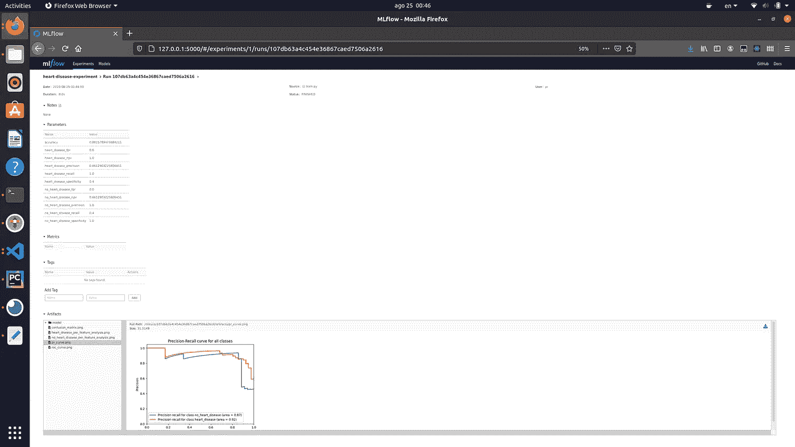
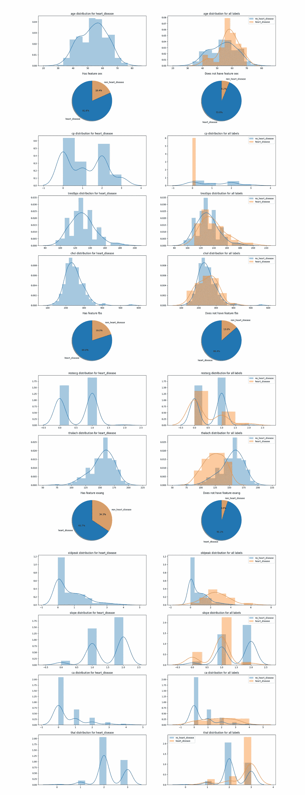

# 使用 TanD 自动化您的机器学习工作流程

> 原文：<https://towardsdatascience.com/automate-your-machine-learning-workflow-with-tand-7bb79ccad384?source=collection_archive---------61----------------------->

## 用几个终端命令训练和部署您的 ML 模型，根本不需要代码


来源:[https://cdn . pix abay . com/photo/2019/04/14/10/28/gears-4126485 _ 1280 . jpg](https://cdn.pixabay.com/photo/2019/04/14/10/28/gears-4126485_1280.jpg)。访问时间:2020 年 8 月 24 日

这是一个关于 TanD 的帖子，一个自动化机器学习工作流程的无代码框架。它的目的是展示如何使用它来自动化您的机器学习工作流任务，以将您的时间花在对您来说重要的事情上。

你可以在这里查看 [GitHub 回购](https://github.com/piEsposito/TanD)。

数据科学家、机器学习工程师或任何从事数据建模工作的人的工作流程都是重复的:在一些预处理的数据集上迭代地训练和部署模型，编写相同的函数来导入数据，一次又一次地拟合和部署一些机器学习模型，这很无聊，而且根本没有效率。

在这种背景下，开发了 TanD(训练和部署)框架来自动化这一机器学习工作流的一部分，以缓解数据科学家的生活，让他们把时间花在对他们来说重要的事情上。

# 它是如何工作的

类似于“Django for Machine Learning”，TanD 的主要思想很简单:通过一些终端命令和对一个`.json`文件的一些设置，用户能够训练一个 ML 模型(在 PyTorch 或 sklearn 上)，将它记录到`mlflow`中，自动创建一个 API 来参考它。只需几个命令，您甚至可以将它部署到 AWS 上，无需编写任何代码。

让你在工作中想怎么懒就怎么懒，而不会影响工作质量。在使用它的 CLI 生成项目模板之后，您可以插入您的数据集，让它为您完成工作，或者指定复杂的 train 函数和 API 端点。

我们现在将展示如何使用 TanD 来自动化 UCI 心脏病数据集上从训练到部署的 ML 工作流。

# 设置项目

我们首先必须安装 TanD，这很容易做到:

```
pip install train-and-deploy
```

如果您想遵循本教程的部署部分，您还应该安装 [AWS CLI](https://docs.aws.amazon.com/cli/latest/userguide/install-cliv2-linux.html) 、 [ElasticBeanstalk CLI](https://docs.aws.amazon.com/pt_br/elasticbeanstalk/latest/dg/eb-cli3-install.html) ，并设置您的 AWS CLI 凭证。不要担心，我们在这里展示的一切都可以用自由层来完成，尽管 API 将是可伸缩和有弹性的。为此，您也可以遵循 [AWS 文档](https://docs.aws.amazon.com/en_us/cli/latest/userguide/cli-configure-quickstart.html#cli-configure-quickstart-creds)中的说明。

要创建一个 TanD 项目，必须在终端上运行命令。我们将使用 PyTorch 模板，尽管您可以使用 sklearn one 来跟踪所有内容:

```
tand-create-project --template pytorch-structured-classification## or if you prefer: tand-create-project --template sklearn-structured-classification
```

这将在文件夹上创建项目文件，并加载一个默认数据集(我们将使用它)，这就是上面提到的 UCI 心脏病。我们现在将逐一查看这些文件:

```
├── app.py
├── config.json
├── data
│   └── data.csv
├── Dockerfile
├── env_files
│   ├── app.env
│   ├── docker_app.env
│   └── train.env
├── lib
│   ├── __init__.py
│   ├── model.py
│   └── preprocess.py
├── mlflow-server.sh
├── requirements.txt
├── test_app.py
└── train.py
```

## 数据

数据文件夹包含将要使用的数据集。阳光下无新事。

## 配置

`config.json`文件遵循以下结构:

其中训练子字典包含与数据集和网络架构相关的训练参数。注意，我们必须指定包含标签的列，并在`labels`列表中按顺序命名它们。`to_drop`包含在定型之前应该从数据集中删除的所有列。

`mlflow`子目录包含与实验的`mlflow`记录相关的参数。

## 环境文件

`env_files`文件夹包含用于模型训练和部署的环境变量源文件。`train.env`为训练期间实验的`mlflow`记录设置变量；

```
MLFLOW_TRACKING_URI=sqlite:///database.db
MLFLOW_DEFAULT_ARTIFACT_ROOT=./mlruns/
```

两者都可以设置为本地路径或云托管路径。为了简单起见，我们将保留它们的默认值，但是注意，为了可伸缩性，您应该设置自己的`mlflow` db 和存储路径。

`app.env`包含与服务于模型的 API 相关的环境变量:

```
MLFLOW_TRACKING_URI="sqlite:///database.db"
MLFLOW_DEFAULT_ARTIFACT_ROOT="./mlruns/"
API_TOKEN="TOKEN123"
MODEL_STAGE="Production"
```

除了出现在`train.env`上的那些，我们在这里有模型的阶段，它将由`mlflow`加载器在生产中获取，还有一个令牌，它必须作为请求参考 API 的`TOKEN`头传递。

如果用户想在本地运行一个`Docker`，那么`docker_app.env`在一个单独的文件中包含变量。

## Dockerfile 文件

当然，它包含了基于 FastAPI 构建服务于模型的图像的指令。

## 解放运动

Lib 包含模型架构(或者，在`sklearn`项目中，一个将`config.json`中选择的模型映射到`sklearn`模型的解析器)。

还包含`preprocess.py`，具有`preprocess`功能。在训练之前，我们在数据集中放置任何应该完成的预处理操作，这比仅仅删除列更复杂(或者我们可以在配置上保持在`to_drop`)。我们今天不会使用定制的预处理程序。

最后是主要文件:

## 火车

在执行任何所需的预处理操作后，`train.py`文件使用配置根据数据路径给出的数据训练模型。它将模型存储在`mlflow`上，这样就可以在生产中读取它，以及许多指标，如准确性、AUC-ROC、AUPR、精确度、召回、NPV 等...

如果您运行多次，它将保存不同的运行及其指标，您将能够在`mlflow` UI 中设置生产模型，只需运行:

```
bash mlflow-server.sh
```

这个脚本还从预处理的数据中创建了一个请求模型，存储在`request_model.json`中。该文件既用于测试模型，也用于新请求的验证和重新排序。

## 应用

TanD 模型模板包括一个简单的 FastAPI 应用程序，用于服务模型，受`$API_TOKEN`保护。它包括端点:

*   `/`进行健康检查；
*   `/update-model`用于通过请求使 API 在`mlflow`指定的后端获取最新的生产阶段模型—需要`$API_TOKEN`；和
*   `/predict`接收特征并返回模型预测—需要`$API_TOKEN`。

## 试验

为了确保一切正常，包括对 API 所有端点的测试。设置好适当的环境变量后，只需运行:

```
pytest
```

如果通过了，你就可以走了。

我们现在准备继续训练模型，测试 API，最后部署它。

# 训练模型

要训练模型，只需运行:

```
source env_files/train.env && python train.py
```

它将执行操作并将其记录到`mlflow`。您可能希望看到以下结果:

```
bash mlflow-server.sh
```

您将看到带有以下内容的用户界面:



注意，除了度量标准，它还存储了大量的度量标准和图表来帮助您评估模型。来源:我卑微的机器打印。

训练脚本还保存对预测的每个要素的分析，以便可视化给定每个分类要素的预测比例和每个类的连续要素的分布。(这有助于检查模型是否有任何“欺骗”的特征，并对学习有一些解释)。

对于心脏病预测为阳性的情况，该图像将是:



大量的图表有助于评估模型和理解它学到了什么。

你也可以在那里看到混淆矩阵，PR 和 ROC 曲线。

之后你可能会想

```
source env_files/app.env && pytest
```

断言一切正常。

一旦我们训练了这个模型，我们就能够开始探索 API，用`Docker`运行它，甚至用几个终端命令将它部署到 AWS。

# 运行 API

我们现在将展示运行一个 TanD 项目 API 的三种方法:本地，通过`Docker`和部署到 AWS ElasticBeanstalk。

## 本地运行

要在本地运行 API，您可以在具有适当要求的环境中运行:

```
uvicorn app:app --reload --host 0.0.0.0 --port 8000
```

这样，API 就可以在您的本地网络上打开了。你可以用一个`curl`帖子请求来测试一下:

```
curl --header "Content-Type: application/json" \
  --header "TOKEN: $API_TOKEN" \
  --request POST \
  --data '{"age":1,"sex":1,"cp":1,"trestbps":1,"chol":1,"fbs":1,"restecg":1,"thalach":1,"exang":1,"oldpeak":1,"slope":1,"ca":1,"thal":1}' \
  http://localhost:8000/predict
```

## 码头运行

您可能希望通过`Docker`运行它，这是一种可用于在云服务的通用虚拟机上部署它的方法。在 TanD 项目的根上构建它非常简单:

```
docker build . -t tand-app:v1
```

当您运行它时，一定要传递适当的环境文件和 API 使用的变量。您可以将它们设置在`env_files/docker_app.env`:

```
docker run -p 8000:8000 --env-file env_files/docker_app.env tand-app:v1
```

同样，您可以使用相同的命令来测试它，只需记住为请求使用正确的令牌:

```
curl --header "Content-Type: application/json" \
  --header "TOKEN: $API_TOKEN" \
  --request POST \
  --data '{"age":1,"sex":1,"cp":1,"trestbps":1,"chol":1,"fbs":1,"restecg":1,"thalach":1,"exang":1,"oldpeak":1,"slope":1,"ca":1,"thal":1}' \
  http://localhost:8000/predict
```

## 使用 AWS ElasticBeanstalk 部署它

TanD 还帮助您在 AWS EB 上部署它，这是一个很好的方法，因为它具有弹性和可伸缩性，同时仍然易于使用(通过我们的助手)。如果您按照上面的建议设置了 AWS CLI 凭据，安装了它，并安装了 ElasticBeanstalk CLI，那么现在就可以开始了。

要准备在 AWS 上部署您的 TanD 项目，请在项目根目录下运行:

```
tand-prepare-aws-eb-deployment --init-git
```

我们传递这个`--init-git`标志，因为 ElasticBeanstalk 使用了来自`.git`目录的一些信息，以便在部署期间将项目上传到 AWS S3。这样，在部署之前，TanD 创建了一个 g it 存储库，并提交了使其工作的所有内容。

如果您已经初始化了一个 git 存储库，您不必传递那个标志，只需记住添加并提交所有内容。

该脚本将创建一个脚本来部署 TanD 项目根目录上的应用程序、`deploy-aws-eb.sh`和`.ebextensions`目录，其中填充了一些用于部署的默认`.config`文件，遵循以下结构:

```
├── .ebextensions
    ├── options.config
    ├── cron.config
    └── scaling.config
```

*   `options.config`为项目设置环境变量，同`app.env` — `mlflow`后端、模型阶段、API token。这就是环境变量传递给 EB 的方式。
*   `cron.config`在部署的应用程序的每个实例上创建一个 cron 作业来每日查询 API `update-model`端点，因此它从`mlflow`后端获取最新的生产阶段模型。这样，如果您运行不同的实验并想要部署不同的模型，您可以通过`mlflow` UI 进行，它将在生产中更新。
*   `scaling.config`为您的 API 设置缩放配置。我们将这些参数设置为我们的应用程序可以拥有的最小和最大实例数、实例类型和缩放标准。我们将最后一个默认为延迟，但是您可以自由地这样做。

然后，我们可以通过一个简单的:

```
bash deploy-aws-eb.sh
```

部署大约需要 5 分钟。之后，您可以使用以下命令检查链接:

```
eb open
```

然后用相同的 curl 命令测试它(记住正确设置链接和 API 令牌):

```
curl --header "Content-Type: application/json" \
  --header "TOKEN: $API_TOKEN" \
  --request POST \
  --data '{"age":1,"sex":1,"cp":1,"trestbps":1,"chol":1,"fbs":1,"restecg":1,"thalach":1,"exang":1,"oldpeak":1,"slope":1,"ca":1,"thal":1}' \
  http://YOUR_LINK_GOES_HERE/predict
```

至此，我们结束了项目教程。

# 结论

作为一个结论，我们可以看到，TanD 允许您非常快速地训练和部署您的 ML 模型，只需要一些设置和终端命令，根本不需要任何代码，但是让您可以自由地适应和更改项目模板。

为了训练和部署您的项目，您只做了 6 个终端命令并检查了`config.json`上的一些设置:

```
tand-create-project --template pytorch-structured-classification## check config.json for your datasetsource train.env && python train.py
source app.env && pytest## run API as you will:tand-prepare-aws-deployment --init-git
bash deploy-aws-eb.sh
```

有了 TanD，你就可以自动化你的 ML 工作流程的很大一部分，节省你的时间去做对你来说重要的事情，或者只是偷懒和开心。

如果你喜欢这个帖子，考虑给它一些掌声或者主演 [GitHub repo](https://github.com/piEsposito/TanD) ，它有助于项目获得更多的可见性。

如果你想和我谈谈这个项目，有一些见解，只是想聊天的批评，你可以在 LinkedIn 上 ping 我或者在回购中创建一些问题。

# 参考资料:

[](https://github.com/piEsposito/TanD) [## piEsposito/TanD

### TanD 是一个简单、无代码、灵活和可定制的框架，用于自动化机器学习工作流。用和…

github.com](https://github.com/piEsposito/TanD) [](https://mlflow.org/) [## MLflow -机器学习生命周期的平台

### 机器学习生命周期的开源平台 MLflow 是一个开源平台，用于管理机器学习生命周期

mlflow.org](https://mlflow.org/) [](https://www.kaggle.com/ronitf/heart-disease-uci) [## 心脏病 UCI

### https://archive.ics.uci.edu/ml/datasets/Heart+Disease

www.kaggle.com](https://www.kaggle.com/ronitf/heart-disease-uci)