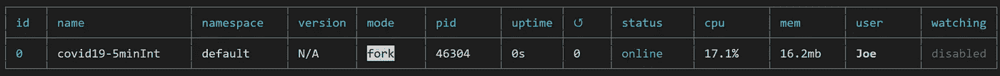
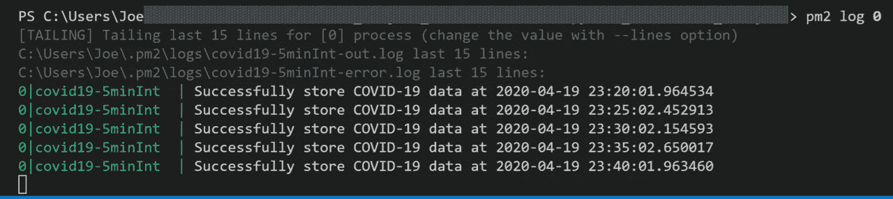
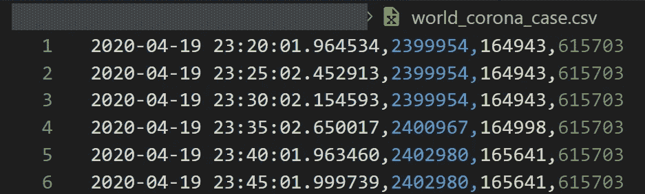

# 使用 Process Manager 2 (PM2)自动化您的 Python 脚本

> 原文：<https://towardsdatascience.com/automate-your-python-script-with-pm2-463238ea0b65?source=collection_archive---------3----------------------->

## 一个重要的 PYTHON 技巧

## 以新冠肺炎数据收集为例的分步指南


插图作者:金彩云

在数据科学中，您可能需要定期运行或处理您的 Python 脚本，尤其是数据收集，以使您的工作流程保持最新，因为它直接关系到您的结果准确性。您可能有一个 Python 脚本，每隔 1、2、…、 *xx* 分钟/小时运行一次，或者每天早上 6 点、晚上 9 点、 *yy* 点/晚上运行一次。而且每次都自己做又累又无聊。

## 这就是为什么自动化或计划你的脚本是重要的！！

当你在网上搜索它的时候，可能已经有几篇文章在讨论它了。如果您使用的是 Windows，您可以考虑使用一个 **Windows 任务调度器**，您可以使用它来调度您的 Windows 系统运行任何 execute(。exe)或批处理(。bat)文件。虽然它有一个好看的用户界面，但有些人仍然不太喜欢它。(来源 [*此处*](https://www.reddit.com/r/sysadmin/comments/8szffr/its_not_just_me_right_task_scheduler_sucks_so_bad/) )

或者如果你使用的是 macOS 或者 Linux，你可以考虑使用一个 **Crontab** 。但是当您有太多的脚本或作业需要管理/记录时，您可能会发现很难管理。

那么，让我们检查一下这个替代方案>>>

# PM2 是另一个选择！

[**PM2**](https://github.com/Unitech/pm2) 是为 Node.js 应用构建的**流程管理器**。

根据我使用 Node.js 进行 web 开发的经验，我不得不使用 *CRON* 来调度和管理几个 Node.js 应用程序，这给了我一段非常艰难的时间，直到我认识了 **PM2** ！！从那以后我的生活好多了。PM2 让我的应用程序永远运行，并在我更新应用程序时自动重新加载。此外，我可以在任何应用程序上使用 **CRON** 或**重启延迟**手动安排重新加载时间，它可以在所有操作系统上完美运行！！

## 嘿等等…，PM2 不是仅限于 Node.js 应用吗？

**不！**没错， **PM2** 意在服务 Node.js 应用，但不限于 Node.js 运行时。在我使用 **PM2** 一段时间后，我意识到它可以用来管理任何编程脚本/运行时！从那时起，我用 Python 试了一下，效果很好！

在本文中，我将展示一个例子，展示如何使用 **PM2** 来调度和自动化您的 Python 脚本！！

# 我们开始吧！

## PM2 装置

安装也可以在一条线上完成，您可以使用`npm`或`yarn`。

```
$ **npm install pm2@latest -g**
# OR 
$ **yarn global add pm2**
# Done!
# Check if program runs.
$ **pm2 -v**
vx.x.x
```

如果你在 Windows 10 上安装了 PM2，第一次运行时，你可能会遇到一个错误，因为当前用户有一个未定义的执行策略。您可以通过以下代码修复它:

```
$ **Set-ExecutionPolicy -Scope CurrentUser -ExecutionPolicy Unrestricted**
```

# 使用 PM2 运行 Python 脚本

安装完成后，您可以使用`$ **pm2 start** <script name>`命令通过 PM2 启动任何 python 脚本。

如果您有多个作业要运行，我还建议您给每个作业起一个有意义的名字，这样您以后就不会混淆了。可以用`**--name** <name>`给每个作业命名。默认情况下，当你启动任何`.py`文件时，PM2 会用 Python 运行你的脚本。但是，如果您的机器上安装了多个版本的 Python，您可以使用`**--interpreter** <interpreter name: node, python, python3, python3.x, ...>`选择特定的 Python 版本。

总的来说，启动 python 脚本的命令如下所示:

```
$ **pm2 start** job1.py --**name** job1 --**interpreter** python3
```

根据 PM2 的默认设置，它会试图让你的应用程序永远运行，这意味着你的脚本将在完成后立即自动重启。

嗯，对一台机器来说可能太多了！因此，有两种方法可以将 Python 脚本设置为定期运行 PM2: 1 .使用重启延迟 2。使用 cron

## 通过“重启延迟”自动重启

您可以使用`**--restart-delay** <xxxx ms>`选项将 Python 脚本设置为定期运行。这样，在 Python 脚本完成工作后，它将等待`xxxx`毫秒，直到下一次重启。

例如，如果您希望您的脚本在每次作业后每 10 秒重启一次，您通常可以在 Python 中使用`while` & `time.sleep`，如下所示:

```
**while True:**
...
   **time.sleep(10)**
```

有了 PM2，你不再需要`while`循环，你可以保持你的代码干净，把重启工作留给 **PM2** 。在每个作业后以 10 秒钟的睡眠时间运行脚本的命令如下所示:

```
$ **pm2 start job1.py --name job1-10s-delay --interpreter python3 --****restart-delay 10000**
```

## 使用“cron”自动重启

您还可以使用 cron 选项通过`**--cron** <'cron pattern'>`来调度您的 Python 脚本。使用`--no-autorestart`禁用 PM2 自动重启选项也很重要，这样它就不会在完成一个任务后自动重启，只会遵循 cron 表达式。

例如，每 1 小时(在第 0 分钟)重新启动脚本的命令如下所示:

```
$ **pm2 start .\testPm2.py --cron '0 * * * *' --no-autorestart**
```

**关于 cron** 的一个提示:如果你是第一次接触 **cron** 。它是 Unix 操作系统中基于时间的作业调度程序。 **cron** schedule 表达式允许您让您的程序在特定的时间定期重启。cron 的格式是`'<minutes 0:60> <hour 0:24> <day of month 1:31> <month 1:12> <day of week 0:6>'.`我推荐你可以尝试通过这个网站创建自己的 cron 表达式:[这里](https://crontab.guru/#0_*_*_*_*)。

让我们结束这无聊的部分，让我们一起经历一个真实世界的例子！

# 真实世界的例子

**抓取全球新冠肺炎数据**

假设您想每隔 5 分钟从 Worldometer 监控并存储新冠肺炎病例的数据。使用[**beautiful soap 4**](https://www.crummy.com/software/BeautifulSoup/bs4/doc/)就可以轻松做到。例如，我的 Python 脚本([*getcovid 19 data . py*](https://gist.github.com/JoeThunyathep/8c2a8ba0681c46dc6298cf62e41262bc))将允许您从 Worldometer 获取新冠肺炎案例数据，并将数据存储到 *CSV* 文件( *world_corona_case.csv* )。

getCovid19Data.py(使用 bs4 抓取新冠肺炎的 Python 脚本)

而不是在脚本中使用`while`循环和`time.sleep()`或者使用常规的 cron 每 5 分钟重启一次脚本。

您可以使用 **PM2** 和**重启延迟** *(5 分钟=300000 毫秒)*来完成:

```
$ **pm2 start getCovid19Data.py --name covid19-5minInt** **restart-delay** **300000**
```

或者，您可以使用 **PM2** 和**cron***(5min = ' */5 * * * *)*来完成

```
$ **pm2 start getCovid19Data.py --name covid19-5minInt --cron '*/5 * * * *' --no-autorestart**
```

就是这样！现在，Python 脚本将每 5 分钟运行一次。现在您可以用这个命令检查您的日志

```
**$ pm2 l**
```

将显示列表。您可以在这里看到所有使用 PM2 运行的作业，这些作业将包含所有在后台运行的 Node.js 应用程序或 Python 脚本。



PM2 表显示了所有应用程序的列表

您可以使用命令`pm2 log <id or name>`查看特定作业的日志。在本例中，您可以使用以下命令:

```
$ pm2 log 0
```



作业 id 为“0”的 PM2 日志

从日志状态可以看到，Python 脚本每 5 分钟存储一次新冠肺炎数据，剩余的[~1.6 到 2.5 秒]是 Python 脚本每次请求数据并保存添加更新数据到`CSV`文件的时间。现在，让我们检查下面结果`CSV`文件中的结果。PM2 很好用！



将 PM2 与 cron 一起使用时，**getcovid 19 data . py s**script 产生的 CSV 结果

## 一些其他有用的 PM2 命令

当你用 PM2 运行多个进程时。您可能希望对每个项目进行不同的操作。以下是我最常用的一些有用命令的列表。

```
$ **pm2 stop <name or id>** #stop specific process$ **pm2 restart <name or id>** #restart specific process$ **pm2 flush <name or id>** #Clear logs of specific process$ **pm2 save** #save list of all application$ **pm2 resurrect** #brings back previously saved processes
$ **pm2** **startup** #Command for running PM2 on startup
```

## 作者单词

我希望您喜欢这篇文章，它可以帮助您更容易地安排 Python 脚本，并将其应用到您的 Python 工作流中。如果您有任何问题、意见或建议，请随时与我分享。

关于我&查看我所有的博客内容:[链接](https://joets.medium.com/about-me-table-of-content-bc775e4f9dde)

**平安健康！**
**感谢阅读。👋😄**