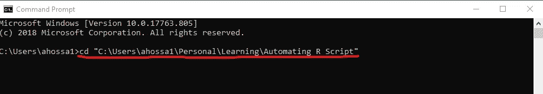
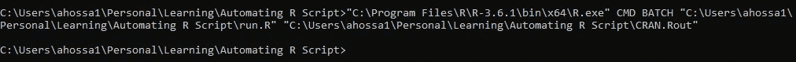
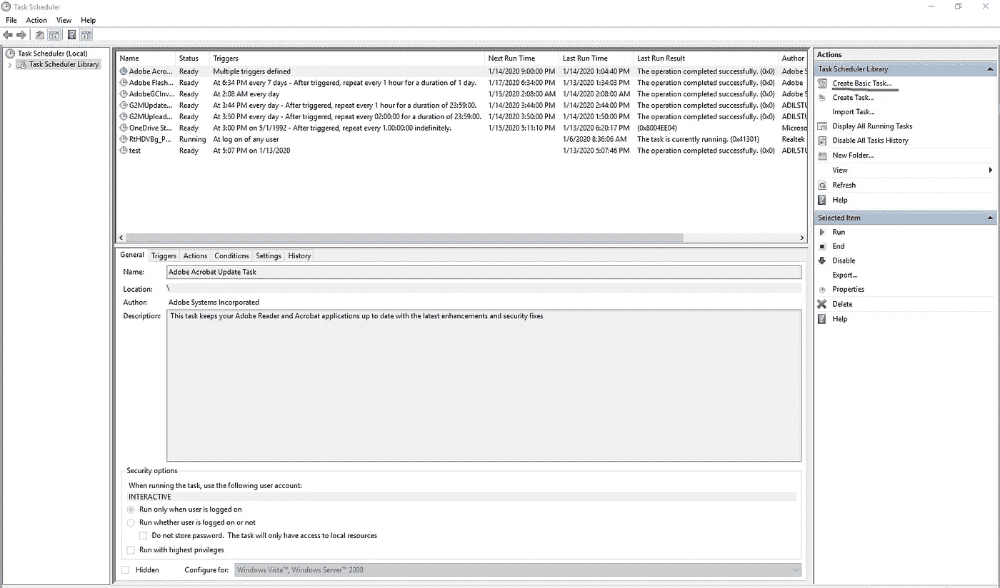
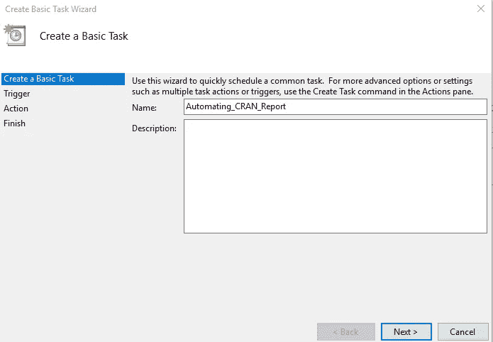
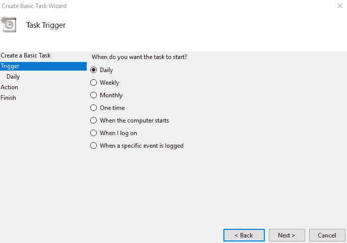
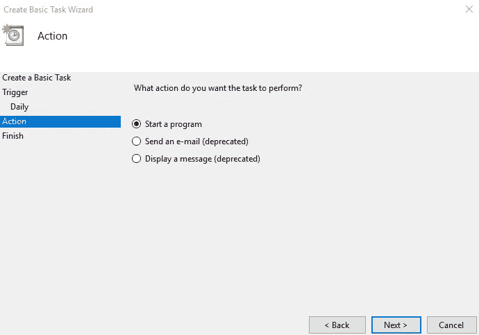
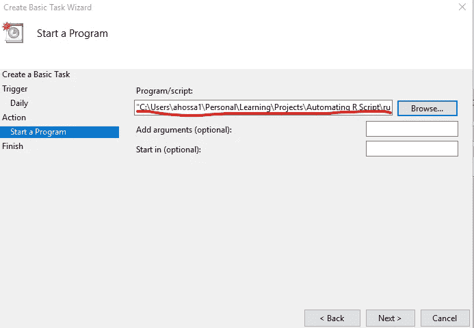
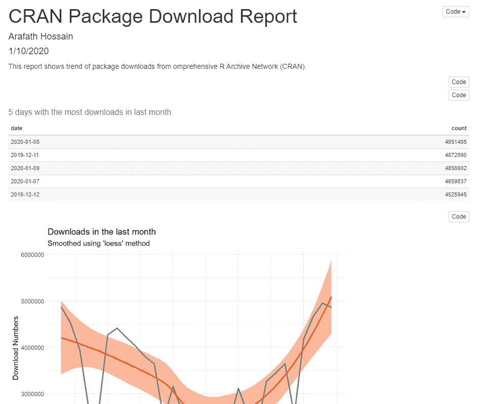

# 自动化您的重复性报告！

> 原文：<https://towardsdatascience.com/automate-your-repetitive-reports-5ee60a53bda2?source=collection_archive---------14----------------------->

## 自动化 R 脚本


来源:[https://thumbs . gfy cat . com/impressive instructiveiberian emerald lizard-small . gif](https://thumbs.gfycat.com/ImpressiveInstructiveIberianemeraldlizard-small.gif)

# 什么是 R 脚本自动化，为什么？

在大多数用例中，R 用于分析数据、运行统计测试和构建模型。在这样做的过程中，数据科学家通过编写代码不断地与 R 进行交互，并从这些交互中产生结果。最终，这些结果被存储、共享或以报告的形式呈现。但是，如果您必须每天或以其他类型的定期间隔复制报告，该怎么办呢？嗯，你总是可以调出 R 脚本，重新运行脚本。但是，如果它是自动完成的，而不需要您在中间启动 R 和运行脚本，不是更好吗？

在本文中，我们将知道如何做到这一点！

# 我们在这里要做的事情的大纲

概括地说，本文有两个部分:

首先，在本文中，我们将创建一个使用实时数据的报告，即定期更新的数据源。

其次，一旦创建了报告，我们将自动执行每天重新创建报告的过程，以捕获更新的数据。

# 第 1 部分:创建报告:

因为这篇文章的目标是自动复制一个已经构建好的报告，所以我已经创建了一个报告并发布在这里:【http://rpubs.com/arafath/CRAN_Report。

请随意访问该报告，并在您的工作站中重新创建它。你可以给 RMarkdown 脚本起个和我一样的名字( *'CRAN_Download_Report。Rmd'* )并将其保存在您想要保存*的相同位置。存储 bat* 文件和其他输出。

该报告中所做的如下所示:

*   从综合存档网络(CRAN)调用 API 下载包的每日和每周下载计数，
*   加载 R 中的数据，
*   计算一些基本的统计数据，
*   可视化数据
*   生成包含基本统计数据和视觉效果的报告(html 格式)。

**使用的数据:**

CRAN 有一个 API 调用，我们可以使用它来获得特定时间内任何包被下载的总次数。我们将使用名为 *cranlogs* 的包来调用 api。

# 第 02 部分:自动化报告复制

一旦我们有了一个可以产生我们想要的结果的 R 脚本，复制工作流程看起来如下:

*   打开 R 控制台或一些 IDE
*   加载所需的 R 脚本
*   运行脚本以产生结果

在这一步中，我们将知道如何告诉 R 自动完成上述所有步骤**。这样，R 也将完成第 01 部分中提到的所有步骤。**

****自动化是如何工作的:****

**为了自动重新运行 R 脚本，我们将使用 Windows 任务调度程序(WTS)。使用任务计划程序，用户可以要求 windows 执行批处理文件(。蝙蝠)。批处理文件包含一系列可以由命令行解释程序执行的命令。**

**我们将创建一个批处理文件，每天自动运行一个 R 脚本。在 R 脚本中，它被指示调用。创建报告的 Rmd 文件。**

## **创建 R 脚本来运行。Rmd 文件**

**您可以在 R 脚本中复制并粘贴以下代码，并将其另存为 *run。R* (我的 r 脚本文件名):**

```
# Loading libraries [install the libraries before if not already installed]
library(knitr)
library(rmarkdown)
library(mailR)# Knits rmd file (.Rmd is saved in the working directory)
knit('CRAN_Download_Report.Rmd')# Creates the html output
render("CRAN_Download_Report.md")# sending email notification
send.mail(from = "youremail@gmail.com",
      to = c("testemail@gmail.com"),
      cc = 'youremail@gmail.com',
      replyTo = c("Reply to someone else <youremail@gmail.com>"),
      subject = "Report update status",
      body = "Daily report on CRAN package download is updated!",
      smtp = list(host.name = "smtp.gmail.com", port = 587, user.name = "youremail", passwd =    "password", tls = TRUE),
      authenticate = TRUE,
      send = TRUE)
```

**这个 R 脚本所做的基本上是编织 rmd 文件并生成一个 html 报告，将它保存在工作目录中并发送一个电子邮件通知。**

## **从窗口的命令外壳运行 R**

**在创建批处理文件之前，我们可以从命令终端手动运行我们的 R 脚本，并检查它是否按预期运行。**

****设置目录****

**打开 windows 命令外壳。在窗口中搜索“cmd”或“命令提示符”并打开它。它将打开黑色的命令外壳。**

**现在，使用“cd”命令将命令目录更改到您想要的位置，后跟您想要的文件位置(ref: image01)。**

****

**图片 01**

****从命令行运行 R****

**我们将使用的命令结构如下: <r.exe location="">CMD BATCH <.r file="" location=""/></r.exe>**

**这里，**

*   ***R.exe 位置*是你的 R 可执行文件所在的文件位置。执行这个文件应该会打开 R 控制台。**
*   ***。r 文件位置*是保存 r 脚本的文件位置，该脚本将调用。Rmd 文件。**
*   ***文件保存位置*是您想要保存执行输出的位置。**

**为了简单起见，我使用与 R 工作目录和位置相同的文件位置来保存任何输出。**

**在我的案例中，这些是确切的位置:**

```
R.exe location = "C:\Program Files\R\R-3.6.1\bin\x64\R.exe" 
.R file location = "C:\Users\ahossa1\Personal\Learning\Automating R Script\run.R" 
file saving location = "C:\Users\ahossa1\Personal\Learning\Automating R Script\test.Rout"
```

**这是我电脑中的最后一行代码(ref: image02):**

```
"C:\Program Files\R\R-3.6.1\bin\x64\R.exe" CMD BATCH "C:\Users\ahossa1\Personal\Learning\Projects\Automating R Script\run.R" "C:\Users\ahossa1\Personal\Learning\Projects\Automating R Script\CRAN.Rout"
```

****

**图片 02**

**一旦您输入命令(image02)并执行它，它应该运行 R 脚本，该脚本将编织 rmarkdown 文档并保存报告。您应该还会收到一封带有通知的电子邮件！**

## **使用命令行指令创建批处理文件**

**我们可以将命令行指令(image02)保存为. bat 文件并保存。然后，在我们需要重新创建报告的任何时候，我们都可以执行。bat 文件，它会自动调用命令行界面并执行 R 脚本。**

**为此，请打开一个文本文件(。txt)。将 Windows shell 命令粘贴到。txt 文件，用扩展名*保存。球棒*。**

**在我的电脑里，我把它命名为“run.bat”。**

> *****在不需要定期重新创建报表的情况下，可以使用这个。bat 档。你所要做的就是双击(或单击)。bat 文件和报告将使用更新的数据生成。*****

## **使用 Windows 任务计划程序自动执行命令行活动**

**现在我们将要求我们的计算机自动调用。bat 文件定期。**

1.  **在 Windows 搜索栏中搜索“任务计划程序”并打开应用程序。下面是它在我的电脑上的样子**

****

**图片 03**

**2.选择*创建基本任务*(图 03 红色标记)**

**3.为任务命名**

****

**图片 04**

**4.下一步，选择一个触发器。我选择了*日报*。**

****

**图片 05**

**5.转到下一步并选择开始时间。**

****

**图片 06**

**6.转到下一步，选择*启动程序*作为操作。**

****

**图片 07**

**7.下一步，加载程序/脚本(。bat 文件)。**

****

**图片 08**

**瞧！！我们完成了！**

**现在每天下午 3:30。下面的 CRAN 包下载报告将被创建，并将发送电子邮件通知！**

****