# 使用 BioBert 从 Spark NLP 中的文本自动检测药物不良事件(ADE)

> 原文：<https://towardsdatascience.com/automated-adverse-drug-event-ade-detection-from-text-in-spark-nlp-with-biobert-837c700f5d8c?source=collection_archive---------20----------------------->

> 在 Spark NLP 和 BioBert 的帮助下，第一个端到端预训练模型和管道可大规模检测药物不良反应。

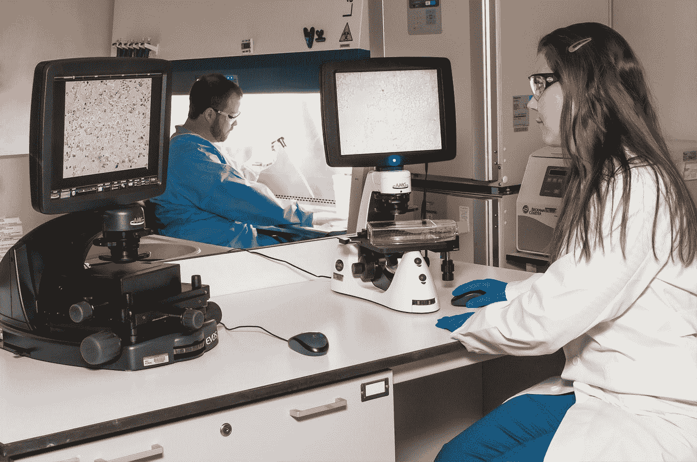

[国家癌症研究所](https://unsplash.com/@nci?utm_source=medium&utm_medium=referral)在 [Unsplash](https://unsplash.com?utm_source=medium&utm_medium=referral) 上拍摄的照片

药物不良反应(ADRs)或药物不良事件(ADEs)对患者具有潜在的巨大危险，是发病率和死亡率的主要原因 [[1]](http://Pirmohamed et al.2004] Munir Pirmohamed, Sally James, Shaun Meakin, Chris Green, Andrew K Scott, Thomas J Walley, Keith Farrar, B Kevin Park, and Alasdair M Breckenridge. 2004\. Adverse drug reactions as cause of admission to hospital: prospective analysis of 18,820 patients. BMJ, 329(7456):15–19.) 。许多药品不良反应很难被发现，因为它们发生在特定条件下的特定人群中，并且可能需要很长时间才能暴露。医疗保健提供者在销售产品前进行临床试验以发现药物不良反应，但通常数量有限。因此，需要上市后药物安全性监测来帮助发现药物上市后的不良反应[【2】](https://www.aclweb.org/anthology/C16-1084/)。

最近，医疗报告[【3】](http://H Gurulingappa and J Fluck. 2011\. Identification of adverse drug event assertive sentences in medical case reports. In 1st international workshop on knowledge discovery and health care management (KD-HCM) co-located at the European conference on machine learning and principles and practice of knowledge discovery in databases (ECML PKDD), pages 16-27.)或社交网络数据[【4】](http://Rachel Ginn, Pranoti Pimpalkhute, Azadeh Nikfarjam, Apur Patki, Karen Oconnor, Abeed Sarker, Karen Smith, and Graciela Gonzalez. 2014\. Mining Twitter for Adverse Drug Reaction Mentions: A Corpus and Classification Benchmark. In proceedings of the 4th Workshop on Building and Evaluating Resources for Health and Biomedical Text Processing (BioTxtM).)等非结构化数据已被用于检测包含 ADR 的内容。发表在科学生物医学文献中的病例报告非常丰富，并且生成迅速。社交网络是非结构化格式的冗余数据的另一个来源。虽然包含 ADR 的单个 tweet 或脸书状态可能没有临床意义，但大量的这些数据可能会暴露严重或未知的后果。

假设需要从各种非结构化的资源(如推特、新闻、网络论坛等)中收集 ADR。)以及科学论文(即 PubMed、arxiv、白皮书、临床试验等。)，我们希望建立一个端到端的 NLP 管道来检测文本是否包含可能的 ADR，并提取 ADR 和提到的药物实体。

# 规模上的 NLP:Spark NLP

Spark NLP 是一个构建在 Apache Spark ML 之上的自然语言处理库，每天被下载到 [10K，总共有 150 万次](https://pepy.tech/project/spark-nlp)。它是发展最快的 NLP 库之一，支持 Python、R、Scala 和 Java 等流行的编程语言。它为机器学习管道提供了简单的、高性能的&精确的 NLP 注释，可以在分布式环境中轻松扩展。

Spark NLP 提供了 330 多种经过预训练的管道和模型，支持超过 46 种语言。它支持最先进的转换器，如 BERT、XLNet、ELMO、ALBERT 和通用句子编码器，可以在集群中无缝使用。它还提供了标记化、词性标注、命名实体识别、依存解析、拼写检查、多类文本分类、多类情感分析以及更多 [NLP 任务](https://github.com/JohnSnowLabs/spark-nlp#features)。如需更多信息和 Colab 笔记本样品，我们强烈建议您查看我们的[车间报告](https://github.com/JohnSnowLabs/spark-nlp-workshop/tree/master/tutorials/Certification_Trainings)。

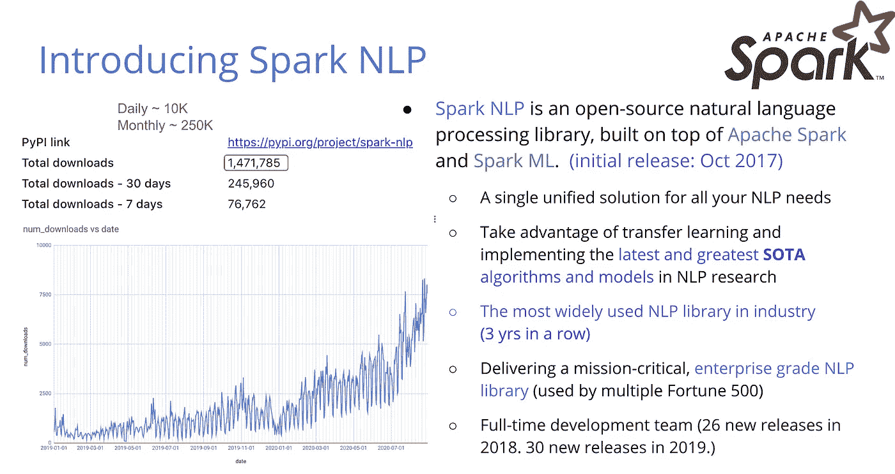

# Spark NLP 医疗图书馆中的 ADRs 模型

我们首先进行了深入的研究，以收集 NLP 研究人员和医疗保健专业人员使用的所有可用的 ADR 数据集(PsyTAR、CADEC、Drug-AE、TwiMed ),我们汇编了一个包含 40K 个样本和 10K ADR 阳性句子的数据集。然后我们在 Spark NLP 中训练了几个[文本分类](/text-classification-in-spark-nlp-with-bert-and-universal-sentence-encoders-e644d618ca32)和[命名实体识别(NER)](/named-entity-recognition-ner-with-bert-in-spark-nlp-874df20d1d77) 模型，使用 [BioBert](https://github.com/dmis-lab/biobert) 语言模型，并作为[预训练模型和流水线](https://github.com/JohnSnowLabs/spark-nlp-models)随 Spark NLP Enterprise 2.6.2 发布。

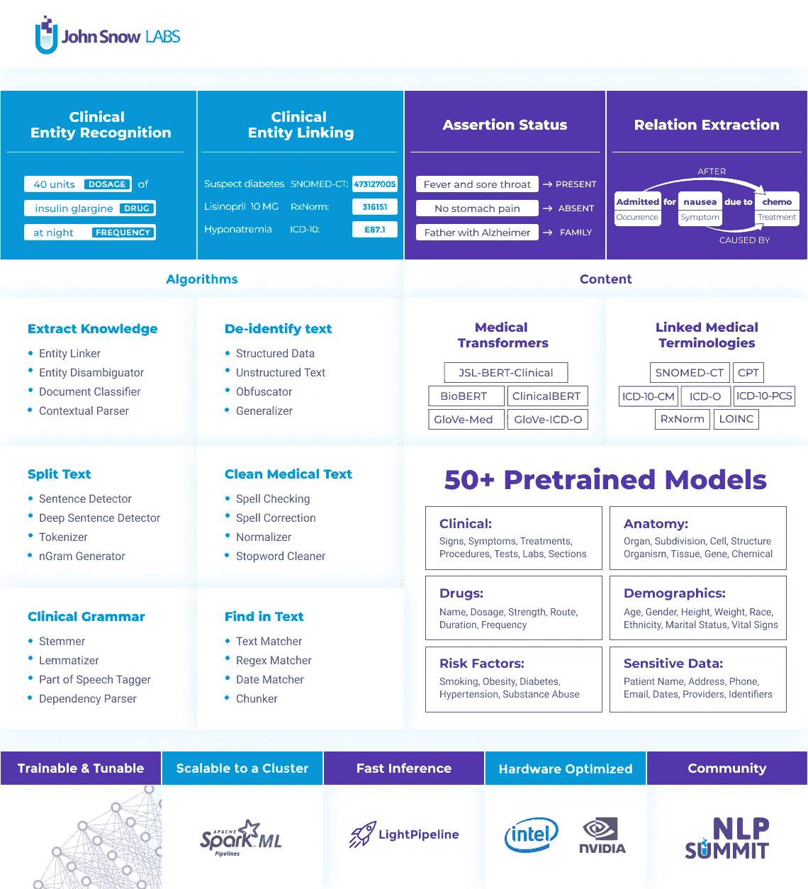

Spark NLP 医疗保健版(许可)

## 药品不良事件 NER 模型

我们发布了 4 种不同的阿德 NER 模型，每一种都根据系统的局限性和所需的精确度，在不同的嵌入上进行训练。

`ner_ade_biobert`:用 768d BioBert 嵌入(`biobert_pubmed_cased`)训练

`ner_ade_clinicalbert`:用 768d BioBert 嵌入式(`biobert_clinical_cased`)训练

`ner_ade_clinical`:200d 临床手套嵌入训练

`ner_ade_healthcare`:100d 保健手套嵌入训练

阿德·NER 可以提取两个实体:`ADE`和`DRUG`

您还可以在同一管道中使用 ADE NER 和[断言状态模型](https://colab.research.google.com/github/JohnSnowLabs/spark-nlp-workshop/blob/master/tutorials/Certification_Trainings/Healthcare/2.Clinical_Assertion_Model.ipynb)，并检测 ADE 检测到的否定范围(`gastric problems`将被检测为`absent`)。

就像所有其他 Spark NLP 模型一样，您也可以在任何 Spark 数据帧上运行它，并获得每一行的预测。

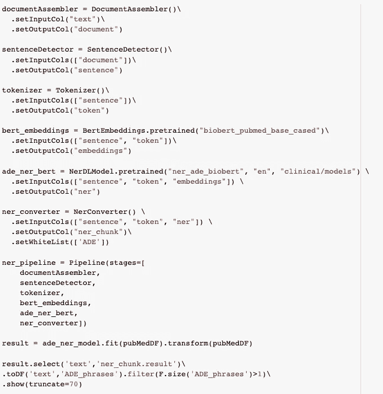

阿德 NER 管道公司

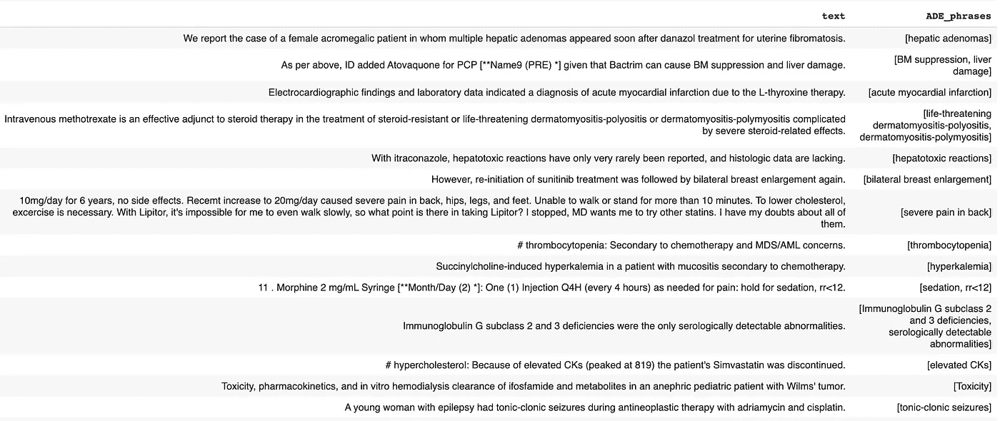

艾德·NER 的预测样本

我们想看看我们的 NER 算法在基准 ADE 数据集上与最先进的(SOTA) [结果相比有多好，我们最终获得了新的 SOTA 精度，其 ***宏平均值为 90.51*** ！](http://Giorgi, John, et al. "End-to-end Named Entity Recognition and Relation Extraction using Pre-trained Language Models." arXiv preprint arXiv:1912.13415 (2019))

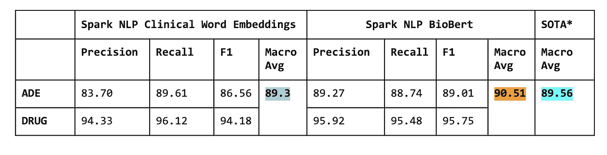

我们的阿德 NER 模型击败了 Giorgi，John 等人(2019)在相同的训练和测试分裂中使用相同的 BioBert 版本报告的 SOTA 结果。

## 药物不良事件(ADE)分类模型

我们发布了 3 个不同的 ADE 分类模型，每个模型都根据不同的嵌入进行了训练，这取决于系统的局限性和所需的精确度。

`classifierdl_ade_biobert`:用 768d BioBert 嵌入进行训练(`biobert_pubmed_cased`)

`classifierdl_ade_conversational_biobert`:在 ***会话短句*** 上用 768d BioBert 嵌入进行训练。

`classifierdl_ade_clinicalbert`:经过 768d BioBert 临床嵌入训练(`biobert_clinical_cased`)

ADE 分类器将返回`True`或`False`以表明文本是否与可能的药物不良事件或反应有关。以下是一些预测:

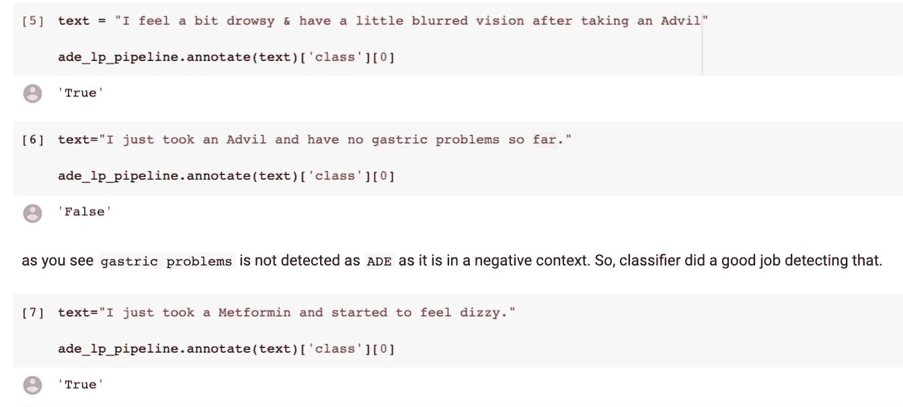

正如所有其他 Spark NLP 模型的情况一样，您也可以将其包装在 [LightPipeline](https://medium.com/spark-nlp/spark-nlp-101-lightpipeline-a544e93f20f1) 中，并获得给定文本的预测。

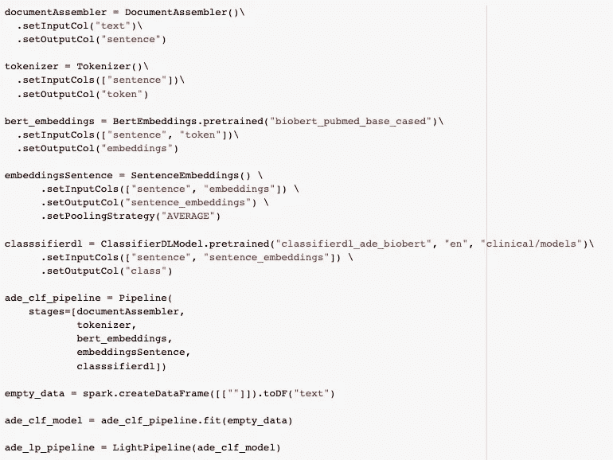

最后，让我们将我们的分类算法与基准 ADE 数据集上的【SOTA】[结果进行比较。正如你所看到的，我们最终获得了新的 SOTA 精确度，F1 的分数为 ***92.15*** ！](http://Huynh, Trung, et al. "Adverse drug reaction classification with deep neural networks." Coling, 2016.)

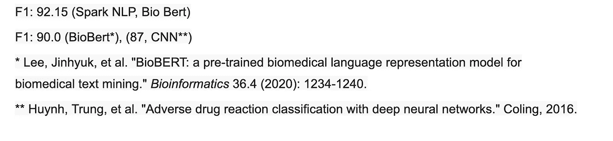

我们还发布了 ADE [预训练管道](https://colab.research.google.com/github/JohnSnowLabs/spark-nlp-workshop/blob/master/tutorials/Certification_Trainings/Public/1.SparkNLP_Basics.ipynb)以避免您从头开始构建管道。下面是如何在 Spark NLP 中使用它，只需一行代码，就可以一次提取给定文本的命名实体和 ADE 状态。

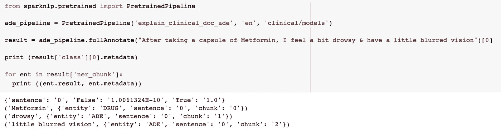

从 *Spark NLP for Healthcare 3.1.2 开始，*现在我们也有了 ADE 关系提取模型(re)来查找药物和 ADE 实体之间的关系。请参见[这款笔记本](https://colab.research.google.com/github/JohnSnowLabs/spark-nlp-workshop/blob/master/tutorials/Certification_Trainings/Healthcare/10.Clinical_Relation_Extraction.ipynb)上的详细笔记。

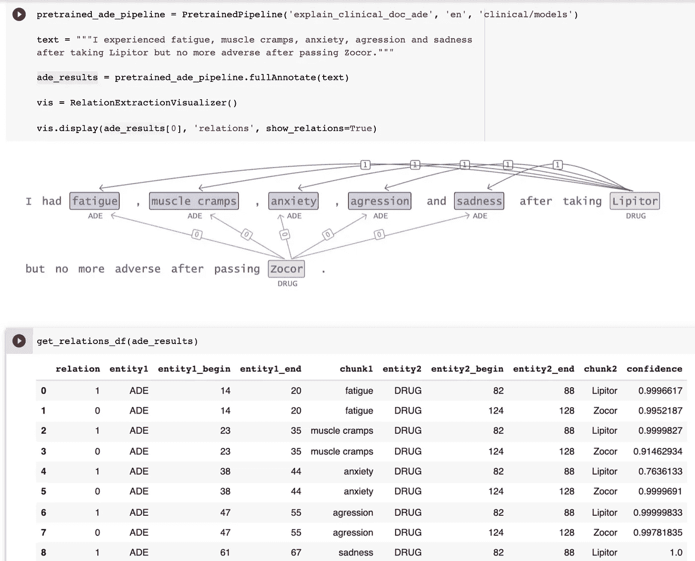

## 结论

在这篇文章中，我们宣布了一种新的分类和 NER 模型，用于从临床和对话文本中检测和提取药物不良事件。你可以在[这个 Colab 笔记本](https://colab.research.google.com/github/JohnSnowLabs/spark-nlp-workshop/blob/master/tutorials/Certification_Trainings/Healthcare/16.Adverse_Drug_Event_ADE_NER_and_Classifier.ipynb)上找到所有代码和更多示例，如果你想在自己的数据上尝试它们，你可以申请 Spark NLP Healthcare [免费试用许可](https://www.johnsnowlabs.com/spark-nlp-try-free/)。

Spark NLP 库在企业项目中使用，在 Apache Spark 和 [TensorFlow](https://www.analyticsindiamag.com/a-hands-on-primer-to-tensorflow/) 上本地构建，并提供一体化的最新 NLP 解决方案，为机器学习管道提供简单、高性能和准确的 NLP 符号，可在分布式环境中轻松扩展。

如果您想了解更多信息并开始练习 Spark NLP，请查看以下资源。您还可以参加我们的 2020 年 NLP 峰会，并结识 50 多位来自业界的杰出演讲者！

 [## Spark NLP 简介:基础和基本组件

### 为什么我们需要另一个 NLP 库？

towardsdatascience.com](/introduction-to-spark-nlp-foundations-and-basic-components-part-i-c83b7629ed59)  [## 基于 Bert 和通用语句编码器的 Spark NLP 文本分类

### 用 Bert 和 Spark NLP 中的通用语句编码器训练 SOTA 多类文本分类器，只需几个…

towardsdatascience.com](/text-classification-in-spark-nlp-with-bert-and-universal-sentence-encoders-e644d618ca32)  [## Spark 自然语言处理中基于 BERT 的命名实体识别(NER)

### 用 BERT 在 Spark NLP 中的几行代码训练一个 NER，获得 SOTA 精度。

towardsdatascience.com](/named-entity-recognition-ner-with-bert-in-spark-nlp-874df20d1d77)  [## 约翰·斯诺实验室/spark-NLP-车间

### 此时您不能执行该操作。您已使用另一个标签页或窗口登录。您已在另一个选项卡中注销，或者…

github.com](https://github.com/JohnSnowLabs/spark-nlp-workshop/tree/master/tutorials/Certification_Trainings)