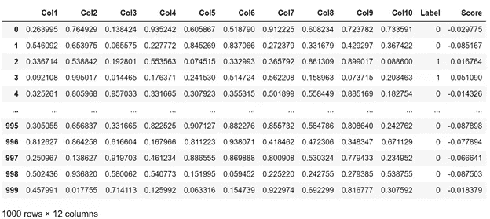
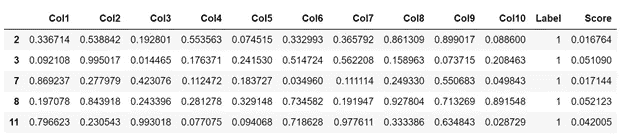
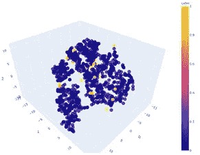
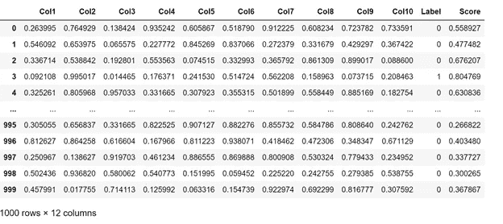
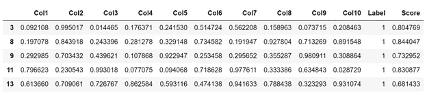
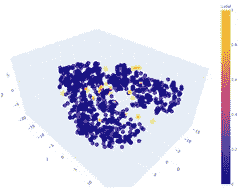
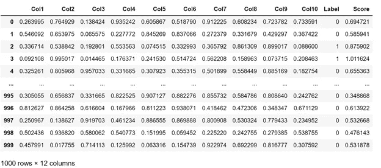
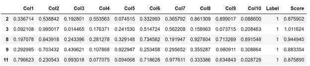
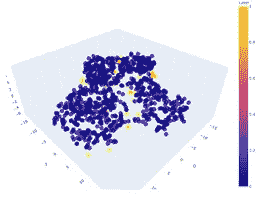

# 使用 PyCaret 的自动化异常检测

> 原文：<https://towardsdatascience.com/automated-anomaly-detection-using-pycaret-5e40df75fe36?source=collection_archive---------33----------------------->

## 一个开源的机器学习库——py caret！！


图片来源——un splash

PyCaret 是一个**开源库**，它通过各种模块提供了各种机器学习功能，其中之一就是异常检测。

PyCaret 的异常检测模块是一个**无人监管的**机器学习模块，用于识别数据中存在的极值，这些极值有时可能表明可疑活动或异常情况。

PyCaret 的异常检测模块提供了**十二种不同的**异常检测技术，根据您正在处理的问题进行选择。它还允许我们通过一个名为“**setup”**的函数，使用传递给该函数的各种参数值来执行特征工程任务。

在本文中，我们将对 PyCaret 本身提供的一个数据集应用 PyCaret 提供的三种异常检测技术。本文涵盖的三种技术是— *隔离林、K 最近邻和聚类。*

在我们实现这些技术之前，让我们先来看看我们需要按照特定的顺序执行的步骤，以便通过使用下面的函数来识别数据中的异常。这些步骤对于 PyCaret 为异常检测提供的所有技术都是通用的。

*   **get_data()** —此函数用于访问 PyCaret 数据集。这是一个可选步骤。
*   **setup()** —该函数初始化环境，并在异常检测之前执行所需的预处理任务。它唯一需要的参数是“数据”参数中的数据帧，但下面是可以通过设置功能实现的各种预处理任务的示例。

```
**setup**(*data, categorical_features = None, categorical_imputation = ‘constant’, ordinal_features = None, high_cardinality_features = None, numeric_features = None, numeric_imputation = ‘mean’, date_features = None, ignore_features = None, normalize = False, normalize_method = ‘zscore’, transformation = False, transformation_method = ‘yeo-johnson’, handle_unknown_categorical = True, unknown_categorical_method = ‘least_frequent’, pca = False, pca_method = ‘linear’, pca_components = None, ignore_low_variance = False, combine_rare_levels = False, rare_level_threshold = 0.10, bin_numeric_features = None, remove_multicollinearity = False, multicollinearity_threshold = 0.9, group_features = None, group_names = None, supervised = False, supervised_target = None, session_id = None, profile = False, verbose=True*)
```

*   **create_model()** —此函数创建模型，并在设置阶段作为参数传递的数据集上对其进行训练。因此，该函数要求在使用之前调用 setup()函数。

```
df = pd.read_csv(path_to_csv) # to access your own dataset
or
df = get_data(“anomaly”) # to access PyCaret’s anomaly datasetsetup_data = setup(data=df)
sample_model = create_model(“iforest”)
```

*   **plot_model()** —该函数获取 create_model()函数期间创建的训练模型，并绘制 setup()函数期间传递的数据。因此，该方法要求在调用之前调用 setup()和 create_model()函数。返回的图用不同的颜色清楚地显示异常数据。

```
plot_model(sample_model)
```

*   **predict_model()** —此函数获取经过训练的模型，并使用它对新数据进行预测。新数据必须是熊猫数据帧的形式。该函数的输出是一个数据帧，其中包含名为“**标签**的预测以及相关的决策得分。

> Label = 0 表示正常数据或内嵌数据
> 
> 标签= 1 表示异常或异常值

现在，当我们对 PyCaret 异常检测函数的工作原理有了一个基本的了解后，让我们开始实际的实现吧。

```
**# Importing PyCaret dependencies.**
from pycaret.datasets import get_data
anomaly = get_data(“anomaly”)**# Importing anomaly detection module.**
from pycaret.anomaly import ***# Initializing the setup function used for pre-processing.**
setup_anomaly_data = setup(anomaly)
```

# 隔离林实现

```
# Instantiating Isolation Forest model.
iforest = create_model(“iforest”)# Plotting the data using Isolation Forest model.
plot_model(iforest)# Generating the predictions using Isolation Forest trained model.
iforest_predictions = predict_model(iforest, data = anomaly)
print(iforest_predictions)# Checking anomaly rows. Label = 1 is the anomaly data.
iforest_anomaly_rows = iforest_predictions[iforest_predictions[“Label”] == 1]
print(iforest_anomaly_rows.head())# Checking the number of anomaly rows returned by Isolaton Forest.
print(iforest_anomaly_rows.shape) **# returned 50 rows**
```



**前 5 个异常行(标签 1)**



**使用隔离林创建的异常图(异常以黄色突出显示)**



基于隔离林的异常图

# **K 最近邻(KNN)实现**

```
# Instantiating KNN model.
knn = create_model(“knn”)# Plotting the data using KNN model.
plot_model(knn)# Generating the predictions using KNN trained model.
knn_predictions = predict_model(knn, data = anomaly)
print(knn_predictions)# Checking KNN anomaly rows. Predictions with Label = 1 are anomalies.
knn_anomaly_rows = knn_predictions[knn_predictions[“Label”] == 1]
knn_anomaly_rows.head()# Checking the number of anomaly rows returned by KNN model.
knn_anomaly_rows.shape **# returned 46 rows**
```



**前 5 个异常行(标签 1)**



**使用 K 个最近邻创建的异常图(异常以黄色突出显示)**



基于 KNN 的异常图

# **聚类**实现

```
# Instantiating Cluster model.
cluster = create_model(“cluster”)# Plotting the data using Cluster model.
plot_model(cluster)# Generating the predictions using Cluster trained model.
cluster_predictions = predict_model(cluster, data = anomaly)
print(cluster_predictions)# Checking cluster anomaly rows. Predictions with Label = 1 are anomalies.
cluster_anomaly_rows = cluster_predictions[cluster_predictions[“Label”] == 1]
print(cluster_anomaly_rows.head())# Checking the number of anomaly rows returned by Cluster model.
cluster_anomaly_rows.shape # returned 50 rows
```



**前 5 个异常行(标签 1)**



**使用聚类创建的异常图(异常以黄色突出显示)**



基于聚类的异常图

# 参考

*   [https://pycaret.org/](https://pycaret.org/)