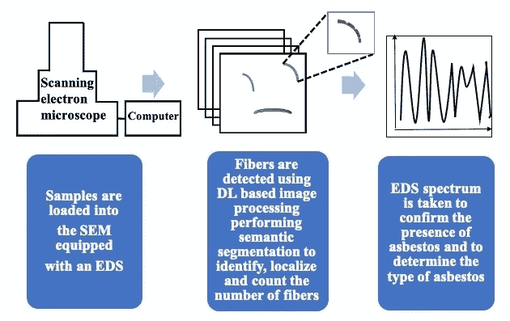
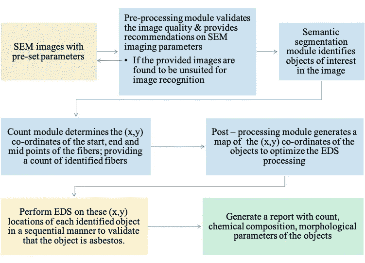
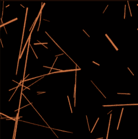

# 基于深度学习的石棉纤维检测

> 原文：<https://towardsdatascience.com/automated-asbestos-analysis-using-semantic-segmentation-53e6741ba5c2?source=collection_archive---------46----------------------->

## [理解大数据](https://towardsdatascience.com/tagged/making-sense-of-big-data)

## 基于深度学习语义分割的建筑工地有害石棉纤维自动检测

作者:Soma Biswas，Debmalya Biswas

**摘要*。*** *空气中的可吸入纤维，如石棉等都有害健康，职业健康与安全指南和法律要求对所有含石棉的材料进行检测和鉴定。然而，石棉纤维的检测和鉴定是一个复杂、耗时和昂贵的过程。* *在这项工作中，我们提出了一种基于深度学习的语义分割模型，能够自动化石棉分析过程，将周转时间从几小时减少到几分钟。所提出的深度神经网络提供了分析过程的端到端自动化，从转换输入扫描电子显微镜(SEM)图像开始，到识别和计数图像中的纤维数量，到掩蔽所识别的纤维区域并重新排列以通过能量色散光谱(EDS)进行有效处理。最后，我们提供了基于 U-Net 的语义分割模型的实现细节，该模型能够以高达 95%的准确度检测和计数 SEM 图像中的石棉纤维(空气样本)。*

这篇论文已经被接受在 2021 年第 50 届 **IEEE 应用图像模式识别**([AIPR](https://www.aipr-workshop.org/))([论文](https://www.researchgate.net/publication/354533691_Deep_Learning_based_Asbestos_Fiber_Detection))上发表

# 1 导言

石棉是一种天然存在的硅酸盐，具有纤维状结构，由于其柔韧性、丰富性、耐火性和耐腐蚀性，通常被称为“奇迹矿物”。这些技术特点和低成本导致石棉被用于许多领域，尤其是建筑业，例如，作为混凝土或树脂化合物的一种成分。像其有用的属性一样，石棉是一种严重的污染物，可导致肺部疾病，如石棉沉滞症、间皮瘤和其他类型的癌症。这些疾病可能有很长的潜伏期。

1990 年，瑞士是首批禁止石棉的国家之一；大多数其他国家在 90 年代紧随其后。然而，在五十年代、六十年代和七十年代，石棉仍然存在于许多建筑物的建筑材料中。为了保护工人和居民的健康，现行的瑞士法律要求任何超过 1990 年的建筑需要在拆除或改造以及回收/处理建筑材料之前进行石棉检查[1，2]。

在过去，重点放在石棉的主要矿点，如喷雾石棉或纤维水泥。然而，如今含有极低浓度(低于 0.1%)石棉的材料仍被视为对工人健康的威胁，因此需要取样分析。举个例子，从 2010 年开始对瓷砖水泥进行分析，从 2017 年开始对石膏进行分析，这些样品中大约有 20%含有石棉。

不幸的是，石棉纤维的检测和鉴定是一个复杂而耗时的过程。如果不确定是否存在石棉，则从现场收集样本(空气或固体，视情况而定),并使用扫描电子显微镜(SEM)和能谱仪(EDS)进行分析。通常通过使用特殊设计的泵收集样品，该泵迫使空气通过镀金过滤器，利用静电相互作用收集颗粒和纤维。在分析之前，使用氧等离子体蚀刻去除样品的有机成分。然后在扫描电镜下分析过滤器的随机选择部分，以寻找薄至 3 米和短至 5 米的石棉纤维。还根据规定的纤维计数规则对单根纤维进行计数，并根据纤维类型进行分类。通过使用 EDS 分析纤维的化学成分来进行分类。最后，对石棉纤维的浓度进行评估，并与规范(因国家而异)定义的标准值进行比较。如果评估的石棉浓度超过一定值，则需要根据指南进行进一步处理。

SEM 图像和 EDS 结果用于各种领域中不同类型材料的形态和化学分析，如医疗技术[3，4]，法医学[5]，建筑行业[6，7]等。然而，分析过程通常是耗时的，因为操作者在获得样品的电子图像后，需要用肉眼手动识别感兴趣的物体，然后选择获得 eds 光谱的位置。因此，这种方法不仅费时，而且费力，并有可能产生偏见。

> 在这项工作中，我们提出了一个基于深度学习(DL)的语义分割模型来自动化分析过程。所提出的模型能够识别和计数纤维的数量，其中神经网络掩蔽所识别的纤维区域并重新排列它们，使得它们可以作为输入提供给能量色散光谱(EDS)。

自动化过程如图 1 所示。



**图一。**基于 DL 的自动化石棉分析(图片由作者提供)

1.  自动成像软件设置为无人值守运行，用于扫描电镜图像采集，为操作员腾出时间进行数据解释。
2.  在 SEM 图像中有效地识别和定位纤维，例如，识别单根纤维、团块、部分覆盖有非石棉颗粒/灰尘的纤维等。；使用基于 DL 的图像识别技术。这些技术适应石棉纤维的形态特征，并提供石棉计数。
3.  通过使用自动 EDS 程序对所识别的纤维位置进行化学分析，从而生成报告，该报告显示了在样品中发现的纤维数量，并且石棉的化学成分和长宽比符合规范分析过程的标准指南。

> 自动化过程有可能将石棉分析的周转时间减少到几分钟，而不是目前的手工处理时间 1-2 小时；预计成本降低高达 25%。

本文的其余部分组织如下:在第 2 部分，我们扩展图 1 以提供每个步骤的细节，子部分对应于图像捕获和图像分析(语义分割和纤维计数)阶段。第 3 节提供了实现细节，包括语义分割模型的训练规范和准确性结果。第 4 节对论文进行了总结，并为未来的工作提供了方向。

# 2 自动化分析

在本节中，我们展开图 1 来提供每个步骤的细节。图 2 示出了扩展的过程。



**图二。**自动化石棉分析步骤(图片由作者提供)

## 2.1 SEM 图像捕捉

使用标准成像软件收集 SEM 图像。收集几组图像，每组包含 100 个 SEM 图像。对于每组图像，工作距离(WD)、高电压(HV)、放大率、亮度和对比度被设置为特定值。所有 SEM 图像可以存储在计算机的本地硬盘上，也可以直接上传到云中，以便执行下一步。这些 SEM 图像然后被提供作为基于深度学习的语义分割模型的输入。

## 2.2 图像分析

如图 2 所示，整个过程包括预处理、语义分割、纤维计数，随后是负责优化 EDS 处理的神经网络输出的后压制步骤。我们从语义分割模型开始，它构成了图像分析模块的核心。

**2.2.1 语义切分**

语义分割指的是一种能够给图像中的每个像素分配类别(标签)的图像识别模型。这允许语义分割模型输出对象在图像中的位置、该对象的形状、哪个像素属于哪个对象等。因此，基于深度学习的语义分割模型包括训练神经网络以输出输入图像的逐像素掩码。

在文献中已经提出了不同的神经网络用于语义分割，例如 FCN [8]、SegNet [9]和 U-Net [10]。在这项工作中，我们将重点放在 UNet 架构上，它似乎对我们的问题域有效。

U-Net 是一种端到端的语义分割模型，它建立在基于卷积神经网络(CNN)的图像分类模型上；通过以编码器-解码器的方式堆叠一堆卷积层。编码器对图像进行下采样，给出图像的压缩特征表示，解码器使用例如转置卷积的方法对图像进行上采样，给出分段输出(不同于使用数学插值的其他方法)。直观地说，编码器由一堆传统的卷积和最大池层组成(在图像分类模型的线上)。因此，它能够捕捉图像的“是什么”信息。由于“在哪里”信息在语义分割中同样重要，解码器能够通过逐渐应用上采样来恢复“在哪里”信息(精确定位)。

> 我们遵循[10]中概述的原始 U-Net 架构，稍加修改即可接受 1024 x 768 x 3 的输入图像(在[10]中输入图像的大小为 572x572x3)。U-Net 的好处是它不包含任何密集层，因此它可以接受任何大小的图像。

**2.2.2 预处理**

本模块的目的是在提供所有 SEM 图像作为语义分割的输入之前，验证它们的质量。如果任何 SEM 图像被确定为在锐度、亮度、对比度或放大率方面不适于处理；该层试图通过执行必要的图像变换来纠正这一点。如果不成功，它会将图像返回到“图像捕获”层，突出显示问题，并在 SEM 图像捕获过程中提供解决问题的建议。

**2.2.3 纤维数**

回想一下，在 SEM 图像分析的某些特定情况下，如石棉(空气样品)分析，需要计算图像中纤维的长度、宽度和长宽比。此外，我们还需要确定图像视野中可见纤维的数量。这确定了图像中石棉纤维的浓度，如果发现石棉浓度超过了某一阈值，根据指导方针，这将要求进一步的处理。

给定一个语义分割输出，其中图像中的(分类的)纤维的像素已经被屏蔽，我们使用 OpenCV HoughLines()函数[11]来计算图像的长度和数量。下面提供了相应的 python 代码片段:

```
def **get_fiber_details**(img): model = get_model()
  model.load_weights('Segmentation.h5)
  img= get_image(file) y_pred = model.predict(img[None,...].astype(np.float32))[0]
  y_pred = np.round(y_pred.reshape((IMAGE_H,IMAGE_W, NUMBER_OF_CLASSES)),0) for i in range(IMAGE_W):
    for j in range(IMAGE_H):
      if y_pred[j,i]>0:
        img[j,i,1]=255
        img[j,i,2]=0
        img[j,i,0]=0
      else:
        img[j,i,1]=0
        img[j,i,2]=0
        img[j,i,0]=0 edges = cv2.Canny(img, 25,255)
  lines = cv2.HoughLinesP(edges, 1, np.pi/180, 30, maxLineGap=250)
  cnt=0
  for line in lines:
    x1, y1, x2, y2 = line[0]
    print(x1, y1, x2, y2, math.sqrt((x1-x2)**2)+((y1-y2)**2))
    cnt=cnt+1**print**('No of fibers: '+str(cnt)).........................................(Sample)**Output**72 764 166 167 356503.0
131 64 630 618 307415.0
66 764 188 136 394506.0
75 440 303 722 79752.0
91 468 291 715 61209.0
497 738 950 384 125769.0
141 94 637 590 246512.0
.........................No of fibers: 147
```

**2.2.4 后处理**

此步骤的目标是为 EDS 处理准备输出。能量色散 X 射线光谱(EDS)是一种分析技术，通常与 SEM 集成，用于分析样品的元素组成或化学特性。为了进行 EDS，通常，首先在样品表面收集 SEM 图像，然后在图像上手动标记具体位置，用于感兴趣物体的化学分析。一旦在图像上识别出所有感兴趣的位置，这些 XY 坐标被手动传送到 EDS 程序的用户界面，以对这些位置进行化学分析。这个手动过程非常耗时。

在自动化过程中，由 **get_fiber_details** 函数提供被识别纤维的(x，y)坐标作为输出。后处理包括以这样的方式对纤维进行分类，即在 EDS 过程中，SEM 内的样品台需要在两个指定位置之间移动最短的距离(相对于电子束)。因此，该步骤的输出是在图像中检测到的纤维的(x，y)坐标的优化图，这有助于减少 EDS 处理，进一步导致更有效的分析。该位置图被直接上传到 EDS 用户界面，用于对物体执行 EDS。

# 3 实施

语义分割模型使用 100 个铁石棉(空气样本)进行训练，训练/验证集的比例为 80-20。所有 100 个 SEM 图像将采用相同的成像参数拍摄，即尺寸、分辨率、亮度、对比度、HV、WD，所有图像的每个参数都是相同的。原则上，这些图像可以在不同位置的相同样本上收集，或者在具有相同对象的不同样本上收集。图 3 示出了从训练语义分割模型中使用的样本注释图像。



**图三。**用于训练的示例注释图像(作者提供的图像)

> 图 4 示出了屏蔽了检测到的纤维的 U-Net 语义分割模型的相应输出。正如可以观察到的，我们用我们的模型实现了> 95%的准确度(精确度)，仅用 100 幅图像进行了训练。


**图 4。** U-Net 语义分割输出(图片由作者提供)

# 4 结论

鉴于石棉对健康的危害，我们提出了一种基于深度学习的语义分割神经网络来自动化石棉分析过程。据我们所知，这是第一篇报道使用语义分割进行石棉分析的实用性的文章。正如在实施部分中所概述的，至少对于空气样本图像，结果是相当有希望的，在空气样本图像中，我们能够基于在 100 个带注释的图像上训练的模型获得> 95%的准确度。

将来，我们计划扩展模型以适应大量的石棉样品，其中石棉纤维可能形成巨大的团块，只有很少的单纤维是可见的。在团块的图像中识别这些单纤维是困难和费时的。我们希望多类语义分割模型在这里将是成功的，因为它将能够检测和分类作为图像中的对象的纤维和纤维团。

# 参考

[1][https://asca-vabs . ch/asca/498/VDI _ richt linie _ 3492 _ jun 2013 . pdf](https://asca-vabs.ch/asca/498/VDI_Richtlinie_3492_Juni2013.pdf)

[2]“石棉:取样、分析和清理程序分析师指南”，ISBN: 9780717628759，系列代码:HSG248，2005。

[3] M. Scimeca，A. Orlandi，I. Terrenato，S. Bischetti，E. Bonanno，“通过 EDX 微量分析评估非小细胞肺癌中的金属污染物”，《欧洲组织化学杂志》，第 58 卷(3):2403，2014 年。

[4] M. Scimeca，A. Pietroiusti，F. Milano，L. Anemona，A. Orlandi，L. T. Marsella 等.“*组织学标本的元素分析:揭开纳米石棉纤维面纱的方法*”, Eur J histo chem，第 60 卷:2573 页，2016 年。

[5] M. E. Taylor，“法医科学中的扫描电子显微镜技术”，《法医科学学会杂志》，第 13 卷，第 269-280 页，1973 年。

[6] B. R. Bandli，M. E. Gunter，“石棉标准参考材料的扫描电子显微镜和透射电子背散射衍射检查、不同形态的闪石颗粒以及滑石矿石的颗粒相鉴别”，显微镜和微量分析，第 20 卷，第 1805-1816 页，2014 年。

[7] B.R. Bandli，M. E. Gunter，(2001 年)。*使用纺锤台和扫描电子显微镜鉴定和表征矿物和石棉颗粒:以美国利比蒙大拿州闪石-石棉为例*，《显微镜》，第 49 卷，第 191-199 页，2001 年。

[8] J. Long，E. Shelhamer，T. Darrell，“用于语义分割的*全卷积网络*”，IEEE 计算机视觉和模式识别会议论文集，第 3431–3440 页，2015 年。

[9] V. Badrinarayanan，A. Kendall 和 R. Cipolla，“ *SegNet:用于图像分割的深度卷积编码器-解码器架构*”，载于《IEEE 模式分析和机器智能汇刊》，第 39 卷，第 2481-2495 页，2017 年。

[10] O. Ronneberger，P. Fischer，T. Brox，“ *U-Net:卷积网络用于生物医学图像分割”，*载于:医学图像计算和计算机辅助干预，LNCS，第 9351 卷:234–241 页，2015 年。

[11]开源计算机视觉(OpenCV)，[https://opencv.org/](https://opencv.org/)