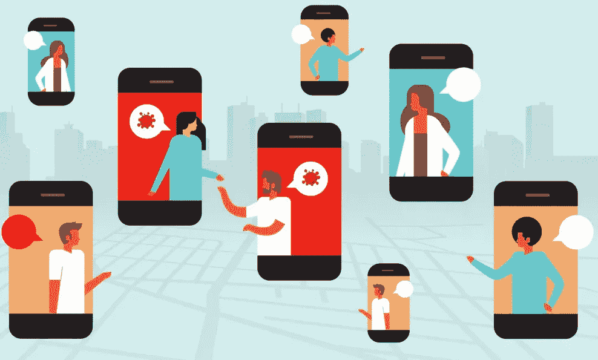
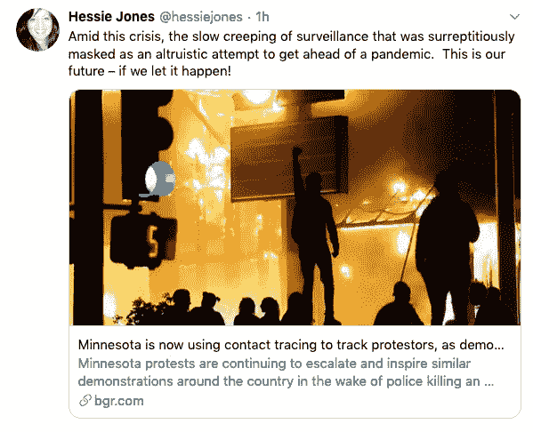

# 自动接触追踪还不能应对未来的大流行

> 原文：<https://towardsdatascience.com/automated-contact-tracing-is-not-ready-for-future-pandemics-609e8d6d9391?source=collection_archive---------81----------------------->

## 大型科技公司正在打开数据监控的潘多拉魔盒吗？

存放照片

相信总是比否认容易。我们的思维自然是肯定的。”—约翰·巴勒斯

当政府争先恐后地应对冠状病毒时，他们对自动化费力的手动接触者追踪实践的解决方案的请求引发了一系列技术。当谷歌和苹果宣布他们将联手启用曝光通知 API，以便应用程序设计人员可以建立跨两个移动网络的联系人跟踪解决方案时，技术社区的反应很快。

最初，正如《连线》[本月早些时候报道的那样，卫生官员并没有这么草率:](https://www.wired.com/story/health-officials-no-thanks-contact-tracing-tech/)

*“相反，在技术的有限帮助下，受灾严重的各州的公共卫生官员正在部署大批人员。马萨诸塞州预算 4400 万美元雇佣 1000 名接触者追踪员。在彭博慈善基金会的资助下，纽约州上周表示，计划招聘多达 17，000 名员工。加州预计将很快宣布计划雇佣多达 20，000 名联系人追踪员。*

显然，地面接触追踪有更高的有效率。这需要感染者和医疗界的参与——这是一个繁重的过程，但它允许卫生当局识别受影响的个人，对他们进行诊断，并迅速确定社区影响。这个过程需要外柔内刚的治疗和病人的信任。

然而，对自动化合同跟踪解决方案的需求并没有减少。当英国政府最初在四月中旬宣布推出 NHS 冠状病毒智能手机应用程序，试图跟上不断上升的病例时，这一举动引起了一些恐慌。如果用户出现症状，他们必须在应用程序中注册自己的状态。这又被发送给在一段时间内与他们有联系的其他用户。

来自“大量蓝牙数据”的重新识别和侮辱用户的风险显而易见。同样，新加坡备受称赞的 TraceTogether 应用程序以隐私第一为宗旨，被用于医疗访谈。然而，它未能领先于病毒，只有 13%的国家采用。此外，卫生当局能够访问每个用户历史记录的详细位置信息，并在应用程序中粗略地通知患者进行自我隔离。

在印度，据 Reina Legal 的合伙人 Tripti Dahr 称，新冠肺炎对印度政府视而不见，该应用程序在一个以前没有数据保护立法的系统中启动。政府规定申请是强制性的；它每 15 分钟追踪一次用户位置；政府声明他们不对用户数据的影响负责；当涉及到目的排除、数据最小化和数据共享时，就有了模糊性。

虽然其中一些在最近几周有所逆转，但其后果对该地区的数据保护立法来说是一个关键案例。

在美国，北达科他州一个名为 Care19 的联系人追踪应用在用户不知情的情况下向 Foursquare 分享数据。据 Jumbo Privacy 的首席执行官 Pierre Valade 称，该团队发现该应用程序正在共享位置、匿名 ID 以及手机的广告标识符，其中包括手机名称、设备名称和设备唯一标识符(UDID)。

在 TraceTogether 和 Care19 解决方案中，使用了加密方法(在一定程度上)来匿名化用户身份和个人身份信息。然而，在这两种情况下，数据操作员都能够重新识别个人。印度的情况表明，政府获取这种离散级别的信息并不断跟踪其公民是不对的。

在我写这篇文章的时候，美国最近几天的抗议和骚乱已经浮出水面，有消息称官员们正在使用联系追踪来监视抗议者。

通过推特

*“明尼苏达州公共安全专员约翰·哈灵顿说他们已经开始联系追踪被捕者…他们和谁有联系？他们在倡导什么平台？…这是有组织犯罪吗？…我们现在正在构建这个信息网络。”*

虽然当局无意中“创造”了相同的术语来跟踪病毒，但已经明确的是，疫情病毒之外的接触者跟踪的真正意图，以及这将对个人和团体造成的最终伤害，因为这为政府机构和执法部门有效颁布新的跟踪方法提供了机会。

蒙特利尔人工智能伦理研究所**也*强调了这些早期解决方案的缺点:*

*   *任何集中式解决方案都使数据极易受到危害。该系统的创建者必须是数据托管机构，除非他们已经将此外包给第三方，并保护公民的数据。将解决方案快速推向市场还没有解决这些潜在的问题。如果这些系统将使用 ML 来补充应用程序的功能，也许应该从对抗 ML 和 ML 安全的角度进行更深入的调查，以确保这些系统的安全。*
*   *所有解决方案都需要强有力的采用(超过 60%的人口)才能有效。这成为了一个障碍，尤其是如果这个系统不是强制性的，人们不信任这个系统和它的创造者。如果解决方案没有考虑到老年人、不太懂技术的人或社会经济弱势群体，尤其是在人们可能没有智能手机的情况下，采用该解决方案也可能会有障碍。*
*   *用户是否对系统有足够的信任，能够放心地输入症状数据，尤其是在应用程序中可能需要使用 ML 模型功能的情况下？*
*   *最终，不正确的预测、不正确的风险评分以及任何其他可能误导个人和决策者的问题都有可能弊大于利。*

*一个更加全球化的解决方案即将出现。苹果和谷歌宣布了一项隐私安全的合作伙伴关系，并依赖于最少的数据收集，使传统的联系追踪方法成本更低。*

*5 月 20 日，苹果发布了包含曝光通知的 iOS 13.5 更新。一旦下载，这将使卫生当局的合同跟踪应用程序。苹果非常明智地将其 API 限制为只有“授权配置文件”，每个国家一个，由政府实体认可。它还限制了开发人员的要求，以确保应用程序仅用于新冠肺炎响应工作，只允许收集响应工作所需的最少数据，并禁止向其他用户披露受感染用户的数据。*

*禁止使用基于位置的 API、收集设备信息的其他框架、用户位置或任何其他访问个人身份信息的数据。从表面上看，它为最终用户提供了必要的隐私保护和控制。然而，允许这些应用程序运行的沙盒并非没有隐私问题。它打开了以个人为代价尊重疾病的更本地化的解决方案的大门。*

*对蓝牙低能耗(BLE)技术的研究已经成为解决方案。许多研究论文和文章都对其性能和长期可行性提出了质疑。*

*我们采访了 Paul-Oliver Dehaye，他是 PersonalData 的创始人。IO ，以及 [MyData](https://mydata.org/) 的成员，这是一个非营利组织，旨在“通过提高个人对其个人数据的自决权来赋予个人权力”。Dehaye 研究了近感探测，评估了 BLE 技术的可行性。*

*对 BLE 的兴趣源于对可扩展的、更高效的接触追踪的需求，以便快速部署封锁措施。接收信号强度指示(RSSI)是从两个移动设备的发射机和接收机之间的信号强度推断距离的度量。RSSI 应该随着距离的增加而减小。然而，根据 Dehaye 的说法，情况可能并不总是如此。*

*影响一个信号强度的因素有很多:“发射功率，发射设备天线路径；飞行路径；接收设备天线路径；和接收器灵敏度。”RSSI 解读的准确性现在质疑 BLE 的有效性。这些发现表明，以下情况可能会产生不一致的结果:*

*   *当人们并排行走时，信号强度比他们前后行走时高得多。*
*   *iPhones 比 Android 发出更强的信号强度；Dehaye [指出:](https://medium.com/personaldata-io/inferring-distance-from-bluetooth-signal-strength-a-deep-dive-fe7badc2bb6d)*他的观点可能会引起关注，因为 iPhone 的拥有量与许多社会经济指标相关。*”*
*   *位于智能手机路径之间的障碍物(如家具或墙壁)可能会反射无线电信号，使其强度增强或减弱，因此，尽管距离相似，室内和室外位置可能会显示不同的结果。*
*   *在相同距离内，放在桌子上的电话比放在钱包或口袋中的电话具有更高的信号强度。手机方向也可以表现出明显的差异。*

*不变的是，在一个场景中，5 个人可能坐在相距两米的房间中，打开窗户，信号也会检测到相邻房间中的另外两个人，石膏板将他们分开，[错误地检测到](https://www.lightbluetouchpaper.org/2020/04/12/contact-tracing-in-the-real-world/)比同一空间中所需的更多的人。在另一种情况下，邻居停下来与同一条街上大约相隔三米的另一个人聊天，感染的风险较低。*

*然而，蓝牙检测可以加强两个设备之间的信号，并且当它们不是相互接触时，将邻居标记为相互接触。假阳性和假阴性结果的真实可能性将使有效地检测接触事件和管理社交距离策略变得更具挑战性。点击阅读 Dehaye 的观点[，了解来自](https://medium.com/personaldata-io/inferring-distance-from-bluetooth-signal-strength-a-deep-dive-fe7badc2bb6d) [RSSI](https://en.wikipedia.org/wiki/Received_signal_strength_indication) 的更详细观点。*

*正如 Dehaye 指出的，“谷歌和苹果的 API 相当于为了流行病学的目的而重新定义了接触的概念。更准确地说，谷歌和苹果让应用开发者能够构建自己不断发展的定义，但它们限制了应用开发者可能使用的输入。我们在上面已经看到，仅蓝牙数据的当前输入很可能太差。因此，应用程序可访问的数据量很有可能会逐步扩大，但苹果和谷歌会控制这种情况。”*

*对于那些可能不太关心并愿意放弃他们的数据以让卫生官员提前发现病毒的普通公众，Dehaye 说:*

**“你被洗脑了。没有数字屏障可以阻止病毒传染给下一个人。它只是记录更集中的数据，可以帮助我们更接近“背后”的感染者。确切地说，我们如何利用这些数据是非常重要的，也是非常政治化的，事实上，如果你认为已经有了广泛的共识，那你就错了。我们可以用一些方法来处理这些可能对最终结果有害的数据(净负面影响)。”**

**“通过利用谷歌和苹果 API 的基于蓝牙的邻近追踪，我们失去了将传播风险等同于物理邻近的共同认知基础。苹果和谷歌开始定义规则，并将逐步引入新的数据作为输入……这也将导致构成误报和漏报的实质性转变。”**

*多伦多的急诊医生 Kashif Pirzada 博士对一些接触者追踪应用程序开发者的工作提出了以下观点:*

*“电子接触者追踪的一些要素可能非常有用，但应该补充而不是取代公共卫生当局的传统接触者追踪。蓝牙低能量信号技术是一种很有前景但未经测试的方法，但不幸的是受到苹果和谷歌应用该技术的方式的严重限制。没有 GPS 数据，公共卫生当局将无法发现传播的“热点”，而这是苹果/谷歌框架所禁止的。一些隐私保护应用程序正在生产中，包括麻省理工学院的 SafePaths 和欧洲的 PEPP-PT，由于他们的强力干预，这些应用程序都不可行。存在明显的隐私风险，但可以针对此次危机制定强有力的数据安全和隐私立法。无论如何，有迹象表明我们可能遗漏了 90-95%的感染，因此如果总体病例数很高，当前的接触者追踪可能没有用，将不得不使用传统的人群水平控制(封锁、封闭、戴口罩)。”*

# *自动联系追踪将重塑社会的未来，科技巨头将极大地影响其发展道路*

*尽管这项技术在应对当前危机时面临诸多挑战，但错误结果导致的决策会产生深远的社会影响。根据 Pirzada，我们作为一个社会愿意部署解决方案来获得一些感染的早期迹象，而没有适当的保护措施吗？*

*流行病学家仍在了解这种病毒的季节性以及它如何随着时间的推移而变异。从各方面来看，接触追踪技术在人群中移动时会产生动态分数，并了解它在感染和再感染人群中的表现。随着时间的推移，这将是一个免疫分数，政府将利用它来塑造个人行为，直到了解更多或发现疫苗。*

*除非我们能够减轻这些早期阶段固有的偏见，否则最弱势群体被社会污名化和持续边缘化的风险将扩大社会经济差距。*

*我们还了解到，新兴的独角兽——自动接触追踪将有助于预测病毒的路径，并使我们的经济恢复正常——将活跃机会主义。健康数据本质上是流动的，然而，这种珍贵的商品将成为政府服务器上的永久记录。加上技术，这将最终意味着蓝牙[嗅探器](https://github.com/oseiskar/corona-sniffer)的进步。*

*我们开始看到这些迫在眉睫的措施，以提高苹果谷歌 API 所呈现的匿名水平，但它们将扩大蓝牙信号之间数据的上下文需求。这是一种必然性。*

*向更分散的解决方案的转变现在受到了大科技的影响。然而，曾经被等同于边缘网络的匿名性会不会开始成为隐私的代名词？如果是这样，接触追踪会不会在我们宝贵的敏感信息中隐藏犯罪活动？*

*欧盟卫生网络为成员国开发了一个[工具箱](https://ec.europa.eu/health/sites/health/files/ehealth/docs/covid-19_apps_en.pdf)以响应针对新冠肺炎的接触者追踪应用解决方案，这是我们见过的最全面的要求之一。他们的工具箱提供了彻底的、不断发展的要求，随着经济开放和国家间旅行正常化，这些要求寻求协调方法。它呼吁:*

*   *主动的公众教育:定期、清晰和全面的沟通*
*   *促进利益攸关方之间的公开辩论和互动*
*   *在数据控制器、技术提供商*
*   *支持对解决方案的持续评估和审查，以确保数据最小化、存储限制、影响评估以及源代码可访问性和可问责性*

*隐私社区最近流传最广的一个问题是，隐私是会在疫情中幸存下来，还是会逐渐消亡？*

*没有人知道五年后世界会是什么样子。然而，政府的草率行动，隐私技术缺乏适当的资金和支持，以及完全无视隐私和加密的数字数据驱动的商业模式的兴起——所有这些都描绘了更加严峻的场景。*

*在隐私法中，当政府本身不遵守规则时会发生什么？最近的发现表明 [NSH 将持有冠状病毒数据 20 年](https://www.theguardian.com/world/2020/may/28/nhs-will-keep-personal-data-of-people-with-coronavirus-for-20-years--uk-test-and-trace-programme)与这些现行立法不符。[苹果](https://amp-theguardian-com.cdn.ampproject.org/c/s/amp.theguardian.com/technology/2020/may/20/apple-whistleblower-goes-public-over-lack-of-action)和[谷歌](https://www.theguardian.com/technology/2020/jan/03/google-executive-human-rights-activism)都证明了它们不可信。令人担忧的是，他们集体垄断了移动市场，现在他们是这些平台的法官和陪审团。*

*当我们把精灵从瓶子里放出来的时候，尽管是出于好意，我们会对发生的事情感到后悔吗？技术是加速我们的意图的一种手段，然而，没有控制，没有教育，没有广泛的讨论，没有审查，技术将定义我们作为一个社会。*

****合著者，Roxana Nasoi—***[*Roxana Nasoi*](https://twitter.com/roxanasoi)*是一位隐私倡导者和技术战略家，拥有 7 年的行为研究经验。Roxana 目前是 Tagion/i25s ApS 的 CSO，Aimedis 的董事会成员，Impulse4women 的董事会成员，香港以色列贸易协会的董事会成员，以及 Ideagist 孵化器的顾问。**

*最初发布于 [Gritdaily](https://gritdaily.com/automated-contact-tracing-future-pandemics/)*