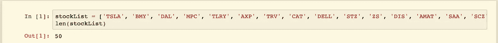
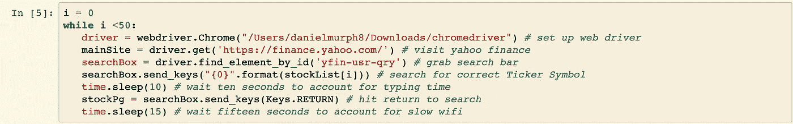
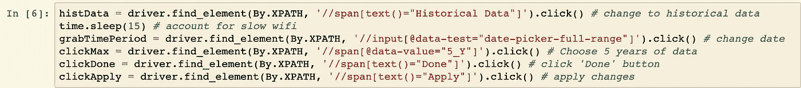
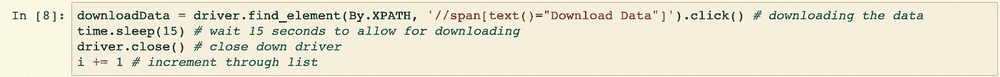
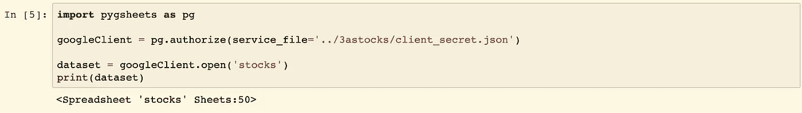

# 使用 Selenium、Pygsheets 从 Yahoo Finance 自动收集数据

> 原文：<https://towardsdatascience.com/automated-data-collection-from-yahoo-finance-with-selenium-pygsheets-126539999d72?source=collection_archive---------24----------------------->

Alexandre Debiève 在 [Unsplash](https://unsplash.com/) 上拍摄的照片。

## 将数据收集掌握在自己手中的简单方法

> 最近，我一直在学习技术交易，以及算法如何帮助投资者做出高效和有效的决策。鉴于人工智能和机器学习在金融领域日益突出，我认为值得研究学生和年轻专业人士如何参与进来。在接下来的文章中，我将概述我在获取数据、清理数据和在 Google Sheets 中托管数据时采取的最初步骤。

# 概观

在这个项目的最初步骤中，我想找到一种方法来自动收集历史数据，确保它清晰易懂，并将其附加到 google 工作表中。由于我正在收集 50 只股票的数据，我知道我不想手动点击雅虎财经，改变日期范围过滤器，并下载数据 50 次。为了实现自动化，我决定使用 Selenium (webdriver、Keys 和 By)、Pandas 和 time 库。 *Yfinance* 是一个允许与雅虎财经轻松互动的 API，但我认为自己尝试自动化数据收集将是一个有趣而富有挑战性的项目。

# 第一步

首先，我必须决定要收集哪些股票的数据。为了做到这一点，我利用了我的 [Robinhood](http://www.robinhood.com) 账户中的“观察列表”。在过去的两年里，我花了一些空闲时间交易、研究和测试某些策略。在整个过程中，我收集了有价值的反馈，帮助我了解了股票市场中什么可行(什么不可行)的开端。下面是我的股票代码清单的代码片段:

有了这个列表，我将能够使用股票代码在雅虎财经上搜索正确的股票，获取其历史数据，然后将其下载到我的电脑上。

# 第二步

我决定使用一个“while”循环来遍历列表中的每个值。在这个循环中，我将执行三个步骤:

1.  **首先**，我将设置我的 web 驱动程序，并利用 selenium 抓取雅虎财经搜索栏，搜索正确的股票代码。在整个过程中，我将利用 **time.sleep()** 来说明缓慢的 WiFi 和/或需要一段时间才能在浏览器中编译的进程。下面的代码片段突出了我用来完成第 1 部分的代码:

构建自动化数据收集算法的第一部分

2.**第二个**，我会切换到“历史数据”标签页。然后，我将单击日期范围过滤器，将其切换到 5 年，并单击“完成”和“应用”span 元素以应用更改。

构建自动化数据收集算法的第二部分

3.**最后，**我将单击“下载数据”span 元素，等待 15 秒钟，让文件完全下载到我的计算机上，然后关闭我的 web 驱动程序。在这之后，我将“I”加 1，继续到列表中的下一个索引。这个循环将一直持续到我列表中的最后一只股票。

构建自动化数据收集算法的第三部分

# 第三步

在使用 [pygsheets](https://pygsheets.readthedocs.io/en/stable/#) 将这些 CSV 文件读入 google sheets 后，我们有了一个如下所示的数据集:

 [## 股票

### TSLA 日期，开盘，盘高，盘低，收盘，调整收盘，成交量 2020-01-03，440.5，454，436.920013，443.01001，443.01777774856

docs.google.com](https://docs.google.com/spreadsheets/d/1VJbaZoem-XFa_uboQfJHVvx64ryOseM0sJvWN7PJXB0/edit?usp=sharing) 

这个数据集的维度可以用我们 Jupyter 笔记本中的几行代码来验证:

虽然为我们的股票列表收集了 5 年的历史数据，但我将在下一篇文章中更进一步(我将编写一个 python 脚本，每天运行它来自动收集数据)。

**补充说明:使用 selenium 有一种更简单的方法，通过用股票符号格式化 url 来直接进入历史数据页面。我还将在下一篇文章中介绍这一点(我决定不在本文中使用它，因为纯粹是为了挑战用 selenium 一页一页地浏览网站。**