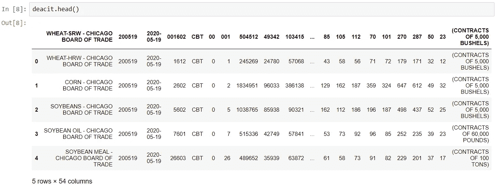
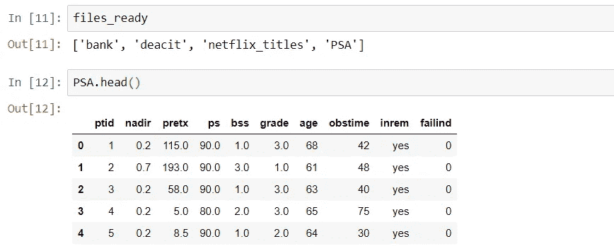

# 使用 Python 自动导入数据

> 原文：<https://towardsdatascience.com/automated-data-import-with-python-832e8f912845?source=collection_archive---------40----------------------->

## python 中数据文件导入的自动化方法。


SpaceX 在 [Unsplash](https://unsplash.com/?utm_source=unsplash&utm_medium=referral&utm_content=creditCopyText) 上拍摄的

数据导入在数据科学中起着举足轻重的作用。知道如何做可以防止模型失败的可能性。为了实现这一点，不同的方法取决于数据类型(例如 csv，。txt，。json)，都有可能。

将数据放入 python 环境是构建模型的基本步骤之一。在某些情况下，我们必须在不使用 API 或 SQL 数据库的情况下加载数据。在本教程中，我将介绍如何在 Python 中自动加载数据。编译这个可能有点棘手。此外，有可能找到一种简单的方法来做这件事。但是我想让你看看我复杂的方法。所以让我们开始吧。

## 入门指南

在开始之前，让我们使用以下命令导入必需的库。在适当的时候，我会解释为什么我们需要这些模块。

```
import pandas as pd
import os
from os import listdir
from os.path import isfile,join
import csv
```

下图显示了包含几种数据文件类型的数据文件夹。请记住文件名。我们将使用它们来创建变量名。


通常，我宁愿将我的工作目录指定为文件路径。这让我可以快速地组合文件路径和文件夹名称。

```
**#assign working directory to variable**
file_path=os.getcwd()**#setting path for data folder**
data_path=file_path+'\\'+'data'
```

## 提取文件名

这一步至关重要，因为我们将从文件名中生成变量名。有两种不同的代码来提取文件名。第一个有扩展，另一个没有扩展。我们使用 ***【列表目录】*** 和***【is file】***方法获取文件名。***【listdir】***方法是获取指定目录下所有文件的列表。在我们的代码中，目录是***【data _ path】***，这是我们不久前分配给我们的工作目录。所以，***【is file】***方法检查该文件是否存在于该文件夹中。

```
**# extracting file names without extensions**
file_names=[".".join(f.split(".")[:-1]) for f in listdir(data_path) if isfile (join(data_path,f))] **# extracting file names with extensions**
full_file_names=[f for f in listdir(data_path) if isfile (join(data_path,f))]**#checking file names and extensions** print(file_names)
print(full_file_names)
```

## 获取分隔符

到目前为止，一切都很好。现在是时候检测文件中使用哪个分隔符作为分隔符了。要做到这一点，我们需要由"*类提供的*方法。这个类用于推导 csv 文件的格式。**

```
****#creating a dictionary with file names and their extensions**
dict_del={}
delimit=[]
for i in range(len(file_names)):
    delimit.append(i)
t=0
for s in full_file_names:
    with open(data_path+'\\'+s, newline='', encoding="utf8") as csvfile:
        dialect = csv.Sniffer().sniff(csvfile.read(1024))
        csvfile.seek(0)
        reader = csv.reader(csvfile, dialect)
        delimit[t]=dialect.delimiter
        dict_del[s]=delimit[t]
        t+=1**
```

**正如你注意到的，我们建立了一个字典和一个列表。名为 ***【分隔符】*** 的列表用于存储分隔符。我们使用 for 循环语法，通过索引用提取的分隔符轻松替换随机值。字典包含文件名(作为键)和分隔符(作为值)。让我们检查一下我们有什么；**

```
****#checking dictionary and delimiters**
print(dict_del)
print(delimit)**
```

## **一个有风险的方法:globals()**

**是时候使用“***【globals()”***方法来创建变量了。有消息来源 **(** [**链接**](https://wiki.c2.com/?GlobalVariablesAreBad) **)** 说它危险是因为它是全球性的。 ***这种方法会造成混乱，所以请仔细阅读！*****

```
****#creating global variables depend on file names**
z=0
files_ready=[]
for f,r in zip(file_names,full_file_names):
    globals()[f]=pd.read_csv(data_path+'\\'+r,sep=dict_del[r])        
    files_ready.append(f)
    z+=1**
```

**如果您注意到，变量是为每个文件名单独创建的。我们完了！让我们确保它有效。**

```
****#checking data files**
print(files_ready)
bank.head()
deacit.head()
netflix_titles.head()**
```

**瞧啊。我们加载了所有文件，并给它们分配了一个变量。**

************

**最后，让我们对一个新的数据文件进行双重检查。我刚刚保存了一个`.txt`文件。(PSA)**

****

**我想知道它是否有效。**

```
****#checking the new file**
print(files_ready)
PSA.head()**
```

****

**一切似乎都运转正常。**

## **最后的想法**

**正如我之前所说，我并不声称这些是实现这一目标的唯一和容易的选择。本教程是我创建的自动化过程的方式。随意开发代码。:)**

****优点**:**

*   **只需运行代码，在短时间内加载几个文件。**
*   **你不需要考虑变量名。**
*   **你不会错过任何新文件。**

****缺点**:**

*   **我测试的代码只有 csv 和 txt 文件。**
*   **可能有更简单的方法。请去看看:)**

****有用链接****

*   **学习如何使用 split()函数([链接](https://docs.python.org/3/library/stdtypes.html#str.split))**
*   **os.path.join 和 os.path.isfile ( [链接](https://docs.python.org/3/library/pathlib.html#module-pathlib))**

## **概述**

**数据导入本质上是一项繁重的工作，但它仍然是构建数据模型的重要组成部分。你可以找到并使用更多的方法。**

**构建您的方法将提高您的编码技能。我希望这个指南对你有用。感谢阅读到最后。**

## ****代码**:**

**[](https://www.linkedin.com/in/esersaygin/) [## eser saygı客户细分主管—图尔基耶 i̇ş银行| LinkedIn

### 经验丰富的项目主管，有银行业工作经验。英语熟练…

www.linkedin.com](https://www.linkedin.com/in/esersaygin/)**