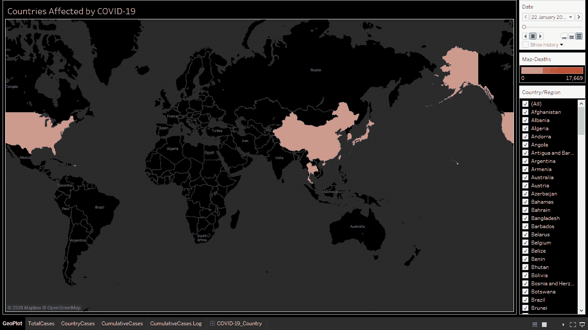

# 实时 Tableau 公共可视化的自动化 ETL

> 原文：<https://towardsdatascience.com/automated-etl-for-live-tableau-public-visualizations-54f2b8652224?source=collection_archive---------34----------------------->

## Python，Google Sheets，Tableau Public，Windows 任务调度器

[https://public.tableau.com/profile/eklavya.saxena#!/viz home/CoronavirusCOVID-19 cases world wide/新冠肺炎 _Country](https://public.tableau.com/profile/eklavya.saxena#!/vizhome/CoronavirusCOVID-19CasesWorldwide/COVID-19_Country)

在积极寻找全职工作机会的同时，在新的冠状病毒新冠肺炎爆发的不确定时期，我感到有必要创建一个一站式 Tableau 可视化仪表板来提高认识。渐渐地，我发现了**零美元资源**来保持更新或者在 Tableau Public 上生存。我希望这有助于我们保持更新，而不必经常粘在新闻频道上，我相信这有时确实会令人沮丧。

当我的一位采访者对我的见解和陈述表示赞赏，但同时引用“你对新冠肺炎数字的可视化很低，哦！不更新”。

那一刻，我感到**受到了**的挑战。在那之前，和我们许多人一样，我一直相信 Tableau Public 不可能有实时数据。如果你想打破这个神话，你来对了博客。简而言之，Google Sheets 就是你的答案。

这篇博客分为两个部分，有效地涵盖了**实时 Tableau 公共可视化的自动化 ETL 的所有方面。**

## [**1。从 GitHub 提取数据并自动运行或调度 Python 脚本**](/data-extraction-from-github-and-auto-run-or-schedule-python-script-9d1910239085)

这一部分(*点击上面的链接标题*)将讨论如何从 raw 中提取数据。GitHub 用户内容的 csv 文件，以及如何在 Windows 上使用任务调度程序自动运行 Python 脚本，包括以下子部分:

1.  从原始数据中提取数据。GitHub 用户内容的 csv 文件
2.  使用 Windows 上的任务调度程序自动化 Python 脚本

 [## 从 GitHub 提取数据，并自动运行或调度 Python 脚本

### 博客的第一部分——实时 Tableau 公共可视化的自动化 ETL

towardsdatascience.com](/data-extraction-from-github-and-auto-run-or-schedule-python-script-9d1910239085) 

## [②**。Python 熊猫 data frame to Google Sheets for Tableau Public LIVE**](/python-pandas-dataframe-to-google-sheets-for-tableau-desktop-live-cc1f86982bca)

本部分(*点击上面的链接标题*)将重点介绍如何使用 pygheets 库将 Pandas Dataframe 转换为 Google Sheets，以及如何使用 Google Sheets 启用 Tableau Public LIVE，包括以下子部分:

1.  启用 Google Sheets API 并创建凭证
2.  将 Python 连接到 Google Sheets 并导出数据帧
3.  使用 Google Sheets 启用 Tableau 公共直播

 [## Python 熊猫数据帧到谷歌表格桌面直播

### 博客的第二部分——实时 Tableau 公共可视化的自动化 ETL

towardsdatascience.com](/python-pandas-dataframe-to-google-sheets-for-tableau-desktop-live-cc1f86982bca) 

感谢您的阅读！我希望这篇博客揭示了一个有趣的方面，即如何为 LIVE Tableau 公共可视化创建自动化 ETL。如果你觉得这有帮助或者没有帮助，请在评论中告诉我。如果这篇文章是有帮助的，分享它。

 [## Eklavya Saxena -印度|职业简介| LinkedIn

### 精通数据的分析师和有抱负的数据科学家，拥有 2 年以上的销售或客户行业经验…

www.linkedin.com](https://www.linkedin.com/in/eklavyasaxena/)