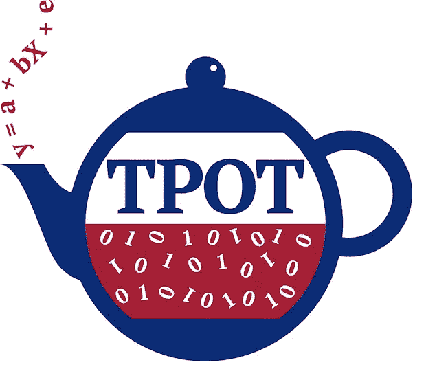

# 自动机器学习(AutoML)简介— TPOT 模块案例

> 原文：<https://towardsdatascience.com/automated-machine-learning-automl-gentle-introduction-tpot-module-case-f5d5a73b2b29?source=collection_archive---------35----------------------->

## 自动机器学习模块简介


斯坦纳·恩格兰在 [Unsplash](https://unsplash.com?utm_source=medium&utm_medium=referral) 上拍摄的照片

根据[维基百科](https://en.wikipedia.org/wiki/Automated_machine_learning)的说法，自动机器学习或 **AutoML** 是将机器学习应用于现实世界问题的过程自动化的过程。AutoML 旨在从原始数据到可部署的机器学习模型建立一个完整的管道。用一个更简单的术语来说， **AutoML 能够自动创建一个机器学习模型，而不需要先前**的模型的先验知识。AutoML 本身仍然是人工智能领域最受欢迎的产品之一。

[直到 2019 年或者最近](https://www.gartner.com/smarterwithgartner/top-trends-on-the-gartner-hype-cycle-for-artificial-intelligence-2019/)，AutoML 正处于人们对人工智能期望的巅峰。不管是什么原因让人们大肆宣传 AutoML，不可否认的是，这个 AutoML 将极大地改变人们在数据科学领域的工作方式。作为一名数据科学家，我也在日常工作中应用 AutoML。

AutoML 是未来，但它并不像没有任何不利的一面。关于 AutoML，我注意到的几件事是:

*   它不会取代数据科学家的工作。我们毕竟是人，是决定哪种结果可以产生和部署的人。
*   **数据还是最重要的。**您可以将任何原始数据放入模型，但是不需要任何预处理或关于数据的进一步知识；不会有好的结果。
*   **预测指标是唯一的目标**。在数据科学工作中，预测模型不一定是我们唯一想要的东西。大多数时候，我们想要的是模型对数据的解释。如果你的目标是知道什么特性是最重要的，那么 AutoML 是不合适的。

虽然有一些缺点，但 AutoML 仍然是数据科学领域的一个突破，作为一名数据科学家，了解它是理所当然的。在这篇文章中，我想介绍如何实现 AutoML 和一个 AutoML 模块；TPOT。

# TPOT



TPOT 的好意

[](https://epistasislab.github.io/tpot/)****是一个优化机器学习流水线的 Python AutoML 模块。它将智能地探索成千上万个可能的管道，以找到最适合您的数据的管道，一旦它完成搜索(或者您厌倦了等待)，它会为您提供找到的最佳管道的 Python 代码，以便您可以从那里修补管道。在 TPOT 探索的大部分 python 代码都是基于 Python 模块 [**Scikit-learn**](https://scikit-learn.org/stable/index.html) (不限于，但大部分都是)的，这是大多数使用 Python 从事 ML 工作的人所熟悉的。****

********

****机器学习管道的例子。由 [TPOT](https://epistasislab.github.io/tpot/) 提供****

****探索过程基于**遗传编程**。根据[维基百科](https://en.wikipedia.org/wiki/Genetic_programming)的说法，这是一种进化程序的技术，我们从不适合的(通常是随机的)程序群体开始，通过对程序群体应用类似于自然遗传过程的操作来适应特定的任务。更简单地说，**它从随机 ML 模型开始，通过选择模型(和参数)的随机过程，它将走向最佳模型的方向。**TPOT 使用的参数中有许多生物技术术语，但我会在后面解释一些重要的参数。****

****TPOT 既用于分类问题，也用于回归问题，基本上是一个监督学习问题，我们需要预测目标数据。让我们试着用 TPOT 做一个例子。****

# ****TPOT 的例子****

****出于学习目的，我将使用从 [Kaggle](https://www.kaggle.com/ronitf/heart-disease-uci) 获得的心脏病数据集。数据的快照如下所示。****

```
**import pandas as pd
heart = pd.read_csv('heart.csv')
heart.head()**
```

********

****您可以阅读源中每一列的解释，但是这个数据集正在处理一个分类问题；不管某人是否有心脏病。我不会做任何数据预处理，因为我的意图只是给出一个 TPOT 如何工作的例子。****

****首先，我们需要[安装](https://epistasislab.github.io/tpot/installing/)模块。使用 TPOT 的建议是使用 Python 的[**【Anaconda】**](https://www.continuum.io/downloads)**发行版，因为许多必要的模块已经存在。然后，我们通过 pip 或 conda 安装模块。******

```
****#Using pip
pip install tpot#or if you prefer conda
conda install -c conda-forge tpot****
```

******现在我们准备使用 TPOT 模块来尝试我们的 AutoML。让我们导入所有模块，并准备我们将使用的数据。******

```
****#Import the TPOT specific for classification problem
from tpot import TPOTClassifier#We use the train_test_split to divide the data into the training data and the testing data
from sklearn.model_selection import train_test_split#Dividing the data. I take 20% of the data as test data and set the random_state for repeatabilityX_train, X_test, y_train, y_test = train_test_split(heart.drop('target', axis = 1), heart['target'], test_size = 0.2, random_state = 101)****
```

******所有的准备工作都已就绪，现在让我们尝试使用 TPOT 的 AutoML 来解决分类问题。******

```
****tpot = TPOTClassifier(generations=100, population_size=100,
                          offspring_size=None,
                          scoring='accuracy',
                          max_time_mins=None, 
                          max_eval_time_mins=5,
                          random_state=101,
                          warm_start=True,
                          early_stop=20,
                          verbosity=2)****
```

******这个分类器似乎有很多参数，是的。您可以在这里检查 TPOTClassifier [中存在的所有参数，但是我将在下面解释一些重要的参数:](https://epistasislab.github.io/tpot/api/)******

*   ********世代**控制运行流水线优化过程的迭代次数。******
*   ******population_size** 控制每一代遗传编程群体中保留的个体数量。****
*   ******后代尺寸**控制每一代遗传程序中产生的后代数量。默认情况下，它等于第**代**的大小。****

****总的来说，TPOT 将评估 ***人口 _ 规模*** + ***世代*** × ***后代 _ 规模*** 管道。因此，上面我们将有 100 + 100 × 100 个管道需要评估。****

****其他重要参数包括:****

*   ******评分**控制功能用于评估给定管道对于分类问题的质量。参见评分功能[这里的](https://epistasislab.github.io/tpot/using/#scoring-functions)了解可以使用的评分功能。****
*   ******max_time_mins** 控制 TPOT 优化管道的时间。如果是没有，那么 TPOT 将不会有任何时间限制做优化。****
*   ******max_eval_time_mins** 控制 TPOT 评估单个管道的时间。更长的时间意味着 TPOT 可以评估更复杂的管道，但需要更长的时间。****
*   ******warm_start** 是指示 TPOT 实例是否将重用来自先前调用的群体的标志。设置 *warm_start* =True 可用于在数据集上短时间运行 TPOT，检查结果，然后从停止的地方继续 TPOT 运行。****
*   ******early_stop** 控制多少代 TPOT 检查优化过程中是否没有改进。如果在给定的数量之后没有更多的改进，那么 TPOT 将停止优化过程。****

****根据上面的参数，让我们尝试用我们的训练数据来拟合 TPOTClassifier。****

```
**tpot.fit(X_train, y_train)**
```

****优化过程如下所示:****

********

****如果**每个管道都已经被评估，达到时间限制，达到提前停止限制，或者简单地终止**，优化过程将停止。下面是我们之前尝试的 AutoML 过程的结果。****

********

****管道似乎已达到最大提前停止次数，并到达最佳管道。当然，由于这是一个随机过程，如果我再运行一次，我可能会得到一个完全不同的模型。****

****如果我们对照测试数据进行测试，让我们检查模型性能。我们可以使用优化的 TPOT 模型作为预测模型。****

```
**from sklearn.metrics import classification_report
print(classification_report(y_test, tpot.predict(X_test)))**
```

********

****尽管没有做任何预处理，这个模型看起来很好，虽然我敢打赌，如果我们分析数据，我们可以得到一个更好的模型，但让我们把它留在那里。****

****现在，如果您想拥有一套完整的管道**自动导出**，您可以使用下面的代码。****

```
**#Give any name you want but still contain the .py extension
tpot.export('tpot_heart_classifier.py')**
```

****完整的管道将显示在您的文件夹中，就在您的笔记本所在的文件夹中。如果您打开该文件，它将如下所示:****

********

****正如我们所看到的，我们不仅得到了最好的管道，还得到了完整的流程纲要。****

# ****结论****

****我只是向你展示如何使用 TPOT 汽车。这个过程很简单，从评估的角度来看，结果还不错。虽然， **AutoML 不是实现最终结果模型**的工具；事实上，AutoML 只是作为模型优化的开始，因为它可以为我们指明前进的方向。****

# ****如果您喜欢我的内容，并希望获得更多关于数据或数据科学家日常生活的深入知识，请考虑在此订阅我的[简讯。](https://cornellius.substack.com/welcome)****

> ****如果您没有订阅为中等会员，请考虑通过[我的推荐](https://cornelliusyudhawijaya.medium.com/membership)订阅。****