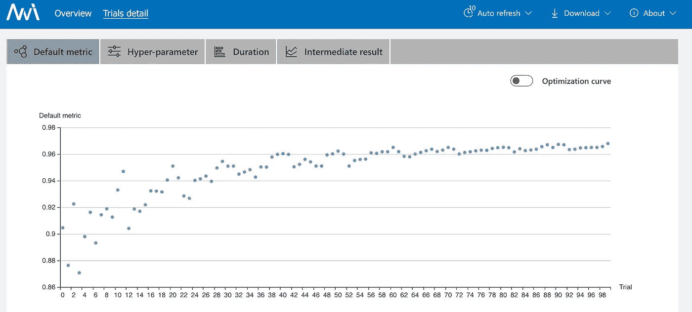

# 梯度推进机器的自动机器学习

> 原文：<https://towardsdatascience.com/automated-machine-learning-for-gradient-boosting-machines-48cd38ad9649?source=collection_archive---------80----------------------->

## 如何利用 NNI 提升梯度增强机器的超参数调节水平

像 XGBoost 和 LightGBM 这样的梯度推进机器是当今最受欢迎的机器学习算法之一，经常出现在 Kaggle 竞赛的获胜者中。尽管它们开箱即用，但通过调整算法的参数可以获得一些性能提升。此外，参数数量太多，无法直观设置或依靠快速试错法。AutoML 前来救援。

AutoML——自动化机器学习——旨在使机器学习自动化。在这里，我们主要关注超参数优化的 AutoML。我们将研究三种不同的算法，每种算法都有不同的优势:Metis、贝叶斯优化超带(BOHB)和基于群体的训练(PBT)。据我所知，最后一个还没有适应梯度增压机。正如我们将看到的，PBT 和 GBM 的结合有一些有趣的含义。

可以在 GitHub 上找到完整代码:[https://GitHub . com/NKDataConv/AutoML _ Gradient _ Boosting _ Machines](https://github.com/NKDataConv/AutoML_Gradient_Boosting_Machines)。我们将使用工具 NNI 中的 AutoML 算法。你可以在这里找到安装 NNI [的说明](https://nni.readthedocs.io/en/latest/installation.html)。此外，我们将需要 LightGBMs，你可以在这里找到安装指南。

让我们从 Metis 开始，了解如何为 NNI 调整算法培训。

## 墨提斯

梅蒂斯的想法很简单。Metis 建立了一个参数与性能的模型。在一些初始随机试验后，该模型可以推断出有希望的参数配置。尝试这些，并根据存档的性能更新模型。Metis 背景中的模型是高斯过程，并且利用贝叶斯优化进行更新。

为了使您的算法适应 Metis，您需要做的就是添加两个描述实验的文件，并将两种方法集成到您现有的代码中。让我们先看看方法: *nni.get_next_parameter()* 给出下一个要尝试的参数配置。其次，*nni . report _ final _ result()*将存档的绩效进行反馈。

在下面的代码片段中，您可以看到这两种方法是如何与训练过程的其余部分一起发挥作用的。完整代码可在 [GitHub](https://github.com/NKDataConv/AutoML_Gradient_Boosting_Machines) 上获得。

在第二行中，生成了一些默认参数。还包括一些 AutoML 没有调优的参数。

您还会注意到，数据被分成四部分:训练集、测试集和两个验证集。现在，你可能想知道，为什么要有两个验证集。也许这不是绝对必要的。尽管如此，我认为这是一个好主意。关于这一点，让我直言不讳。训练集是针对机器学习算法本身的。在训练过程之后，在验证集上测量性能。通常，您执行一些迭代训练和验证。在此过程中，您需要手动检查验证集的性能。在训练和验证之间经过足够的周期后，验证数据集上的过度拟合可能会发生。这就是为什么我们应该拿出一套测试设备的原因。有了 AutoML，训练和验证之间循环变得更加复杂，而且要进行多次。因此，拥有一个测试集比以往任何时候都更重要。该测试集仅在 AutoML 的整个过程完成后使用。

现在来看两个验证集。第一个用于确定提前停止。提前停止是一个非常强大的想法。与梯度提升机器相结合，它确保当验证数据集的性能不再提高时，不再添加更多的树。但这本身就是对验证数据的优化。请记住，我们从验证数据集转移到测试数据集，因为验证数据已经发生了优化，我们不想过度适应。这同样适用于这里。我们通过提前停止优化第一个验证集。然后，我们转向超参数优化。这就是我们使用第二个验证数据集的地方。总结:将验证一分为二的优势在于，超参数优化不会发生在早期停止后产生良好结果的参数上。相反，它针对参数进行了优化，在训练过程(包括提前停止另一部分数据)之后，这些参数会产生良好的结果。

需要注意的一件非常重要的事情是报告回来的最终分数的性质。它不一定是可微的。在这里，是准确性。但是分数可以是任何东西，甚至是你自己定义的损失。基于这种损失，超参数被优化。通常，对于机器学习中的优化，损失必须是可微的，以找到最小值。这里的情况不是这样。这在陈述问题和性能测量方面提供了很大的自由度。我们可以在这里陈述我们真正关心的东西(而不是关注数学性质)。

现在，让我们回到代码。需要一个额外的文件 *search_space.json* 来描述参数搜索空间，从该空间对超参数进行采样。

这是一个 JSON 文件。参数的名称是关键，括号中是获取新值的策略(此处仅使用随机整数和均匀分布)。更多策略可用，见[此处](https://nni.readthedocs.io/en/latest/Tutorial/SearchSpaceSpec.html)。)

第二个文件 *config.yml* 描述了 AutoML 配置。

这是 YAML 的档案。要注意的最重要的事情是获得正确的优化模式。当我们在这里优化精度时，我们希望将其最大化。如果你要使用像均方差这样的损失，你可以将它设置为*最小化*。

现在，可以从相应文件夹中的命令行启动实验:

*nni CTL create—config config . yml*

最后，您可以在 NNI UI 上观察结果。

用于超参数调整的 NNI 用户界面

## BOHB

这种算法也做贝叶斯优化，但有另一个很酷的功能。这种特性称为连续减半。总的想法是，对整个数据集的训练在计算上是昂贵的。所以你开始只训练几轮助推。在这些提升回合之后，你比较表现，并且只继续最成功的回合。他们再次接受几轮训练，并再次比较他们的表现。这一直持续到只剩下一个配置。这是最成功的配置。该过程可以分别节省资源和时间，因此，对于需要花费太多时间进行多次训练的大型复杂数据集来说，这是一种很好的方法。

我们需要做一些小的改变来适应 BOHB。

首先要注意的是参数 *TRIAL_BUDGET* 。这个是 BOHB 自己设置的，不需要包含在 *search_space.json* 中。 *TRIAL_BUDGET* 负责保持第一次试验规模较小，并在以后的试验中延长试验时间。这个想法是有 10 个助推轮的倍数。在 *TRIAL_BUDGET = 1* 的情况下，将有 10 轮助推。用 *TRIAL_BUDGET = 2* ，会有 20 轮助推，以此类推。这有一个缺点，参数 *boosting_rounds* 将不再包含在超参数优化中。

第二个要注意的是方法*nni . report _ intermediate _ result*。这不是绝对必要的，但是在 UI 中提供了一些很好的可视化效果。
最后，for 循环在第一次迭代和所有其他迭代之间存在差异。这是为了在第一次迭代中启动助推器(分别是模型)。在进一步的迭代中，模型将加载参数 *init_model* 和已经训练好的模型作为参数。

其他两个文件基本保持不变。

## 聚对苯二甲酸丁二醇酯（polybutylene terephthalate 的缩写）

现在让我们看看 PBT。这个想法类似于进化算法。PBT 总是训练一群算法。最有希望的那些将其超参数配置复制到群体中最没有希望的那些。通过应对，超参数出现微小变化。在一定的机会下，最没有希望的配置被新采样的配置替换。从一个算法到另一个算法的超参数的处理有很大的意义。在整个 AutoML 训练结束时，我们不会以某个超参数配置结束。相反，它是算法被训练的不同超参数的历史。我们还有一个训练有素的模特。利用 PBT，可以在开始时以较大的学习速率训练算法，在结束时以较低的学习速率训练算法。或者也许它有一些优势，开始时树的深度较低，结束时树的深度较高。有了 PBT，这一切都成为可能。而且是自动进行的。

与其他算法相比的一个缺点如下:通常你会在训练和验证集上找到一个好的超参数配置。然后你在你的测试集上测试它，如果你满意，在整个数据集上再次训练它。尚不清楚这对于 PBT 是否有意义。由于 PBT 返回训练好的算法，因此在整个数据集上复制超参数配置的历史可能没有意义。

最后，让我们再次看看执行情况。

作为 PBT 的一个附加参数，我们有检查点目录。它们是在一次迭代结束时从群体中保存模型并在下一次迭代开始时再次加载它们所必需的。PBT 和 NNI 会自动将来自不同群体的模型保存在专门的文件夹中。

现在你可以开始你自己的 AutoML 实验了。我建议从梅蒂斯开始。如果您的数据量很大，而时间又很紧，那么就转到 BOHB 吧。如果你可以在训练过程中忽略一些数据，尝试 PBT。如果你让我知道你的自动化实验进展如何，我会很高兴。