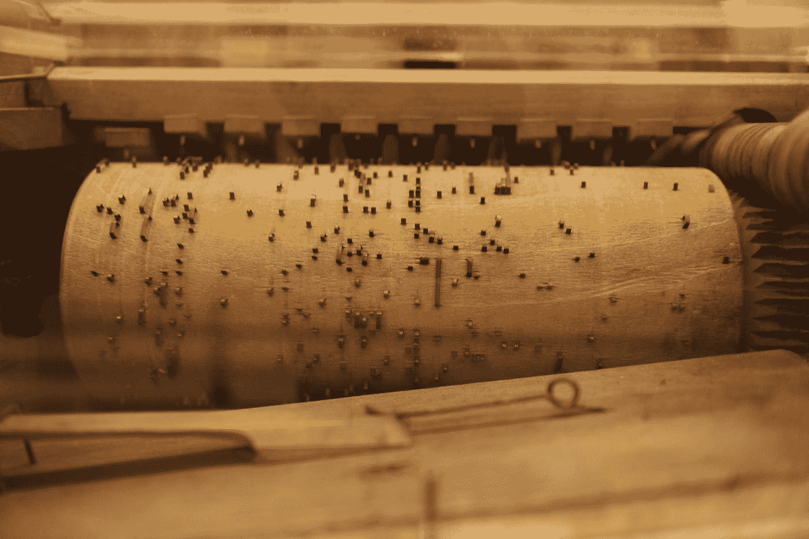

# 自动化机器学习不应该让数据科学家担心

> 原文：<https://towardsdatascience.com/automated-machine-learning-shouldnt-worry-data-scientists-9a54dfef0491?source=collection_archive---------41----------------------->

## [意见](https://towardsdatascience.com/tagged/opinion)

## 这些工具只做数据科学中简单的部分

照片由[丹尼尔·塔特尔](https://unsplash.com/@danieltuttle?utm_source=medium&utm_medium=referral)在 [Unsplash](https://unsplash.com?utm_source=medium&utm_medium=referral) 上拍摄

最近，我一直在看到很多服务和产品宣传机器学习的自动化。[数据机器人](https://www.datarobot.com/)和 [H2O.ai](https://www.h2o.ai/) 提供了允许在点击界面中创建机器学习算法的平台。他们甚至会为你做特征工程！这种功能，或者类似的东西，正在慢慢地被构建到各种工具和程序中。他们承诺自动化整个机器学习管道的创建——从特征转换、超参数调整到模型选择。有一些开源工具也可以做同样的事情(比如 [TPOT](https://github.com/EpistasisLab/tpot) ，一个我喜欢的很酷的模块，但是我永远无法在一个非常小的数据集上实际工作)。

现在，这些工具大多不是很好和/或非常昂贵(订阅数据机器人的费用，你可以雇用一名全职数据科学家)。但我毫不怀疑，很快就会有工具完全处理模型/超参数/特征转换过程。

有人问我是否担心自己作为数据科学家的工作安全。不，我没有。我迫不及待地想等到这些工具出现并开源，这样我就可以输入“import machinelearn ”,让它做愚蠢的超参数优化，然后我就可以继续做这项工作中最难的部分了。

当我获得的数据达到可以被这些工具之一接受的程度时，问题基本上就解决了。在这一点上，我需要运行一些代码来进行网格搜索，找到一个相当不错的模型，并调整超参数。见鬼，如果我现在用默认参数运行 XGBoost，它通常会和我曾经得到的一样好。做额外的调整工作是值得的，因为它相对容易，而且你很快就会达到收益递减点(除非你在一场 Kaggle 比赛中，即使收益递减也可能让你从第 10 名升至第 1 名，所以你可以充分利用精确度的每一个微小增量)。

一旦你有了你的数据格式，你就可以用它来进行一场 Kaggle 比赛，你已经完成了最困难的部分。如果在这一点上，我只是运行一个函数，进行比我的典型网格搜索更彻底的优化搜索，并且探索一些不同的特性转换，我会很高兴。也许我的模型会做得稍微好一点，我会节省自己写代码的几分钟。那会很好。但如果这会让你失业，也许你应该认真考虑一下你能拿出什么样的技能。

在我听说过的大多数数据科学职位中，一旦问题被框定，数据被收集，样本被选择，并且数据是整齐的一行一个样本的格式，困难的部分不是建立模型。最难的部分是到达那个点。虽然我不怀疑随着工具的发展，这些步骤中的一些在将来会变得更简单，但我看不出在不久的将来整个过程会容易地自动化。将业务问题转化为预测问题是困难的，需要大量的业务知识以及抽象的定量思维。弄清楚使用什么数据以及如何获取数据是很困难的——业务在发展，数据基础设施并不总是那么干净，所以这里没有现成的解决方案。选择一个无偏的样本集进行训练可能非常困难，对此没有一个千篇一律的解决方案。最常见的情况是，需要对来自问题细节知识的数据施加某种结构。

我毫不怀疑在接下来的几年里，我们会有一些很好的工具来自动构建机器学习管道。希望一旦这个问题变得微不足道，就不会有多少有抱负的数据科学家试图通过炫耀他们的模型在 Iris 数据集上有多精确来证明他们的技能。除此之外，我看不出对这个领域有什么影响。