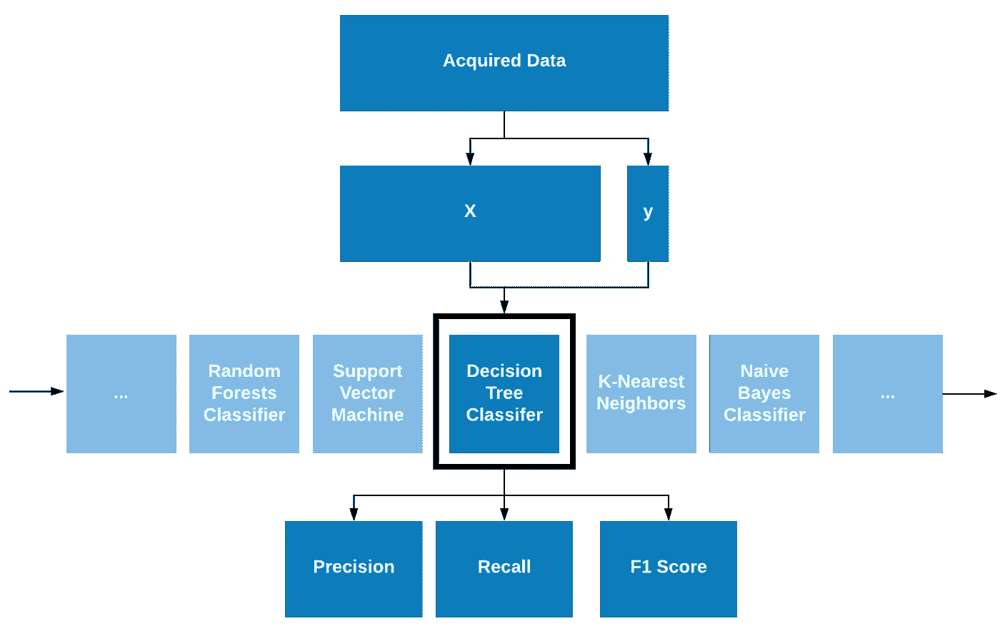
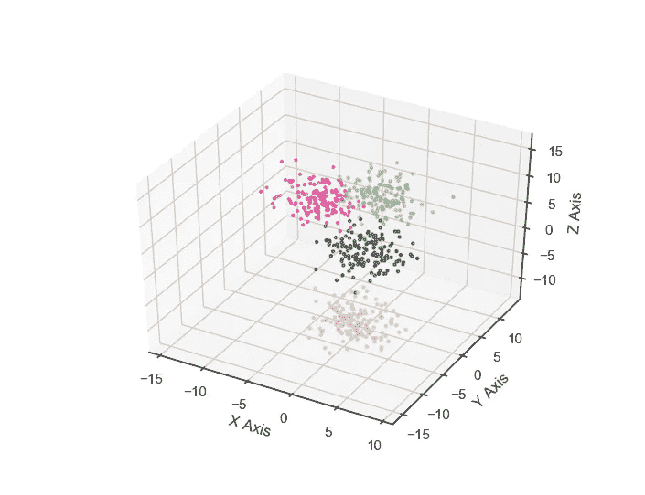
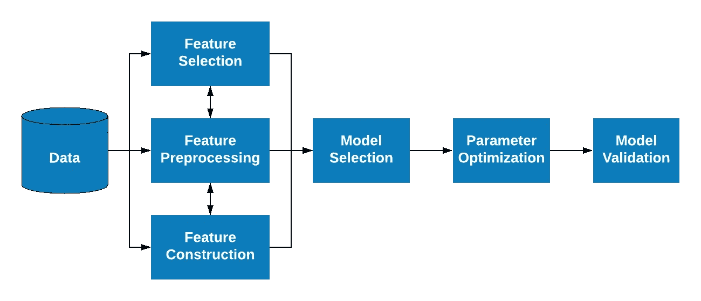

# 使用 Python3.7 的自动机器学习:提高模型开发的效率

> 原文：<https://towardsdatascience.com/automated-machine-learning-using-python3-7-improving-efficiency-in-model-development-8c3574febc0b?source=collection_archive---------10----------------------->

## 作者:[萨利赫·阿勒哈利法](https://www.linkedin.com/in/saleh-alkhalifa)和[康纳·克兰西](https://www.linkedin.com/in/conclancy)


# 介绍

随着过去几年数据科学的兴起，已经开发了各种 Python 工具和库来提高效率和扩展该领域科学家、分析师和程序员的能力。在 **2018** 中，一些最受欢迎的**技能组合**包括*熊猫*和 *Scikit-learn* 的高级使用。在 **2019** 中，一些最可雇佣的技能组合包括使用 *PyTorch* 和 *Keras* 。也就是说，2020 年的新年对我们有什么需求？在 2020 年，最受欢迎的技能之一将是自动化概念(T21)。

从数据科学的角度来看，大部分自动化通常是在机器学习模型的部署阶段观察到的。数据科学家准备数据、训练模型和部署解决方案，以循环的方式完成特定的任务。自动化的思想很少用在模型开发过程中。然而，考虑到我们已经看到的有利于自动化的转变，本文将展示如何在模型开发阶段使用自动化，使用 *GridSearchCV* 和 *TPOT* Python 库来识别准确的模型，以实现更快的模型部署。


图 1-机器学习模型开发过程。自动化通常出现在项目的部署阶段。然而，本文将展示自动化在过程的开发和验证阶段的使用。

# 标准算法选择

机器学习算法，如*决策树*、*支持向量机*或*K-最近邻*，都需要输入数据和各种参数或超参数的调整。超参数通常是由数据科学家选择的参数，如邻居的数量或树的最大深度。参数是由模型选择的内部值，例如权重。按照图 2 的原理图，采集数据，通过迭代每个算法并微调参数和超参数，开发多个模型。基于所需的标准对每个迭代进行评分，例如*准确性*和*F1-分数*，并选择得分最高的模型进行部署。



图 2——以传送带方式筛选算法的标准流程。

在开发和验证阶段，可能会使用 8-10 种不同的算法对每个数据集进行训练和评分，图 2 中列出了其中几种算法。在每种算法中，通常有 6-10 个超参数需要优化，其中许多参数的范围是无限的。假设每个模型都系统地尝试了超参数的每种可能的逻辑组合，则需要创建和测试大约 800 个模型。如果每个程序平均运行 2-3 分钟(取决于数据集的大小)，那么算法选择的参数优化将需要 2600 分钟，即每周 40 小时的标准工作时间。想象一下，如果在某种程度上，这个过程可以通过开源 Python 库实现自动化，将会取得多大的成就。

# 自动化机器学习

在 *Pypi* 中有许多允许自动算法选择和调整的库。一些著名的库包括 [*AutoML*](https://pypi.org/project/automl/) ， [*MLBox*](https://pypi.org/project/mlbox/) ，*[*Auto-sk learn*](https://pypi.org/project/auto-sklearn/)， [*GridSearchCV*](https://scikit-learn.org/stable/modules/classes.html#module-sklearn.model_selection) ，以及[*【TPOT*](https://pypi.org/project/TPOT/)——其中最后两个将是本文的重点。*

*我们将从 scikit-learn 自己的四个超参数优化器开始:*

```
*[1] [model_selection.**GridSearchCV** 
[2] model_selection.**ParameterGrid**
[3] model_selection.**ParameterSampler**
[4] model_selection.**RandomizedSearchCV**](https://scikit-learn.org/stable/modules/classes.html#module-sklearn.model_selection)*
```

*选择超参数范围的方法是这些优化器之间的主要区别。第一个选项 [*GridSearchCV*](https://scikit-learn.org/stable/modules/generated/sklearn.model_selection.GridSearchCV.html#sklearn.model_selection.GridSearchCV) 利用了一种穷举方法，其中尝试了参数的每一种可能的组合。另一方面， *RandomizedSearchCV* 尝试相同的方法，然而，尝试的是全部可能组合的随机子集。让我们在下面的例子中仔细看看 *GridSearchCV* 。*

## *数据创建和基线识别*

*我们将继续导入 *make_blobs* 库来生成一些数据供我们使用。我们将创建一个具有 4 个中心的 3D 数据集，并使用标准差 2 将它们更紧密地聚集在一起。这将确保数据没有很好地分离，并且需要开发更复杂的模型。*

```
*import pandas as pd
from sklearn.datasets import make_blobsX, y = make_blobs(n_samples=600, # Total number of samples.
                      centers=4, # Number of centers.
                   n_features=3, # Number of columns of features.
                random_state=42, # The random seed state.
                cluster_std = 2, # The standard deviation.
                  )

df = pd.DataFrame(X)
df.columns = ["col_1", "col_2", "col_3"]
df["Label"] = y* 
```

*为了确认我们的数据的形状和整体外观，我们可以将它绘制成 3D 散点图，如下所示。*

```
*from mpl_toolkits.mplot3d import Axes3D

fig = plt.figure()
ax = fig.add_subplot(111, projection='3d')
ax.scatter(df["col_1"],   # X 
           df["col_2"],   # Y
           df["col_3"],   # Z
       c = df["Label"],   # Color By
         cmap='Accent',   # Colors
                   s=5,   # Size
          )

ax.set_xlabel('X Axis')
ax.set_ylabel('Y Axis')
ax.set_zlabel('Z Axis')

plt.show()*
```

**

*图 3 —手边数据集的 3D 表示。*

*随着数据集的构建和准备就绪，我们可以继续选择一个模型。给定数据的形状、质心的位置和可分性，我们将尝试使用支持向量机( *SVM* )算法来训练分类器。*

```
*## SVM Classifier:from sklearn.svm import SVC
svc_clf = SVC(gamma='auto',
              kernel = "poly",
              C = 0.1,
              degree = 4,
              tol = 0.01,
              random_state=42
              )svc_clf.fit(X_train, y_train)# SVM  Results: precision    recall  f1-score   support0       0.58      0.91      0.71        35
1       0.92      0.59      0.72        41
2       1.00      0.86      0.93        44
3       0.97      1.00      0.98        30 accuracy                           0.83       150
   macro avg       0.87      0.84      0.83       150
weighted avg       0.87      0.83      0.83       150print("SVM Accuracy: ", accuracy_score(y_test, svc_predictions, normalize=True, sample_weight=None)*100)SVM Accuracy: 82.6%*
```

*我们的第一次尝试显示，使用上面显示的参数，一个 *SVM* 算法的准确率大约为 82%。现在可以迭代上面显示的各种参数来提高精度；然而， *GridSearchCV* 可以更有效、更系统地处理这些问题。*

## *GridSearchCV*

*将尝试使用以下方法准备 *GridSearchCV* 。将设置可能的参数范围，并且模型将尝试选择产生最佳结果的参数集。*

```
 *from sklearn.svm import SVC
from sklearn.model_selection import GridSearchCV
svc_clf = SVC(gamma = 'auto')
parameters = {'kernel':('linear', 'rbf'), 'C':[1, 2, 5, 10], "degree" : [1,2,3,4,5], "tol" : [0.001, 0.01, 0.1, 1]}
clf = GridSearchCV(svc_clf, parameters, cv = 5)
clf.fit(X_train, y_train)
print ("Best Params: ", clf.best_params_)Best Params: {'C': 1, 'degree': 1, 'kernel': 'linear', 'tol': 0.001}*
```

*随后使用推荐的参数重新运行 *SVM* 算法，我们可以达到 96%的准确率，比我们上面设定的基准高出 14%!*

*总结该过程，允许该库迭代所有可能的参数条件，并选择显示最有希望得分的条件集。这个过程太棒了。但是，这仍然需要为 7–9 个其他算法进行设置。这就是像 *TPOT* 这样的库可以用于进一步开发自动化的地方！*

## *TPOT 图书馆*

*[*TPOT*](http://epistasislab.github.io/tpot/using/#tpot-with-code) 库执行类似上面所示的搜索；在感兴趣的各种算法中的每一个上，迭代和调整后续参数。下面的图 4 描述了 *TPOT* 库运行的过程。该库导入数据集，并处理与特征预处理、特征选择和特征构造相关的所有项目。然后，TPOT 专注于算法选择、参数调整和模型验证，以优化模型。 *TPOT* 实现了 [*XGBoost*](https://xgboost.readthedocs.io/en/latest/) 的使用，这是一个优化的分布式梯度增强库，旨在提高您的流程的效率和灵活性。*

**

*图 4——TPOT 图书馆运作流程示意图。*

*出于本教程的目的， *TPOT* 将通过下面这段代码确定算法和参数。*

```
*from tpot import TPOTClassifier

pipeline_optimizer = TPOTClassifier(
    generations=5,         # Number of iterations
    population_size=30,    # number of individuals 
    cv=5,                  # Cross validationpipelines
    random_state=42,       # The seed of the pseudo random generator
    verbosity=3,           # Level of communication 
    scoring="f1_weighted"  # Scoring evaluation
)

pipeline_optimizer.fit(X_train, y_train)
pipeline_optimizer.score(X_test, y_test)

pipeline_optimizer.export('tpot_exported_pipeline.py')
print(pipeline_optimizer.fitted_pipeline_)*
```

*完成此过程后，管道将导出一个名为*tpot _ exported _ pipeline . py*的文件，其中包含模型和结果。我们可以从打印在最后一行的拟合管道中看到，正确分类数据集数据点的最佳参数应该使用以下内容:*

```
*Pipeline(memory=None,
         steps=[('gaussiannb', 
                   GaussianNB(priors = None,
                       var_smoothing = 1e-09))],verbose=False)*
```

*使用*高斯算法*重新运行数据集后，我们达到了 **98%** 的准确率！大约比我们上一个型号高 2%。*

# *结论*

*在机器学习模型开发过程的模型开发和验证阶段，可以使用 *GridSearchCV* 和 *TPOT* 库。 *GridSearchCV* 专门用于识别给定算法的最佳超参数；我们成功地将准确率提高了 14%,而没有明显的召回损失，总准确率达到 96%。 *TPOT* 用于自动算法和超参数选择，从而成功地将我们的准确率提高到 98%。**在模型开发阶段实施这两种方法** **将有助于提高模型的准确性，减少总的开发时间。***

*我们希望这篇文章既有益又有趣。一如既往，我们试图迎合我们的文章，以满足经验和非经验用户的需求。对于未来文章的建议，请随时通过文章顶部的 LinkedIn 个人资料联系我们。*