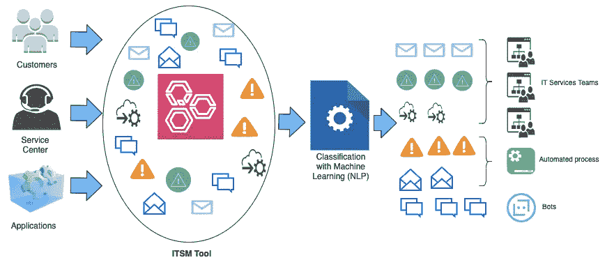
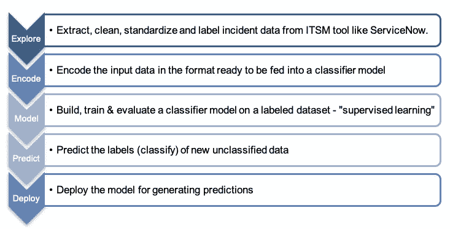
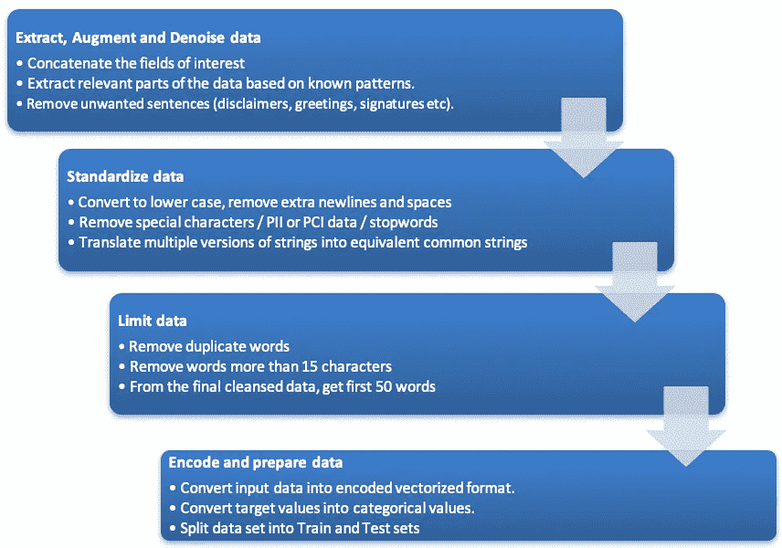
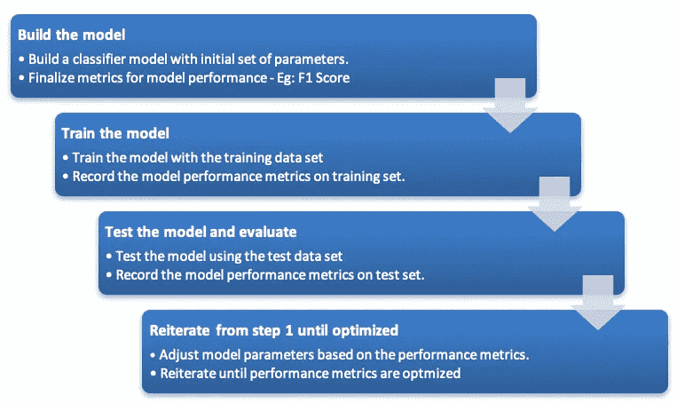
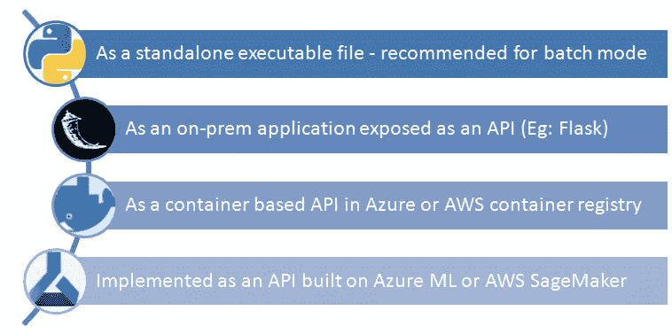
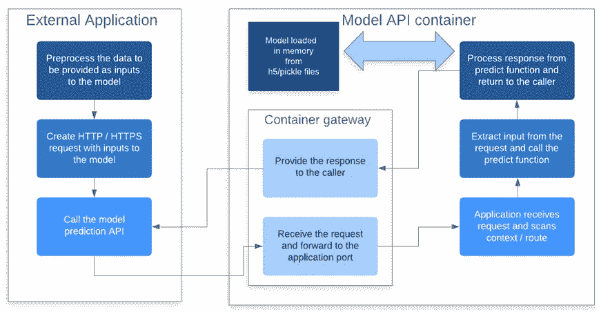
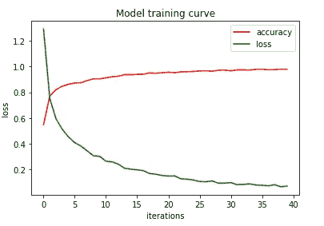
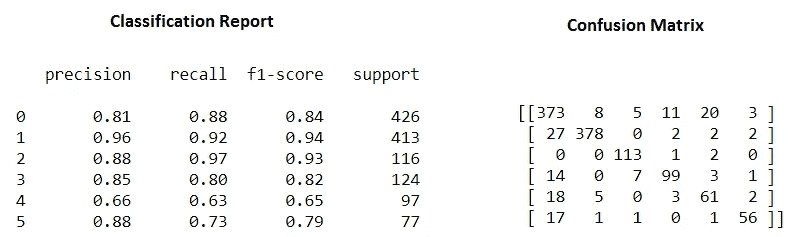

# 使用 NLP 在 ITSM 进行服务请求分类

> 原文：<https://towardsdatascience.com/automated-request-classification-in-it-services-management-2d1034fa83c1?source=collection_archive---------28----------------------->

## 初学者指南



使用机器学习对 ITSM 环境中的服务请求和事件进行分类

> 客户体验是下一个竞争战场。杰里·格雷瓜尔
> 
> 你最不满意的顾客是你最大的学习来源。~ *比尔·盖茨*

对于任何企业来说，客户的好感都是成功的关键驱动力。运行高效和有效的 IT 服务管理系统对赢得客户好感和获得竞争优势大有帮助。

让我们探索一下如何应用自然语言处理(NLP)来减少生产环境中服务请求或事件的平均修复时间(MTTR)。

让我们看一个假设的案例研究。

***起飞成功*** *:*

*“ABC 时尚”推出了会员奖励计划，为客户提供了更新版的在线门户网站。在幕后，IT 基础设施有 3 个新的应用程序，为上游和下游系统之间的 15 个集成做出了贡献。一个 10 人的 IT 服务团队，内部分成 3 个子团队，每个子团队处理一个特定的集成领域，在新程序上线并中断一些事情之前，一直在提供最高质量的服务:*

***“休斯顿——我们有麻烦了”！！***

*>服务请求量增加了 5 倍，部分原因是客户对新系统缺乏了解，部分原因是系统集成中的已知问题。团队无法遵守如此高容量的服务水平协议(SLA)。*

*>来自客户的请求涵盖了以自由文本格式描述的广泛问题，这些问题在分析阶段很难手动分类。通常，客户没有在“联系我们”web 表单中选择正确的类别和子类别，这导致了不正确的分类和 IT 服务团队分配。这种请求的重新安排有助于 MTTR。*

*>由于系统中集成点增多，生产事故数量增加。然而，一些事故可以通过简单的步骤解决。*

直到团队成员分析了问题，请求才获得适当的优先级。例如，无论在请求创建期间设置了什么样的默认优先级，门户登录失败或应用程序停机都应该以最高优先级来处理。

***我们有解决办法吗？***

谢天谢地，是的。进一步的头脑风暴表明，如果服务请求和事件在到达 IT 支持团队 之前得到适当的分类和标记，这些问题可以得到缓解 ***。***

一个**请求分类系统**将解决这个问题，如果它是:

1.  **自动化**:零人工干预完成。
2.  **基于内容**:基于对请求中包含的实际内容的审查，而不是基于创建时错误选择的类别的人工猜测。
3.  **实时**:在创建请求或事件时实时完成，而不是等到团队成员手动分类。

# 机器学习拯救世界

自然语言处理(NLP)是人工智能的一个子领域，涉及计算机和人类(自然)语言之间的交互。它用于将机器学习算法应用于文本和语音。

例如，我们可以使用 NLP 来创建语音识别、文档摘要、机器翻译、垃圾邮件检测、命名实体识别、问题回答、自动完成、预测打字等系统。

对于讨论中的问题，NLP 可以用于使分类“基于内容”,其中通过分析请求的内容，使用训练的模型来预测类别。

基于 NLP 的系统具有以下先决条件:

1.  文本数据在输入系统之前应进行预处理。它应该丢弃“不需要的”和“噪声”数据。
2.  文本数据应该标准化并“编码”成模型算法可以理解的格式；原始文本数据不能输入模型。通常，文本中的单词或字母被编码成数字，这些数字以某种方式向模型表示其含义。对于感兴趣的读者，这里有一个很好的文本编码解释:[https://towardsdatascience . com/Text-Encoding-a-review-7c 929514 cccf](/text-encoding-a-review-7c929514cccf)
3.  精确标注数据集的可用性是构建有效预测的良好模型的关键。这对于“监督学习”来说是正确的，在这种情况下，模型将从标记的数据集学习特征和模式，以便它可以预测未知或新输入数据的结果。例如，模型可以"*学习"*像点数、兑换、奖励、挣得等这样词语。出现在请求描述中可能意味着该请求应该属于“奖励积分”类别。如果可以提取历史服务请求或事件并正确标记以训练模型，则获得更准确的分类器的机会就越大。
4.  应该清楚地定义目标类别，以便分类能够很好地工作。类别的数量不应该太低(重置本练习的整个原因)或太高(分类器将不能有效地理解正确的类别)。类别应该清晰且不重叠，以避免模型混淆。

考虑到这些，下面是构建服务请求分类器的基本 NLP 方法:



基于 NLP 的应用程序开发的典型流程

# 基本解决方案的 100 英尺视角

NLP 是一个海洋，有成千上万的文本处理方法和算法可供我们使用，随着我们试图更接近人类理解文本的专业知识，它每天都在不断改进。

然而，当手头的问题值得这样做时，简单往往会有回报。

让我们按照上面提到的开发模型，探索一个非常简单的方法来解决 *ABC 时装店*的分类问题。

## 目标类别:

以下是一些假设但真实的类别，可由 *ABC 时尚店*使用。它们互不重叠，涵盖了一般报告的大多数问题类型。


CRM 服务管理系统的目标类别示例

## 分类器模型性能度量最终确定:

模型的性能意味着该模型根据其学习的特征预测结果的好坏。对于目前的问题，将根据模型预测服务请求类别(从下面提到的 6 个类别中)的正确程度来衡量性能。

有许多方法可以衡量模型性能，其中 F1 分数简单易用。F1 分数基于两个指标—精确度和召回率，这两个指标决定了预测值的正确比例和预测的已知值的正确比例。

例如:如果模型将 10 个服务请求分类为“应用程序问题”，其中 8 个是实际的应用程序问题，而标记数据集中已知应用程序问题的总数为 12，则精度= 8/10 (0.8)，召回= 10/12 (0.83)。F1 得分= 2 P*R / (P+R) = 0.814

更多信息，请查看:【https://en.wikipedia.org/wiki/F1_score】T4

所以对于这个问题， **F1 分数**作为一个性能指标。

## 探索性数据分析:

假设服务请求的已标记数据集可用(可能是对过去 2 年的历史数据进行的人工标记),该数据集具有所有相关文本属性以及目标标签，探索性数据分析可以提供对数据的重要洞察，如:

>按标记目标分组的记录计数—该数据集中排名前 5 的类别是什么？它是否严重偏向任何一种类型？

>文本属性对于分析有多好？有太长/太短的单词吗？有没有需要删除的 PII 数据？他们的同一文本的多个版本—“登录”、“登录”、“登录”、“登录”具有相同的含义，并且可以转换为“登录”。

Pandas 是一个用于探索性数据分析的优秀软件包。将 json 或 csv 格式的源数据导入 Pandas 数据框后，可以应用各种函数来了解数据的特征，并基于正则表达式提取相关数据。

对于当前的问题，来自服务请求的字段子集，如“请求简短描述”、“详细描述”、“附加说明”、“工作日志”等，并将它们连接起来以获得源数据。源中的整个文本可能没有用，我们将不需要的普通行删除，以使文本更清晰。

## 文本数据编码和特征选择:

文本分类器模型应该基于从来自相同数据域的相似标记数据集中学习到的“特征”来预测任何输入文本数据的类别。如果我们有一些历史服务请求数据，这些数据在问题分析过程中被归类到上述类别之一，那么这些“知识”需要是原始文本，因此需要被转换成模型能够理解的特征值。从更高的层面来说，一个文本句子根据一些规则和预先确定的“词汇”被转换成一个数字向量——实数或整数。

这里不需要复杂的预训练编码器，因为重点是关键字的*存在，而不是文本中单词的特定上下文和顺序。*

Scikitlearn 是最易于使用的软件包之一，可用于文本编码和模型开发。它有各种各样的文本分析库以及实用程序和优化算法，可以帮助我们开始学习 NLP。



典型的文本标准化和编码过程

## 培训、测试和评估模型:

模型开发和测试遵循以下方法。模型开发是一个迭代的过程，在此过程中，根据模型指标(F1 分数)对模型进行评估，如果结果不令人满意，可以调整模型参数并重新开始训练过程。对于分类问题，“混淆矩阵”特别有助于检查模型表现不佳的特定情况，这意味着它预测输入数据的不同标签。这种情况需要重新考虑，特别是在数据 a 的可用性方面

如果随后的训练和测试没有提高 F1 分数很多，那么数据集大小或文本编码中的特征数量可能会被重新考虑。如果仍然没有什么需要改进的地方，可以认为模型已经优化了。



典型的模型开发和测试周期

## 部署模型:

一旦模型被构建和测试，最重要的部分就是部署。虽然现在大多数现代 ITSM 工具都具有可以定制的开箱即用的人工智能功能，但拥有一个内部构建的分类器模型总是有助于获得更多的控制和多功能性。

以下是部署分类器模型的几种方法:



部署分类器模型的各种选项

但是，将该模型部署到生产环境的最佳方式是将其预测功能作为 API 公开，该 API 支持与 ITSM 工具的实时集成，从而在创建服务请求时对其进行即时分类。



ITSM 工具和部署模型之间的典型 API 集成

基于容器的解决方案将所有的模型数据、元数据、库和实用函数封装在一个容器“映像”中，并将模型打包成一个可移植的应用程序。这些映像可以部署到 AWS 或 Azure cloud container 注册表中，从而在基础架构、可伸缩性、安全性和可用性方面更加易于管理。

最后，这是一个基于可用技术堆栈、预算和能力的最符合组织利益的架构决策。

# 分类器的示例配置

对于那些了解 NLP 概念、工具包和行话的人来说，下面是一个非常基本的和部分调优的样本模型开发方法:

>**输入数据集**:来自 ITSM 工具的服务请求数据转储 csv 文件，已完成标记。

>**变量**:

自变量 X =来自感兴趣领域的扩充、处理和标准化文本，如简短描述、说明、结束语、附加注释。

因变量 Y =个目标标签之一

**>特征生成—编码:**

scikitlearn 的 Encoder = CountVectorizer。

词汇表最多选择 3000 个单词(max_features ),并且只选择出现在 5 个以上示例中的单词。选择单个单词进行模式匹配(ngram_range=(1，1))

```
from sklearn.feature_extraction.text import CountVectorizer**# initialize a count vectorizer** 
cv = CountVectorizer(min_df = 5,max_df=1.0, max_features=3000, ngram_range=(1, 1))**# provide the entire input text to fit the Vectorizer**
cv.fit(x)
```

**但是为了简单起见，对于这个特定的分类问题，不考虑这种复杂的编码。此外，像这样的分类问题，可能只需要检查单词的出现，而不是它们的相对顺序和位置/上下文；拥有一个计数矢量器是一个好的简单的开始，而不是使用 GRU/LSTM/伯特等复杂的单词嵌入。**

独立(输入 X)数据由计数矢量器编码成特征矢量。

对于类别数= 6，相关(目标 Y)数据被编码成一个独热向量。

假设我们的数据集中有 6000 个示例，并且我们将它分成 80–20 个开发交叉验证集，编码看起来会像这样:

```
**# split train test sets of raw text data**
x_train, x_test, y_train, y_test = train_test_split(x, y, test_size=0.20, random_state=0)print('x_train = {} y_train = {} x_test = {} y_test = {}'.format(x_train.shape,y_train.shape,x_test.shape,y_test.shape))x_train = (4800,) y_train = (4800,) 
x_test = (1200,) y_test = (1200,)**# Encode the train and test data into feature vectors** 
X_train_vec = cv.transform(x_train)
X_test_vec = cv.transform(x_test)**# Convert the target categories into one-hot vectors of dimension 6 (number of target labels)** y_train_oh = convert_to_one_hot(y_train,C=6)
y_test_oh = convert_to_one_hot(y_test,C=6)**# print shapes of train and test sets**
print('X_train_vec = {} X_test_vec = {}'.format(X_train_vec.shape,X_test_vec.shape))
print('y_train_oh = {} y_test_oh = {}'.format(y_train_oh.shape,y_test_oh.shape))X_train_vec = (4800, 3000) X_test_vec = (1200, 3000)
y_train_oh = (4800, 6) y_test_oh = (1200, 6)
```

可以观察到输入变量 x_train，x_test 如何从字符串的一维向量转换成编码的稀疏矩阵 X_train_vec，X_test_vec，以及输出目标类别如何被编码成向量 from，y_train，y_test 到独热表示 y_train_oh，y_test_oh。

*分类数据的一键编码请参见*[*https://machine learning mastery . com/why-one-hot-encode-data-in-machine-learning/*](https://machinelearningmastery.com/why-one-hot-encode-data-in-machine-learning/)

*>**模型类型**:浅层人工神经网络*

*>**模型架构和超参数(部分调优):***

*输入编码层→*

*隐藏层 1 (128 个单位)→放弃正则化 1 (p=0.6) →*

*隐藏层 2 (128 个单位)→放弃正则化 2 (p=0.6) →*

*SoftMax 分类器(6 个单元—每个类别一个)。*

*正规化=辍学(0.6)*

*权重初始化= glorot_uniform (Xavier)*

*优化器=随机梯度下降(SGD)*

*损失函数=分类 _ 交叉熵*

*迭代次数(历元)= 40*

```
***# Build Sequential Model by adding layers (Keras on Tensorflow)**model = Sequential()
model.add(Dense(128, activation='relu', input_dim=X_train_vec.shape[1],kernel_initializer=glorot_uniform(seed=None)))
model.add(Dropout(0.6))
model.add(Dense(128, activation='relu', input_dim=X_train_vec.shape[1],kernel_initializer=glorot_uniform(seed=None)))
model.add(Dropout(0.6))
model.add(Dense(6, activation='softmax'))**# initialize the optimizer algorithm**
sgd = SGD(lr=0.01, decay=1e-6, momentum=0.9, nesterov=True)**# Complile the model with a loss function and the above optimizer**
model.compile(loss='categorical_crossentropy', optimizer= sgd, metrics=['accuracy'])*
```

***>模型实现:***

*使用带有 Tensorflow 后端的 Keras 在 Python 中建立模型。*

*>**模型训练曲线:***

*我们看到了如何根据模型的迭代次数来绘制损失和准确性值。训练集的准确率达到 96%以上，但这并不意味着模型是准确的。必须用看不见的数据进行交叉验证和测试，看是否有过度拟合。*

**

*显示损失和准确度随迭代次数变化的训练曲线*

*>**测试分类:***

*对测试数据集运行预测可能会导致假阳性和假阴性。分类报告和混淆矩阵示例如下:*

**

*分类报告和混淆矩阵有助于找出具体的问题领域*

*类别 4 的 F1 分数非常低。类别 0 和 1(混淆矩阵的第 2 行和第 1 列)之间有很多重叠，这意味着如果服务请求的实际类别(基本事实)是 1，那么它会被模型错误地标记为 0。*

***>保存编码器、模型和元数据用于未来预测:***

*对于将来的预测，可以保存模型和编码器，以便将来访问预测器过程。*

```
***# Save the encoder into a pickle file**
# cv is the scikitlearn CountVectorizer instance that has been fit to the entire vocabulary 
with open("C:\\Users\\jch\\Downloads\\POC\\cv.pickle", "wb") as f:
    pickle.dump(cv,f)

**# serialize model to JSON**
model_json = model.to_json()
with open("C:\\Users\\jch\\Downloads\\POC\\model.json", "w") as json_file:
    json_file.write(model_json)
**# serialize weights to HDF5**
model.save_weights("C:\\Users\\jch\\Downloads\\POC\\model_wgts.h5")
print("Saved model to disk")*
```

*当模型预测 API 被初始化时，这些可以被加载回存储器:*

```
***# Load the encoder from the pickle file**
with open("C:\\Users\\jch\\Downloads\\POC\\cv.pickle", "rb") as f:
    cv = pickle.load(f)**# Load the model**
with open("C:\\Users\\jch\\Downloads\\POC\\model.json", "r") as json_file:
    loaded_model_json = json_file.read()
    model = model_from_json(loaded_model_json)**# load weights into new model**
model.load_weights("C:\\Users\\jch\\Downloads\\POC\\model_wgts.h5")*
```

# *他们从此幸福地生活在一起…*

*ABC Fashion 通过为其 ITSM 工具实施分类器，最终获得了高客户满意度的奖励。新的分类器在以下方面有所帮助:*

****收益:****

**> MTTR 减少了大量。**

**>以前需要相同解决步骤的服务请求，现在有 50%在创建后就自动解决了。这是可能的，因为问题被相应地标记，并被转发给自动化机器人用于解决步骤。**

**> ITSM 报告和仪表板可以按类别实时报告问题，从而深入了解服务请求类型的频率和趋势。**

**>关键系统警报被标记为严重级别为 1 的问题，并标记为立即响应。**

**>团队的工作量已经正常化，这给了他们进一步改进的机会。**

# *结束这一切…*

*我们在这里看到的分类器模型，像任何开发和部署的软件一样，需要监控和维护。新的输入模式、预测的偏斜度、F1 分数的下降、新类别的引入、针对性能和可伸缩性对已部署应用的增强、针对更好的预测对模型进行调优——所有这些都属于一个生命周期。*

*现代 ITSM 工具有现成的基于人工智能的文本处理插件，这些插件完全由工具提供商管理。这种工具使开发变得简单、省事，有时被称为“零代码”。然而，与管理解决方案相比，构建内部模型提供了更好的控制和更大的即兴创作空间。*