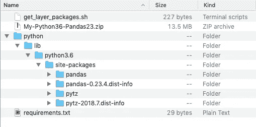
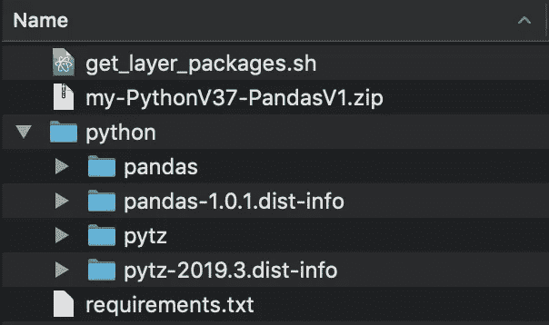
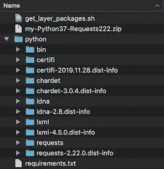

# 使用 AWS Lambda(带层)、AWS S3 和当前超级碗赔率的自动刮擦

> 原文：<https://towardsdatascience.com/automated-scraping-using-aws-lambda-with-layers-aws-s3-and-current-superbowl-odds-dc7f9c6d27b1?source=collection_archive---------26----------------------->

## 关于如何在 AWS 上设置一个自动刮刀的指南，没有漂亮的 Soup 或 Selenium…一路上还带着相当多的戏谑！

> *注意:这篇文章假设读者已经了解基本的 AWS Lambda 和 S3 功能。简单介绍一下 AWS 快速入门指南: [Lambda](https://docs.aws.amazon.com/lambda/latest/dg/getting-started.html) 和 [S3](https://docs.aws.amazon.com/quickstarts/latest/s3backup/step-1-create-bucket.html)


开炮！(由 [NFL](https://giphy.com/nfl/) 通过 [Giphy](https://giphy.com/gifs/nfl-tampa-bay-buccaneers-l3vRiQESRDKkl9qta) 拍摄)

# 好吧…首先，让我们来解决房间里的大象。

是的，我是坦帕湾海盗队的球迷。不，我不是因为他们签了汤姆·布拉迪才开始喜欢他们的。我从 10 岁起就是一个粉丝，在坦帕以南大约一小时车程的地方长大，他们认为他们的新制服/标志比 creamsicle 的制服和 Bucco Bruce 的标志酷得多。为了完全透明，在今年 3 月 20 日之前，我不是 TB12 的粉丝。也就是说，我不记得有哪一次我对 NFL 橄榄球赛在秋季回归如此兴奋。去年，海盗队在传球码数方面领先联盟。布雷迪和埃文斯、戈德温、格隆考斯基和霍华德是一伙的吗？？？开炮！希望到九月来临的时候，世界会变得更好(通俗地说)，雷蒙德·詹姆斯体育场会被点亮！！！


NFC South 就要被干掉了！(照片由 [NBC 体育](http://nbcsports.tumblr.com/post/107421040869)通过 [Giphy](https://giphy.com/gifs/rob-gronkowski-gronk-tall-yWhBLGwP9nFVm) 拍摄)

海盗队签下布雷迪后不久，我看了看超级碗赔率，发现海盗队的赔率是+2600。如果你不熟悉美国博彩赔率，这意味着 100 美元的赌注，赌徒赢得了 2700 美元的总支出。就背景而言，堪萨斯城酋长队是目前赢得 2021 年超级碗的最大热门，目前的赔率在+550 到+650 之间，这取决于你检查的体育博彩赔率。在+2600 的情况下，我下了一个小赌注，如果成功的话，会有一笔可观的支出。

> " Andrew，这篇文章不应该是关于实现自动化的 AWS Lambda 吗？"

最近，我一直在试图为一篇新的博客文章想一个新的主意，将我学到的一种流行的 AWS 服务结合起来。在听说海盗队也签下了罗布·格隆考斯基后不久，我开始思考我的赌注，赔率将如何变化，以及我如何分析未来 9-10 个月的走势。排队文章灵感！

在本帖中，我们将:

*   创建一个 Lambda 函数，该函数将剔除当前超级碗赔率
*   创建 Lambda 层以便于访问
*   使用 CloudWatch 自动执行每天的抓取功能


赢得比赛的超级猫头鹰(照片由 [PBS](https://giphy.com/pbsdigitalstudios/) 通过 [Giphy](https://giphy.com/gifs/pbsdigitalstudios-pbs-owl-l3q2EftwJ1tCBmDfy) 拍摄)

# 自动气象站λ

我第一次接触 AWS Lambda 是在去年，当时一位同事听到我谈论我如何学习使用 AWS EC2 部署应用程序。他们解释了我为什么不需要一台 24/7 全天候运行的服务器来运行我选择的脚本或 scraper。相反，他们让我去调查 AWS Lambda。

> “AWS Lambda 允许您在不提供或管理服务器的情况下运行代码。您只需为消耗的计算时间付费。有了 Lambda，你可以为几乎任何类型的应用程序或后端服务运行代码——所有这些都无需管理。只需上传你的代码，Lambda 就会为你的代码提供高可用性的运行和扩展。您可以将代码设置为从其他 AWS 服务自动触发，或者直接从任何 web 或移动应用程序调用它。”— [**AWS 链接**](https://aws.amazon.com/lambda/)

厉害！但是，作为一名数据科学家，我经常使用像 pandas 或 scikit-learn 这样的库。这两个库都没有预装在 Lambda 环境中。这意味着如果您想要包含除 AWS SDK 之外的库和依赖项，您需要创建一个部署包。此外，作为一名程序员，我学到的第一个概念是避免重复相同的代码。我希望尽可能地高效，不希望每次只需要几行代码就能实现目标时，就创建一个大的部署包。这就是λ层非常有益的地方。

*   在继续阅读之前，请转到 AWS 控制台，创建一个基本的 Lambda 函数和一个具有基本 Lambda 权限的新执行角色。我们将使用这个λ向前移动；稍后我会详细讨论执行角色权限。

# λ层

兰姆达斯像洋葱，这意味着他们也像食人魔(和冻糕！).


"不是每个人都喜欢洋葱。"(左图来自[男高音](https://tenor.com/view/shrek-onions-gif-5703242) |右图来自[纱线](https://memes.getyarn.io/yarn-clip/763df806-2f86-4cbd-bb7c-83548c0ac283/gif))

> “您可以配置 Lambda 函数，以层的形式引入额外的代码和内容。层是包含库、自定义运行时或其他依赖项的 ZIP 存档。通过层，您可以在函数中使用库，而无需将它们包含在部署包中。”
> -[-**AWS 链接**-](https://docs.aws.amazon.com/lambda/latest/dg/configuration-layers.html)

我真的希望在我花几天时间开发几个 Lambdas 之前就知道层的功能，因为调试过程会容易一百万倍。在构建 Chrome 扩展(仍在构建中)的过程中，我为应用程序中运行的三个主要 Lambdas 创建了一个大型部署包。浪费了相当多的时间，因为我不得不等待开发包的构建和上传，只是为了测试代码中的简单编辑。本质上，使用层类似于在虚拟环境中安装库。在某些时候，你必须在你的虚拟环境中安装这个库来使用它的代码，这基本上就是你在 AWS 上要做的事情。

本教程的主要目的是向你展示如何自动化你的 Lambda 函数。大声喊出来 [Quy Tang](https://medium.com/@qtangs) 他的[教程是关于如何为 Python 的熊猫库](https://medium.com/@qtangs/creating-new-aws-lambda-layer-for-python-pandas-library-348b126e9f3e)创建一个新的 AWS Lambda 层。它非常简单，可以快速启动并运行，并且我能够修改 Python 3.7 的代码。在浏览该指南时，我注意到的唯一区别是运行这段代码时得到的文件夹结构:

```
./get_layer_packages.sh
zip -r my-Python36-Pandas23.zip .
```



【左】前面提到的[教程](https://medium.com/@qtangs/creating-new-aws-lambda-layer-for-python-pandas-library-348b126e9f3e)的结果(图片由[曲唐](https://medium.com/@qtangs)拍摄)。[右]运行代码时的结果(作者截图)。

这两种文件夹结构都适用于上传到 AWS Lambda 层。如果您运行的是 Python 3.7，那么您将需要适当的 Docker 映像。在您的`.sh`脚本中，将`.6`改为`.7`:

```
lambci/lambda:build-python3.7
```

对于这个应用程序，我想避免使用 BeautifulSoup 和 Selenium，因为我想让它尽可能地轻便，并且我想使用 pandas 为我们提供的有用功能，`pd.read_html(<URL_HERE>)`。要记住的重要一点是，为了让`.read_html()`正常工作，你试图从中检索信息的网站必须有一个 HTML 格式的表格。当我想获取的唯一数据是 HTML 表中的数据时，我喜欢使用这个函数。对于我的个人项目，我还需要为`requests`库做一个单独的 Lambda 层。我需要这样做，因为我想访问的一个站点返回 403 响应，并需要特定的头来发出 GET 请求。(同样，因为库[不包含在 AWS SDK](https://aws.amazon.com/blogs/compute/upcoming-changes-to-the-python-sdk-in-aws-lambda/) 中)。



作者截图

**注:在我的调试过程中，我了解到* `lxml` *库需要调用上面的* `pd.read_html()` *函数才能得到响应。我在请求层中安装了* `lmxl` *只是为了方便自己。我本来可以专门为* `lxml` *再做一层的。*

在谷歌上快速搜索“当前超级碗赔率”会有很多潜在的选项。在这篇文章中，我将只演示抓取[一个网站](https://www.vegasinsider.com/nfl/odds/futures/)，我之所以选择它是因为它过于简单，格式陈旧。理论上，你可以随意抓取任意多的网站。在我的私人版本中，我从 3 个其他来源获取数据，这些数据似乎是实时更新的。这三个来源不是体彩本身，但为市场上一些最可信的体彩提供了现场赔率。实时更新对我来说很重要，因为我的下一篇博文将是关于获取由特定事件触发的文本通知。我能想到的描述这一点的最好例子来自硅谷的[T4，在那里](https://en.wikipedia.org/wiki/Silicon_Valley_(TV_series))[吉尔福伊尔正在接收他的比特币价格变动通知](https://www.youtube.com/watch?v=t_L0UPmxgho&start=26)。

# 编码的时间到了:

此时，你应该已经创建了一个 Lambda 和一两个不同的层。让我们深入一小段代码和自动化过程。下面是我们将在 Lambda 中实现的第一部分代码:

```
import json
import requests
import pandas as pd
from fractions import Fraction
from functools import reduce
from datetime import datetime, timedelta# set the URL
url = '[https://www.vegasinsider.com/nfl/odds/futures/'](https://www.vegasinsider.com/nfl/odds/futures/')# define the dataframe; located in the 6th index position
df = pd.read_html(url)[6]# limit the dataframe to the 32 teams/rows we want
df = df.iloc[:32, :-1]# label the columns
df.columns = ['team', 'odds']# convert the fraction to American odds
df.odds = df.odds.apply(lambda x: 100*float(Fraction(x)))# format the row into string w/ "+"
df.odds = df.odds.apply(lambda x: '+' + str('%g'%(x)))
```

## 好了，我们的数据已经格式化了，现在我们需要保存它:

这就是 AWS S3(简单存储服务)发挥作用的地方。前往 AWS 控制台的 S3 部分，创建一个基本的 S3 桶。一旦您完成了创建 bucket，请返回 Lambda 控制台。为了让你的 Lambda 能够访问 S3 桶，我们必须给 Lambda 这样做的权限。您可以在第一次实例化 Lambda 时授予它权限，也可以在创建后编辑权限。我们将选择后者。以下是步骤:

首先，点击 Lambda 中的“Permissions”选项卡。接下来，单击您的“执行角色:角色名称”下面的 URL 链接，这将打开一个带有身份和访问管理(IAM)控制台的新选项卡。接下来，单击标有“附加策略”的蓝色大按钮。最后，在过滤搜索中搜索“S3 ”,并选择“AmazonS3FullAccess”并附加策略。

既然我们的 Lambda 拥有 S3 权限，那么是时候进行更多编码了:

```
# instantiate S3 object
s3 = boto3.client('s3')# set datetime str w/ EST timezone adjustment and Daylight Savings
if datetime.now().month in range(4,11):
    day_and_time = (timedelta(hours=-4) + datetime.now())
else:
    day_and_time = (timedelta(hours=-5) + datetime.now())
day_and_time = day_and_time.strftime("%b-%d-%Y-%H%M%S")# the two different file paths used for uploading
scraped_file_path = '/tmp/SB_odds_' + str(day_and_time) + '.csv'
path_name_for_bucket = scraped_file_path[5:]# create csv file
output = final.to_csv(scraped_file_path, index=True)# upload the new csv file to S3
s3.upload_file(f'{scraped_file_path}', '<YOUR_S3_BUCKET_NAME_STR>', f'{path_name_for_bucket}')# define a simple lambda handler
def lambda_handler(event, context):
    return {
    'body': json.dumps('SUCCESS: The SB odds have been scraped!'),
    'date and time':day_and_time
}
```

在定义`lambda_handler()`函数时，不需要返回字典内容(或者根本不需要任何东西)。我写这段代码是因为当你运行一个测试时，看到输出是一种视觉享受。我稍后会解释更多关于时区和夏令时的调整，但是需要注意的是文件路径格式不包含任何空格。在继续之前，请确保测试您的函数并检查您的相关 S3 桶以获得结果文件。

# 大获成功！


祝贺安迪·雷德、马霍斯、蜜獾和所有 2020 KC 酋长队获得冠军！( [NFL](https://giphy.com/nfl) 通过 [Giphy](http://giphy.com) 拍摄的[左](https://giphy.com/gifs/nfl-TFBx2muuRkJ1jquFQT)和[右](https://giphy.com/gifs/nfl-LNfkiwcd378LxrXy89)照片)

如果你还在继续，你应该有一个 Lambda (w/ Layers)可以将一个`.csv`文件推送到你的 S3 桶中。然而，现在唯一能触发 Lambda 执行的事情是在控制台中按下“test”按钮。

# 自动化来了！

这个过程的下一步是设置一个自动触发器，在你想要的时间执行你的 lambda 函数。为了实现这一点，我们将使用 CloudWatch AWS 服务，更具体地说是一个 cron 作业。

> [“cloud watch 为您提供数据和可操作的见解，以监控您的应用、响应系统范围的性能变化、优化资源利用率，并获得运营状况的统一视图。”](https://aws.amazon.com/cloudwatch/)

CloudWatch 有很多功能，但是我们将只使用它来执行我们的 cron 任务。一般来说，Cron 用于运行预定的进程(例如:定期删除不再需要的日志文件)。你可以在这本[初学者指南](https://www.ostechnix.com/a-beginners-guide-to-cron-jobs/)中读到更多关于 cron jobs 的内容。重要的一点是，我们将为一个函数设定一个时间，让它按照指定的时间表执行。AWS 控制台的 cron 表达式时间格式为:

```
<Minute> <Hour> <Day_of_month> <Month> <Day_of_week> <Year>
```

这些字段中的每一个都应该填入一个数值，数字之间只有一个空格。此外，我们将利用两个方便的 cron 通配符，`*`和`?`。`*`通配符代表字段中的所有值(例如:在小时字段中，`*****`将包括每个小时)，而`?`通配符代表我们的星期值，因为我们不关心它是星期几。[这里有一个链接，包含了 AWS 上 cron 表达式可用的所有不同通配符。对于这个博客，我们将设置 cron 作业每天在美国东部时间 08:00 执行。请完成所有这些步骤，我将在以下段落中解释这是怎么回事:](https://docs.aws.amazon.com/AmazonCloudWatch/latest/events/ScheduledEvents.html#CronExpressions)

*   前往[云手表控制台](https://console.aws.amazon.com/cloudwatch/)。
*   在左侧，单击“规则”选项卡，然后单击蓝色的“创建规则”按钮。
*   在“步骤 1”页面的左侧，选择“计划”选项，然后选择“cron 表达式”选项。
*   输入`00 12 * 04–10 ? 2020`作为您的 cron 表达式。
*   在“步骤 1”页面的右侧，单击“添加目标”按钮。
*   在下拉菜单中，分别选择“Lambda function”和您的特定功能。
*   最后，单击“配置详细信息”按钮，并填写下一页上的名称和描述框。

您可能已经注意到时间表中有一个“固定费率”选项。我不确定每天执行的确切时间，我想精确一些，所以我选择了“cron expression”。因为这篇文章是关于获得超级碗赔率的，所以我想设置刮刀每天运行直到下一次超级碗。我还没有想出用一个表达式来做这件事的方法，所以我们将重复这个过程四次来创建单独的规则。夏令时于 11 月 1 日结束，因此我们需要用两个表达来表示 2020 年。我们还需要一份 2021 年 1 月的，一份 2021 年 2 月 1 日至 2 月 7 日的。三个 cron 表达式将使用`—`(破折号)操作符来指定月或日值的范围:

```
00 12 * 04-10 ? 202000 13 * 11-12 ? 202000 13 * 1 ? 202100 13 1-7 2 ? 2021
```

到目前为止，您可能已经注意到 AWS CloudWatch 的执行时间是 GMT。除非你住在那个时区的某个地方，否则你会想根据你的时区来调整你的计划时间。这就是为什么我们在为`.csv`文件路径设置日期时间字符串时进行了时间增量调整。在创建了四个规则中的每一个之后，您应该已经准备好了。

# 结束语

你有它；一个自动铲运机，将填充你的 S3 桶每天与当前超级碗赔率！如果您想测试您的 cron 表达式并立即看到结果，只需将表达式的时间值编辑为从现在起 5 分钟(GMT)并稍事休息。5 分钟后，你的 S3 里会有一个新的`.csv`。

感谢阅读！如果你喜欢这篇文章，请发送一些中等掌声，并关注我的页面，以便将来发布。希望，你现在可以创建自己的自动铲球，不会像中场休息时的左鲨鱼一样。


lolz(左图来自[男高音](https://tenor.com/view/sharks-katy-perry-concert-dancing-gif-3718657) |右图来自 [Giphy](https://giphy.com/gifs/super-bowl-shark-i-have-no-idea-what-im-doing-lXiRG1vwLewnehlxS) )

*本文的项目托管在* [*Github*](https://github.com/SproulHimself/aws_lambda_layer_blog) *上。*