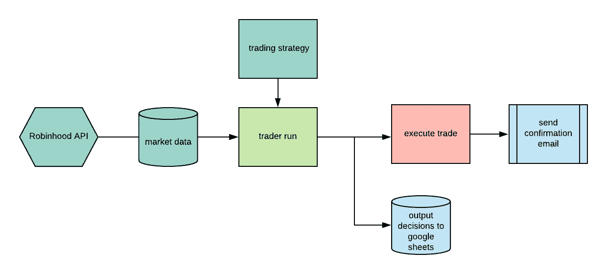
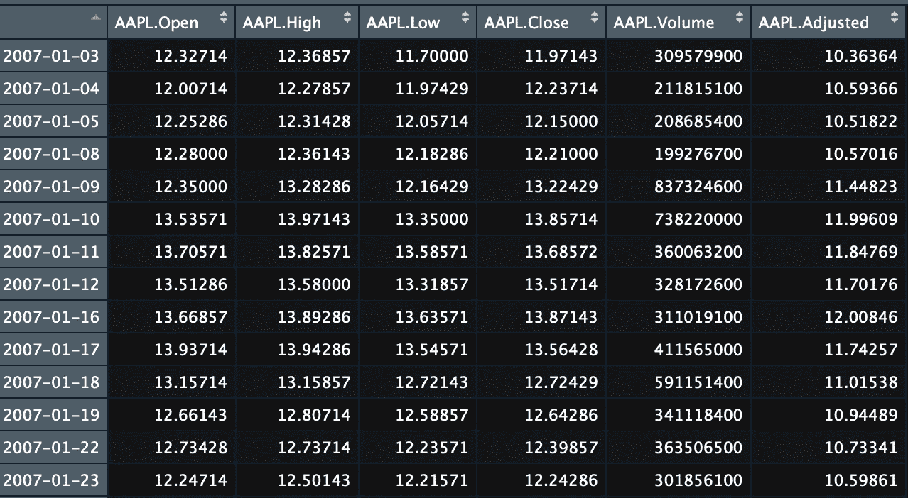
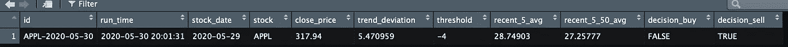

# 自动股票交易与 R

> 原文：<https://towardsdatascience.com/automated-stock-trading-with-r-part-1-5a1020831096?source=collection_archive---------25----------------------->


杰森·布里斯科在 [Unsplash](https://unsplash.com/s/photos/stocks?utm_source=unsplash&utm_medium=referral&utm_content=creditCopyText) 上的照片

本文解释了如何使用 r 创建一个交易管道

*   连接 Google API 并加载当前持有数据
*   连接 Robinhood API 并获取当前股票价格
*   使用 Yahoo API 获取历史市场数据
*   决策算法和执行订单



图 1:交易渠道

我使用以下 API

*   谷歌云平台
*   罗宾汉
*   雅虎财经

# 1.设置

为了创建管道，我使用了 R Markdown 文档。我使用这些库来处理金融数据。

```
library(dplyr)
library(purrr)
library(dbplyr)
```

*罗宾汉*图书馆与罗宾汉账号互动。Quantmod 库允许与雅虎金融数据交互，并包括用于技术分析的有用库。

```
library(RobinHood)
library(quantmod)
```

我使用 googlesheets4、big query 和 DBI 与基于谷歌云服务的数据库进行交互。

```
library(googlesheets4)
library(bigrquery)
library(DBI)
```

这里的*库*是用来访问带有定义函数的本地 R 脚本的。

```
library(here)
source(here("src", "R", "data_functions.R"))
source(here("src", "R", "trading_models.R"))
```

# 2.连接 API

我为我的项目设置了账单，并使用。json 文件。

```
gs4_auth(
path = "google_auth.json",
cache = FALSE
)
```

在里面。Rprofile 我为 sys 环境设置了以下变量。

```
# Put that inside .Rprofile system file
Sys.setenv("username" = "adam")
Sys.setenv("password" = "test")
```

然后与 RobinHood API 建立连接。。Rprofile 文件传递上面定义的相关凭据。

```
robinhood_connection = RobinHood(
username = Sys.getenv("username"),
password = Sys.getenv("password")
)
```

# 3.收集数据并做出决策

然后，我使用雅虎财经 API 收集所有相关数据。

```
# This function is located in data_functions.R script
get_market_data <- function() {
 # Load data into the workspace
 getSymbols("AAPL", src="yahoo")
 return(AAPL)
}data <- get_market_data()
```

对于本文来说，这个函数收集 APPL 股票的历史数据。这将有助于交易算法做出决定。



然后，我将数据和输入参数传递给一个算法，该算法决定是买入还是卖出给定的股票。我将在另一篇文章中解释算法**，它检查当前持有量并决定卖出、买入或持有给定的股票。这就是算法的输出。**

```
stock_decision <- moving_average_model(
 data = data,
 trend_deviation = -4
)
```



# 4.执行订单

然后，我从 RobinHood API 请求最新的 APPL 股票价格。

```
market_price <- get_quote(
robinhood_connection,
ticker = c("AAPL"),
limit_output = TRUE
)$last_trade_price
```

然后，程序根据函数的输出执行购买。下订单应该会生成一封电子邮件。

```
if(purchase_stock$decision_buy) {
x = place_order(
RH = robinhood_connection,
symbol = "AAPL",
type = "market",
time_in_force = "gfd",
trigger = "immediate",
price = market_price,
quantity = n,
side = "buy"
 )
} else if (purchase_stock$decision_sell) {
x = place_order(
RH = robinhood_connection,
symbol = "AAPL",
type = "market",
time_in_force = "gfd",
trigger = "immediate",
price = market_price,
quantity = n,
side = "sell"
 )
}
```

最后，管道将输出写入 Google sheets，并在股票被买卖时更新持股表。

```
write_output_sheets(
data = stock_decision,
sheet = "records")if (purchase_stock$decision_buy | purchase_stock$decision_sell) {
update_current_holdings(purchase_stock)
}
```

# **总结**

用 r 执行库存订单是可能的，而且相对容易。下一步是编排工作流。我尝试过用气流和云合成器来做这件事。Cloud Composer 比 airflow 更容易设置。也挺贵的。局部设置气流可能是一个更好的选择，但是，它需要更多的工程知识。

在下一篇文章中，我将讨论一个简单的移动平均线交易算法。

***注来自《走向数据科学》的编辑:*** *虽然我们允许独立作者根据我们的* [*规则和指导方针*](/questions-96667b06af5) *发表文章，但我们不认可每个作者的贡献。你不应该在没有寻求专业建议的情况下依赖一个作者的作品。详见我们的* [*读者术语*](/readers-terms-b5d780a700a4) *。*

# 参考

[1] RobinHood cran 包文档，[https://cran . r-project . org/web/packages/robin hood/robin hood . pdf](https://cran.r-project.org/web/packages/RobinHood/RobinHood.pdf)

[2] Quantmode cran 包文档[https://cran . r-project . org/web/packages/quant mod/quant mod . pdf](https://cran.r-project.org/web/packages/quantmod/quantmod.pdf)

[3]为 Google sheets 设置 Google API[https://googlesheets4.tidyverse.org](https://googlesheets4.tidyverse.org)

[4]云作曲[https://cloud.google.com/composer](https://cloud.google.com/composer)