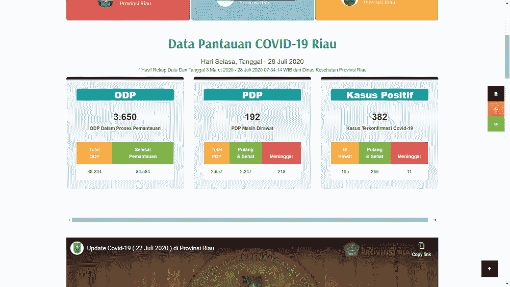
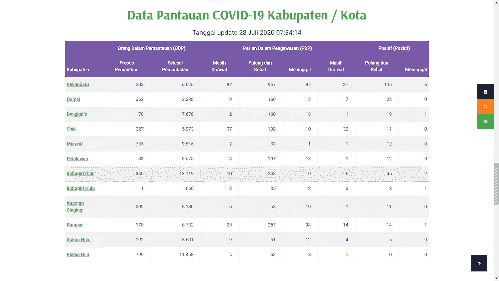
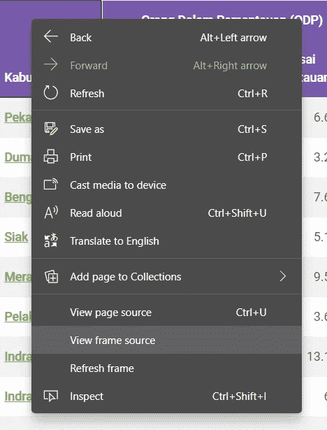
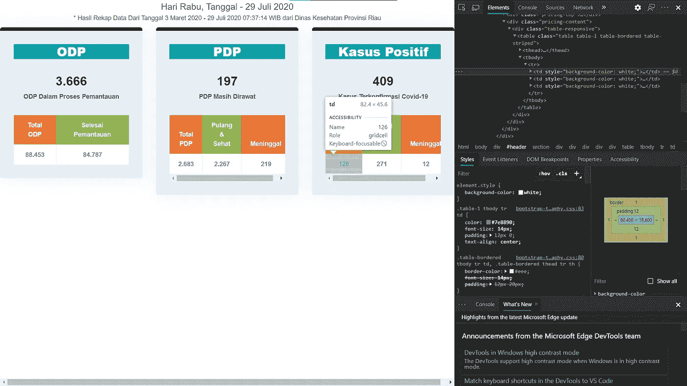
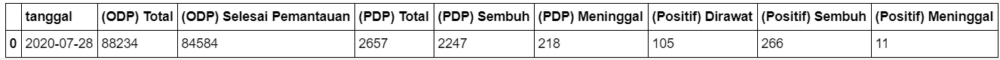
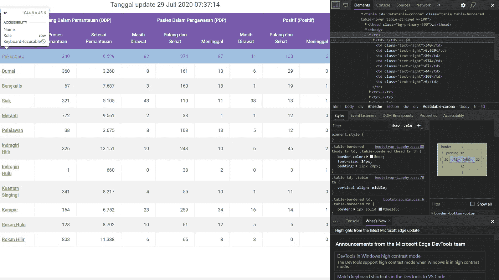
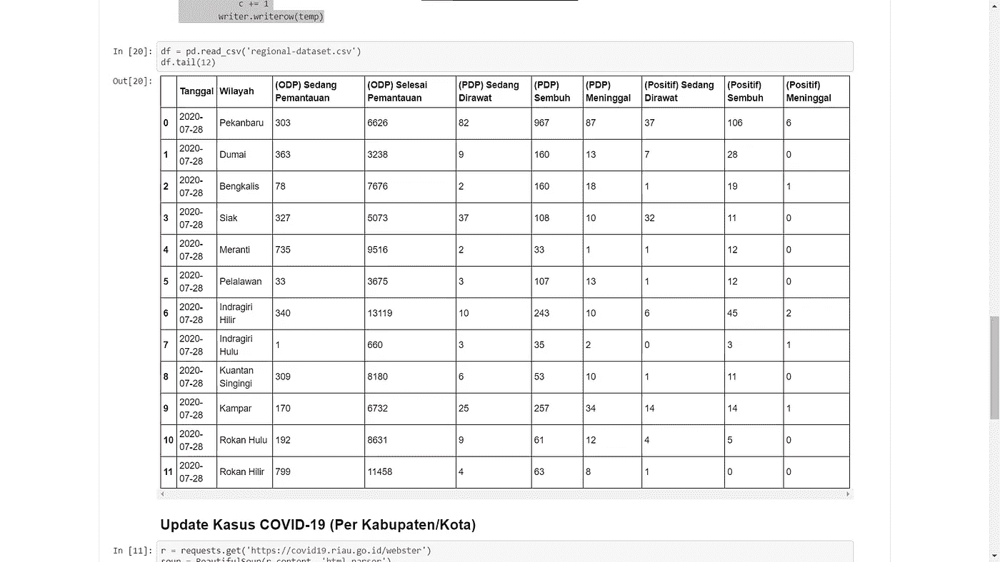
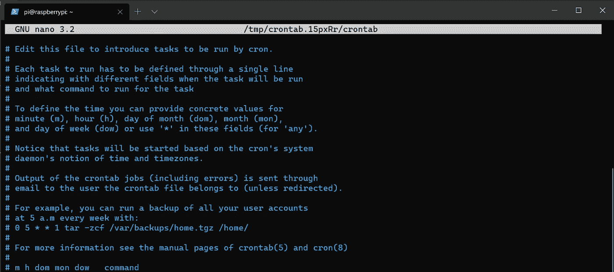

# 使用 Python 和 Cron 实现自动 Web 抓取

> 原文：<https://towardsdatascience.com/automated-web-scraping-python-cron-e6bedf4c39eb?source=collection_archive---------21----------------------->


在 [Unsplash](https://unsplash.com/s/photos/automation?utm_source=unsplash&utm_medium=referral&utm_content=creditCopyText) 上 [Sai Kiran Anagani](https://unsplash.com/@_imkiran?utm_source=unsplash&utm_medium=referral&utm_content=creditCopyText) 拍摄的照片

## 在廖内省建立一个每天更新的新冠肺炎数据集。

有时，我们想每天做一些事情。如果你一个人做似乎很无聊，你只是为了做而浪费时间。自动化是我们所需要的。通过在给定的时间安排它，我们可以节省时间，让计算机自己完成任务。

在本文中，我想向您展示如何使用 Python 为印度尼西亚廖内省构建新冠肺炎数据集来检索数据集，并使用 Cron 来调度任务。如果你想了解更多，你可以在我的 GitHub 库[这里](https://github.com/khalidmeister/covid-riau-tracker)查看一下。

# 问题陈述

廖内是印度尼西亚的一个省。就像其他地方一样，这个地方也与新冠肺炎作战。他们的信息来源是 corona.riau.go.id。首页是这样的，


在网站上，它显示了省和地区一级存在的病例数量。虽然它是最新的，他们没有显示它的历史数据。就像下面这些图片一样，



左:省级案件量，右:地区级案件量

因为这个问题，我提出了一个 web 抓取技术来记录数据并保存为。csv 格式。在这之后，我将一步一步地向你展示我如何抓取网站，以及如何在给定的时间表自动完成这些任务。

# 该过程

## 用美汤刮网

我做的第一件事就是浏览网站。为了抓取它，我使用 bs4 库从其中提取文本。对于这种情况，存在一些问题。首先，我之前展示的表格来自另一个网站，它只是网站上的一个框架。因此，我们必须找到它的来源。



在 Microsoft Edge browser 上，我们可以通过右键单击每个表格来获取其框架的来源，然后选择“查看框架来源”。省级数据来源于[https://covid19.riau.go.id/webster](https://covid19.riau.go.id/webster)。对于城市或摄政级别，来源来自[https://covid19.riau.go.id/pantauan_data_kasus](https://covid19.riau.go.id/pantauan_data_kasus)。下一步是浏览每个网站，获取我们需要的数据。

首先，我们将从[https://covid19.riau.go.id/webster](https://covid19.riau.go.id/webster)提取数据。检索数据并不困难，因为我们只需检查哪个标签属于这个数字。我们想要提取的数据只是每一列的数字，所以我们可以使用一个列表作为列名。



基于上图，标签包含了数字。标签被标签封装。因此，我们必须提取所有的

标签，然后，我们提取每个标签的

| 标签内容。我们使用循环来提取数据，并将其放入一个具有字典结构的变量中，然后将其写入 CSV 文件。代码看起来像这样， |

如果我们显示。csv 文件，看起来像这样，



之后，我们将提取城市摄政级别的数据集。



对于数据集，我们将从[https://covid19.riau.go.id/pantauan_data_kasus](https://covid19.riau.go.id/pantauan_data_kasus)中获取。根据上面的图片，我们只需要首先检索所有的< tr >标签。之后，我们可以为每个< tr >标签检索< td >标签。变成. csv 文件的过程与前面的过程相同，代码如下所示:

在我们运行代码之后，它将创建一个. csv 文件，并附加在现有行的下面。这是的预览。csv 文件，



## 使用 Cron 调度任务

创建数据集后，我们可以专注于如何每天更新数据集。为此，我们可以在 Linux 上使用 Cron 来调度任务。在这种情况下，我将使用 Raspberry Pi Zero W 作为我的服务器来每天抓取数据集，我使用的操作系统是 Raspbian。

你已经注意到我在 Windows 上写了这个脚本。因此，我在 GitHub 上建立了一个知识库，这样任何设备都可以访问它。如果你想知道代码，你可以在我的库[这里](https://github.com/khalidmeister/covid-riau-tracker)看到。我已经在我的 Pi 上克隆了存储库，所以我们可以直接调度任务。

在创建 schedule 命令之前，我们必须用。sh 格式来放置我们想要运行的脚本。我做的脚本看起来像这样，

第一行是 shebang 声明，告诉系统使用 bash 解释器。下面一行是我们想要运行的 python 脚本。完成这些之后，我们可以使用 Cron 创建我们的 schedule 命令。

要做到这一点，我们可以先打开终端。然后，键入 crontab -e，终端将打开一个 Nano 文本编辑器(如果您想使用 vim，可以更改它)。首先，我们会看到一些类似 crontab 文件的注释，



我们可以把我们的计划任务写在它的下面。它的结构看起来像这样，

```
**59 23 * * * /bin/bash ~/projects/covid-riau-tracker/script.sh**
```

嗯，一开始看起来很奇怪，但让我解释一下。前五个字段描述了我们任务的时间表。按照顺序，它们分别描述了分钟(0–60)、小时(0–24)、一个月中的某一天(1–31)、一个月(1–12)和一周中的某一天(1–7)。在这些字段之后，我们可以定义想要运行的命令。

因为我已经编写了脚本，所以我们可以使用 bash 来运行它。如果你仔细看，我写下了它的绝对路径。这是因为 Cron 没有与我们的文件相同的路径。这就是为什么我写绝对路径来访问文件。

在我们写完任务后，我们可以使用 CTRL + O 保存它，我们可以使用 CTRL + X 退出到终端。就这样，我们创建了一个 web 抓取任务的自动化。

# 结论

总之，如果我们想要的数据不是以友好的格式存在，web 抓取是一种有用的检索方法。csv 格式。同样，我们可以不自己运行它而让 Cron 来做。

虽然已经自动化了，但是有一个问题。就是如何更新数据集，然后推送到 GitHub。直到现在，我仍然无法将结果推送到 GitHub，我正在为此而挣扎。因此，如果你知道如何在 Cron 中做到这一点，请在下面留下评论。

我想这就是我现在能和你分享的。我希望这对你有所帮助，关于网络搜集如何真正有助于检索我们想要的数据，以及如何使其自动化。谢谢你。