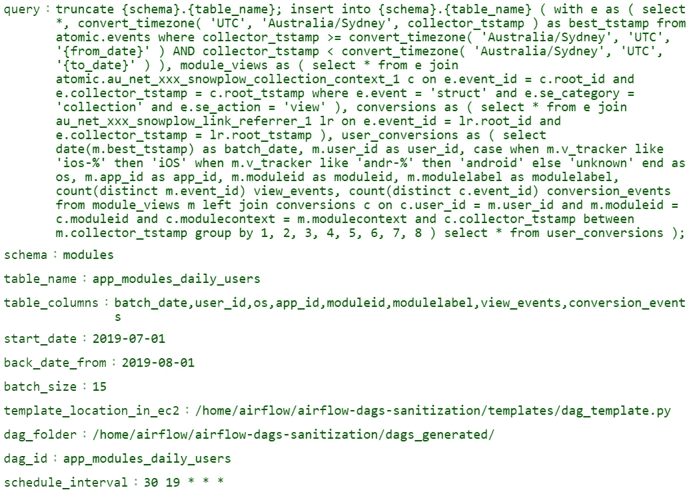
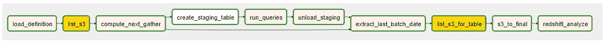
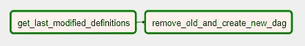

# 为数据科学家和分析师自动创建气流 DAG

> 原文：<https://towardsdatascience.com/automatic-airflow-dag-creation-for-data-scientists-and-analysts-17d24a9884ba?source=collection_archive---------24----------------------->

## 日常工作的自动化减少了数据错误，并为创新提供了更多时间。只需点击一下鼠标，使用这里提供的脚本，数据科学家和分析师就可以快速进行批量分析。

> *TL；DR* : DAG creator 是一个 python 脚本，当运行时，它会选择最新的 json 定义文件，并将其中的值替换到 DAG 模板中，为每个定义文件创建新的 DAG。当执行新创建的 DAG 时，它会将查询的输出存储在 s3 中，然后将所需的数据推入 Redshift 中的最终表中。

最近，我听到(之前也遇到过)许多这样的场景:数据科学家或分析师希望通过批处理来自动完成分析，但他们必须等待数据工程师或软件工程师来完成。一方面，数据工程师知道如何生产代码，但另一方面，他们没有足够的时间来处理来自分析师和科学家的每一个需求。

> 这篇文章将展示一个工具，在没有数据工程师帮助的情况下快速生产你的代码。*最棒的是，生产就绪代码附在这个帖子里，供那些想直接使用它的人使用。*

根据我的经验，大多数数据科学家和分析师仍然通过会产生错误和数据问题的即席脚本进行日常分析。此外，对于一些人来说，制作脚本不值得他们花费时间，但是他们必须投资，因为这是团队的需求。对于像我一样的其他人，我们喜欢生产和优化 ETL 和数据流。

## 为什么生产数据分析:

好吧，信不信由你，有许多人仍然想知道为什么要生产代码，当他们可以每天早上或定期地通过改变 SQL 查询来执行它的时候。对他们和其他人来说，这些是你从生产数据的特别分析和处理中得到的好处。

1.  一次性工作，您不必每天花 30 分钟来手动执行查询，这些查询可能会也可能不会给出无错误的数据。如果它偶然给出任何数据问题，那么将会有更多的时间浪费。
2.  数据同时被复制到 S3，以备将来参考或未雨绸缪。
3.  可读性和标准化的代码实践，对于任何新资源来说，理解和更新脚本将花费更少的时间。
4.  在空间和时间之间，基于不同的用例，生产化的代码可以利用其中任何一个。
5.  更好的异常处理将给出有意义的错误，最终将节省调试任何数据问题的时间。
6.  其他人可以导入或继承您的工作，以便在他们的流程中使用。
7.  自动回溯数据和重试逻辑。

# 自动气流 DAG 创建

此过程将自动创建 DAG，其中需要将所有分析任务放在 DAG 中，DAG 将充当模板。这些任务每次都是一样的。当您分析/查询数据时，这种情况肯定会出现，您必须将输出存储到一个表中，以便查看您的仪表板，或者您只想将数据附加到已经存在的表中，作为定期批处理的一部分。顺便说一下，DAG 是一个有向无环图。它是工作流中需要顺序或同时执行的任务的集合。

首先，在此过程中有 3 种类型的文件相关联:

1.  DAG 定义(。json)
2.  DAG 模板(。py)
3.  DAG 创建者(。py)

# **DAG 定义**

简而言之，这些是每个 Dag 中不同的值。因为它定义了 DAG 的用途，所以我们称它为 DAG 定义文件。

下面是一个这样的例子:

你可以在这里找到示例文件

*   **查询**:这是一个红移查询，它的 schema、table_name、from_date 和 to_date 参数化。当 dag_creator 被执行时，这些值将被填充。它应该在第一个“truncate {schema}”处包含 truncate 语句。“{table_name}”，它应该是{schema}中的 insert 语句。{table_name}它还应该具有用表的 datetime 列参数化的 from_date 和 to_date。将执行该查询，并将所需的数据放入一个临时表中。
*   **模式**:红移模式
*   **table _ name**:schema 下的红移表。该名称用于红移表和 s3 文件夹。后者更难重命名，因此对于工作流，最好将其设置为您想要的最终表名。
*   **table_columns** :表格的列。它应该包含 batch_date。而且应该符合上面的查询。
*   **start_date** :上述查询应该开始执行的日期。(> =)
*   **back_date_from** :理想的情况是，如果用户今天更新了“查询”中的某些内容，那么从第二天开始，这些更改将会反映在表中，但是如果用户希望将日期倒推，以便这些更改也反映在过去的日期中，那么这需要是在表中进行更改之后的日期。这将自动清除 s3 键，并随后从表中删除> =该日期的行。现在，要么手动运行 DAG，要么等待下一次每日运行，以便将更新的数据推送到 s3 和表中。DAG 完成后，将此字段更新为其默认值，即“”。**警告**:请务必将此字段改回''，否则在每次 DAG 运行时，它将清除所需的 s3 密钥并删除表中的行。
*   **batch_size** :这用于将上面的红移查询分成多个批次，其中 batch_size 是在一个红移查询中运行的天数。当在初次运行时运行大量数据时，这提高了运行红移查询的速度。
*   **template _ location _ in _ ec2**:DAG 模板的位置。此位置是固定的，不应更改。该位置应该存在于您的虚拟机中。
*   **dag _ folder**:EC2 中放置最终 DAG 的文件夹，它将符号链接到 Airflow DAG 文件夹
*   **DAG _ id**:DAG 的 Id。这应该是唯一的，否则以前的同名 DAG 将被覆盖
*   **Schedule _ interval**:DAG 的时间表(Cron 格式)

# **DAG 模板**

这是具有参数化值的最终 DAG 的框架，以便可以在 DAG Creator 的帮助下替换这些值。该 DAG 将具有下图所示的任务:

*   **load_definition** :这将从 s3 加载 *DAG 定义*
*   **list_s3** :列出最近 14 天的 s3 密钥，这是 SLA。用气流变量覆盖它:“模块 _ 转换 _ 回顾 _ 天数”
*   **compute_next_gather** :基于列表键，这将计算出接下来几天要执行的任务，并因此将‘from _ date’和‘to _ date’推送到进一步的任务
*   **创建暂存表**:创建暂存表
*   **run_queries** :根据上面计算的日期执行查询
*   **卸载 _ 暂存**:将暂存台卸载到 s3 中
*   **extract _ last _ batch _ date**:从红移，这将计算 max(batch_date)
*   **list_s3_for_table** :列出 s3 键
*   **s3_to_final** :基于列表 s3 键和 last batch_date，这将计算出将哪些 s3 值推入最终表中
*   **红移 _ 分析**:执行红移分析

下面是遵循的 s3 结构。并且符合红移数据库结构，即 *schema.table.batch_date*

> = > S3://bucket/redshift _ schema/redshift _ table/batch _ date =*YYYY-MM-DD*/

你可以在这里找到 python 代码

# **DAG 创建者**

这是主 DAG，它将从 *DAG 定义*中读取值，并将其替换到 *DAG 模板*中，并创建与存在的 *DAG 定义*一样多的 DAG。

*   **get _ last _ modified _ definitions**:从 s3 开始，将只选取那些在 *DAG 创建者*的最后执行日期之后(大于或等于)修改的定义。
*   **remove _ old _ and _ create _ new _ dag**:根据上面的定义列表，这将取消 DAG 与 EC2 的链接并将其删除，然后创建 DAG 并将其与新定义链接。

你可以在这里找到 python 代码

## **思考要点:**

1.  添加新的 JSON DAG 定义后，需要在 airflow GUI 中手动运行 *dag_creator* DAG current。DAG 运行完成后需要几分钟时间，新的 DAG 才会显示在 GUI 中。您可以在 CICD 管道中自动执行它，或者在 s3 中出现新定义文件时使用 Lambda 来执行它。所以，每当你按下
2.  将表的所有权更改为数据库管理员或 ETL 管理员，以便 Airflow 可以将数据写入其中。

# 包裹

因此，当 DAG 创建器运行时，它将挑选最新的定义文件，并替换 DAG 模板中的值，以便为每个定义文件创建新的 DAG。当执行新的 DAG 时，它会将查询的输出存储在 s3 中，然后将所需的数据推入 Redshift 中的最终表中。

但是，如果你有大量的数据或点击流数据，不能把红移。下一篇文章将介绍另一种类似的教学方法，它将从 s3 中选择所需的拼花数据，而不是这里的红移，进行分析并将最终数据推入 s3 和红移。