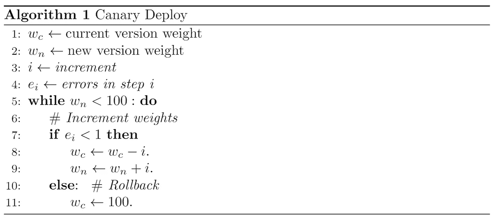

# 机器学习模型的自动金丝雀释放

> 原文：<https://towardsdatascience.com/automatic-canary-releases-for-machine-learning-models-38874a756f87?source=collection_archive---------38----------------------->

## [理解大数据](https://towardsdatascience.com/tagged/making-sense-of-big-data)

## 作为应用于机器学习的代码的连续部署和基础设施。

鸣谢:福扎伊·阿哈默德在 [Pexels](https://www.pexels.com/es-es/foto/al-aire-libre-antiguo-arquitectura-arquitectura-islamica-2349168/)

“MLOps”是关于自动管理机器学习生命周期的。为此，机器学习工程师可以应用“DevOps”原则，主要区别在于它们的范围。

例如，ML 中的一个大挑战是测试，因为您不仅要测试数据是否满足某些要求，如训练模型所需的最少观察次数，还要检查您添加到模型中的新功能是否提高了它们的性能。

然而，一些“devo PS”[工具](https://en.wikipedia.org/wiki/DevOps#Toolchains)可以直接应用于 ML 周期，如持续部署或基础设施作为代码。

在本文中，我们重点关注通过 Canary 部署持续交付 ML 模型，以及如何通过 AWS CloudFormation 为这些任务自动提供 AWS 堆栈。

> H **高亮**:所有附带的代码都可以在这个 [repo](https://gitlab.com/Miguel_TM/ml-canary-deploy/) 上找到，金丝雀策略是基于[这个](https://github.com/aws-samples/aws-lambda-deploy/blob/master/functions/simple/simple.py) AWS 的例子。

# 为什么要持续部署？

当用户可以直接与 ML 模型的结果或预测交互时，我们说它处于生产中，作为 [API](https://www.freecodecamp.org/news/what-is-an-api-in-english-please-b880a3214a82/) 部署以接收来自最终用户的请求。

如果我们继续改进这个模型，我们将需要一个框架来自动部署代码变更和重新训练模型。

例如，如果我们向模型中添加一些新变量，使其精度提高 x%，那么我们希望用户从这个新模型中获得结果。

这将意味着自动将最终用户的请求切换到较新的模型版本。

# 金丝雀释放怎么样？

“金丝雀”一词来源于煤矿中用金丝雀来警告矿工有毒气体的危险程度。

这种策略对部署很有用，因为一小部分用户或请求就像金丝雀一样，可以检测到已部署变更的早期问题。因此，在向所有用户发布该版本之前，可以检测到潜在的问题。

要实施 canary deploy，我们将遵循以下步骤:

1.  将一小部分请求分配给较新的版本。
2.  检查新版本中的错误。如果发现错误，回滚或将所有权重分配给当前版本。
3.  重复第一步和第二步，直到新版本收到所有请求。

下面是伪代码版本。

金丝雀部署伪代码。来源:作者

# 步骤 1:将流量路由到新版本

AWS Lambda 允许实现金丝雀部署的一个特性是 ***加权别名*** 、别名是一个函数标识符。通过指定路由配置，它们允许一个将流量路由到同一功能的两个不同版本(不同的代码快照)。

例如，如果我想用一个开发阶段来标识一个 lambda 函数，我可以使用一个“dev”别名，我们稍后将看到如何使用 CloudFormation 自动实现这一点。

现在，假设“我的当前版本”拥有 100%的流量，我们希望开始将 10%的流量路由到“我的新版本”。

我们可以通过更改“dev”别名的路由配置来指定这一点。

在第 13 行(代码片段)，注意我们正在调用“update_alias”函数来将 10%的流量路由到“my_new_version”，有关此函数的更多详细信息，请参见[文档](https://boto3.amazonaws.com/v1/documentation/api/latest/reference/services/lambda.html#Lambda.Client.update_alias)。

一个自然产生的问题是，如何验证“我的新版本”没有错误？以便我们可以继续向它发送更多的流量。

# 步骤 2:检查调用错误

我们想知道函数是否返回一个错误，所以我们将使用调用度量，特别是 ***【错误】*** 度量，因为它们包括“由您的代码和 Lambda 运行时抛出的异常”(有关更多选项，请参见 Lambda 函数[度量](https://docs.aws.amazon.com/lambda/latest/dg/monitoring-metrics.html))。

由于“我的新版本”现在拥有 10%的流量，我们需要定义一个时间窗口来检索其可能的错误。例如，如果在之前的 5 分钟内有错误。

为此，我们考虑将每分钟内的所有误差相加。因此，如果在过去 5 分钟的给定分钟内，有一个错误，这将是一个警告，停止分配更多的权重给新版本。

现在，假设“我的新版本”出现了错误，我们该怎么办？

请注意，上面的 update_alias 有一个参数，用于配置路由到“dev”的流量。

因此，通过将一个空字典分配给“AdditionalVersionWeights”，我们将所有流量都转到“my_current_version”。

# 第三步:线性增加权重

到目前为止，我们已经知道了如何为新版本分配一个权重，以及在出现错误提示时应该做什么。但是，正如你在伪代码的第 9 行看到的(wₙ → wₙ + *i* )，我们还没有定义如何给“我的新版本”分配更多的权重。

鸣谢:西蒙·哈奇在 [Unsplash](https://unsplash.com/photos/eXBqaHUt994)

注意到“AdditionalVersionWeights”需要的流量百分比是一个[浮点值](https://boto3.amazonaws.com/v1/documentation/api/latest/reference/services/lambda.html#Lambda.Client.update_alias)，我们可以使用无限的数学函数来增加权重。

例如，我们可以考虑指数或二次函数，然而，通常的部署偏好类型是线性的。也就是说，流量在每一分钟以相等的增量分配，在我们的例子中，每分钟 10%，您可以在 [repo](https://gitlab.com/Miguel_TM/ml-canary-deploy/-/blob/master/canary/utils.py#L161) 中查看这个实现。

# 通过 CloudFormation 实现 AWS 堆栈自动化

因为我们想在 AWS 上自动创建资源，所以我们通过 CloudFormation 创建服务。

到目前为止，我们已经调用了一个 lambda 函数，并从 CloudWatch 检索它的统计数据。这些是授予执行 Lambda 函数的 [IAM 角色](https://docs.aws.amazon.com/IAM/latest/UserGuide/id_roles.html)的操作或权限，简单来说，IAM 角色就像一张身份证，可以使用不同的 AWS 服务。

请注意模板上的 MLmodelAPI 资源，它表示作为无服务器 API 部署的 ML 模型。由于这超出了本文的范围，您可以在这里找到一个很好的实现。

正如您在上一节中所记得的那样，给 lambda 函数赋予一个别名可以让我们识别它，我们可以使用 AWS::Lambda::Alias 资源自动完成这项工作。

在这种情况下，我们根据工作阶段“dev”、“stage”或“prod”为 MLModelApi Lambda 函数分配标识符。

因此，如果我们在 ML 模型中添加一个新特性或者修复一个错误，我们可以安全地在“开发”阶段工作。当这些变化准备就绪时，我们发布一个新版本(新代码的快照)并开始向它发送新流量，就像我们之前看到的那样。

# 使用 Gitlab-ci 进行持续部署

每次我们推送一个 git 存储库时，在测试代码没有被破坏之后，我们都会运行一个脚本管道来部署新的变更。

然而，并不是每次推送都会改变 ML 模型 API 的代码，例如，只添加文档的代码。

出于这个原因，遵循[常规提交](https://www.conventionalcommits.org/en/v1.0.0/)的标准，我们允许部署(canary release)阶段只有在提交消息以 API 为目标时才是活动的。

一个例子是“Feat (Api):我的特征消息”或“Fix (Api):我的 Fix 消息”。在 [repo](https://gitlab.com/Miguel_TM/ml-canary-deploy) 管道中，您可以发现部署阶段(齿轮标志)显示了提交“Feat (Api): Sample Lambda 函数”。

为了实现这一点，我们遵循一个正则表达式模式，首先匹配动作的类型(专长、修正、测试等等)。)通过捕获第一个大写字母，随后是两个或多个小写字母。然后，它通过匹配任何后跟“(Api)”的字符来匹配范围，在本例中是 Api。您可以在下面的代码中查看完整的正则表达式模式。

> 回滚到分支也可以应用，你可以在这篇[文章](/what-data-scientists-need-to-know-about-devops-2f8bc6660284)上找到 ML 模型的 CI 应用。

# 最后的想法

现在，每次你对你的 ML 模型进行修改，就像提交“Feat (Api):添加一个新特性”一样简单。

这有两个很大的好处，一个是遵循一种编码风格，你和其他人将能够理解你的变化。第二，你可以自动看到你在生产中的变化。

添加到管道中的一个缺少的步骤是持续集成，这样您就可以获得回滚 git 分支的好处。

例如，您在“开发”中处理变更，在 CI 中转移到“阶段”,在 Canary 部署中继续“生产”。

> 你可以在下面的[回购](https://gitlab.com/Miguel_TM/ml-canary-deploy/)中找到所有代码和简要说明。

 [## Miguel Trejo marr UFO/ml-canary-deploy 项目

### 金丝雀部署示例

gitlab.com](https://gitlab.com/Miguel_TM/ml-canary-deploy) 

# 参考

1.  [AWS Lambda 功能指标](https://docs.aws.amazon.com/lambda/latest/dg/monitoring-metrics.html)。

2. [AWS Lambda 部署示例](https://github.com/aws-samples/aws-lambda-deploy/blob/master/functions/simple/simple.py)。

3. [AWS Lambda 函数别名](https://docs.aws.amazon.com/lambda/latest/dg/configuration-aliases.html)。

4. [Gitlab CI/CD 配置](https://docs.gitlab.com/ee/ci/yaml/)。