# Azure 机器学习工作区的自动数据注册

> 原文：<https://towardsdatascience.com/automatic-data-registration-for-azure-machine-learning-workspaces-65beb7d81521?source=collection_archive---------61----------------------->

## 大规模数据科学环境的再现性

# A.介绍

Azure 机器学习(AML)工作区是一个很好的平台，数据科学家和数据工程师可以在这个平台上协作并从事不同的项目。它将笔记本编码环境、为代码提供动力的计算目标、保存数据源引用的数据集和数据存储库以及跟踪实验的方法结合在一起。

虽然围绕此工作区的大多数任务都可以通过用户界面或云外壳/命令行来完成，但是一旦您向外扩展到大量工作区或数据源，手动管理所有资源就会变得难以承受。

博客是 github repo 的伙伴。

## 这个项目的目的

*   创建一种自动注册和管理 AML 工作区数据的方法(步骤 1-4)
*   将这些任务的有用脚本打包到可以从一个控制点触发的容器中(步骤 5-6)
*   启用授权和身份验证措施，以确保解决方案“企业就绪”(步骤 7)

## 一些好处:

*   可再现性:不同项目/团队的相同数据(和版本)
*   可伸缩性:易于管理不同的团队/项目:例如，运行 Azure 数据工厂管道来(同时)在整个域的所有工作区和订阅中填充新数据。
*   数据跟踪:定义 RBAC，将触发这些任务的权限授予少数团队成员，以提高安全性和可跟踪性

## 使用的技术

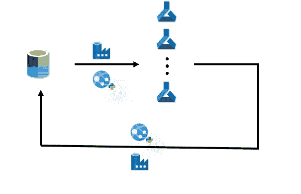

该解决方案的功能架构:展示了由 ADF 触发的 python Web 应用程序，该应用程序将数据从数据湖存储区移动到各种 AML 工作区，然后再返回。*作者图片*

在 [github 仓库](https://github.com/iuliaferoli/azureML_python_webapp_extensions)项目中

*   Python 和 azureml-SDK
*   Flask，用于修改 python 脚本以作为 web 服务运行

在这个 Azure 教程博客中

*   Azure 数据湖作为您的数据源
*   Azure 机器学习工作区是注册数据的地方
*   Azure Web 服务
*   Azure 数据工厂触发对 web 应用的 HTTP 请求
*   为了使这个解决方案安全，我们将使用 Azure 授权和认证概念:服务主体、密钥库、托管身份、AAD。

# B.辅导的

## 资源部署

在本节中，我们将介绍必要资源的部署。查看 Azure 文档演练和更多信息的链接。

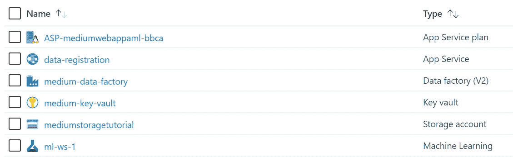

你在 Azure 上的新项目资源组。我在西欧部署了一切*图片作者*

## 1. [Azure 机器学习工作区](https://docs.microsoft.com/en-us/azure/machine-learning/how-to-manage-workspace#create-a-workspace)

*   可以跨不同的资源组或区域
*   在本教程中，我创建了一个“基本”AML 实例。

## 2.具有至少一个容器和至少一个文件的数据湖或 blob 存储

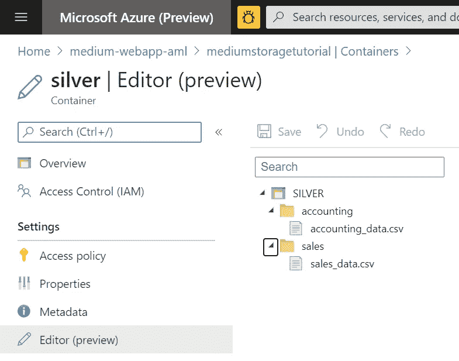

我在 medium-webapp-aml 资源组中名为 mediumstoragetutorial 的存储帐户。*作者图片*

*   创建一个存储帐户，并确保在高级设置中启用“分层命名空间”，使其成为一个数据湖。
*   我创建了一个名为 silver 的“主”容器(假设数据将来自您的业务中先前生成数据的任何流程)
*   我添加了包含模拟数据的文件夹:一个会计和销售容器，每个容器包含一个 csv 文件，我们稍后需要在工作区中注册该文件。

## 3.服务主体

*   在这个自动化场景中，服务主体(sp)用于向 AML 进行身份验证，而不是用户每次运行都必须使用 Azure 凭据登录。

3.1.我们将在您的 AAD [(链接)](https://docs.microsoft.com/en-us/azure/machine-learning/how-to-setup-authentication#set-up-service-principal-authentication) [(链接)](https://docs.microsoft.com/en-us/azure/active-directory/develop/howto-create-service-principal-portal)上注册一个服务主体作为应用程序

*   点击 Azure 门户右上角的> _ 图标，打开 Azure 云外壳。
*   通过使用您想要的任何名称而不是 sp-medium-demo 运行此命令来创建服务主体:

```
az ad sp create-for-rbac --sdk-auth --name sp-medium-demo
```

*   保存您在 json 响应中获得的`clientId`、`clientSecret`和`tenantId`字段，以备后用(它们将进入您的密钥库

3.2 授予其对您的 AML 和存储帐户的必要权限

*   转到您的门户，打开机器学习和存储帐户资源，准备好您为服务负责人指定的名称，以添加到“角色分配”页面。

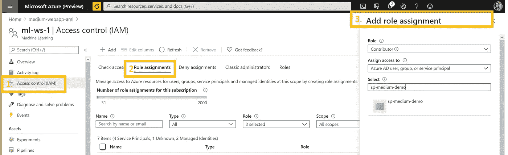

*角色分配菜单。作者图片*

*   将服务负责人应用程序 C *贡献者*添加到您的 AML 工作区
*   使 sp 成为您的存储帐户的*存储 Blob 数据读取器*

## 4.钥匙库

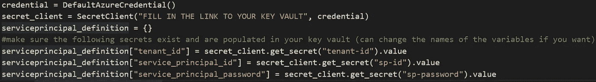

github 中的代码片段，在 register_data.py. *文件中。图片作者*

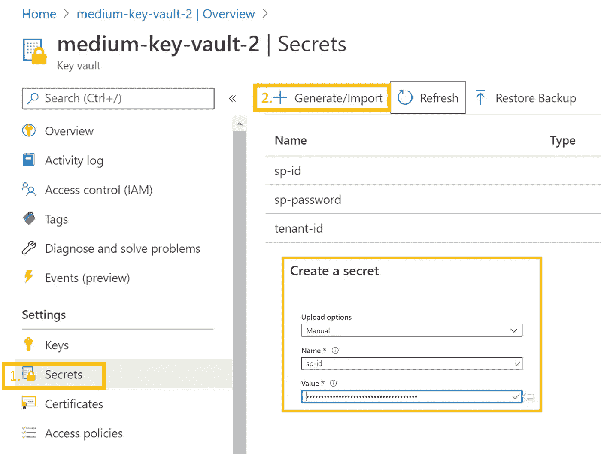

向密钥库添加秘密。*作者图片*

*   在您的资源组中创建一个密钥库，并创建三个秘密来存储您刚刚创建的服务主体的凭证。(*不带引号*)
*   [您稍后将克隆的代码](https://github.com/iuliaferoli/azureML_python_webapp_extensions#2-run-the-code-locally--fill-in-missing-details)从密钥库中获取这些凭证，以确保自动化的&安全认证/授权。
*   所以为了简单起见，你可以为你的秘密使用相同的名字，`**tenant-id**`**`**sp-id**`**`**sp-password**`为`tenantId,` `clientId`，以及在第 3.1 步得到的`clientSecret`值****

## ****4.部署在 Web 应用程序中的代码(进行数据注册)，可在我的 github 上获得[。](https://github.com/iuliaferoli/azureML_python_webapp_extensions)****

*   ****在您选择 IDE 中克隆存储库。我将使用 [Visual Studio 代码](https://code.visualstudio.com/) (VSC)，以便更容易与 Azure Web App 集成。****
*   ****C [孤独的 VSC github 库教程](https://code.visualstudio.com/docs/editor/github#_cloning-a-repository)****
*   ****您可以通过将 Visual Studio 代码作为 flask 应用程序运行来测试该代码是否已正确导入 Visual Studio 代码，如 repo readme 中的[所述。](https://github.com/iuliaferoli/azureML_python_webapp_extensions#3-optional-run-the-code-as-a-web-application-locally)****

****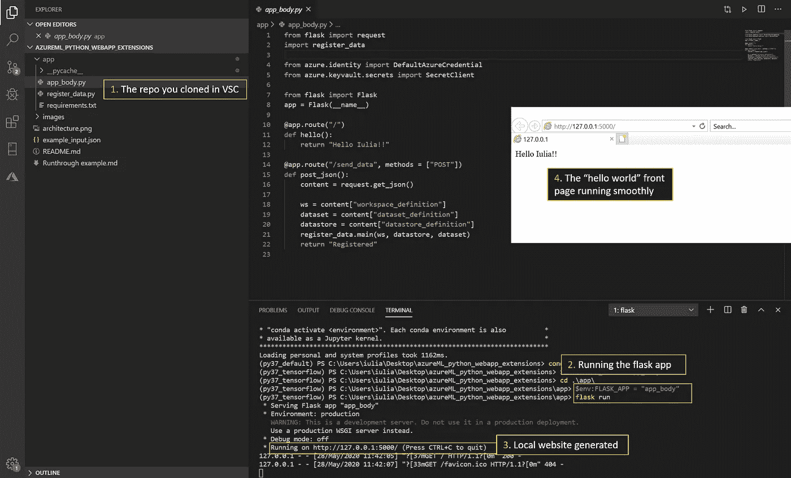****

****运行代码时 Visual Studio 代码环境的屏幕截图。*作者图片*****

*   ****在这段代码中，您唯一需要自己填写的是到您新创建的密钥库(DNS 名称:yourname.vault.azure.net)的**链接，以及秘密的名称(如果您更改了它们，请参见步骤 4)，请参见 [github 自述文件中的说明。](https://github.com/iuliaferoli/azureML_python_webapp_extensions#2-run-the-code-locally--fill-in-missing-details)******
*   ****要访问密钥库，您需要在密钥库访问策略中添加机密阅读器权限。你可以从现在开始运行代码的地方(例如一个 VM)这样做，但是在本教程中，我们在下一步中只将这些权限直接授予 web-app。****
*   ****因此，`/send_data` POST 请求应该还不能工作，这对安全性来说是件好事****

## ****5.[一个 web 应用](https://docs.microsoft.com/en-us/azure/developer/python/tutorial-deploy-app-service-on-linux-01)来托管您的 python 应用****

****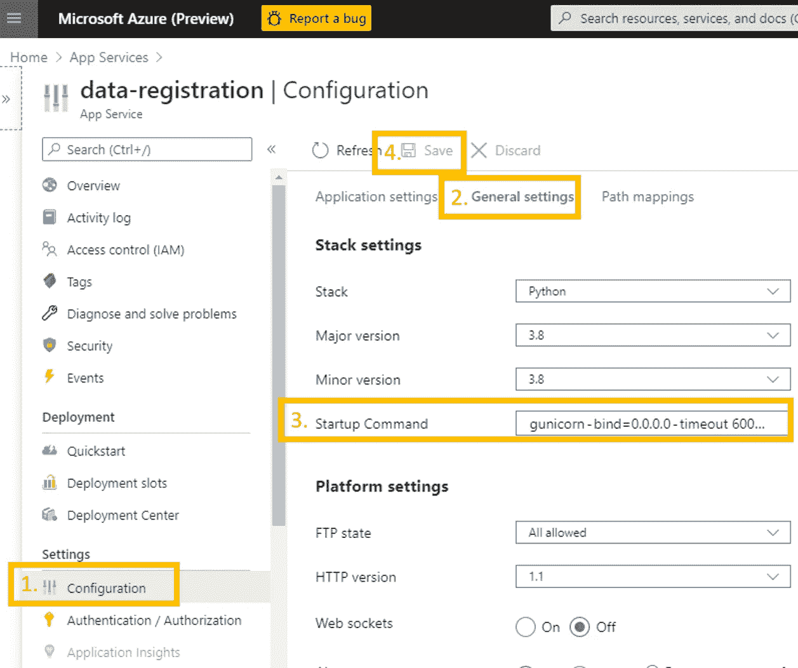****

****我通过门户创建了“数据注册”应用程序，然后从您的资源中通过名称选择它来更改配置。*作者图片*****

*   ****在 Azure 上创建一个“Web 服务”,运行时栈用 Python，操作系统用 Linux。部署后转到资源。****
*   ****更改您的应用程序服务[的启动命令，以匹配您的](https://docs.microsoft.com/en-us/azure/developer/python/tutorial-deploy-app-service-on-linux-04#flask-startup-commands) flask 应用程序的名称，并执行以下操作:****

```
**gunicorn --bind=0.0.0.0 --timeout 600 app_body:app**
```

*   ****(见左图)然后保存配置。****

****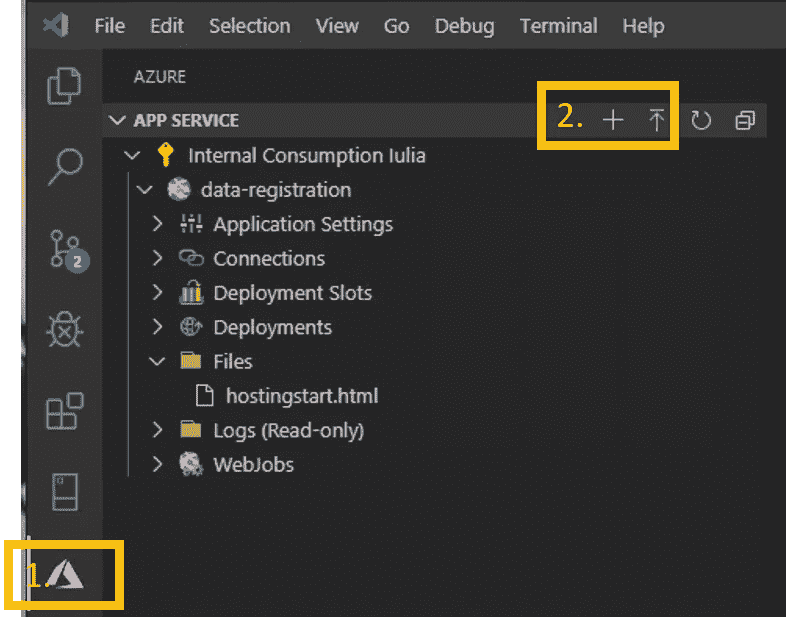****

****我创建的数据注册应用程序现在可以在 VSC 看到。*作者图片*****

*   ****现在，您需要将 Visual Studio 中的代码连接到您在 Azure 门户上创建的应用程序。****
*   ****[为 VSC 安装 azure web 服务插件](https://marketplace.visualstudio.com/items?itemName=ms-azuretools.vscode-azureappservice)，然后根据需要使用您的 azure 凭据登录。****
*   ****现在你将在 VSC 拥有蓝色之刃(1。图片中)，您可以在您的订阅下的列表中看到您创建的 web 应用程序。单击标有 deploy (2。)****
*   ****当命令托盘要求时，填写克隆的 repo 中的“app”文件夹和新部署的 web 的名称。然后单击 accept，现在您就可以将 python flask 应用程序和依赖项部署到您的新网站了。****
*   ****部署完成后，请访问网站。它应该说“你好，尤利亚！”—将`app_body.py`中的此消息更改为您想要的任何内容。****

****5.05 允许 Web 应用程序访问密钥库****

*   ****对于 web 应用程序的另一个页面，即`/send_data`，我们需要 Web 应用程序从您在步骤 4 中设置的密钥库中读取秘密。****
*   ****首先，Web 应用程序需要一个身份来授权。在门户中启用此功能，方法是转到您的 web 应用程序，然后转到身份设置:****

****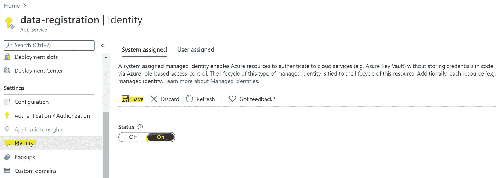****

****为您的 web 应用程序启用系统分配的身份，然后保存。*作者图片*****

****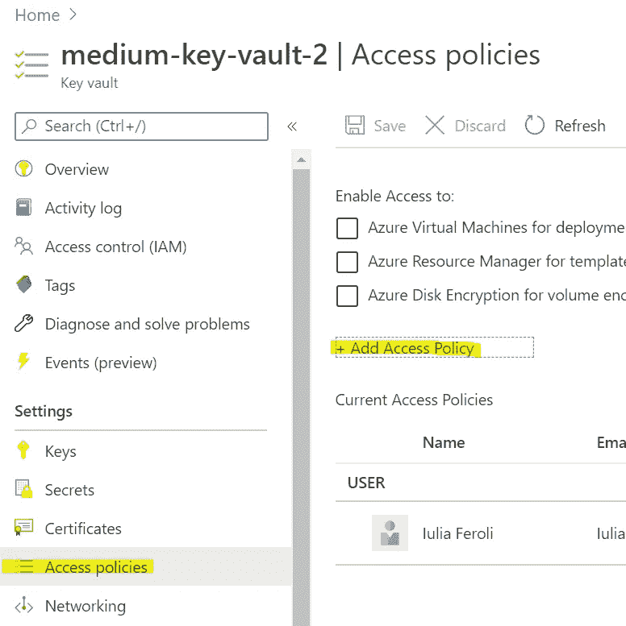****

*****作者图片*****

*   ****现在转到门户中的密钥库，检查访问策略设置。单击以添加新的访问策略，并搜索您刚刚为其创建身份的 Web 应用的名称；在保存上一步之前，它不会显示在列表中)****
*   ****使用*秘密管理*权限模板，在*选择负责人*下选择您的 Web App 名称并保存。然后再次保存对所有访问策略的修改。****
*   ****现在，您的 web 应用程序可以向`/send_data`选项卡发送 post 请求，并使用密钥库中的凭证注册您的数据。****

## ****[6。一个 Azure 数据工厂](https://docs.microsoft.com/en-us/azure/data-factory/quickstart-create-data-factory-portal)实例向你的 web 应用发送请求****

*   ****部署 Azure 数据工厂，通过 Author & Monitor 打开实例，然后单击 create pipeline。****
*   ****现在搜索“Web”活动，并将其拖动到您的管道区域。这将是你管道中的唯一一步。****
*   ****填写您部署的 web 应用程序的名称，选择 POST request，并填写您的请求主体，作为您克隆的代码的 JSON 输入。[点击](https://github.com/iuliaferoli/azureML_python_webapp_extensions/blob/master/Runthrough%20example.md#inputs--running)查看如何创建这个 JSON。****

****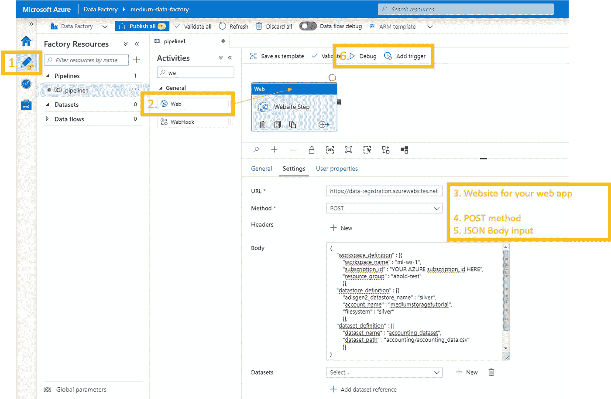****

*****作者图片*****

*   ****您现在可以调试或立即触发来运行您的函数。****
*   ****管道成功后，您现在可以检查您的 AML 工作区。您通过 JSON 发送的数据存储/数据集现在应该已经注册并可用了！****

********

****成功！！作者图片****

# ****C.增强安全性****

## ****7.安全和授权限制****

## ****为什么****

****此时，任何人都可以调用您的 web 应用程序，这不是一个健壮和安全的解决方案。****

****虽然没有数据通过 HTTP 请求发送，但应用程序也没有提供任何关于应用程序的信息；这仍然不是尽可能健壮和安全的解决方案(也不是企业解决方案所必需的)****

## ****解决办法****

****期望的状态:只有你的 Azure 数据工厂实例被授权调用你的 Web 应用，从而将数据注册到你的工作区。****

*   ****我们通过激活数据工厂的托管标识来实现这一点；这样就可以像授权给用户一样授权给它****
*   ****通过设置对 Web 应用程序的 AAD 认证，用户(或应用程序)必须登录，并且他们的帐户必须具有正确的授权才能进行呼叫。****

## ****履行****

****我的同事 René Bremer 已经设计了这个解决方案，他在 github 上有一个资源库。按照步骤去做。你只需要从 Azure 功能适应 Web 应用程序(无论如何都是同样的步骤)。****

****这是他设计的安全流程:****

****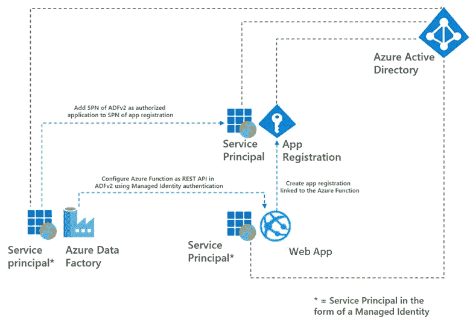****

****由勒内·布雷默创作****

# ****结束了****

****希望这对您有用，无论是完整的解决方案，还是您可以在不同项目中使用的独立部分！****