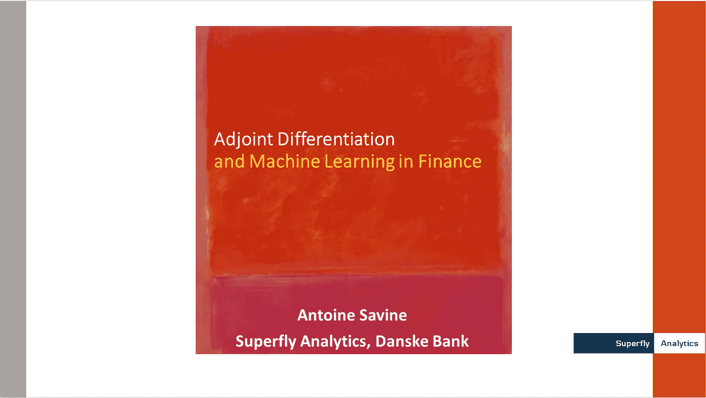

# 15 分钟内解释自动微分

> 原文：<https://towardsdatascience.com/automatic-differentiation-15min-video-tutorial-with-application-in-machine-learning-and-finance-333e18c0ecbb?source=collection_archive---------36----------------------->

## 视频教程及其在机器学习和金融中的应用

我在过去的五年里做了很多关于[自动微分](https://en.wikipedia.org/wiki/Automatic_differentiation) (AAD)的讲座和专业介绍。我甚至写了一本关于它的[书](https://www.amazon.com/Modern-Computational-Finance-Parallel-Simulations-ebook/dp/B07KJTXH7X)。许多学生、学者和专业人士认为最有用的是 2019 年 11 月在彭博伦敦办公室录制的 15 分钟教程。

挑战是在不到 1/4 小时的时间内解释 AAD 的主要思想及其在机器学习和金融中的应用。我想给出的不仅仅是一个概述，而是对关键的数学和技术概念的一个实际的窥视。

我设法在这么短的时间内涵盖了主要概念:

*   通过与有限差分等经典自动微分算法的比较，介绍 AAD 的优势，并在波动性风险报告的背景下进行演示。
*   介绍*计算图*的关键概念，以及前馈神经网络和 Black & Scholes 公式实现的明显不同的示例。
*   用可区分节点(或“ops”)的一般术语解释计算图，以及它们如何表达评估和区分。我还在威尔莫特杂志的三篇文章中详细讨论了这些话题。
*   发现逆序微分的力量，将经典反向传播推广到任意计算，回顾反向传播作为前馈网络环境中的一个特例。
*   解释 AAD 如何在执行过程中记录操作，并自动将它们按正确的顺序排列，以实现最佳反向传播，并在 Black & Scholes 计算图上进行说明。
*   介绍*路径微分*，衍生产品风险管理中的另一个关键概念，以及如何使用 AAD 以神奇的速度和分析准确性计算它们。
*   综上所述，解释先进投资银行中实施的现代衍生产品系统如何应用 AAD 实时计算复杂的风险报告，并使用支持计算机视觉或自然语言处理的相同底层技术。

我必须快速交付大量信息，因此本教程最好与幻灯片一起提供，如下所示:

点击图片查看幻灯片

安托万·萨维恩

在金融领域，衍生敏感性被称为“希腊人”——罗尔夫·鲍尔森在威尔莫特发表了一篇关于 AAD 的专栏文章(98 期，11 月 18 日，第 36-39 页)，名为**这不是斯巴达** (300 个希腊人不会阻止我们)