# 基于机器学习的胸部 CT 扫描自动判读

> 原文：<https://towardsdatascience.com/automatic-interpretation-of-chest-ct-scans-with-machine-learning-8902b1357de9?source=collection_archive---------33----------------------->

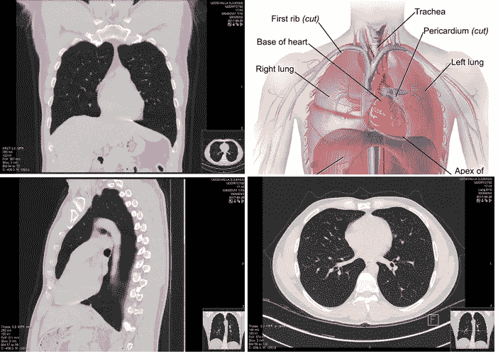

这张图片包括来自维基百科[这里](https://commons.wikimedia.org/wiki/Scrollable_high-resolution_computed_tomography_images_of_a_normal_thorax)的可滚动 CT 的剧照，以及来自维基百科[这里](https://en.wikipedia.org/wiki/Thoracic_cavity#/media/File:Blausen_0458_Heart_ThoracicCavity.png)的胸廓图。

这篇文章提供了使用机器学习自动解释胸部 CT 扫描的深入概述，包括对来自 19，993 名不同患者的 36，316 卷新 RAD-ChestCT 数据集的介绍。这篇文章的主要参考是我最近的论文[“基于机器学习的大规模胸部计算机断层扫描体积的多种异常预测”](https://arxiv.org/abs/2002.04752)，其中描述了 RAD-ChestCT 的开发和分析，这是世界上最大的胸部体积成像数据集。

CT 扫描是大体积图像，大约为 512 x 512 x 1000 灰度像素，描绘了心脏、肺和胸部的其他解剖结构。它们用于包括癌症、感染和骨折在内的各种医疗状况的诊断和管理。这篇文章讨论了如何获得 CT 扫描，如何解释 CT 扫描，为什么 CT 的自动解释具有挑战性，最后，如何使用机器学习来自动解释 CT 扫描。

# **什么是胸部 CT 扫描？**

胸部 CT 描绘了胸部，包括左肺、右肺、气道、心脏和大血管:

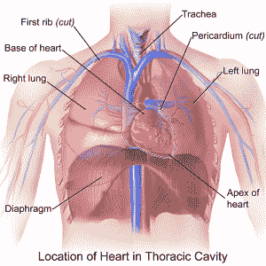

图片来源:[维基百科](https://en.wikipedia.org/wiki/Thoracic_cavity#/media/File:Blausen_0458_Heart_ThoracicCavity.png)

关于胸部解剖的更详细的概述，见[这篇文章](https://glassboxmedicine.com/2019/01/25/anatomy-for-radiology-chest/)。

因为胸部 CT 扫描是体积图像，所以可以通过滚动[三个不同的平面](https://glassboxmedicine.com/2019/01/22/anatomy-for-radiology-terms-of-location/)来查看:冠状面、轴面和矢状面。

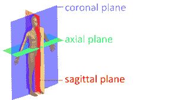

修改自[维基百科解剖平面](https://en.wikipedia.org/wiki/Anatomical_plane)

以下是轴面上的 CT 扫描示例[:](https://media3.giphy.com/media/2kWaWmhoFfFkI/source.gif)

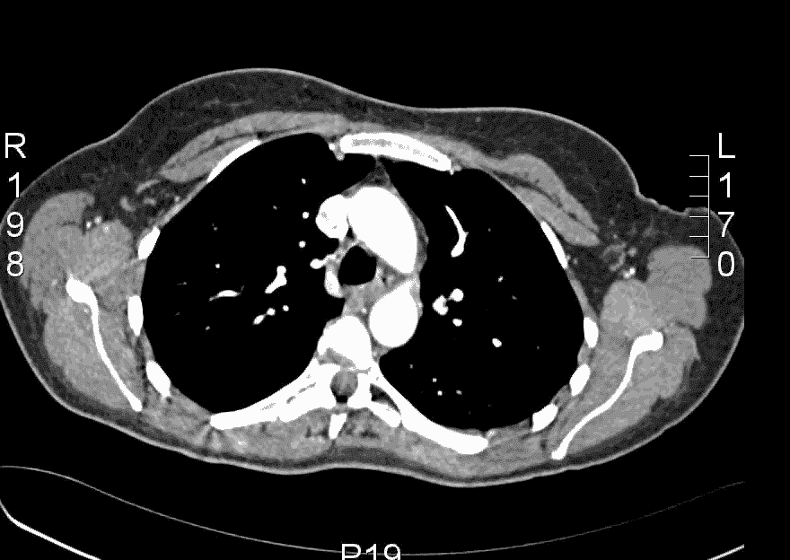

这是轴面上的另一个 CT 扫描示例:

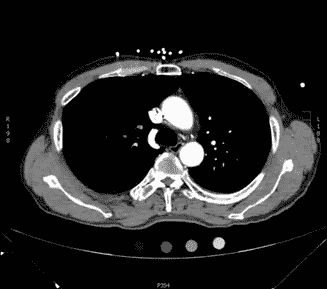

关于从所有三个不同视图显示的 CT 扫描示例，请参见[这篇文章](https://commons.wikimedia.org/wiki/Scrollable_high-resolution_computed_tomography_images_of_a_normal_thorax)，其中包括正常胸部的可滚动高分辨率 CT 图像。

# **CT 扫描是如何获得的？**

下图显示了 CT 扫描仪，它是一种环形仪器:

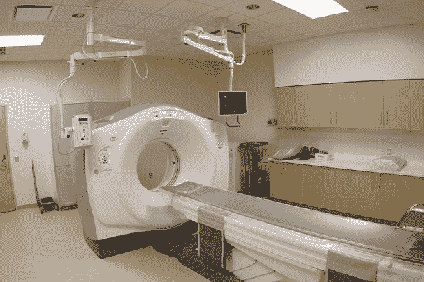

图片来源:[维基百科](https://en.wikipedia.org/wiki/File:UPMCEast_CTscan.jpg)

患者躺在手术台上，通过 CT 扫描仪的“环形孔”移动。这是 CT 扫描仪内部的样子:

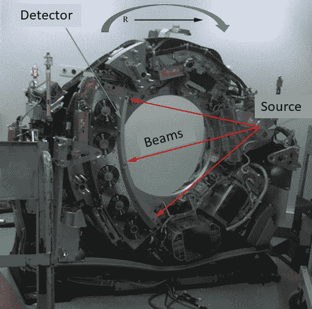

图片来源:修改自[维基百科](https://en.wikipedia.org/wiki/File:Ct-internals.jpg)

CT 扫描是基于 x 光的。然而，CT 与“投影 x 射线”不同，因为 CT 是 3D 的，而投影 x 射线是 2D 的(自动投影 x 射线解释在此[概述](https://glassboxmedicine.com/2019/05/11/automated-chest-x-ray-interpretation/))。

CT 扫描仪的 x 射线源将 x 射线束(上面红色部分所示)穿过患者的身体，射到探测器上。当患者穿过中心孔时，整个源/探测器设备围绕患者旋转，从而可以在 3D 空间中的许多点上测量患者身体的放射密度。

最终的 CT 扫描使用 Hounsfield 单位对患者体内数百万个点的辐射密度进行编码，其中空气显示为黑色，骨骼显示为白色。中等密度的组织显示为灰色。

# **放射科医师如何解读 CT 扫描？**

CT 扫描是一种流行的成像形式，对于许多疾病的诊断和管理非常有用。放射科医生是解释医学图像并撰写描述性报告的医生，其他医生在护理病人时会用到该报告。

放射科医师执行两个主要任务来解释 CT 扫描。首先，放射科医师必须确定存在何种异常情况，例如肺炎(肺部感染)、肺不张(肺组织塌陷)、心脏肥大(心脏增大)、结节、肿块、胸腔积液(肺部积液)等。接下来，放射科医师必须在描述中指明异常位于何处。位置通常在医学上很重要——例如，不同种类的肺癌往往位于不同的地方。下表总结了放射科医师的任务:

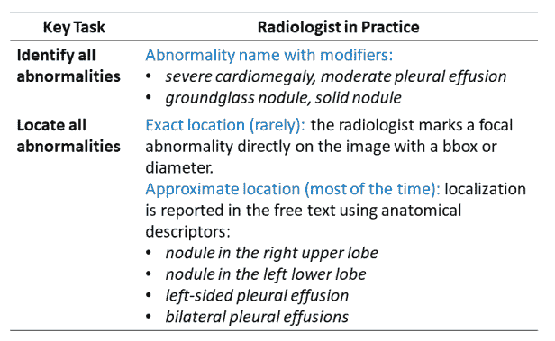

# **CT 报告示例**

这是一份来自国家诊断成像公司的胸部 CT 报告示例，其中的文本复制自一份公开的示例报告，您可以在此处查看:

> *检查:CTA 胸部 W W O 对比*
> 
> *临床病史:SOB、呼吸困难、呼吸困难、ILD、可能的职业性肺病*
> 
> *适应症:49 岁气短患者。可能是 PE。可能是职业性肺病。*
> 
> *程序:在无静脉造影和有静脉造影的情况下获得连续的轴向切片。通过肺动脉进行团注薄层切片。*
> 
> *肺动脉干显示无血栓或栓子迹象。没有鞍状栓子的证据。左右主肺动脉看起来不明显。双侧一级和二级肺动脉分支没有显示栓子。腋窝区域没有腺病。纵隔和肺门区域没有肿块或腺病。包括上腹部显示脾脏钙化，这可能表明远程肉芽肿性疾病。右边是一些局灶性肾皮质增厚，可能是先前的疤痕。没有证据表明肺实质间质性肺病。在图像 2 系列 4 的左下肺有一个 3 毫米的结节。如果有进一步的担忧，可以在 12 个月后进行 CT 监测。在左侧的同一系列图像 49 上也有一个类似的小结节。没有浸润或渗出。未见急性骨异常。*
> 
> *印象:没有肺栓塞疾病的证据。如果有足够的关注，可以在 12 个月时通过 CT 对左侧的一些小结节进行随访。没有间质性肺病的证据。*

# **为什么说自动 CT 判读是一项有趣且具有挑战性的任务？**

放射科医生为每次 CT 扫描制作这些详细的报告非常耗时。当患者已经接受了多次 CT 扫描时，这甚至更加耗时，例如，初始扫描和 3 个月后的随访扫描，因为在这种情况下，放射科医师必须并排比较两次扫描，以了解患者的健康状况如何变化。人们对开发机器学习方法以自动解释 CT 扫描、加速放射学工作流程并降低放射科医生 3–5%的实时诊断错误率非常感兴趣。

CT 扫描的自动解释具有挑战性，原因有几个:

**挑战 1:** 患者的解剖结构根据性别、年龄、体重和正常解剖变异而自然变化。因此“变异”不一定意味着“异常”

**挑战二:**有上百种可能的异常。下图仅显示了几个例子，包括嗜酸性肺炎、空洞性病变(“空洞”)、囊肿、肺气肿(肺变得更加疏松，例如由于吸烟)、气胸(肺和肺囊之间的气囊)和纤维化(类似于瘢痕形成):

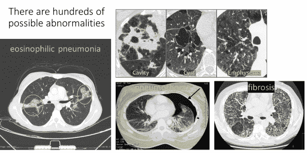

从这些原始图像修改:嗜伊红细胞肺炎[维基多克](https://www.wikidoc.org/index.php/Eosinophilic_pneumonia_CT)。空洞/囊肿/肺气肿[放射科医生](https://radiologyassistant.nl/assets/chest-x-ray-lung-disease/a52e3672ce5a1b_1-cyst-cavity.jpg)。气胸[百科](https://en.wikipedia.org/wiki/Pneumothorax)。纤维化[维基百科](https://en.wikipedia.org/wiki/High-resolution_computed_tomography)

**挑战 3:** 在一次扫描中通常会出现多种不同的异常。平均 CT 扫描包含 10 +/- 6 种不同的异常。下面显示了几个具有一个以上异常的 CT 扫描切片示例:

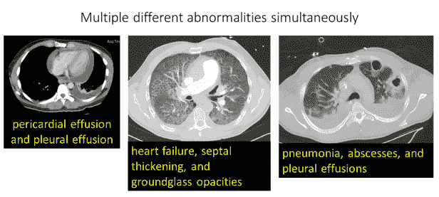

由这些原始图像修改而来:心包积液[放射科](https://radiopaedia.org/cases/pericardial-effusion-1)。肺炎、脓肿。心力衰竭[放射医学](https://radiopaedia.org/cases/congestive-cardiac-failure)

**挑战 4:** 此外，在一次扫描中经常会出现多个相同的异常情况。下面，我们可以看到一个扫描显示肺气肿肺中的多个肺大泡(大气囊)，另一个扫描显示充满结节，还有一个扫描显示多个肿块:

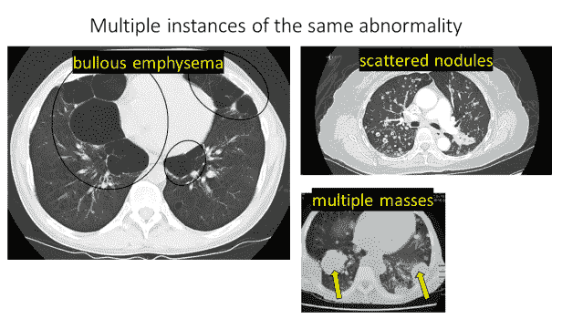

从这些原始图像修改:肺气肿[TES.com](https://www.tes.com/lessons/tGSVv66fn8GrOQ/emphysema)。结节[肺历书](https://pulmonarychronicles.com/index.php/pulmonarychronicles/article/view/467/1018)。大众[研究门户](https://www.researchgate.net/figure/chest-CT-Scan-of-showing-lung-masses-blue-arrows-and-multiple-nodules-consistent-with_fig2_281846781)

**挑战 5:** 不同的异常可以看起来彼此相似。在这些情况下，放射科医师依靠他们的广泛培训和患者的医疗背景来确定异常的性质。下面的扫描显示了肿瘤(“TUM”)和肺不张(“ATL”，塌陷的肺组织)，它们在该扫描中看起来相似:

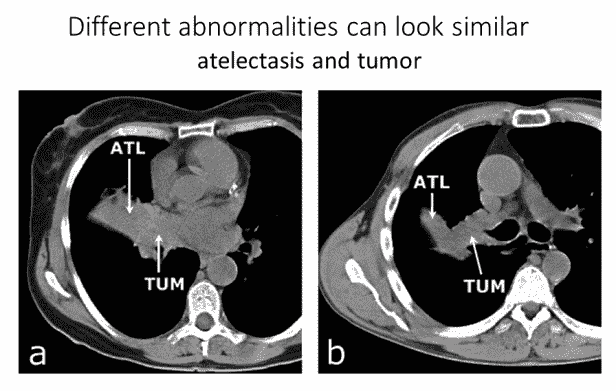

图片来源:肺不张/肿瘤[研究之门](https://www.researchgate.net/figure/Example-slices-of-typical-lung-CT-images-of-two-patients-with-atelectasis-ATL-and_fig1_313807162)

**挑战 6:** 同样的异常可以有不同的表现。例如，同样的异常情况根据严重程度会有不同的表现，例如下面的肺炎扫描，左边的扫描显示整个肺部因肺炎而“变白”,而右边的扫描只显示肺部因肺炎而“变白”的一小部分:

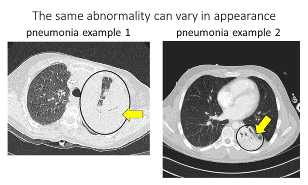

由这些原图修改:肺炎例 1 [Kalpana Bansal](https://www.researchgate.net/figure/Pneumonia-Axial-CT-scan-lung-window-section-showing-left-lung-consolidation-arrow_fig6_276176939) 。肺炎例 2 [放射医学](https://radiopaedia.org/articles/pneumonia?lang=us)

同样的畸形也可能因其形状和质地而看起来不同。下图显示了根据形状(例如分叶状、针状、圆形)和质地(例如毛玻璃、实心)而看起来不同的肺结节:

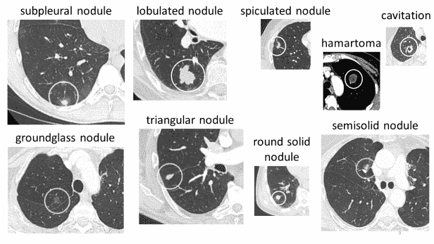

修改自这些原始图像:肺结节[维基百科](https://en.wikipedia.org/wiki/Lung_nodule)

下图总结了自动化 CT 解释面临的挑战:

# **如何使用机器学习进行自动 CT 解读**

为了理解如何使用机器学习进行自动 CT 解释，首先考虑哪种数据可用于训练模型是很重要的。

医疗保健系统保存与相应 CT 报告配对的 CT 体积:

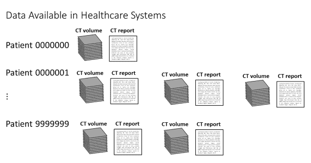

有些患者只有一个 CT 体积和报告，例如上图中的患者 000000。其他患者将有多个 CT 体积和报告。这些多个 CT 体积可能是在不同的时间拍摄的和/或可能是身体的不同部分(虽然本文主要关注胸部 CT，但也可能获得头部、腹部、骨盆和其他区域的 CT)。

我们还需要考虑哪种数据在医疗保健系统中不可用:

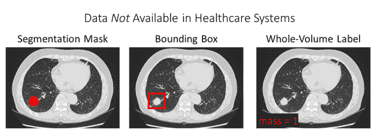

根据 SeattleCCA.org[的海量图像](https://www.seattlecca.org/diseases/lung-cancer/pulmonary-nodules)修改

具体来说，如上图所示，在基线时，我们无法访问:

*   分割遮罩:这些是像素标签(“感兴趣的异常周围的跟踪轮廓”)，需要它们来训练分割模型。此处回顾了医学图像的分割模型[。](https://glassboxmedicine.com/2020/01/21/segmentation-u-net-mask-r-cnn-and-medical-applications/)
*   边界框:这些是围绕感兴趣的异常绘制的框，需要它们来训练对象检测模型。从技术上来说，放射科医生有时会直接在图像上绘制线条或其他注释，通过大量的工作，这些线条或注释可以变成适合训练机器学习模型的边界框注释(例如， [DeepLesion](https://arxiv.org/abs/1710.01766) )。然而，放射科医师从不在单次扫描中注释每个异常，并且更可能的是，放射科医师将在一次扫描中仅注释一种类型异常的一个代表性实例(例如，几个结节中的一个结节)。因此，所有异常的综合边界框注释永远不可用。
*   全体积标签:这些是分配给训练全体积分类器所需的整个体积的标签。人们可能会认为医院会在 CT 扫描上存储“标签”,例如指示是否存在肿块(肿块=0 对肿块=1)。但是，医院不会存储这些信息。唯一可用的信息是自由文本报告。在以后的文章中，我将描述如何从自由文本报告中获得结构化的整卷标签。

## **可能性:从 CTs 生成文本**

假设我们所有的是与报告配对的卷，一种直观的方法是尝试直接从卷中生成文本。在该设置中，我们将首先将 CT 体积处理成低维表示(例如，使用 [CNN](https://glassboxmedicine.com/2019/05/05/how-computers-see-intro-to-convolutional-neural-networks/) )，然后我们将从该低维表示生成文本(例如，使用 LSTM):

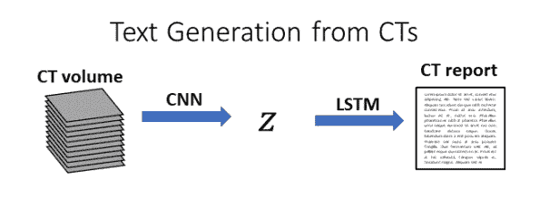

目前我还没有看到任何关于从体积中自动生成 CT 报告的研究。有几项关于自动生成胸部 x 射线报告的研究，这是一项更可行的任务，因为胸部 x 射线的尺寸小得多(小约 1，000 倍)，并且胸部 x 射线报告的长度短得多(短约 6 倍)。然而，即使在这个更简单的任务中，模型也很难产生准确的报告。我怀疑这部分是因为放射学报告包括许多“正常”的句子，所以对于一个模型来说，一个包含大多数正常句子的生成报告有可能获得“高分”，即使该报告在异常情况上搞砸了——这恰好是医生最关心的部分！

尽管从 CTs 生成文本可能是一项有趣的学术实践，但从 CTs 生成文本的主要实际缺点是:

*   文本生成模型必须是完美的，才能在商业上使用。如果每 10 个笔记中有一个错误，没有人会使用该系统，因为医疗错误的潜在成本太高，而且“检查每份报告的正确性”所需的时间比从头开始口述报告所需的时间还要长。
*   文本生成模型本身并不提供每个异常的性能指标，而这正是放射科医师为了信任该系统而需要看到的。有些异常比其他异常更难检测，放射科医生想知道该模型在检测每种异常方面有多好。

更实际的途径是建立一个机器学习系统，它可以以结构化的方式预测异常情况和位置。然后，我们可以获得每个异常的性能指标，还可以突出显示扫描中可以观察到每个异常的位置。这种系统可用于自动检伤分类(例如，“将所有带有气胸的扫描移动到放射科医师队列的顶部”)，并可与放射科医师的读数结合使用，以尝试并提高诊断准确性。此外，擅长预测异常和位置的系统也可以用于生成文本(如果这是期望的目标)。由于放射学语言是高度结构化的，仅给出异常及其位置的列表，使用规则生成基本的自由文本报告是微不足道的。

## **单一异常 CT 分类**

由于前面部分列出的原因，人们对 CT 图像中的异常分类很感兴趣。

在单一异常 CT 分类中，模型(通常为 CNN)处理 CT 体积，并根据感兴趣的特定异常是否存在产生 0 或 1(即，二元分类):

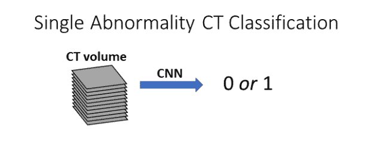

所有先前的胸部 CT 分类工作都集中在一次预测一种异常或一类异常的模型上。这一先前的工作依赖于小的、手工制作的数据集，这些数据集已经由专家用小块水平或切片水平的疾病注释费力地标记。

这是我整理的一个表格，总结了一些先前通过胸部 CT 扫描预测间质性肺病的工作。此处显示的模型通常为每个切片或补片分配一个类别标签，用于间质性肺病的子类别:

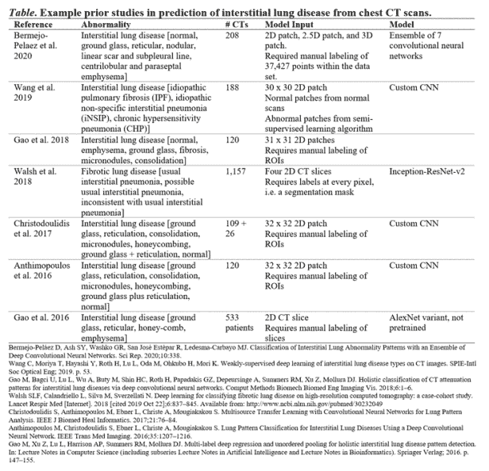

这是我整理的另一个表格，总结了之前对 CT 扫描中其他异常的预测，包括肺癌、颅内出血和气胸:

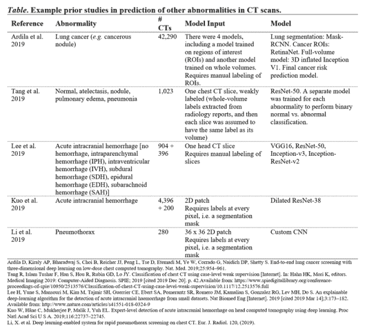

对补丁级或切片级注释进行训练的一个优点是，得到的模型将固有地提供补丁级或切片级的本地化。

关于补丁或切片级注释的训练的一个缺点是这些注释在健康系统中不可用，并且必须手动获取，这:

*   限制了可以包含在数据集中的 CT 数量(除了 Ardila 等人和 Kuo 等人的研究，所有这些论文都使用少于 1，200 次 CT 扫描)；
*   限制可以考虑的异常数量(显示的所有研究都考虑了<8 abnormalities).

## **多重异常 CT 分类**

尽管单一异常分类模型可以实现高性能，但是它们具有固有的有限功能。全面的 CT 解释将需要数百个独立的二元分类器。CT 解释的另一个框架是多标记分类，其中许多异常是从一次 CT 扫描中同时预测的。关于多类分类和多标签分类的回顾，请见[本帖](https://glassboxmedicine.com/2019/05/26/classification-sigmoid-vs-softmax/)。

多标记异常分类如下进行:

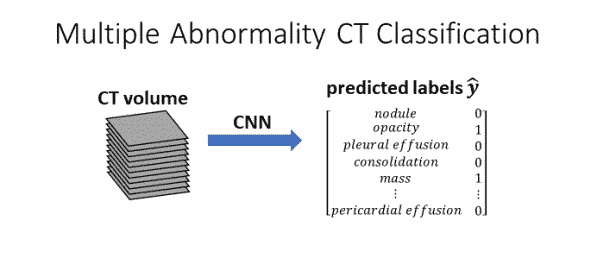

每个 CT 体积被分配给一个、多个或不分配给任何类别。

直到我的[最近的工作](https://arxiv.org/abs/2002.04752)多标记胸部 CT 分类的问题还没有被探索。然而，已经对多标记 2D 胸部 x 射线分类进行了深入研究，这得益于具有多个全图像标记的胸部 x 射线的大型公共数据集的可用性:

受先前胸部 x 线多标记分类工作的启发，我最近致力于胸部 CT 的多标记分类。[我在多标记胸部 CT 分类方面的工作](https://arxiv.org/abs/2002.04752)有三个部分:

*   准备来自 19，993 名不同患者的 36，316 个胸部 CT 体积的数据集。据我所知，这是世界上最大的多注释体积医学成像数据集。
*   开发一种基于规则的方法，用于从平均 F 值为 0.976 的自由文本放射学报告中自动提取结构化异常标签。需要这些结构化异常标签来训练分类器。
*   多器官、多疾病卷积神经网络分类器的训练和评估，该分类器分析整个 CT 体积以同时预测 83 种异常。该模型在 18 种异常情况下达到大于 0.90 的 [AUROC](https://glassboxmedicine.com/2019/02/23/measuring-performance-auc-auroc/) ，所有 83 种异常情况的平均 AUROC 为 0.773。

在以后的文章中，我将更详细地探讨这些方向:如何准备大量的 ct 数据集和报告，如何从报告中提取结构化标签，以及如何构建完整的 CT 分类器。

## **关于 CT 数据的其他有趣任务**

CT 数据的一些更有趣的任务是:

*   对象检测，其中模型预测感兴趣的异常周围的边界框的坐标。这里，围绕感兴趣的异常的边界框需要用于训练和评估。在[的深度病变论文](https://arxiv.org/abs/1710.01766)中可以找到 CT 扫描中这一任务的例子。
*   分割，其中模型预测像素标签(有效地，“异常的跟踪轮廓”)。
*   配准，其中模型“对齐”两个不同的扫描，以便解剖结构处于大致相同的位置。

# **总结**

*   胸部 CT 是由大约 512 x 512 x 1000 灰度像素组成的立体医学图像，使用围绕患者身体旋转的 x 射线源和探测器采集。
*   放射科医师通过识别扫描中出现的所有异常的性质和位置来解释胸部 CT。放射科医师写一份总结他们发现的报告。
*   医院存储 CT 体积和自由文本报告，但不存储分割遮罩、边界框或结构化整体体积标签。
*   CT 扫描的自动解释的先前工作集中在一次识别一类异常，例如间质性肺病或颅内出血。
*   最近，我整理了一个 36，316 个胸部 CT 体积的数据集，并建立了一个多标记分类模型来预测每个完整体积的 83 个异常。
*   CT 体积上的附加任务包括对象检测、分割和配准。

*原载于 2020 年 3 月 5 日 http://glassboxmedicine.com**[*。*](https://glassboxmedicine.com/2020/03/05/automatic-interpretation-of-chest-ct-scans-with-machine-learning/)*