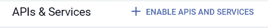
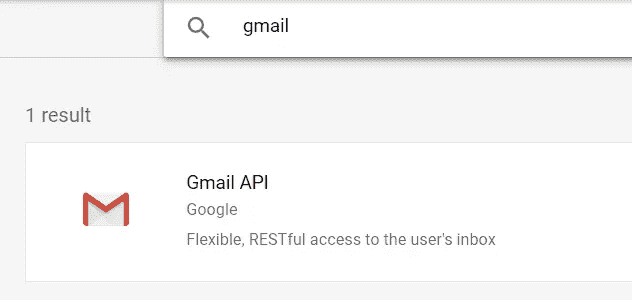
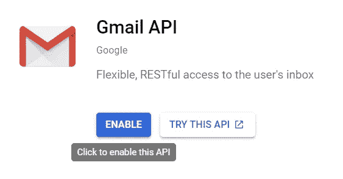
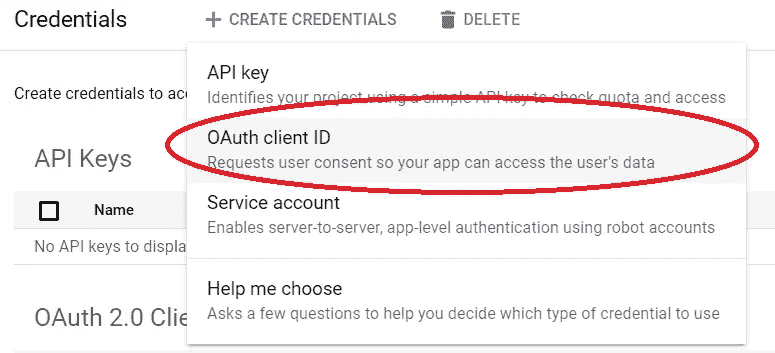
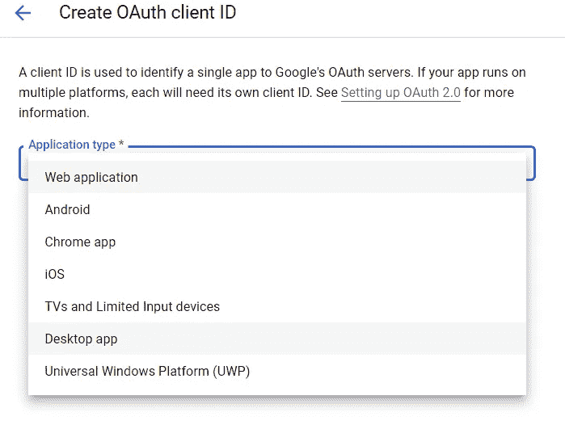
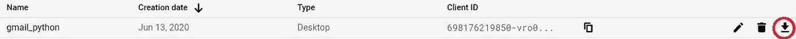
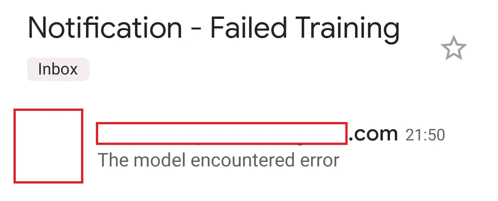

# 使用 Python 自动通知电子邮件

> 原文：<https://towardsdatascience.com/automatic-notification-to-email-with-python-810fd357d89c?source=collection_archive---------16----------------------->

## 使用 Python 自动化您的通知系统


约纳斯·勒普在 [Unsplash](https://unsplash.com?utm_source=medium&utm_medium=referral) 上拍摄的照片

你有没有处于一个等待你的机器学习模型，需要去某个地方的位置？或者您正在执行另一项任务，并且一直在思考您的脚本是否已经成功运行？我以前也有过这样的经历，这就是为什么我用 Python 为我的电子邮件创建了一个自动通知系统。

在本文中，我将解释如何通过几个简单的步骤用 Python 创建自动化系统。让我们开始吧。

# 电子邮件准备

为了简单起见，我会使用 Gmail 的电子邮件系统。我们首先需要做的是从[谷歌 API 控制台](https://console.developers.google.com/)设置 Gmail API。在开发人员仪表板中，选择启用 API 和服务。



在那里，尝试输入并搜索 Gmail API。



在 Gmail API 选项中，单击启用以激活我们的 Gmail API。



完成后，我们需要在中创建凭据来访问电子邮件，并使用 Gmail 发送通知。



选择 OAuth 客户端 ID，当询问应用程序类型时，因为我使用 Jupyter Notebook 来运行我的脚本，所以我会选择桌面应用程序。



随便你给它起什么名字，这里我就叫它 gmail_python。当您完成创建凭证时，您需要以 JSON 形式下载它。对于我的推荐，最好改名为‘credentials . JSON’。



将文件与 Jupyter 笔记本(或脚本)放在同一个文件夹中。

# 创建通知系统

电子邮件系统将基于谷歌 Gmail API 的推荐发送电子邮件。我还会使用[电子邮件模块](https://docs.python.org/3/library/email.html#module-email)来帮助我构建发送电子邮件的系统。

首先，让我们创建生成消息的函数。

```
from email import encoders
from email.mime.base import MIMEBase
from email.mime.multipart import MIMEMultipart
from email.mime.text import MIMEText
import base64
import osdef create_message(sender, to, subject, message_text):
  """Create a message for an email.Args:
    sender: Email address of the sender.
    to: Email address of the receiver.
    subject: The subject of the email message.
    message_text: The text of the email message.Returns:
    An object containing a base64url encoded email object.
  """
  message = MIMEText(message_text)
  message['to'] = to
  message['from'] = sender
  message['subject'] = subject
  return {'raw': base64.urlsafe_b64encode(message.as_string().encode()).decode()}
```

然后我们创建发送消息的函数。

```
def send_message(service, user_id, message):
  """Send an email message.Args:
    service: Authorized Gmail API service instance.
    user_id: User's email address. The special value "me"
    can be used to indicate the authenticated user.
    message: Message to be sent.Returns:
    Sent Message.
  """
  try:
    message = (service.users().messages().send(userId=user_id, body=message)
               .execute())
    print('Message Id: {}'.format(message['id']))
    return message
  except:
    print ('An error occurred')
```

现在我们有两个功能来创建消息和发送电子邮件。下一步，让我们创建一个自动化通知系统的函数。这里我们需要之前从 google Gmail API 创建的凭证。在这里，我将我的系统设置为使用凭证 JSON 文件作为‘credentials . JSON’。

```
def notification(sender, to, subject, notification):#Sender is the sender email, to is the receiver email, subject is the email subject, and notification is the email body message. All the text is str object.SCOPES = '[https://mail.google.com/'](https://mail.google.com/')
    message = create_message(sender, to, subject, notification)
    creds = Noneif os.path.exists('token.pickle'):
        with open('token.pickle', 'rb') as token:
            creds = pickle.load(token)
        #We use login if no valid credentials
    if not creds or not creds.valid:
        if creds and creds.expired and creds.refresh_token:
            creds.refresh(Request())
        else:
            flow =   InstalledAppFlow.from_client_secrets_file('credentials.json', SCOPES)
            creds = flow.run_local_server(port=0)
            # Save the credentials for the next run
        with open('token.pickle', 'wb') as token:
            pickle.dump(creds, token)service = build('gmail', 'v1', credentials=creds)
    send_message(service, sender, message)
```

随着我们的通知功能准备就绪，我们可以尝试发送通知。例如，我会尝试学习下面的机器学习模型。

```
import seaborn as sns
import pandas as pd
from sklearn.linear_model import LinearRegression#Loading the dataset and only using the numerical variables
mpg = sns.load_dataset('mpg').drop(['origin', 'name'], axis = 1)
linear_model = LinearRegression()try:
    #Training the model
    linear_model.fit(mpg.drop('mpg', axis =1), mpg['mpg'])notification('test1[@gmail.com](mailto:cornelliusyudhaw@gmail.com)', 'test2[@gmail.com](mailto:cornelliusyudhaw@gmail.com)', 'Notification - Success Training', 'The model has finish')
except:
    notification('test1[@gmail.com](mailto:cornelliusyudhaw@gmail.com)', 'test2[@gmail.com](mailto:cornelliusyudhaw@gmail.com)', 'Notification - Failed Training', 'The model encountered error')
```



现在，当培训结束或他们遇到错误时，我会收到通知。我们用于训练的上述数据含有 NaN 值，所以这显然会导致误差。虽然，我的观点是，我们现在能够为我们的电子邮件创建通知系统。

# 结论

在本文中，我向您展示了如何使用 python 为您的电子邮件创建一个简单的通知系统。你可以随意修改这个系统。

# 如果您喜欢我的内容，并希望获得更多关于数据或数据科学家日常生活的深入知识，请考虑在此订阅我的[简讯。](https://cornellius.substack.com/welcome)

> 如果您没有订阅为中型会员，请考虑通过[我的介绍](https://cornelliusyudhawijaya.medium.com/membership)订阅。