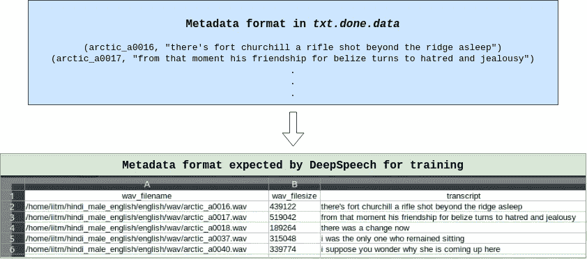

# 针对印度口音微调 Mozilla DeepSpeech

> 原文：<https://towardsdatascience.com/automatic-speech-recognition-for-the-indian-accent-91bb011ad169?source=collection_archive---------9----------------------->

## 谷歌语音识别 API 的最佳开源替代品——现在是第二大英语国家！


[张肯尼](https://unsplash.com/@kennyzhang29?utm_source=medium&utm_medium=referral)在 [Unsplash](https://unsplash.com?utm_source=medium&utm_medium=referral) 上拍照

让计算机识别语音的最初尝试之一是专注于识别数字！贝尔实验室在 1952 年设计了 [**奥黛丽系统**](http://www.icsi.berkeley.edu/pubs/speech/audreytosiri12.pdf) ，它可以识别单个语音说出的数字。从那以后，维基百科的这篇文章中详细记录了许多其他的实验。快进到今天，我们有最先进的自动语音识别引擎(ASR ),如苹果的 Siri、谷歌助手和亚马逊的 Alexa。

很长一段时间，谷歌的语音转文本 API (STT)是任何 ASR 任务事实上的选择。当像[**Mozilla deep speech**](https://github.com/mozilla/DeepSpeech)这样的开源替代品在 2017 年末问世时，这种情况慢慢改变了。它基于百度的原始[深度语音研究论文，并使用(大部分)美国英语数据集进行训练，导致对其他英语口音的泛化能力较差。](https://arxiv.org/abs/1412.5567)

在最近的一次实习中，我不得不为一个视频会议平台集成一个 ASR 引擎，这个平台主要由印度人使用。我们更倾向于寻找开源替代方案，但是大多数通用方案在实时会议中表现不佳。就在那时，我看到了 DeepSpeech 和 IITM 的[**Indic TTS**](https://www.iitm.ac.in/donlab/tts/index.php)**项目。**

**Indic 数据集包含超过 50 GB 的来自印度 13 个邦的说话者的语音样本。它由 10000 多个英语口语句子组成，既有男性也有女性母语者。这些文件可以在*中找到。wav* 格式连同相应的文本。**

**在本文中，我将向您展示使用 Indic 数据集对 DeepSpeech 进行微调的过程，但是您也可以轻松地对其他英语数据集进行微调。你可以在 [IITM 网站](https://www.iitm.ac.in/donlab/tts/database.php)上注册，向他们索取数据集。**

**先决条件:熟悉 ASR 引擎、语音处理，并对递归神经网络和张量流有基本的了解。**

**注意:我所有的训练和预处理都是在 Google Colab 上用 **DeepSpeech 版本 0.7.4** 完成的**

# **预处理数据集**

**在你申请数据集后，IITM 会给你七天的时间访问他们的 Google Drive 链接。因为我长期需要这些数据，所以我把所有的 ZIP 文件都转移到了 Google Cloud Bucket 中。每个 ZIP 文件都会有一个包含*的文件夹。wav* 文件和对应的名为 *txt.done.data* 的元数据文件。**

**我们需要处理元数据文件，并为数据集生成*培训/开发/测试*分割。我们可以一次为一个州训练模型，或者将几个州分组，然后训练模型。下图显示了如何处理元数据。**

****

**作者图片**

**下面给出的 GitHub 要点包含了生成单个 CSV 文件的完整代码，我们稍后需要对其进行拆分。大部分代码都是不言自明的，有足够的注释。确保先安装好 **Librosa** 和 **num2words** 。**

**执行脚本时， *wav* 参数指向包含所有音频文件的文件夹，而 *meta* 参数指向包含 *txt.done.data* 文件的文件夹。这里，第一部分将数据从 Google Bucket 复制到 Colab。第二部分创建一个 CSV 文件，最后一个命令追加到这个 CSV 文件中，依此类推。如果您想单独训练每个 ZIP 文件，只运行一个命令并继续分割 CSV(尽管我不建议这样做)。如果附加到同一个文件，小心注释掉第 45 行。**

```
$ gsutil cp gs://bucket-name/hindi_female_english.zip /content/hindi_female_english.zip
$ gsutil cp gs://bucket-name/hindi_male_english.zip /content/hindi_male_english.zip$ unzip hindi_female_english.zip -d /content/hindi_female_english
$ unzip hindi_male_english.zip -d /content/hindi_male_english--------------------------------------------------------------------$ python preProcess.py --wav /content/hindi_female_english/english/wav --meta /content/hindi_female_english/english$ python preProcess.py --wav /content/hindi_male_english/english/wav --meta /content/hindi_male_english/english
```

**现在，我们有一个 CSV 文件，需要将它分成三个单独的文件。在左边的要点中，我们首先将主 CSV 文件分割成*序列*和*中间*，然后将*中间*分割成*开发*和*测试*。然后我们最终有了三个文件，对应于 DeepSpeech 训练所需的三个拆分。**

# **微调深度演讲**

**这里给出了官方培训文档[。它非常详细，但跳过了一些可能会让你沮丧很长时间的细节😩。我假设您已经将数据集传输到 Google Cloud bucket，并且有适当的互联网连接，因为如果您不快速重新连接，Colab 会终止您的实例。**以下所有步骤均摘自 Colab 上的** **培训笔记本**](https://deepspeech.readthedocs.io/en/v0.7.4/TRAINING.html) [**此处**](https://colab.research.google.com/drive/15s7ZcV-MxOOMIvQSL48KYTSFcDmjc4gi?usp=sharing) **。****

1.  ****授权 Colab 访问您的 Google Cloud Bucket:** 下载您项目的 IAM 访问凭证文件并上传到 Colab。**

```
import os
from google.colab import authauth.authenticate_user()os.environ["GOOGLE_APPLICATION_CREDENTIALS"] = "creds.json"#ensure the path is set correctly
!echo $GOOGLE_APPLICATION_CREDENTIALSproject_id = '<gcloud-project-id>'
bucket_name = 'gs://<bucket-name>'
!gcloud config set project {project_id}
```

****2。从 GitHub:** 克隆 DeepSpeech v0.7.4，下载相应的检查点。**

```
!git clone --branch v0.7.4 [https://github.com/mozilla/DeepSpeech](https://github.com/mozilla/DeepSpeech)!wget [https://github.com/mozilla/DeepSpeech/releases/download/v0.7.4/deepspeech-0.7.4-checkpoint.tar.gz](https://github.com/mozilla/DeepSpeech/releases/download/v0.7.4/deepspeech-0.7.4-checkpoint.tar.gz)!tar -xvf deepspeech-0.7.4-checkpoint.tar.gz -C \
/content/model_checkpoints/
```

****3。安装 DeepSpeech 依赖项:**每次训练模型时，我们都需要安装很多东西。详细步骤在笔记本[这里](https://colab.research.google.com/drive/15s7ZcV-MxOOMIvQSL48KYTSFcDmjc4gi#scrollTo=In4HqOMdrg8n&line=2&uniqifier=1)给出。**

****4。设置默认的 CUDA 版本:**如果你第一次没有做好，这部分将会非常令人沮丧😤。出于某种原因，每当你试图在 Colab 中设置默认的 CUDA 版本为 10.0 (DeepSpeech 需要 CUDA 10.0 和 CuDNN v7.6)，它总是试图恢复到 10.1🤷。我发现了一系列看似有效的步骤，但我不能保证每次都有效——你可能需要挖掘一点点，才能找到正确的方法。详细步骤在笔记本[这里](https://colab.research.google.com/drive/15s7ZcV-MxOOMIvQSL48KYTSFcDmjc4gi#scrollTo=pQIMGUGzU09V&line=3&uniqifier=1)给出。如果你仍然不能让它工作，我会非常乐意帮助:)**

****5。安装 TensorFlow-GPU:****

```
!pip3 uninstall tensorflow
!pip3 install 'tensorflow-gpu==1.15.2'
```

**6。将数据从 Google Bucket 复制到 Colab:这里需要小心，将文件复制到您生成 CSV 文件时的位置，因为模型使用 CSV 文件中声明的音频文件的绝对路径。**

```
%cd /content/!gsutil cp gs://bucket-name/hindi_female_english.zip /content/hindi_female_english.zip
!gsutil cp gs://bucket-name/hindi_male_english.zip /content/hindi_male_english.zip!unzip hindi_female_english.zip -d /content/hindi_female_english
!unzip hindi_male_english.zip -d /content/hindi_male_english
```

****7。检查不在 *alphabet.txt* :** 中的额外字符这个文件(存在于 */DeepSpeech/data* 中)定义了 DeepSpeech 正在被训练的语言的字母表。因为我们的任务语言是一样的，我们不需要改变它。如果我们想用一种完全不同的语言训练一个新的模型，我们需要重新定义字母表并遵循这些步骤。将三个 CSV 文件上传到 */content/* 并对其运行 *check_parameters.py* 。**

```
!python3 /content/DeepSpeech/training/deepspeech_training/util/check_characters.py -csv /content/train.csv -alpha!python3 /content/DeepSpeech/training/deepspeech_training/util/check_characters.py -csv /content/dev.csv -alpha!python3 /content/DeepSpeech/training/deepspeech_training/util/check_characters.py -csv /content/test.csv -alpha
```

****注意:**您可能需要注释掉`check_characters.py`中的一些行才能让它工作。在注释掉一些行之后，这个文件中的第 44 行应该是这样的**

```
if not args.disable_unicode_variants:
  unicode_transcript = unicodedata.normalize("NFKC", row[2])
  #if row[2] != unicode_transcript:
    #print("Your input file", in_file, "contains at least one transript with unicode chars on more than one code-point: '{}'. Consider using NFKC normalization: unicodedata.normalize('NFKC', str).".format(row[2]))
    #sys.exit(-1)
all_text |= set(row[2])
```

**8.训练模型(最后😌):这一步非常简单。尝试不同的超参数，并仔细检查路径。增强参数可以帮助您的模型更好地进行概化。**

**9.导出模型进行推理:训练过程完成后，a *。pb* 模型文件被导出到 *export_dir* 。但是这个模型非常大(~700MB)，并且对于批量预测不是非常有效。幸运的是，有一个选项可以将导出的模型转换成内存映射模型，之后我们会得到一个*。pbmm* 模型文件。**

```
%cd /content/DeepSpeech/!python3 util/taskcluster.py --source tensorflow --artifact convert_graphdef_memmapped_format --branch r1.15 --target .!./convert_graphdef_memmapped_format --in_graph=/content/models/ft_model.pb --out_graph=/content/models/ft_model.pbmm
```

**这个*。pbmm* 文件相对较小(~180MB)且高效，可与相应的[划线器文件](https://github.com/mozilla/DeepSpeech/releases/download/v0.7.4/deepspeech-0.7.4-models.scorer)一起使用，以改善推断结果。**

# **结论**

**唷！那篇文章很长😵。如果您已经到达这里，感谢您的坚持:)**

**在我使用 DeepSpeech 的过程中，我发现它是 ASR 最容易使用的库之一。我希望这篇文章能帮助任何自己尝试的人。**

**你可以通过 [LinkedIn](https://www.linkedin.com/in/abhiroop1999/) 、 [GitHub](https://github.com/abhirooptalasila) 联系我**

**[](/generating-subtitles-automatically-using-mozilla-deepspeech-562c633936a7) [## 使用 Mozilla DeepSpeech 自动生成字幕

### 对于那些嘴里薯条的噪音让你无法看电影的时候:)

towardsdatascience.com](/generating-subtitles-automatically-using-mozilla-deepspeech-562c633936a7)**