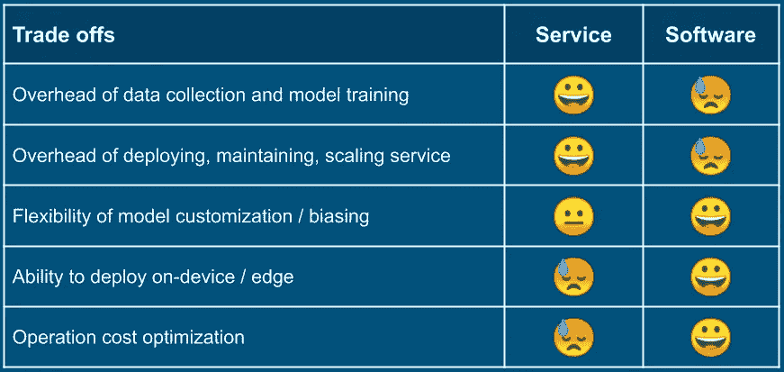
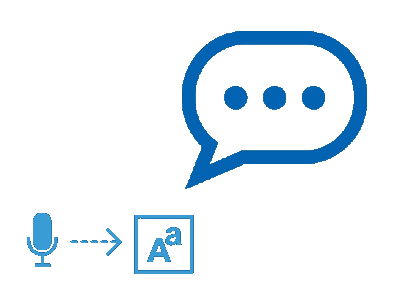
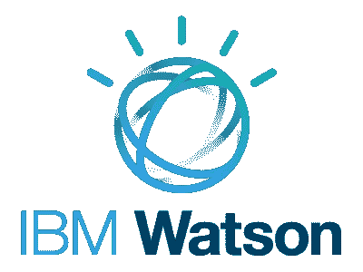
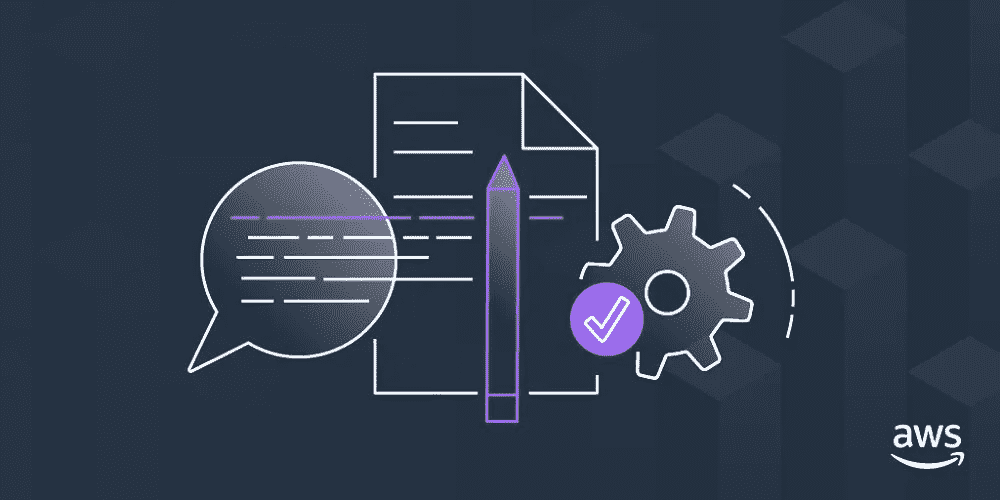
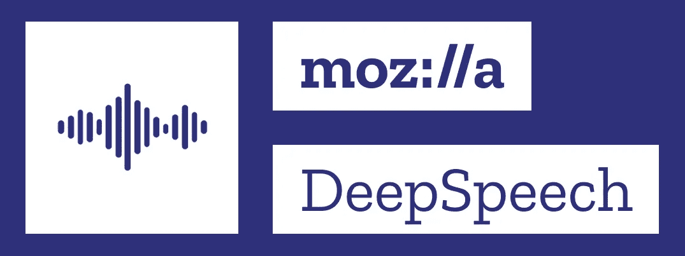

# 用 Python 进行语音识别

> 原文：<https://towardsdatascience.com/automatic-speech-recognition-in-python-programs-a64851ad29b3?source=collection_archive---------18----------------------->


图片来自[俚语实验室](https://slanglabs.in)

## 语音识别

## 比较 9 个最突出的选择。

语音识别技术在过去的几年里发展迅速，并且正在从科学领域过渡到工程领域。随着 Alexa、Siri 和 Google Assistant 等语音助手的日益流行，一些应用程序(例如， [YouTube](https://medium.com/slanglabs/voice-in-apps-youtube-25bcc288ac4c) 、[加纳王国](https://medium.com/slanglabs/voice-in-apps-gaana-1f6e2d8b026b)、 [Paytm Travel](https://medium.com/slanglabs/voice-in-apps-paytm-travel-5bee6aea76dc) 、 [My Jio](https://medium.com/slanglabs/voice-in-apps-my-jio-5dc8f2e298d) )开始拥有语音控制的功能。在 Slang Labs，我们正在为程序员构建一个平台，让他们能够轻松地用语音体验来增强现有的应用程序。

自动语音识别(ASR)是处理语音的必要的第一步。在 ASR 中，对麦克风说出的音频文件或语音经过处理并转换为文本，因此也称为语音到文本(STT)。然后，该文本被馈送到自然语言处理/理解(NLP/NLU)以理解和提取关键信息(例如意图、情感)，然后采取适当的行动。ASR 也有独立的应用，例如记录口述，或为视频制作实时字幕。

我们对 ASR 和 NLU 感兴趣，尤其是它们在应用程序中语音到动作循环的功效。我们的 [Android 和 Web SDK](https://docs.slanglabs.in/)提供了从应用程序员的角度来看合适的简单 API，而俚语平台则处理将 ASR、NLU 和文本到语音(TTS)缝合在一起的复杂性负担。但是，很自然地，我们对 ASR、NLU 和 TTS 的技术状态感到好奇，尽管我们没有将我们技术堆栈的这些部分作为单独的 SaaS 产品来展示。对现有 ASR 解决方案的探索就是这种好奇心的结果。

# 服务与软件

有两种可能性:在云上调用语音转文本 SaaS，或者在应用程序中托管一个 ASR 软件包。

**服务**是最容易开始的方式。你必须报名参加 SaaS 并获得钥匙/证书。然后，您就可以在代码中使用它了，或者通过 HTTP 端点，或者通过您选择的编程语言中的库。然而，对于合理的大量使用，它通常花费更多的钱。

**软件**软件包在您托管它时为您提供完全的控制，还可以为您的应用创建更小的模型，并将其部署在设备/边缘上，而无需网络连接。但训练和部署模型需要专业知识和前期努力。



使用语音云服务与自托管 ASR 软件包的权衡

这是一个可逆的选择。例如，您可以从云服务开始，如果需要，迁移到您自己的软件包部署；反之亦然。您可以设计您的代码来限制这种反转的爆炸半径，以及在您迁移到另一个 SaaS 或软件包的情况下。

# 批处理与流式

您需要确定您的应用程序需要批处理 ASR 还是流式 ASR。

**批处理:**如果你有需要离线转录的录音，那么批处理就足够了，而且更经济。在 batch API 中，音频文件作为参数传递，语音到文本的转换一次性完成。

**流媒体:**如果你需要实时处理语音(比如声控应用，视频字幕)，你就需要一个流媒体 API。在流式 API 的情况下，使用音频缓冲区的可用块重复调用它。它可能会发送临时结果，但最终结果在最后才可用。

所有的服务和软件包都有批处理 API，但是目前有些缺少流式 API。因此，如果你有一个流媒体应用程序，这消除了一些选择。

# Python 的选择

大多数语音服务提供流行编程语言的库。在最坏的情况下，您总是可以使用 HTTP 端点。对于语音包来说也是如此，这些包带有各种编程语言的绑定。在最坏的情况下，您可以自己创建绑定。所以使用 Python 没有任何约束。

> 我为本文选择 Python，因为大多数语音云服务和 ASR 软件包都有 Python 库。此外，你可以在浏览器中使用它的同伴 [**Colab notebook**](https://colab.research.google.com/github/scgupta/ml4devs-notebooks/blob/master/speech/asr/python_speech_recognition_notebook.ipynb) 运行文章的代码片段，而不需要在你的计算机上安装任何东西。

一个常见的用例是从麦克风收集音频，并将缓冲区(批处理或流)传递给语音识别 API。不变的是，在这样的转录器中，麦克风是通过 [PyAudio](https://people.csail.mit.edu/hubert/pyaudio/) 访问的，这是通过 [PortAudio](http://www.portaudio.com/) 实现的。但是由于麦克风在 Colab 上不可用，我们将其简化。我们将使用一个完整的音频文件来检查批处理 API。对于流式 API，我们将把一个音频文件分成块并模拟流。

# 如何最好地利用文章的其余部分

涵盖以下服务和软件包。

**服务:**

1.  谷歌语音转文本
2.  微软 Azure 语音
3.  IBM Watson 语音测试
4.  亚马逊转录
5.  细微差别

**软件:**

1.  CMU 狮身人面像
2.  Mozilla DeepSpeech
3.  卡尔迪
4.  脸书 wav2 字母

由于某些特性或限制(在各自的章节中列出)，没有为 Amazon Transcribe、Nuance、Kaldi 和脸书 wav2letter 提供代码示例。相反，给出了代码示例和资源的链接。

下一节有常见的实用函数和测试用例。最后一节介绍了 Python `SpeechRecognition`包，它提供了对几个服务和软件包的批处理 API 的抽象。

如果你想对所有的服务和软件包有一个总体的了解，那么请打开 [Colab](https://colab.research.google.com/github/scgupta/ml4devs-notebooks/blob/master/speech/asr/python_speech_recognition_notebook.ipynb) ，在你阅读这篇文章的时候执行代码。如果您只对特定的服务或套餐感兴趣，请直接跳到该部分。但是不管是哪种情况，都要使用 Colab 中的代码来更好地探索它。

让我们深入研究代码。

# 通用设置

下载我们将用于测试语音识别服务和软件包的音频文件:

```
$ curl -LO https://github.com/mozilla/DeepSpeech/releases/download/v0.6.0/audio-0.6.0.tar.gz

$ tar -xvzf audio-0.6.0.tar.gz

$ ls -l ./audio/
```

它有三个音频文件。用需要的元数据定义测试用例:

```
TESTCASES **=** [
  {
    'filename': 'audio/2830-3980-0043.wav',
    'text': 'experience proves this',
    'encoding': 'LINEAR16',
    'lang': 'en-US'
  },
  {
    'filename': 'audio/4507-16021-0012.wav',
    'text': 'why should one halt on the way',
    'encoding': 'LINEAR16',
    'lang': 'en-US'
  },
  {
    'filename': 'audio/8455-210777-0068.wav',
    'text': 'your power is sufficient i said',
    'encoding': 'LINEAR16',
    'lang': 'en-US'
  }
]
```

另外，写一些实用函数。`read_wav_file()`获取音频文件的路径，并返回缓冲字节和采样率:

```
**def** **read_wav_file**(filename) **->** Tuple[bytes, int]:
    **with** wave**.**open(filename, 'rb') **as** w:
        rate **=** w**.**getframerate()
        frames **=** w**.**getnframes()
        buffer **=** w**.**readframes(frames)

    **return** buffer, rate
```

`simulate_stream()`对于模拟 steam 来尝试流式 API 很有用。通常，会有一个类似麦克风的音频源。每隔一段时间，麦克风将生成一个语音块，该语音块必须传递给流 API。`simulate_stream()`函数有助于避免所有的复杂性，并专注于 API。它需要一个音频缓冲区和批处理大小，*生成该大小的*块。请注意下面的`yield buf`语句:

```
def simulate_stream(buffer: bytes, batch_size: int = 4096):
    buffer_len = len(buffer)
    offset = 0
    while offset < buffer_len:
        end_offset = offset + batch_size
        buf = buffer[offset:end_offset]
        yield buf
        offset = end_offset
```

# 谷歌语音转文本


谷歌将[语音转文本](https://cloud.google.com/speech-to-text/docs)作为谷歌云服务之一。它有 C#、Go、Java、JavaScript、PHP、Python 和 Ruby 的[库](https://cloud.google.com/speech-to-text/docs/reference/libraries)。它支持批处理和流模式。

## 设置

你将需要你的[谷歌云证书](https://developers.google.com/accounts/docs/application-default-credentials)。您需要设置指向 cred 文件的环境变量`GOOGLE_APPLICATION_CREDENTIALS`:

```
$ export GOOGLE_APPLICATION_CREDENTIALS**=**'/path/to/google/cloud/cred/file/gc-creds.json'
$ ls -l $GOOGLE_APPLICATION_CREDENTIALS
```

## 批处理 API

使用批量语音转文本 API 很简单。您需要创建一个`SpeechClient`，创建一个带有音频元数据的`config`，并调用语音客户端的`recognize()`方法。

```
**from** google.cloud **import** speech_v1
**from** google.cloud.speech_v1 **import** enums

**def** **google_batch_stt**(filename: str, lang: str, encoding: str) **->** str:
    buffer, rate **=** read_wav_file(filename)
    client **=** speech_v1**.**SpeechClient()

    config **=** {
        'language_code': lang,
        'sample_rate_hertz': rate,
        'encoding': enums**.**RecognitionConfig**.**AudioEncoding[encoding]
    }

    audio **=** {
        'content': buffer
    }

    response **=** client**.**recognize(config, audio)
    *# For bigger audio file, replace previous line with following:
*    *# operation = client.long_running_recognize(config, audio)
*    *# response = operation.result()* 
    **for** result **in** response**.**results:
        *# First alternative is the most probable result
*        alternative **=** result**.**alternatives[0]
        **return** alternative**.**transcript

*# Run tests* **for** t **in** TESTCASES:
    **print**('\naudio file="{0}"    expected text="{1}"'**.**format(
        t['filename'], t['text']
    ))
    **print**('google-cloud-batch-stt: "{}"'**.**format(
        google_batch_stt(t['filename'], t['lang'], t['encoding'])
    ))
```

当您运行它时，您将在输出中看到每个音频测试文件的文本:

```
audio file="audio/2830-3980-0043.wav"    expected text="experience proves this"
google-cloud-batch-stt: "experience proves this"

audio file="audio/4507-16021-0012.wav"    expected text="why should one halt on the way"
google-cloud-batch-stt: "why should one halt on the way"

audio file="audio/8455-210777-0068.wav"    expected text="your power is sufficient i said"
google-cloud-batch-stt: "your power is sufficient I said"
```

## 流式 API

谷歌的流媒体 API 也相当简单。为了处理音频流，您可以使用可用的音频块重复调用流 API，它将返回临时结果:

```
**from** google.cloud **import** speech
**from** google.cloud.speech **import** enums
**from** google.cloud.speech **import** types

**def** **response_stream_processor**(responses):
    **print**('interim results: ')

    transcript **=** ''
    num_chars_printed **=** 0
    **for** response **in** responses:
        **if** **not** response**.**results:
            **continue**

        result **=** response**.**results[0]
        **if** **not** result**.**alternatives:
            **continue**

        transcript **=** result**.**alternatives[0]**.**transcript
        **print**('{0}final: {1}'**.**format(
            '' **if** result**.**is_final **else** 'not ',
            transcript
        ))

    **return** transcript

**def** **google_streaming_stt**(filename: str, lang: str, encoding: str) **->** str:
    buffer, rate **=** read_wav_file(filename)

    client **=** speech**.**SpeechClient()

    config **=** types**.**RecognitionConfig(
        encoding**=**enums**.**RecognitionConfig**.**AudioEncoding[encoding],
        sample_rate_hertz**=**rate,
        language_code**=**lang
    )

    streaming_config **=** types**.**StreamingRecognitionConfig(
        config**=**config,
        interim_results**=**True
    )

    audio_generator **=** simulate_stream(buffer)  *# chunk generator
*    requests **=** (
        types**.**StreamingRecognizeRequest(audio_content**=**chunk)
        **for** chunk **in** audio_generator
    )
    responses **=** client**.**streaming_recognize(
        streaming_config, requests
    )
    *# Now, put the transcription responses to use.
*    **return** response_stream_processor(responses)

*# Run tests* **for** t **in** TESTCASES:
    **print**('\naudio file="{0}"    expected text="{1}"'**.**format(
        t['filename'], t['text']
    ))
    **print**('google-cloud-streaming-stt: "{}"'**.**format(
        google_streaming_stt(
            t['filename'], t['lang'], t['encoding']
        )
    ))
```

在输出中，您可以看到随着输入更多音频，效果会有所改善:

```
audio file="audio/2830-3980-0043.wav"    expected text="experience proves this"
interim results: 
not final: next
not final: iSpy
not final: Aspira
not final: Xperia
not final: Experian
not final: experience
not final: experience proved
not final: experience proves
not final: experience proves the
not final: experience proves that
not final: experience
final: experience proves this
google-cloud-streaming-stt: "experience proves this"
```

# 微软 Azure 语音



微软 Azure 认知服务是一个 AI 服务和认知 API 的家族。[语音服务](https://azure.microsoft.com/en-in/services/cognitive-services/speech-services/)包括[语音转文本](https://azure.microsoft.com/en-in/services/cognitive-services/speech-to-text/)，文本转语音，语音翻译服务。

## 设置

安装 Azure 语音包:

```
$ pip3 install azure-cognitiveservices-speech
```

您可以在 [Microsoft Azure portal](https://portal.azure.com/) 上启用语音服务并查找您帐户的凭据。你可以在这里开一个免费账户[。服务凭据:](https://azure.microsoft.com/en-in/free/ai/)

```
AZURE_SPEECH_KEY **=** 'YOUR AZURE SPEECH KEY'
AZURE_SERVICE_REGION **=** 'YOUR AZURE SERVICE REGION'
```

## 批处理 API

Azure 的批处理 API 也很简单。它接受一个配置和音频输入，并返回文本:

```
**import** azure.cognitiveservices.speech **as** speechsdk

**def** **azure_batch_stt**(filename: str, lang: str, encoding: str) **->** str:
    speech_config **=** speechsdk**.**SpeechConfig(
        subscription**=**AZURE_SPEECH_KEY,
        region**=**AZURE_SERVICE_REGION
    )
    audio_input **=** speechsdk**.**AudioConfig(filename**=**filename)
    speech_recognizer **=** speechsdk**.**SpeechRecognizer(
        speech_config**=**speech_config,
        audio_config**=**audio_input
    )
    result **=** speech_recognizer**.**recognize_once()

    **return** result**.**text **if** result**.**reason **==** speechsdk**.**ResultReason**.**RecognizedSpeech **else** None

*# Run tests* **for** t **in** TESTCASES:
    **print**('\naudio file="{0}"    expected text="{1}"'**.**format(
        t['filename'], t['text']
    ))
    **print**('azure-batch-stt: "{}"'**.**format(
        azure_batch_stt(t['filename'], t['lang'], t['encoding'])
    ))
```

输出将如下所示:

```
audio file="audio/2830-3980-0043.wav"    expected text="experience proves this"
azure-batch-stt: "Experience proves this."

audio file="audio/4507-16021-0012.wav"    expected text="why should one halt on the way"
azure-batch-stt: "Whi should one halt on the way."

audio file="audio/8455-210777-0068.wav"    expected text="your power is sufficient i said"
azure-batch-stt: "Your power is sufficient I said."
```

## 流式 API

Azure 有几种流 API。通过创建不同类型的音频源，人们可以推送音频块，或者向 Azure 传递回调来拉取音频块。它触发几种类型的语音识别事件来连接回调。以下是如何将推送音频流与音频流发生器连接起来:

```
**import** time
**import** azure.cognitiveservices.speech **as** speechsdk

**def** **azure_streaming_stt**(filename: str, lang: str, encoding: str) **->** str:
    speech_config **=** speechsdk**.**SpeechConfig(
        subscription**=**AZURE_SPEECH_KEY,
        region**=**AZURE_SERVICE_REGION
    )
    stream **=** speechsdk**.**audio**.**PushAudioInputStream()
    audio_config **=** speechsdk**.**audio**.**AudioConfig(stream**=**stream)
    speech_recognizer **=** speechsdk**.**SpeechRecognizer(
        speech_config**=**speech_config,
        audio_config**=**audio_config
    )

    *# Connect callbacks to the events fired by the speech recognizer
*    speech_recognizer**.**recognizing**.**connect(
        **lambda** evt: **print**('interim text: "{}"'**.**format(
            evt**.**result**.**text
        ))
    )
    speech_recognizer**.**recognized**.**connect(
        **lambda** evt:  **print**('azure-streaming-stt: "{}"'**.**format(
            evt**.**result**.**text
        ))
    )

    *# start continuous speech recognition
*    speech_recognizer**.**start_continuous_recognition()

    *# push buffer chunks to stream
*    buffer, rate **=** read_wav_file(filename)
    audio_generator **=** simulate_stream(buffer)
    **for** chunk **in** audio_generator:
      stream**.**write(chunk)
      time**.**sleep(0.1)  *# to give callback a chance against fast loop* 
    *# stop continuous speech recognition
*    stream**.**close()
    time**.**sleep(0.5)  *# give chance to VAD to kick in
*    speech_recognizer**.**stop_continuous_recognition()
    time**.**sleep(0.5)  *# Let all callback run* 
*# Run tests* **for** t **in** TESTCASES:
    **print**('\naudio file="{0}"    expected text="{1}"'**.**format(
        t['filename'], t['text']
    ))
    azure_streaming_stt(t['filename'], t['lang'], t['encoding'])
```

第一个测试用例的输出如下所示:

```
audio file="audio/2830-3980-0043.wav"    expected text="experience proves this"
interim text: "experience"
interim text: "experienced"
interim text: "experience"
interim text: "experience proves"
interim text: "experience proves this"
azure-streaming-stt: "Experience proves this."
```

# IBM Watson 语音转文本



IBM [Watson 语音转文本](https://www.ibm.com/in-en/cloud/watson-speech-to-text)是一项 ASR 服务。NET，Go，JavaScript， [Python](https://cloud.ibm.com/apidocs/speech-to-text/speech-to-text?code=python) ，Ruby，Swift，Unity API 库，还有 HTTP 端点。它有丰富的文档。

## 设置

您需要[注册/登录](https://cloud.ibm.com/docs/services/text-to-speech?topic=text-to-speech-gettingStarted)，获取 API 密钥凭证和服务 URL，并填写在下面。

## 批处理 API

可以预见，批处理 API 非常简单:

```
**import** os

**from** ibm_watson **import** SpeechToTextV1
**from** ibm_cloud_sdk_core.authenticators **import** IAMAuthenticator

**def** **watson_batch_stt**(filename: str, lang: str, encoding: str) **->** str:
    authenticator **=** IAMAuthenticator(WATSON_API_KEY)
    speech_to_text **=** SpeechToTextV1(authenticator**=**authenticator)
    speech_to_text**.**set_service_url(WATSON_STT_URL)

    **with** open(filename, 'rb') **as** audio_file:
        response **=** speech_to_text**.**recognize(
            audio**=**audio_file,
            content_type**=**'audio/{}'**.**format(
                os**.**path**.**splitext(filename)[1][1:]
            ),
            model**=**lang **+** '_BroadbandModel',
            max_alternatives**=**3,
        )**.**get_result()

    **return** response['results'][0]['alternatives'][0]['transcript']

*# Run tests* **for** t **in** TESTCASES:
    **print**('\naudio file="{0}"    expected text="{1}"'**.**format(
        t['filename'], t['text']
    ))
    **print**('watson-batch-stt: "{}"'**.**format(
        watson_batch_stt(t['filename'], t['lang'], t['encoding'])
    ))
```

以下是输出:

```
audio file="audio/2830-3980-0043.wav"    expected text="experience proves this"
watson-batch-stt: "experience proves this "

audio file="audio/4507-16021-0012.wav"    expected text="why should one halt on the way"
watson-batch-stt: "why should one hold on the way "

audio file="audio/8455-210777-0068.wav"    expected text="your power is sufficient i said"
watson-batch-stt: "your power is sufficient I set "
```

## 流式 API

Watson 的流媒体 API 在 WebSocket 上工作，只需要一点点工作就可以设置好。它具有以下步骤:

*   创建一个用于接收语音识别通知和结果的`RecognizeCallback`对象。
*   创建缓冲队列。麦克风(或流模拟器)产生的音频块应该写入该队列，Watson 读取并使用这些块。
*   启动一个执行语音识别(以及 WebSocket 通信)的线程。
*   启动麦克风或语音模拟器，开始产生音频块
*   完成后，加入语音识别线程(即，等待它完成)。

```
**import** json
**import** logging
**import** os
**from** queue **import** Queue
**from** threading **import** Thread
**import** time

**from** ibm_watson **import** SpeechToTextV1
**from** ibm_watson.websocket **import** RecognizeCallback, AudioSource
**from** ibm_cloud_sdk_core.authenticators **import** IAMAuthenticator

*# Watson websocket prints justs too many debug logs, so disable it* logging**.**disable(logging**.**CRITICAL)

*# Chunk and buffer size* CHUNK_SIZE **=** 4096
BUFFER_MAX_ELEMENT **=** 10

*# A callback class to process various streaming STT events* **class** **MyRecognizeCallback**(RecognizeCallback):
    **def** **__init__**(self):
        RecognizeCallback**.**__init__(self)
        self**.**transcript **=** None

    **def** **on_transcription**(self, transcript):
        *# print('transcript: {}'.format(transcript))
*        **pass**

    **def** **on_connected**(self):
        *# print('Connection was successful')
*        **pass**

    **def** **on_error**(self, error):
        *# print('Error received: {}'.format(error))
*        **pass**

    **def** **on_inactivity_timeout**(self, error):
        *# print('Inactivity timeout: {}'.format(error))
*        **pass**

    **def** **on_listening**(self):
        *# print('Service is listening')
*        **pass**

    **def** **on_hypothesis**(self, hypothesis):
        *# print('hypothesis: {}'.format(hypothesis))
*        **pass**

    **def** **on_data**(self, data):
        self**.**transcript **=** data['results'][0]['alternatives'][0]['transcript']
        **print**('{0}final: {1}'**.**format(
            '' **if** data['results'][0]['final'] **else** 'not ',
            self**.**transcript
        ))

    **def** **on_close**(self):
        *# print("Connection closed")
*        **pass**

**def** **watson_streaming_stt**(filename: str, lang: str, encoding: str) **->** str:
    authenticator **=** IAMAuthenticator(WATSON_API_KEY)
    speech_to_text **=** SpeechToTextV1(authenticator**=**authenticator)
    speech_to_text**.**set_service_url(WATSON_STT_URL)

    *# Make watson audio source fed by a buffer queue
*    buffer_queue **=** Queue(maxsize**=**BUFFER_MAX_ELEMENT)
    audio_source **=** AudioSource(buffer_queue, True, True)

    *# Callback object
*    mycallback **=** MyRecognizeCallback()

    *# Read the file
*    buffer, rate **=** read_wav_file(filename)

    *# Start Speech-to-Text recognition thread
*    stt_stream_thread **=** Thread(
        target**=**speech_to_text**.**recognize_using_websocket,
        kwargs**=**{
            'audio': audio_source,
            'content_type': 'audio/l16; rate={}'**.**format(rate),
            'recognize_callback': mycallback,
            'interim_results': True
        }
    )
    stt_stream_thread**.**start()

    *# Simulation audio stream by breaking file into chunks and filling buffer queue
*    audio_generator **=** simulate_stream(buffer, CHUNK_SIZE)
    **for** chunk **in** audio_generator:
        buffer_queue**.**put(chunk)
        time**.**sleep(0.5)  *# give a chance to callback* 
    *# Close the audio feed and wait for STTT thread to complete
*    audio_source**.**completed_recording()
    stt_stream_thread**.**join()

    *# send final result
*    **return** mycallback**.**transcript

*# Run tests* **for** t **in** TESTCASES:
    **print**('\naudio file="{0}"    expected text="{1}"'**.**format(
        t['filename'], t['text']
    ))
    **print**('watson-cloud-streaming-stt: "{}"'**.**format(
        watson_streaming_stt(t['filename'], t['lang'], t['encoding'])
    ))
```

产出:

```
audio file="audio/2830-3980-0043.wav"    expected text="experience proves this"
not final: X. 
not final: experts 
not final: experience 
not final: experienced 
not final: experience prove 
not final: experience proves 
not final: experience proves that 
not final: experience proves this 
final: experience proves this 
watson-cloud-streaming-stt: "experience proves this "
```

# 亚马逊转录



[Amazon transcript](https://aws.amazon.com/transcribe/)是一个[语音转文本](https://docs.aws.amazon.com/transcribe/latest/dg/getting-started.html) AWS 云服务，拥有 C#、Go、Java、JavaScript、PHP、Python 和 Ruby 的[库](https://aws.amazon.com/transcribe/resources/)。它有一个[批处理](https://docs.aws.amazon.com/transcribe/latest/dg/getting-started-python.html)语音转文本 API(也可以作为[命令行](https://docs.aws.amazon.com/cli/latest/reference/transcribe/start-transcription-job.html)使用)，但是它要求音频文件要么在 S3 桶中，要么可以通过 HTTP 获得。它在 [WebSocket](https://docs.aws.amazon.com/transcribe/latest/dg/websocket.html) 和 [HTTP/2](https://docs.aws.amazon.com/transcribe/latest/dg/how-streaming.html) 上也有一个流媒体 API。这里有一个使用 AWS Java SDK 的[示例，但是没有 Python 绑定(当然可以使用 Python 套接字库，但是需要进入](https://docs.aws.amazon.com/transcribe/latest/dg/getting-started-streaming.html)[低级事件流编码](https://docs.aws.amazon.com/transcribe/latest/dg/event-stream.html))。

Amazon Transcribe Python APIs 目前不支持本文中涉及的用例，因此这里不包括代码示例。

# 细微差别


Nuance 很可能是最古老的[商业语音识别产品](https://www.nuance.com/dragon.html)，甚至是为各种领域和行业定制的。他们确实有语音识别服务的 Python 绑定。这里是他们 GitHub repo 中的一个[代码样本](https://github.com/NuanceDev/ndev-python-http-cli/blob/master/ndev/asr.py)。

我想不出创建开发者账户的方法。我希望有一种方法可以获得类似于其他产品的有限期限的免费试用信用，并获得访问服务所需的凭据。

# CMU 狮身人面像


[CMUSphinx](https://cmusphinx.github.io/) 已经存在了相当一段时间，并且一直在适应 ASR 技术的进步。 [PocketSphinx](https://github.com/cmusphinx/pocketsphinx-python) 是一个语音转文本解码器 Python 包。

## 设置

首先安装 [swig](http://www.swig.org/) 。在 macOS 上，您可以使用`brew`进行安装:

```
$ brew install swig
$ swig -version
```

在 Linux 上，可以使用`apt-get`:

```
$ apt-get install -y swig libpulse-dev
$ swig -version
```

然后使用 pip 安装`pocketsphinx`:

```
$ pip3 install pocketsphinx
$ pip3 list | grep pocketsphinx
```

## 创建解码器对象

无论您使用批处理还是流式 API，您都需要一个解码器对象:

```
**import** pocketsphinx
**import** os

MODELDIR **=** os**.**path**.**join(os**.**path**.**dirname(pocketsphinx**.**__file__), 'model')

config **=** pocketsphinx**.**Decoder**.**default_config()
config**.**set_string('-hmm', os**.**path**.**join(MODELDIR, 'en-us'))
config**.**set_string('-lm', os**.**path**.**join(MODELDIR, 'en-us.lm.bin'))
config**.**set_string('-dict', os**.**path**.**join(MODELDIR, 'cmudict-en-us.dict'))

decoder **=** pocketsphinx**.**Decoder(config)
```

## 批处理 API

批处理 API 非常简单，只有几行代码:

```
**def** **sphinx_batch_stt**(filename: str, lang: str, encoding: str) **->** str:
    buffer, rate **=** read_wav_file(filename)
    decoder**.**start_utt()
    decoder**.**process_raw(buffer, False, False)
    decoder**.**end_utt()
    hypothesis **=** decoder**.**hyp()
    **return** hypothesis**.**hypstr

*# Run tests* **for** t **in** TESTCASES:
    **print**('\naudio file="{0}"    expected text="{1}"'**.**format(
        t['filename'], t['text'])
    )
    **print**('sphinx-batch-stt: "{}"'**.**format(
        sphinx_batch_stt(t['filename'], t['lang'], t['encoding'])
    ))
```

您将看到现在熟悉的输出:

```
audio file="audio/2830-3980-0043.wav"    expected text="experience proves this"
sphinx-batch-stt: "experience proves this"

audio file="audio/4507-16021-0012.wav"    expected text="why should one halt on the way"
sphinx-batch-stt: "why should one hold on the way"

audio file="audio/8455-210777-0068.wav"    expected text="your power is sufficient i said"
sphinx-batch-stt: "your paris sufficient i said"
```

注意抄写中的错误。随着更多的训练数据，它通常会改善。

## 流式 API

流式 API 也非常简单，但是没有挂钩来获得中间结果:

```
**def** **sphinx_streaming_stt**(filename: str, lang: str, encoding: str) **->** str:
    buffer, rate **=** read_wav_file(filename)
    audio_generator **=** simulate_stream(buffer)

    decoder**.**start_utt()
    **for** chunk **in** audio_generator:
        decoder**.**process_raw(chunk, False, False)
    decoder**.**end_utt()

    hypothesis **=** decoder**.**hyp()
    **return** hypothesis**.**hypstr

*# Run tests* **for** t **in** TESTCASES:
    **print**('\naudio file="{0}"    expected text="{1}"'**.**format(
        t['filename'], t['text']
    ))
    **print**('sphinx-streaming-stt: "{}"'**.**format(
        sphinx_streaming_stt(t['filename'], t['lang'], t['encoding'])
    ))
```

# Mozilla DeepSpeech



Mozilla 在 2019 年 12 月发布了 [DeepSpeech 0.6](https://hacks.mozilla.org/2019/12/deepspeech-0-6-mozillas-speech-to-text-engine/) 软件包，用 C、Java、.NET、 [Python](https://deepspeech.readthedocs.io/en/v0.6.0/Python-API.html) 和 JavaScript，包括支持在 edge 设备上使用 TensorFlow Lite 模型。

## 设置

您可以使用 pip 安装 DeepSpeech(如果您想在 Colab 运行时或您的机器上使用 GPU，请使用它`deepspeech-gpu==0.6.0`):

```
$ pip install deepspeech**==**0.6.0
```

下载并解压缩模型(这需要一段时间):

```
$ curl -LO https://github.com/mozilla/DeepSpeech/releases/download/v0.6.0/deepspeech-0.6.0-models.tar.gz
$ tar -xvzf deepspeech-0.6.0-models.tar.gz
$ ls -l ./deepspeech-0.6.0-models/
```

测试它是否一切正常。检查最后三个命令的输出，您将分别看到结果*【经验证明少】**【为什么要中途停顿】**【我说你的动力够用了】*。你都准备好了。

```
$ deepspeech --model deepspeech-0.6.0-models/output_graph.pb --lm deepspeech-0.6.0-models/lm.binary --trie ./deepspeech-0.6.0-models/trie --audio ./audio/2830-3980-0043.wav

$ deepspeech --model deepspeech-0.6.0-models/output_graph.pb --lm deepspeech-0.6.0-models/lm.binary --trie ./deepspeech-0.6.0-models/trie --audio ./audio/4507-16021-0012.wav

$ deepspeech --model deepspeech-0.6.0-models/output_graph.pb --lm deepspeech-0.6.0-models/lm.binary --trie ./deepspeech-0.6.0-models/trie --audio ./audio/8455-210777-0068.wav
```

## 创建模型对象

第一步是读取模型文件并创建一个 DeepSpeech 模型对象。

```
**import** deepspeech

model_file_path **=** 'deepspeech-0.6.0-models/output_graph.pbmm'
beam_width **=** 500
model **=** deepspeech**.**Model(model_file_path, beam_width)

*# Add language model for better accuracy* lm_file_path **=** 'deepspeech-0.6.0-models/lm.binary'
trie_file_path **=** 'deepspeech-0.6.0-models/trie'
lm_alpha **=** 0.75
lm_beta **=** 1.85
model**.**enableDecoderWithLM(lm_file_path, trie_file_path, lm_alpha, lm_beta)
```

## 批处理 API

批量语音转文本只需要几行代码:

```
**import** numpy **as** np

**def** **deepspeech_batch_stt**(filename: str, lang: str, encoding: str) **->** str:
    buffer, rate **=** read_wav_file(filename)
    data16 **=** np**.**frombuffer(buffer, dtype**=**np**.**int16)
    **return** model**.**stt(data16)

*# Run tests* **for** t **in** TESTCASES:
    **print**('\naudio file="{0}"    expected text="{1}"'**.**format(
        t['filename'], t['text']
    ))
    **print**('deepspeech-batch-stt: "{}"'**.**format(
        deepspeech_batch_stt(t['filename'], t['lang'], t['encoding'])
    ))
```

输出:

```
audio file="audio/2830-3980-0043.wav"    expected text="experience proves this"
deepspeech-batch-stt: "experience proof less"

audio file="audio/4507-16021-0012.wav"    expected text="why should one halt on the way"
deepspeech-batch-stt: "why should one halt on the way"

audio file="audio/8455-210777-0068.wav"    expected text="your power is sufficient i said"
deepspeech-batch-stt: "your power is sufficient i said"
```

## 流式 API

DeepSpeech streaming API 需要创建一个流上下文，并重复使用它来提供音频块:

```
**def** **deepspeech_streaming_stt**(filename: str, lang: str, encoding: str) **->** str:
    buffer, rate **=** read_wav_file(filename)
    audio_generator **=** simulate_stream(buffer)

    *# Create stream
*    context **=** model**.**createStream()

    text **=** ''
    **for** chunk **in** audio_generator:
        data16 **=** np**.**frombuffer(chunk, dtype**=**np**.**int16)
        *# feed stream of chunks
*        model**.**feedAudioContent(context, data16)
        interim_text **=** model**.**intermediateDecode(context)
        **if** interim_text **!=** text:
            text **=** interim_text
            **print**('inetrim text: {}'**.**format(text))

    *# get final resut and close stream
*    text **=** model**.**finishStream(context)
    **return** text

*# Run tests* **for** t **in** TESTCASES:
    **print**('\naudio file="{0}"    expected text="{1}"'**.**format(
        t['filename'], t['text']
    ))
    **print**('deepspeech-streaming-stt: "{}"'**.**format(
        deepspeech_streaming_stt(t['filename'], t['lang'], t['encoding'])
    ))
```

DeepSpeech 返回中期结果:

```
audio file="audio/2830-3980-0043.wav"    expected text="experience proves this"
inetrim text: i
inetrim text: e
inetrim text: experi en
inetrim text: experience pro
inetrim text: experience proof les
deepspeech-streaming-stt: "experience proof less"
```

# 卡尔迪


卡尔迪是一个在研究社区中非常流行的语音识别工具包。它旨在试验不同的研究理念和可能性。它有各种可能的技术和备选方案的丰富集合。与代码实验室中讨论的其他替代方案相比，学习曲线更加陡峭。

[PyKaldi](https://pykaldi.github.io/) 提供 [Python 绑定](https://pykaldi.github.io/api/kaldi.asr.html)。请务必看一下他们的 GitHub repo 的自述文件。

没有预构建的 PyPI 即用包，您必须从源代码或 Conda 构建它。这两种选择都不适合 Colab 环境。

# 脸书 wav2 字母


脸书于 2020 年 1 月发布了 [wav2letter@anywhere](https://ai.facebook.com/blog/online-speech-recognition-with-wav2letteranywhere/) 。它拥有一个完全卷积的(CNN)声学模型，而不是其他解决方案使用的递归神经网络(RNN)。它非常有前途，包括用于边缘设备。它为其[推理框架](https://github.com/facebookresearch/wav2letter/wiki/Inference-Framework)提供了 [Python 绑定](https://github.com/facebookresearch/wav2letter/wiki/Python-bindings)。

和 Kaldi 一样，这也不提供 PyPI 包，需要从[源](https://github.com/facebookresearch/wav2letter/)进行构建和安装。

# 语音识别 Python 包

[SpeechRecognition](https://pypi.org/project/SpeechRecognition/) 包提供了几种解决方案的良好抽象。我们已经探索使用谷歌服务和 CMU Sphinxpackage。现在我们将通过 SpeechRecognition 包 API 来使用这些 API。可以使用 pip 进行安装:

## 批处理 API

SpeechRecognition 只有批处理 API。第一步是从文件或麦克风创建音频记录，第二步是调用`recognize_<speech engine name>`函数。它目前有 CMU 狮身人面像、谷歌、微软、IBM、Houndify 和 Wit 的 API。让我们通过 SpeechRecognition 抽象使用一个云服务(Google)和一个软件包(Sphinx)来结帐。

```
**import** speech_recognition **as** sr
**from** enum **import** Enum, unique

**@**unique
**class** **ASREngine**(Enum):
    sphinx **=** 0
    google **=** 1

**def** **speech_to_text**(filename: str, engine: ASREngine, language: str, show_all: bool **=** False) **->** str:
    r **=** sr**.**Recognizer()

    **with** sr**.**AudioFile(filename) **as** source:
        audio **=** r**.**record(source)

    asr_functions **=** {
        ASREngine**.**sphinx: r**.**recognize_sphinx,
        ASREngine**.**google: r**.**recognize_google,
    }

    response **=** asr_functions[engine](audio, language**=**language, show_all**=**show_all)
    **return** response

*# Run tests* **for** t **in** TESTCASES:
    filename **=** t['filename']
    text **=** t['text']
    lang **=** t['lang']

    **print**('\naudio file="{0}"    expected text="{1}"'**.**format(
        filename, text
    ))
    **for** asr_engine **in** ASREngine:
        **try**:
            response **=** speech_to_text(filename, asr_engine, language**=**lang)
            **print**('{0}: "{1}"'**.**format(asr_engine**.**name, response))
        **except** sr**.**UnknownValueError:
            **print**('{0} could not understand audio'**.**format(
                asr_engine**.**name
            ))
        **except** sr**.**RequestError **as** e:
            **print**('{0} error: {0}'**.**format(asr_engine**.**name, e))
```

输出:

```
audio file="audio/2830-3980-0043.wav"    expected text="experience proves this"
sphinx: "experience proves that"
google: "experience proves this"

audio file="audio/4507-16021-0012.wav"    expected text="why should one halt on the way"
sphinx: "why should one hold on the way"
google: "why should one halt on the way"

audio file="audio/8455-210777-0068.wav"    expected text="your power is sufficient i said"
sphinx: "your paris official said"
google: "your power is sufficient I said"
```

## 其他提供商的 API

对于其他语音识别提供商，您将需要创建 API 凭证，您必须将这些凭证传递给`recognize_<speech engine name>`函数，您可以查看[这个示例](https://github.com/Uberi/speech_recognition/blob/master/examples/audio_transcribe.py)。

它还有一个很好的麦克风抽象，通过 PyAudio/PortAudio 实现。在[批次](https://github.com/Uberi/speech_recognition/blob/master/examples/microphone_recognition.py)中检查示例以捕捉来自麦克风的输入，并在[背景](https://github.com/Uberi/speech_recognition/blob/master/examples/background_listening.py)中持续进行。

*想写一个把麦克风输入转换成文本的 Python 转录器？看看这个:* [*如何使用 Mozilla deep speech*](https://www.ml4devs.com/articles/how-to-build-python-transcriber-using-mozilla-deepspeech/)*构建 Python 转录器。*

**如果您喜欢，请:**

[](https://www.ml4devs.com/newsletter/)[](https://twitter.com/intent/follow?user_id=29633907)[](https://www.linkedin.com/in/scgupta/)